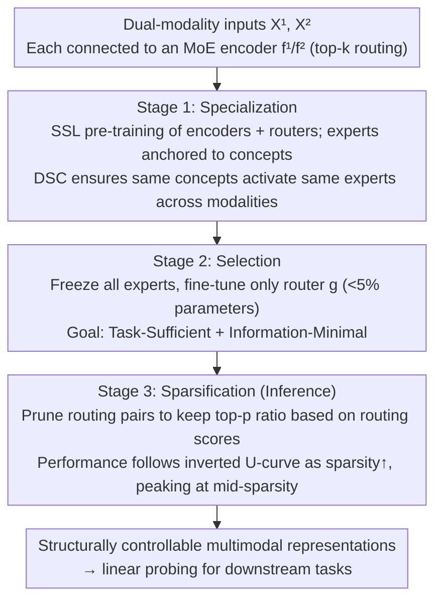

# Toward Structural Multimodal Representations: Specialization, Selection, and Sparsification via Mixture-of-Experts

**Conference**: ICML 2026  
**arXiv**: [2605.03348](https://arxiv.org/abs/2605.03348)  
**Code**: None  
**Area**: Multimodal VLM / MoE / Representation Learning  
**Keywords**: Multimodal representation, MoE, Task-sufficiency, Information-minimality, Inference-time pruning  

## TL;DR
This paper proposes the S3 framework, which uses MoE to decompose multimodal representations into concept-level experts (Specialization), activates task-relevant experts via routing (Selection), and prunes low-contribution paths at inference time based on routing scores (Sparsification). Across four MultiBench benchmarks, it reveals an "inverted U-shaped" curve where performance peaks at intermediate sparsity, providing a third paradigm for multimodal representation beyond contrastive learning and InfoMax.

## Background & Motivation

**Background**: Two mainstream paradigms for multimodal representation learning exist: contrastive learning (e.g., CLIP, AudioCLIP), which maps paired modalities to a shared space to maximize cross-modal mutual information; and InfoMax-style methods (e.g., FOCAL, DisentangledSSL, JointOpt), which aim to preserve both shared and modality-unique information. Both aim to learn a "fixed embedding."

**Limitations of Prior Work**: Contrastive learning has a theoretical upper bound—the mutual information of its optimal solution is only related to the entropy $H(X_S)$ of the shared factor $X_S$ (Proposition 2.3). Once a task depends on modality-unique factors $X_U^m$, contrastive representations cannot achieve Bayes optimality. While InfoMax can be task-sufficient, it also maximizes $I(Z^m;X^m|Y)$, retaining a large amount of task-irrelevant information, which violates the InfoMin principle and hinders downstream classification.

**Key Challenge**: A single monolithic embedding must simultaneously handle conflicting requirements: "alignment + preserving differences + adapting to task variations." The combination of task-relevant factors for samples is highly variable, but fixed representations cannot be selected on demand.

**Goal**: Construct multimodal representations that are both **Task-Sufficient** ($I(Z_Y^{1*},Z_Y^{2*};Y)=I(X^1,X^2;Y)$) and **Information-Minimal** ($I(Z_Y^{1*},Z_Y^{2*};X^1,X^2|Y)=0$), while remaining adjustable and controllable at the sample and task levels.

**Key Insight**: Shift the focus from "optimizing objective functions" to "adding structural inductive biases." Explicitly decompose the representation space into a set of concept subspaces $\mathcal{Z}=\bigoplus_{c\in\mathcal{C}}\mathcal{Z}_c$, where each subspace is implemented by an MoE expert. The same latent concept across different modalities should activate the same experts (Distributional Semantic Coherence), thereby achieving "concept-level" rather than "instance-level" cross-modal alignment.

**Core Idea**: Reinterpret MoE as a tool for semantic specialization (rather than just parameter expansion). A three-stage pipeline—Specialization → Selection → Sparsification—is used to solve "how to construct semantic expert spaces," "how to activate task-relevant experts," and "how to prune redundant paths at inference time," achieving structurally controllable Task-Sufficient + Information-Minimal multimodal representations.

## Method

### Overall Architecture
MoE encoders $f^1, f^2$ are used for the two modalities. Each MoE layer contains $N_{\mathrm{expert}}=\chi\cdot\rho$ experts (granularity $\chi$ + expansion ratio $\rho$). The router $g$ uses top-$k$ softmax to determine which experts each token traverses: $g(\mathbf{x})=\mathrm{TOP}_k(\mathrm{softmax}(\mathbf{W}_g\mathbf{x}))$, with output $\mathrm{MoE}(\mathbf{x})=\sum_i g(\mathbf{x})_i e_i(\mathbf{x})$. The three stages are connected in series: Stage 1 pre-trains the encoder + router via SSL; Stage 2 fine-tunes only the router; Stage 3 performs pruning at inference time.

### Key Designs

**1. Specialization: Pre-train the representation space as a set of "semantic experts" and align across modalities at the expert level.**

A single monolithic embedding faces conflicts when aligning, preserving differences, and adapting to tasks. Here, MoE explicitly decomposes the representation space into concept subspaces, anchoring each expert to a semantic concept. The training objective is $\max_{f^1,f^2}[I(Z^1;X^1)+I(Z^2;X^2)]$ subject to DSC constraints (Proposition 3.4: for all shareable concepts $c$, $p(\pi_c(Z^1)|c\in C^1)=p(\pi_c(Z^2)|c\in C^2)$). Mutual information is estimated using InfoNCE lower bounds. The loss consists of three parts: intra-modal $\mathcal{L}_{\mathrm{rep}}=\tfrac12(\mathcal{L}_{\mathrm{InfoNCE}}^{[1\to1]}+\mathcal{L}_{\mathrm{InfoNCE}}^{[2\to2]})$ for diversity, cross-modal $\mathcal{L}_{\mathrm{dsc}}=\tfrac12(\mathcal{L}_{\mathrm{InfoNCE}}^{[1\to2]}+\mathcal{L}_{\mathrm{InfoNCE}}^{[2\to1]})$ for implicit alignment of concept activation patterns, and an auxiliary routing loss $\mathcal{L}_{\mathrm{aux}}$ to prevent expert collapse and encourage balanced, confident activation. While InfoNCE is instance-level, its contrastive signal implicitly shapes expert activation distributions to cluster synonymous concepts into the same expert. Explicit concept decomposition + DSC ensures alignment happens at the "expert level" rather than the "feature vector level," allowing modality-unique parts to naturally route to modality-exclusive experts.

**2. Selection: Freeze all experts and fine-tune only the routers for task adaptation.**

Conventional fine-tuning modifies the encoder, destroying the semantic expert structure learned in Stage 1. Here, only the router $g$, which accounts for a minimal fraction of parameters (<5%), is tuned. The objective $\max_g[I(Z_Y^1,Z_Y^2;Y)-\alpha\cdot I(Z_Y^1,Z_Y^2;X^1,X^2|Y)]$ simultaneously pursues Task-Sufficiency and Information-Minimality. The first term (sufficiency) is approximated by SupCon loss—pulling samples with the same label together; Proposition E.2 proves it is a valid lower bound for task-conditioned MI: $\mathcal{L}_{\mathrm{SupCon}}^{[m\to\bar m]}=-\mathbb{E}_{i,s\in\mathcal{S}_{y_i}}\log\frac{\exp(\langle z_i^m,z_s^{\bar m}\rangle/\tau)}{\sum_j\exp(\langle z_i^m,z_j^{\bar m}\rangle/\tau)}$. The second term (minimality) $I(Z;X|Y)=\mathbb{E}_{p(x,y)}[D_{KL}(p(z|x)\|p(z|y))]$ is approximated using vMF when features reside on a hypersphere after InfoNCE, simplified into a compactness loss $\mathcal{L}_{\mathrm{Comp}}^{[m\to\bar m]}=-\mathbb{E}[\langle\mu_x^m,\hat\mu_y^{\bar m}\rangle]$, pulling samples toward their class means. Thus, "what is learned" (fixed semantic basis) and "what is used for a task" (task-dependent selector) are strictly decoupled, similar to prompt tuning but with a more structured goal.

**3. Sparsification: Prune based on routing scores at inference time, treating information minimization as a "knob."**

After Stage 2, router scores act as estimates of "input-expert contribution to the task." Standard MoE uses a fixed top-$k$ regardless of actual utility, potentially activating unnecessary experts. Without further training, this stage sorts top-$k$ routing pairs within each batch by score, retaining only a top-$p$ ratio and pruning the rest. The pruning process demonstrates an inverted U-shaped curve: as $p$ decreases from 1, irrelevant paths are pruned first (performance increases or stabilizes), reaching a "sweet spot" for minimal sufficient representation (peak performance), followed by performance decline as $p$ becomes too small and critical paths are removed. Since residual connections remain, pruning single routing paths does not cut off the information flow. This extends information minimization from training to inference, providing a real-time adjustment knob for the efficiency-accuracy trade-off and a diagnostic tool for "how many task-relevant routes" actually exist.

### Loss & Training
- Stage 1: $\mathcal{L}_{\mathrm{special}}=\lambda_{\mathrm{rep}}\mathcal{L}_{\mathrm{rep}}+\lambda_{\mathrm{dsc}}\mathcal{L}_{\mathrm{dsc}}+\lambda_{\mathrm{aux}}\mathcal{L}_{\mathrm{aux}}$ (includes expert balance regularization).
- Stage 2: $\mathcal{L}_{\mathrm{select}}=\lambda_{\mathrm{suff}}\mathcal{L}_{\mathrm{suff}}+\lambda_{\mathrm{min}}\mathcal{L}_{\mathrm{min}}$ (excludes balance regularization, as the goal is to activate relevant experts imbalancedly).
- Fair Comparison: Setting $k=\chi$ ensures that parameters per token activation are equivalent to a dense FFN.

## Key Experimental Results

### Main Results
Linear probing accuracy on four MultiBench benchmarks (MOSEI / MOSI / UR-FUNNY / MUStARD). The table below shows the best results for S3 on MOSEI under different granularities $\chi$ compared to baselines with equivalent active parameters (data extracted from original MOSEI tables at optimal $p$):

| Dataset | Method | Best Accuracy (%) | Remarks |
|---------|--------|-------------------|---------|
| MOSEI | CLIP (Contrastive) | ~74.5 | shared-only |
| MOSEI | FactorCL / DisentSSL (InfoMax) | 74-76 | retains all info |
| MOSEI | **S3 (χ=8, sweet spot)** | **77.95** | $p\approx 0.3$ |
| MOSI | InfoMax Baselines | ~63 | |
| MOSI | **S3 (χ=8)** | **66.13** | $p\approx 0.6$ |
| UR-FUNNY | InfoMax Baselines | ~63 | |
| UR-FUNNY | **S3 (χ=4)** | **64.74** | $p\approx 0.4$ |

S3 consistently outperforms contrastive and InfoMax baselines across all four benchmarks, with peaks occurring at intermediate sparsity rather than $p=1$.

### Ablation Study

| Configuration | MOSEI Accuracy (%) | Trend Shape |
|---------------|-------------------|-------------|
| χ=2 (Coarse) | 77.25 (peak at $p=0.1$) | Delayed U-shape—routing ambiguity causes initial drop |
| χ=4 (Medium) | 77.18 (peak at $p=0.1$) | Smooth transition |
| χ=8 (Fine) | **77.95** (peak at $p=0.3$) | Classic inverted U-shape |
| χ=8, p=1.0 (No pruning) | 75.78 | 2 points lower than pruning peak |
| Specialization only (Skip Selection) | < 75 | Router not adapted to task |

### Key Findings
- **Granularity determines pruning curve shape**: At low granularity ($\chi=2$), each expert contains multiple concepts, leading to routing ambiguity where initial pruning hurts—performance only improves at extreme pruning ($p=0.1$, Delayed U-shape). At high granularity ($\chi=8$), experts specialize in single concepts with high routing confidence, and pruning benefits start immediately from $p=0.9$, with a sweet spot around $p=0.3$. This pattern is consistent across benchmarks.
- **Inverted U-shape = Empirical Proof of InfoMin**: Peak performance at intermediate sparsity strongly supports that "task-irrelevant info indeed drags down downstream tasks"—direct experimental validation of the InfoMin principle in multimodal scenarios.
- **Router adaptation is efficient**: Routers account for <5% of total parameters but drive task adaptation—indicating that once a structured latent space is built, "which part to use" is more critical than "what to learn."
- **Robust across batch sizes**: The trend remains invariant between 64-512 batch sizes, implying the pruning behavior is determined by structural properties rather than training artifacts.

## Highlights & Insights
- **Paradigm Shift from "Loss Tuning" to "Structural Induction"**: The authors explicitly point out that failures in contrastive learning and InfoMax are not just about the wrong loss, but a lack of structural inductive bias. This perspective is enlightening for representation learning beyond SSL (e.g., few-shot, transfer learning).
- **Semantic Interpretation of MoE**: Reinterpreting MoE as "concept experts" rather than just a capacity tool is a novel perspective with theoretical support. DSC provides a new mathematical language for cross-modal alignment ("alignment of expert activation distributions" instead of traditional "feature alignment").
- **Inference-time Pruning Knob**: Making Information-Minimality a training-free inference-time hyperparameter, visualized via the inverted U-curve, is highly practical. The same model can switch efficiency/accuracy trade-offs in real-time.
- **Theory + Empirical Loop**: Starting from proofs that contrastive learning is strictly suboptimal when tasks depend on unique factors (Prop 2.5), characterizing limitations via task-irrelevant information decomposition, and finally echoing theoretical predictions with the inverted U-curves in S3 creates a complete and rare logical structure.

## Limitations & Future Work
- Experiments were performed on relatively small-scale MultiBench tasks with dual modalities (mostly text-audio/visual feature vectors); stability, training cost, and convergence on large-scale image-text (COCO/LAION) or tri-modal scenarios (video-audio-text) remain unknown.
- DSC assumes "shareable concepts activate the same expert across modalities," but in practice, seeking this natural alignment across heterogeneous modalities might be difficult—do "timbre" in audio and "texture" in vision truly map to the same expert? Lack of interpretability or visualization evidence.
- The vMF approximation in Stage 2 requires features on a unit hypersphere (typical after InfoNCE), but if the backbone uses non-normalized outputs, the KL derivation fails.
- The "sweet spot" $p$ for Sparsification must currently be swept on a validation set without theoretical guidance; there is a lack of methodology for automatically determining $p$ across different tasks/data scales.
- While the comparison with dense FFNs is fair regarding active parameters, the total parameter count of MoE implies higher storage and loading costs, limiting deployment on edge devices.

## Related Work & Insights
- **vs. CLIP/ImageBind (Contrastive)**: CLIP compresses all information into a single embedding, bounded by $H(X_S)$; S3 uses expert subspaces to carry shared + unique information, theoretically achieving task-sufficiency.
- **vs. FOCAL/JointOpt/DisentangledSSL (InfoMax)**: These handle $Z_S+Z_U^m$ explicit splitting but remain fixed vectors; S3 hands the choice to a trainable router and allows further pruning at inference.
- **vs. FactorCL (Enhanced Contrastive)**: FactorCL uses augmentation to indirectly expand shared factors but remains limited by the contrastive objective; S3 breaks the contrastive vs. InfoMax duality via structure.
- **vs. Prompt Tuning / LoRA**: Similar in "lightweight adaptation," but while prompt/LoRA tunes inputs or low-rank increments, S3 tunes the router—the semantic role of selecting experts is closer to a "controller" without extra parameters beyond the existing MoE router.
- **vs. Switch Transformer/MoE works**: Traditional MoE focuses on computational capacity and load balance; S3 reverses this to use MoE to express "concept decomposition" as a semantic structure, pointing to a new direction of "semantic specialization" for MoE research.

## Rating
- Novelty: ⭐⭐⭐⭐⭐ High integration of "structural inductive bias + MoE concept experts + inference pruning knob"; DSC formalization is a new contribution.
- Experimental Thoroughness: ⭐⭐⭐⭐ Four benchmarks + three granularities + three batch sizes + full pruning curves provide clear structural conclusions; however, the scale of scenarios is small.
- Writing Quality: ⭐⭐⭐⭐⭐ Clean and self-consistent theoretical derivations (Props 2.3/2.5, Defs 3.1-3.4), with every theoretical proposition corresponding to experimental results.
- Value: ⭐⭐⭐⭐ Points toward a third path for multimodal representation; high engineering value for the inference knob; deployment costs and scalability need further verification.

<!-- RELATED:START -->

## Related Papers

- [\[ICML 2026\] SAME: Stabilized Mixture-of-Experts for Multimodal Continual Instruction Tuning](same_stabilized_mixture-of-experts_for_multimodal_continual_instruction_tuning.md)
- [\[ICLR 2026\] Capacity-Aware Inference: Mitigating the Straggler Effect in Mixture of Experts](../../ICLR2026/multimodal_vlm/capacity-aware_inference_mitigating_the_straggler_effect_in_mixture_of_experts.md)
- [\[CVPR 2026\] MoDES: Accelerating Mixture-of-Experts Multimodal Large Language Models via Dynamic Expert Skipping](../../CVPR2026/multimodal_vlm/modes_accelerating_mixture-of-experts_multimodal_large_language_models_via_dynam.md)
- [\[AAAI 2026\] MCMoE: Completing Missing Modalities with Mixture of Experts for Incomplete Multimodal Action Quality Assessment](../../AAAI2026/multimodal_vlm/mcmoe_completing_missing_modalities_with_mixture_of_experts_for_incomplete_multi.md)
- [\[ICML 2025\] Dynamic Mixture of Curriculum LoRA Experts for Continual Multimodal Instruction Tuning](../../ICML2025/multimodal_vlm/dynamic_mixture_of_curriculum_lora_experts_for_continual_multimodal_instruction_.md)

<!-- RELATED:END -->
