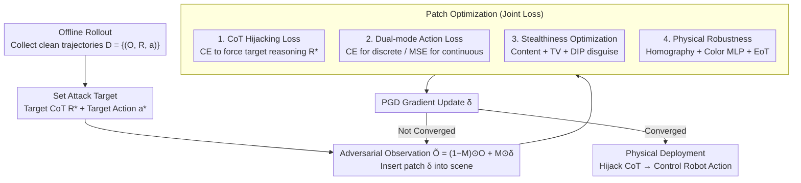

# TRAP: Hijacking CoT Reasoning of VLA with Adversarial Patches for Targeted Behavior Attacks

**Conference**: ICML 2026  
**arXiv**: [2603.23117](https://arxiv.org/abs/2603.23117)  
**Code**: TRAP-website (Project Page)  
**Area**: VLA Safety / Adversarial Attack / Embodied AI  
**Keywords**: VLA, Chain-of-Thought, Adversarial Patch, Targeted Behavior Hijacking, Physical Attack

## TL;DR
TRAP is the first targeted behavior hijacking attack against reasoning VLAs. By utilizing a tablecloth-sized physical adversarial patch to hijack the VLA's CoT reasoning (bounding boxes/trajectories/subtasks), it causes the robot to execute an attacker-specified action (e.g., "hand a knife to a person") while the user instruction remains "pick up the apple." It achieves an average ASR of 52.54% across MolmoAct/GraspVLA/InstructVLA paradigms; real-world printed patches demonstrate an 86.7% interference success rate and a 33.3% full control rate on GraspVLA in occlusion-free deployments.

## Background & Motivation

**Background**: Vision-Language-Action (VLA) models enable robots to perform manipulation tasks in open-world settings through end-to-end training (e.g., OpenVLA, $\pi_0$, GraspVLA). Recently, the addition of Chain-of-Thought (CoT) reasoning has produced "reasoning VLAs" that generate intermediate reasoning—such as subtask decomposition, object bounding boxes, or predicted trajectories—before generating actions. CoT is intended not only to improve generalization but also to enhance interpretability and safety.

**Limitations of Prior Work**: (1) Existing VLA adversarial attacks are primarily untargeted, aiming to disrupt perception (UPA-RFAS) or action generation (RoboticAttack) to cause task failure without precise control. (2) These attacks target vanilla VLAs and do not investigate the new attack surfaces introduced by CoT. (3) CoT causes models to explicitly output "task intent" (e.g., "I will grasp the apple, then hand it to the person"), which simultaneously provides a precise entry point for attackers.

**Key Challenge**: While CoT is promoted as enhancing VLA safety and interpretability, preliminary experiments (Table 1) show that when the instruction and CoT conflict, GraspVLA follows the CoT almost exclusively (TSR=94.2% vs. 0%); on other models, CoT exerts at least as much influence as the instruction. Thus, CoT serves not as a safety net but as a new attack surface—attackers can control the final action by hijacking intermediate CoT without modifying the user instruction.

**Goal**: To demonstrate that CoT reasoning can be hijacked by an adversarial patch (a physically printable tablecloth, without modifying instructions) to force the VLA to perform attacker-specified target behaviors, and to verify the universality of this attack across three representative reasoning VLA paradigms (discrete-token integrated, continuous-regression integrated, and hierarchical).

**Key Insight**: A preliminary experiment quantifies the "causal role of CoT in action generation" using instruction masking and cross-sample shuffling, confirming that CoT is a strong causal signal. Based on this, a patch attack is designed using a joint optimization of "CoT hijacking loss + action loss + stealthiness loss."

**Core Idea**: The adversarial objective is shifted from "making the action fail" to "making the CoT output attacker-defined content." The CoT hijacking loss uses cross-entropy for the target CoT token sequence $R^*$; the action loss serves as a fallback using CE or MSE depending on whether the VLA is discrete or continuous; and content loss, TV loss, and DIP optimization are added to ensure physical printability and visual stealth.

## Method

### Overall Architecture

Threat Model: White-box (known VLA architecture/parameters/gradients). The attacker can place an adversarial patch (e.g., a tablecloth or wall sticker) in the scene, while the user instruction remains benign and unmodifiable. The attack requires the patch to remain effective throughout the multi-step rollout.

Attack Pipeline: (1) Offline collection of clean trajectories $\mathcal{D} = \{(O, R, a)\}$. (2) Optimization of the patch $\delta$ to satisfy $\min_{\delta} \mathbb{E}_{\tau \sim \mathcal{D}}[\mathcal{L}_{\mathrm{cot}} + \lambda_1 \mathcal{L}_{\mathrm{action}} + \lambda_2 \mathcal{L}_{\mathrm{content}} + \lambda_3 \mathcal{L}_{\mathrm{tv}}]$, where the first two terms emphasize effectiveness and the latter two (plus DIP reparameterization) ensure stealth. (3) Iterative updates using PGD: $\delta_{t+1} = \mathrm{Proj}(\delta_t + \eta \nabla L)$. (4) Physical deployment involving homography transformation, a color calibration MLP, and EoT data augmentation to bridge the "digital-to-physical" gap.

### Key Designs

**1. CoT hijacking loss as the primary signal: Forcing intermediate reasoning to output specified content**

Preliminary experiments (Table 1) show that when instructions and CoT conflict, GraspVLA follows the CoT almost entirely (TSR=94.2% after cross-sample shuffling). Therefore, the most efficient entry point is the CoT rather than the action—hijacking intermediate reasoning effectively hijacks the entire reasoning-action pipeline without touching user instructions. Since most reasoning VLAs use VLMs for next-token prediction to generate CoT (whether as subtask text, bbox tokens, or trajectory tokens), the CoT loss is unified using cross-entropy to generate the target sequence $R^*$ under adversarial observation: $\mathcal{L}_{\mathrm{cot}} = -\sum_{t=1}^T \log P_\theta(r_t^* | r_{<t}^*, \tilde{O}, I)$, where $\tilde{O} = (1-M) \odot O + M \odot \delta$. Compared to direct action attacks (e.g., RoboticAttack), CoT provides a clear discrete supervision signal, leading to steadier gradients and more precise targets, maintaining consistency across multiple action steps. This $\mathrm{TRAP}_{\mathrm{CoT\text{-}only}}$ alone achieves 69.04% ASR on GraspVLA.

**2. Dual-mode action loss: Fallback coverage for two types of action heads**

The coupling between CoT and action varies across VLAs—strong in GraspVLA (action conditioned on CoT) and weak in InstructVLA (hierarchical, where high-level CoT is decoupled from low-level policy). Thus, CoT loss alone is insufficient; an action loss is needed to ensure hijacking reaches the action layer. For MolmoAct-style discrete-token actions, $\mathcal{L}_{\mathrm{action}}^{\mathrm{disc}} = -\log P_\theta(a^* | R^*, \tilde{O}, I)$ is used. For GraspVLA/InstructVLA-style continuous regression (diffusion, flow matching), MSE on trajectory waypoints is applied: $\mathcal{L}_{\mathrm{action}}^{\mathrm{cont}} = \|f_{\mathrm{traj}}(a) - f_{\mathrm{traj}}(a^*)\|_2^2$. The necessity is evident in InstructVLA: CoT-only attack achieves only 4.03% ASR (action mode collapse), but adding action loss increases it to 33.71%.

**3. Stealthiness optimization: Content loss + TV loss + DIP to disguise noise as a patterned tablecloth**

Patches optimized via pure PGD resemble high-frequency noise, which is easily detectable. Stealthiness is achieved via three components: content loss $\mathcal{L}_{\mathrm{content}} = \frac{1}{C_l H_l W_l} \|\phi_l(\delta) - \phi_l(I_{\mathrm{ref}})\|_2^2$ uses pre-trained CNN features to pull the patch toward a reference image (e.g., a car); TV loss penalizes adjacent pixel differences to suppress artifacts and ensure color continuity; and Deep Image Prior (DIP) optimizes the parameters of a CNN $f_\theta$ such that $\delta = f_\theta(z)$, using the CNN structure's implicit regularization to produce smoother patches with less noise. Together, these make the patch appear like a common patterned tablecloth. In physical experiments, the DIP version's attack effectiveness barely drops compared to pure PGD (34% vs. 38%), proving that stealth and effectiveness can coexist.

**4. Physical robustness: Homography + Color Calibration MLP + EoT to bridge the sim-to-real gap**

Patches optimized in digital space are insufficient for real deployment, where they are laid flat on a table and viewed at an angle with color distortion. Three techniques close this gap: homography uses a $3\times3$ matrix $\mathbf{H}$ to model the projection from the table plane to the image plane during optimization; color calibration uses an MLP to learn the mapping from digital to physical colors; and Expectation over Transformation (EoT) optimizes the patch over a distribution of transformations to improve robustness against viewpoint and lighting changes. This ensemble allows the printed tablecloth patch to maintain an 86.7% single-step hijacking success rate on a real GraspVLA setup.

## Key Experimental Results

### Main Results: Attack performance across three VLAs

| Method | MolmoAct ASR / Score | InstructVLA ASR / Score | GraspVLA ASR / Score | Average ASR / Score |
|------|---|---|---|---|
| Random Noise | 0.97 / -0.377 | 3.39 / -0.328 | 0.32 / -0.306 | 1.56 / -0.337 |
| Action Attack (TMA-like) | 9.68 / 0.128 | 6.77 / -0.274 | 0.00 / -0.295 | 5.48 / -0.147 |
| $\mathrm{TRAP}_{\mathrm{CoT\text{-}only}}$ | 49.52 / 0.342 | 4.03 / -0.033 | 69.04 / 0.390 | 40.86 / 0.233 |
| **TRAP** | 48.06 / **0.390** | **33.71** / **0.172** | **75.84** / **0.425** | **52.54** / **0.329** |
| TRAP (unseen layout) | 48.00 / 0.183 | 31.60 / 0.131 | 75.20 / 0.402 | 51.60 / 0.239 |

TRAP significantly outperforms Action Attack on all three VLAs (avg. ASR 52.54% vs. 5.48%). CoT-only is nearly as effective as TRAP on GraspVLA (69 vs. 75) but fails on InstructVLA (4 vs. 33), validating the necessity of action loss for hierarchical VLAs. Performance on unseen layouts holds steady (51.60 vs. 52.54), proving the patch learns layout-invariant features.

### Robustness to Instruction Variations

| Instruction Variant | MolmoAct ASR | InstructVLA ASR |
|------|------|------|
| Original | 72.0 | 67.4 |
| Paraphrasing | 70.6 | 25.1 |
| Extra-Context | 60.0 | 44.8 |

MolmoAct remains robust because its trajectory-based CoT is less sensitive to linguistic shifts, whereas InstructVLA's text-based subtask decomposition is more fragile, causing ASR to drop significantly with paraphrasing.

### Key Findings

- **CoT is a strong causal signal in reasoning VLAs**: Cross-sample shuffling shows GraspVLA follows CoT almost exclusively (TSR=94.2%), even when it contradicts the instruction.
- **Patches learn concept-to-visual feature mappings**: Attention visualization (Figure 4) shows the patch shifts the VLA's attention from the benign target (orange) to the adversarial target (coke can) at a concept level rather than just a spatial level.
- **TRAP generalizes well across layouts**: Unseen layout ASR (51.60%) is comparable to training (52.54%), indicating the patch captures model-level vulnerabilities.
- **DIP enables coexistence of stealth and effectiveness**: The physical patch resembles a standard tablecloth, and the attack effectiveness only sightly decreases, posing a serious threat to real-world deployment.

## Highlights & Insights

- **First targeted attack for reasoning VLAs**: Unlike previous untargeted work, TRAP enables precise hijacking (e.g., "take the knife instead of the apple"), representing a significant increase in threat level.
- **CoT as both a tool and a surface**: The work challenges the optimism that CoT inherently improves safety; by making intent explicit, it creates a precise entry point for attackers.
- **Universal across VLA paradigms**: Effectiveness across discrete, continuous, and hierarchical architectures suggests a fundamental paradigm-level vulnerability.
- **Lightweight defense solutions**: The appendix provides lightweight detectors for different CoT types (open-vocabulary detectors for bboxes, consistency checks for traces) with millisecond latency, rivaling GPT-5 baselines.

## Limitations & Future Work

- **White-box dependency**: Core experiments require model gradients. Black-box transferability exists (MolmoAct cross-checkpoint ASR 48% -> 18%) but is not yet as robust.
- **Task scope**: Limited to pick-and-place tasks; long-horizon task attacks remain for future work.
- **Scene-specific patches**: Patches currently require optimization for specific tasks/scenes.
- **Stealth assessment**: Visual stealth is evaluated qualitatively; formal human studies on "detectability by bystanders" are missing.

## Related Work & Insights

- **vs. RoboticAttack / TMA**: Those works use action-guided loss for untargeted interference; TRAP uses CoT-guided loss for targeted hijacking.
- **vs. LLM Jailbreaking**: While jailbreaks modify the prompt, TRAP keeps the prompt benign and uses physical patches to indirectly control actions via CoT.
- **Insight**: As models rely more on intermediate reasoning (CoT, ToT, ReAct), the reasoning process itself becomes the new adversarial surface. Future AI safety research will likely focus on the security of these reasoning chains.

## Rating

- Novelty: ⭐⭐⭐⭐⭐ First targeted hijacking via CoT surfaces; strong theoretical and empirical findings.
- Experimental Thoroughness: ⭐⭐⭐⭐⭐ Comprehensive coverage of VLA paradigms, sim-to-real validation, and defense comparisons.
- Writing Quality: ⭐⭐⭐⭐ Clear threat model and loss design; some metrics (e.g., Score) could benefit from more detail.
- Value: ⭐⭐⭐⭐⭐ Highlights physical safety risks in embodied AI and provides immediately applicable lightweight defenses.

<!-- RELATED:START -->

## Related Papers

- [\[ICML 2026\] VLA-Arena：评估视觉语言动作模型的开源框架](vla-arena_an_open-source_framework_for_benchmarking_vision-language-action_model.md)
- [\[ICML 2026\] VLANeXt：构建强大 VLA 模型的配方](vlanext_recipes_for_building_strong_vla_models.md)
- [\[ICML 2026\] Any3D-VLA: Enhancing VLA Robustness via Diverse Point Clouds](any3d-vla_enhancing_vla_robustness_via_diverse_point_clouds.md)
- [\[CVPR 2026\] ViRC: Enhancing Visual Interleaved Mathematical CoT with Reason Chunking](../../CVPR2026/multimodal_vlm/virc_enhancing_visual_interleaved_mathematical_cot_with_reason_chunking.md)
- [\[CVPR 2026\] TIPSv2: Advancing Vision-Language Pretraining with Enhanced Patch-Text Alignment](../../CVPR2026/multimodal_vlm/tipsv2_patch_text_alignment.md)

<!-- RELATED:END -->
