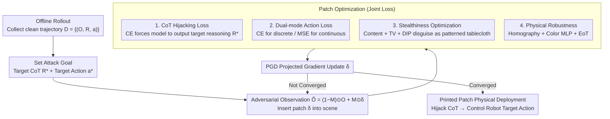

# TRAP: Hijacking CoT Reasoning of VLA for Targeted Behavior Attacks via Adversarial Patches

**Conference**: ICML 2026  
**arXiv**: [2603.23117](https://arxiv.org/abs/2603.23117)  
**Code**: TRAP-website (Project Page)  
**Area**: VLA Safety / Adversarial Attacks / Embodied AI  
**Keywords**: VLA, Chain-of-Thought, Adversarial Patch, Targeted Behavior Hijacking, Physical Attack

## TL;DR
TRAP is the first targeted behavior hijacking attack against reasoning VLAs. It hijacks the VLA's CoT reasoning (bounding boxes/trajectories/subtasks) through a tablecloth-sized physical adversarial patch. This forces the robot to perform an attacker-defined action (e.g., "give a knife to a person") while the user instruction remains "pick up the apple." Across MolmoAct, GraspVLA, and InstructVLA CoT paradigms, it achieves an average ASR of 52.54%. Real-world printed patches on GraspVLA achieve an 86.7% interference success rate and a 33.3% full control rate in occlusion-free deployments.

## Background & Motivation

**Background**: Vision-Language-Action (VLA) models enable robots to perform manipulation tasks in open-world settings through end-to-end training (e.g., OpenVLA, $\pi_0$, GraspVLA). Recently, the integration of Chain-of-Thought (CoT) reasoning has resulted in "reasoning VLAs"—models that generate intermediate reasoning such as subtask decomposition, target bounding boxes, or predicted trajectories before generating actions. CoT is not only intended to enhance generalization but is also believed to improve interpretability and safety.

**Limitations of Prior Work**: (1) Existing VLA adversarial attacks are primarily untargeted, aiming to disrupt perception (UPA-RFAS) or action generation (RoboticAttack) to cause task failure without precise control. (2) These attacks target vanilla VLAs and do not investigate the new attack surfaces introduced by CoT. (3) CoT causes the model to explicitly output "task intent" (e.g., "I will first grasp the apple, then hand it to the person"), which simultaneously provides a precise entry point for attackers.

**Key Challenge**: CoT is advertised as a means to "improve VLA safety and interpretability." However, preliminary experiments (Table 1) show that when the instruction and CoT conflict, GraspVLA almost entirely follows the CoT (TSR = 94.2% vs. 0%). In other models, CoT carries at least as much influence as the instruction. In other words, CoT is not a safety net but a new attack surface—attackers can control final actions by hijacking intermediate CoT without modifying the user instruction.

**Goal**: To demonstrate that CoT reasoning can be hijacked by an adversarial patch (a physically printable tablecloth that does not modify the instruction), forcing the VLA to perform an attacker-specified target behavior. This research validates the universality of this attack across three representative reasoning VLA paradigms: discrete-token integrated, continuous-regression integrated, and hierarchical.

**Key Insight**: First, perform preliminary experiments to quantify the "causal role of CoT in action generation" through instruction masking and cross-sample shuffling, confirming that CoT is a strong causal signal. Based on this observation, design a patch attack optimized through a combination of "CoT hijacking loss + action loss + stealthiness loss."

**Core Idea**: Shift the adversarial goal from "making actions fail" to "forcing CoT to output attacker-defined content." The CoT hijacking loss uses cross-entropy against a target CoT token sequence $R^*$. The action loss uses CE or MSE as a backup depending on whether the VLA is discrete or continuous. Content loss, TV loss, and DIP optimization are added to ensure physical printability and visual stealthiness.

## Method

### Overall Architecture

Threat Model: White-box (known VLA architecture/parameters/gradients). The attacker can place an adversarial patch (e.g., a tablecloth or wall sticker) in the scene, while the user instruction remains benign and unmodifiable. The attack requires the patch to remain effective throughout the entire multi-step reasoning rollout.

Attack Pipeline: (1) Offline collection of clean trajectories $\mathcal{D} = \{(O, R, a)\}$. (2) Patch $\delta$ optimization to satisfy $\min_{\delta} \mathbb{E}_{\tau \sim \mathcal{D}}[\mathcal{L}_{\mathrm{cot}} + \lambda_1 \mathcal{L}_{\mathrm{action}} + \lambda_2 \mathcal{L}_{\mathrm{content}} + \lambda_3 \mathcal{L}_{\mathrm{tv}}]$. The first two terms (CoT hijacking + action) ensure attack effectiveness, while the latter two (content + TV, plus DIP reparameterization) ensure stealthiness. (3) Iterative updates using PGD projected gradients: $\delta_{t+1} = \mathrm{Proj}(\delta_t + \eta \nabla L)$. (4) During the physical deployment phase, homography transformation, a color calibration MLP, and EoT data augmentation are applied to bridge the "digital patch to printed tablecloth" reality gap.

### Key Designs

**1. CoT Hijacking Loss as the Primary Signal: Forcing intermediate reasoning to output attacker-specified content**

Preliminary experiments (Table 1) show that when instructions and CoT conflict, GraspVLA follows CoT almost exclusively (TSR = 94.2% after cross-sample shuffling). Therefore, the most efficient entry point is CoT rather than the action itself—hijacking the intermediate reasoning essentially hijacks the entire reasoning-action pipeline without touching the user instruction. Since all major reasoning VLAs use VLMs for next-token prediction to generate CoT (whether it be subtask text, bbox coordinate tokens, or trajectory points), the CoT loss consistently uses cross-entropy to make the model generate the target sequence $R^*$ under adversarial observations: $\mathcal{L}_{\mathrm{cot}} = -\sum_{t=1}^T \log P_\theta(r_t^* | r_{<t}^*, \tilde{O}, I)$, where $\tilde{O} = (1-M) \odot O + M \odot \delta$. Compared to direct action attacks (e.g., RoboticAttack), CoT provides a language sequence with clear discrete supervision, resulting in more stable gradients and precise targets. As a mid-level abstraction, it maintains consistency across multiple action timesteps in a rollout. This $\mathrm{TRAP}_{\mathrm{CoT\text{-}only}}$ component alone achieves a 69.04% ASR on GraspVLA.

**2. Dual-mode Action Loss: Comprehensive coverage for two types of action heads**

The coupling between CoT and action varies across VLAs—strong in GraspVLA (CoT directly conditions action) and weak in InstructVLA (hierarchical two-stage, where high-level CoT and low-level policy are decoupled). Thus, CoT loss alone is insufficient; action loss is needed to reliably ground the hijacking at the action level. Two types of heads are handled: for discrete-token actions (actions quantized into bins as tokens) like MolmoAct, $\mathcal{L}_{\mathrm{action}}^{\mathrm{disc}} = -\log P_\theta(a^* | R^*, \tilde{O}, I)$ is used. For continuous regression (diffusion, flow matching, MLP heads) like GraspVLA/InstructVLA, MSE on trajectory waypoints is applied: $\mathcal{L}_{\mathrm{action}}^{\mathrm{cont}} = \|f_{\mathrm{traj}}(a) - f_{\mathrm{traj}}(a^*)\|_2^2$. The necessity is evident in InstructVLA: CoT-only attacks achieve only 4.03% ASR (action mode collapse), while adding action loss increases it to 33.71%.

**3. Stealthiness Optimization: Content loss + TV loss + DIP to disguise noise patches as patterned tablecloths**

Patches optimized purely by PGD are filled with high-frequency noise, making them easily detectable by humans. Stealthiness is achieved through a three-component approach: content loss $\mathcal{L}_{\mathrm{content}} = \frac{1}{C_l H_l W_l} \|\phi_l(\delta) - \phi_l(I_{\mathrm{ref}})\|_2^2$ uses features from the $l$-th layer of a pre-trained CNN to pull the patch toward a reference image (e.g., a sports car), giving it natural patterns and structures. TV loss penalizes differences between adjacent pixels to suppress high-frequency artifacts and ensure color continuity (aiding physical printing). DIP (Deep Image Prior) does not optimize $\delta$ directly in pixel space but instead optimizes the parameters of a CNN $f_\theta$ such that $\delta = f_\theta(z)$. The implicit regularization of the CNN structure makes the patch smoother and less noisy. Together, these make the patch resemble an ordinary patterned tablecloth, reducing suspicion. In physical experiments, the DIP version's attack effectiveness barely dropped compared to pure PGD (34% vs. 38%), proving that stealth and effectiveness can coexist.

**4. Physical Robustness: Homography + Color MLP + EoT to bridge the "digital-to-physical" gap**

A patch optimized in digital space is insufficient for physical deployment, where it is laid flat on a table, captured at an angle by a camera, and subject to color distortion. The paper uses three techniques to close this sim-to-real gap: homography uses a $3\times3$ matrix $\mathbf{H}$ to model the projection of the patch from the table plane to the image plane during optimization. Color calibration uses an MLP to learn the mapping from "digital simulation color" to "physical print color," aligning the patch's color distribution with reality. EoT (Expectation over Transformation) optimizes the patch over a distribution of transformations to improve robustness against viewpoint and lighting perturbations. This allows a printed tablecloth patch to maintain an 86.7% single-step hijacking success rate on GraspVLA in the real world.

### Optimization Process

PGD projected gradients: $\delta_{t+1} = \mathrm{Proj}_{\|\cdot\|_\infty \le \epsilon}(\delta_t + \eta \nabla_\delta L)$, with a pixel update step of $8/255$ and a batch size of 4. Anneal regularization: early stages prioritize content and TV weights for stealthiness, while later stages decay these weights to allow the attack effectiveness to dominate. Optimization was performed on an H800 GPU, simulator evaluation on an RTX 4090, using 25 layouts for training and 10 unseen layouts for testing per task, with 175 rollouts per task.

## Key Experimental Results

### Main Results: Attack Effectiveness across Three VLAs

| Method | MolmoAct ASR / Score | InstructVLA ASR / Score | GraspVLA ASR / Score | Avg ASR / Score |
|------|---|---|---|---|
| Random Noise | 0.97 / -0.377 | 3.39 / -0.328 | 0.32 / -0.306 | 1.56 / -0.337 |
| Action Attack (TMA-like) | 9.68 / 0.128 | 6.77 / -0.274 | 0.00 / -0.295 | 5.48 / -0.147 |
| $\mathrm{TRAP}_{\mathrm{CoT\text{-}only}}$ | 49.52 / 0.342 | 4.03 / -0.033 | 69.04 / 0.390 | 40.86 / 0.233 |
| **TRAP** | 48.06 / **0.390** | **33.71** / **0.172** | **75.84** / **0.425** | **52.54** / **0.329** |
| TRAP (unseen layout) | 48.00 / 0.183 | 31.60 / 0.131 | 75.20 / 0.402 | 51.60 / 0.239 |

TRAP significantly outperforms Action Attack on all three VLAs (Avg ASR 52.54% vs. 5.48%). While CoT-only is nearly as effective as TRAP on GraspVLA (69 vs 75), it fails on InstructVLA (4 vs 33), validating the necessity of action loss for hierarchical VLAs. Performance on unseen layouts remains high (51.60 vs 52.54), demonstrating that the patch learns layout-invariant features.

### Robustness to Instruction Variations

| Instruction Variant | MolmoAct ASR | InstructVLA ASR |
|------|------|------|
| Original | 72.0 | 67.4 |
| Paraphrasing | 70.6 | 25.1 |
| Extra-Context | 60.0 | 44.8 |

MolmoAct is generally robust under instruction variations (trajectory-based CoT is less sensitive to linguistic changes). However, InstructVLA, which uses text-based subtask decomposition, is more fragile; paraphrasing causes ASR to plumment, suggesting the patch learns "object-name" bindings rather than "instruction-template" triggers.

### Real-world Deployment (GraspVLA)

| Deployment | Single-step Hijack Success Rate | Full Control Rate |
|------|---|---|
| Occlusion-free (patch flat on table) | 13/15 = 86.7% | 5/15 = 33.3% |
| Object-occluded (patch as tablecloth) + PGD | 19/50 = 38.0% | — |
| Object-occluded + DIP (More Stealthy) | 17/50 = 34.0% | — |

DIP optimization makes the patch visually similar to a standard patterned tablecloth while maintaining attack effectiveness (38% vs. 34%), proving that stealth and effectiveness can be combined.

### Key Findings

- **CoT is a strong causal signal in reasoning VLAs**: Cross-sample shuffling experiments show that GraspVLA follows CoT almost exclusively (TSR=94.2%), even when CoT contradicts instructions. This fundamentally proves CoT is an attack surface rather than a safety net.
- **Patches learn "concept-to-visual-feature" mappings**: Attention visualizations (Figure 4) show that the patch shifts the VLA's attention from the benign target (orange) to the adversarial target (coke can), and the transfer is "concept-level" rather than "position-level."
- **TRAP generalizes well across layouts**: ASR on unseen layouts (51.60) is nearly equal to training (52.54), indicating the patch captures model-level vulnerabilities rather than layout-specific shortcuts.
- **Transfer from RT-1-finetuned to pre-trained MolmoAct**: ASR drops from 48% to 18.39% but remains effective, suggesting fine-tuning restructures the vulnerability surface, though black-box attacks via surrogate models remain possible.
- **DIP enables both stealth and effectiveness**: Physical patches look like normal tablecloths but only show a slight decrease in attack effectiveness, serving as a warning for real-world deployment risks.

## Highlights & Insights

- **First targeted attack for reasoning VLAs**: Unlike previous untargeted work that only reduced performance, TRAP is the first to achieve precise behavior hijacking (e.g., "take the knife instead of the apple"), representing a qualitative jump in threat level.
- **CoT as both a generalization tool and an attack surface**: The paper challenges the community's optimism regarding CoT (better interpretability and safety). By making intent explicit, CoT provides a precise entry point for attackers.
- **Universality across three VLA paradigms**: Coverage of MolmoAct, GraspVLA, and InstructVLA indicates this is a paradigm-level flaw rather than an isolated case.
- **Physical printability, stealth, and robustness**: The ability to print a patch as a tablecloth and maintain an 86.7% success rate on GraspVLA demonstrates a viable physical threat.
- **Lightweight defense solutions**: The appendix provides lightweight detectors for each CoT type (open-vocabulary detectors for bboxes, consistency checks for traces, lightweight encoders for text) with millisecond-level latency and performance near the GPT-5 baseline.

## Limitations & Future Work

- **White-box dependency**: Core experiments require VLA parameters and gradients. While black-box transfer was tested (ASR 48% → 18%), it is not yet strong enough; attackers in the real world often lack access to VLA parameters.
- **Task limitation to pick-and-place**: Reasoning VLAs currently struggle with long-horizon tasks, so the attack was only validated on short-range manipulations. Future work is needed for multi-step composite tasks.
- **Scene-specific patches**: A new patch must be optimized for each new task or scene; there is no universal patch.
- **Defensibility**: The proposed detectors do not reach 100% recall. If TRAP's optimization objective included signals to evade detectors, the arms race could escalate.
- **Subjective stealthiness**: While DIP outputs look like tablecloths, human evaluation on whether they are recognized as "suspicious" is missing.
- **Physical world ethics**: Releasing physical adversarial attacks is dual-use. The paper includes an impact statement, but releasing optimization code significantly lowers the barrier for reproduction.

## Related Work & Insights

- **vs. RoboticAttack / TMA**: These works use action-guided loss for untargeted patch attacks. TRAP uses CoT-guided loss for targeted hijacking, significantly increasing the threat level.
- **vs. UPA-RFAS**: UPA-RFAS disrupts visual encoder representations for untargeted interference. TRAP targets CoT reasoning for targeted behavior, exploring a different attack surface.
- **vs. LLM Jailbreaking**: Pure LLM jailbreaks modify prompts to bypass boundaries. TRAP does not modify user instructions but indirectly controls actions via physical patches and CoT, establishing an attack paradigm for embodied AI.
- **vs. Adversarial Patch (Athalye et al. 2018)**: Classic patches target image classification. TRAP extends this to the VLA CoT-action pipeline, overcoming challenges of multi-step consistency and physical realism.
- **Insight**: As LLM/VLA increasingly rely on intermediate reasoning (CoT, ToT, ReAct), the reasoning process itself becomes a new attack surface. Designs that allow models to "think explicitly" require rigorous security audits. Future AI safety research will likely focus on the "attack and defense of reasoning chains."

## Rating

- Novelty: ⭐⭐⭐⭐⭐ First targeted hijacking specifically for reasoning VLAs; identifies CoT as a new attack surface.
- Experimental Thoroughness: ⭐⭐⭐⭐⭐ Coverage of three VLA paradigms, simulation and real-world testing, cross-checkpoint transfer, thorough ablation, and lightweight defense comparisons.
- Writing Quality: ⭐⭐⭐⭐ Clear threat model and loss design logic. Physical experiments provide video evidence. Some formulas (e.g., Score) are briefly introduced.
- Value: ⭐⭐⭐⭐⭐ Directly reveals physical safety risks in embodied AI deployment. Essential reading for reasoning VLA deployers; provides ready-to-use lightweight defenses.

<!-- RELATED:START -->

## Related Papers

- [\[CVPR 2026\] Hierarchical Attacks for Multi-Modal Multi-Agent Reasoning](../../CVPR2026/multimodal_vlm/hierarchical_attacks_for_multi-modal_multi-agent_reasoning.md)
- [\[NeurIPS 2025\] MIP against Agent: Malicious Image Patches Hijacking Multimodal OS Agents](../../NeurIPS2025/multimodal_vlm/mip_against_agent_malicious_image_patches_hijacking_multimod.md)
- [\[ICML 2026\] Any3D-VLA: Enhancing VLA Robustness via Diverse Point Clouds](any3d-vla_enhancing_vla_robustness_via_diverse_point_clouds.md)
- [\[AAAI 2026\] Phantom Menace: Exploring and Enhancing the Robustness of VLA Models Against Physical Sensor Attacks](../../AAAI2026/multimodal_vlm/phantom_menace_exploring_and_enhancing_the_robustness_of_vla_models_against_phys.md)
- [\[ICML 2026\] VisionPulse: Dynamic Visual Sparsification in Multimodal Reasoning](visionpulse_dynamic_visual_sparsity_for_efficient_multimodal_reasoning.md)

<!-- RELATED:END -->
