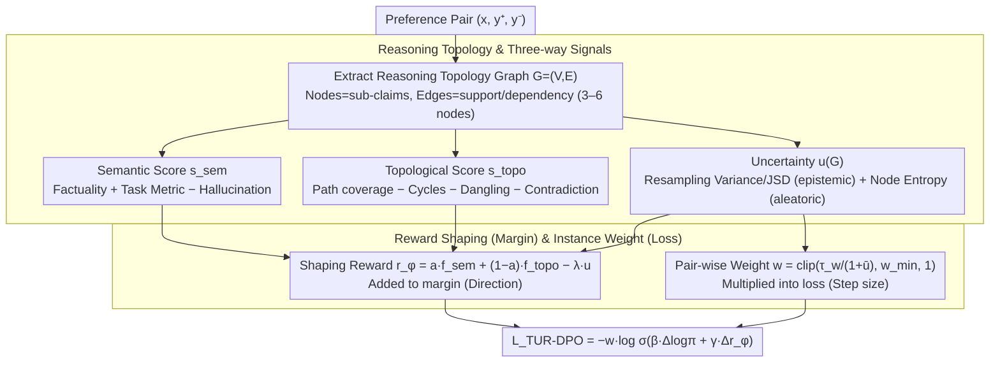

# TUR-DPO: Topology- and Uncertainty-Aware Direct Preference Optimization

**Conference**: ICML 2026  
**arXiv**: [2605.00224](https://arxiv.org/abs/2605.00224)  
**Code**: None  
**Area**: Alignment RLHF / Preference Optimization / Uncertainty Estimation / LLM Reasoning  
**Keywords**: DPO, Reasoning Topology Graph, Uncertainty Weighting, instance-weighted Bradley-Terry, RL-free Alignment

## TL;DR
TUR-DPO overlays a "semantic + topological structure" shaping reward difference and a dynamic "per-sample uncertainty" down-weighting instance weight on the preference logits of DPO. This allows the model to explicitly reward reasoning process structural rationality and weaken the influence of fragile preference pairs while maintaining the simplicity of RL-free training. It systematically outperforms DPO and IPO on reasoning tasks like GSM8K / MATH / BBH / QA and matches PPO on most tasks.

## Background & Motivation

**Background**: Preference alignment has become the mainstream path for aligning large models with human intent. RLHF + PPO is the standard approach, which is powerful but requires a complex engineering stack (online rollout, independent value heads, reward shaping, and strict KL control). DPO compresses this into a closed-form loss without the need for online sampling by directly maximizing the "log-odds of preferred answers relative to a reference policy," achieving or exceeding PPO performance on multiple benchmarks.

**Limitations of Prior Work**: DPO treats each pair $(y+, y-)$ as a flat label for the entire sequence—it only rewards *what is said* and not *how it is derived*, nor does it have mechanisms to down-weight noisy labels or "structurally fragile" preference pairs. On tasks sensitive to reasoning structures, such as mathematical reasoning, factual QA, and multi-step logic, these two flaws lead the model to learn answers that are "fluent but structurally broken." RL-free variants like ORPO / SimPO / KTO / IPO modify the loss form or reference policy but do not inject reasoning structure or uncertainty signals.

**Key Challenge**: (a) The desire to achieve reward shaping and distinguish reasoning quality like PPO without the engineering overhead of online rollout and value learning; (b) The objective to keep the simplicity and stability of DPO while explicitly distinguishing "solid reasoning" from "eloquent fluff" and automatically suppressing training instability caused by noisy preference pairs.

**Goal**: (1) Inject two types of signals—reasoning structural rationality and pair-wise uncertainty—into DPO without online sampling or independent critics; (2) Preserve the closed-form optimization structure of DPO so the new method can be directly integrated into existing DPO pipelines; (3) Provide theoretical explanations showing this modification is equivalent to instance-weighted Bradley-Terry estimation + KL-regularized policy optimization with shaped rewards.

**Key Insight**: A lightweight "Reasoning Topology Graph" (nodes = atomic sub-claims, edges = support/dependency relations) is extracted for each candidate response to derive semantic, topological, and uncertainty scores. These are combined into a shaping reward difference and a per-pair weight, added to the DPO logit and loss coefficient respectively.

**Core Idea**: "Reasoning topology + uncertainty" are treated as two additive terms and one multiplicative term in the DPO preference margin ($w \cdot \log\sigma(\beta \Delta\log\pi + \gamma \Delta r_\phi)$), rewarding *how* it is derived while suppressing noise within an RL-free framework.

## Method

### Overall Architecture
The training loop is identical to DPO: maintaining a policy $\pi_\theta$ and a reference policy $\pi_{\text{ref}}$ (fixed or updated via EMA), with preference pairs $\mathcal{D}=\{(x_i,y_i^+,y_i^-)\}$. For each $(x,y)$, TUR-DPO performs four additional steps: (a) Extracting a small directed graph $G=(V,E)$ (3-6 nodes) from the response; (b) Calculating a semantic score $s_{\text{sem}}(x,y)$, a topological score $s_{\text{topo}}(G)$, and an uncertainty score $u(G)$; (c) Linearly combining these into a shaping reward $r_\phi(x,y,G)=a f^{\text{sem}}_\phi(s_{\text{sem}}) + (1-a)f^{\text{topo}}_\phi(s_{\text{topo}}) - \lambda u(G)$; (d) Mapping the average uncertainty within a pair to a per-pair weight $w \in [w_{\min},1]$, adding the shaping reward difference $\gamma\Delta r_\phi$ to the DPO logit, and using $w$ as a loss multiplier. This design introduces no online sampling or value heads, with parameters concentrated in a small linear calibrator $\phi$.

### Key Designs

**1. Reasoning Topology Graph: Quantifying "How it was Derived" into Scalars**

DPO only considers *what is said* and ignores *how it is derived*. This design explicitly quantifies the reasoning process. A small directed graph $G=(V,E)$ (3-6 nodes representing sub-claims and dependencies) is extracted for each answer. Topological scores explicitly punish structural failures invisible to vanilla DPO: minimal valid path coverage $q_{\text{path}}$, cycle count $c_{\text{cycle}}$, dangling nodes $d_{\text{dangling}}$, and local contradictions $q_{\text{contradict}}$, weighted as $s_{\text{topo}}(G)=\alpha_1 q_{\text{path}}-\alpha_2 c_{\text{cycle}}-\alpha_3 d_{\text{dangling}}-\alpha_4 q_{\text{contradict}}$. Semantic scores combine node-level factuality $q_{\text{fact}}$, task metrics $q_{\text{task}}$ (EM/ROUGE), and hallucination penalties $q_{\text{hall}}$. Uncertainty scores capture both epistemic uncertainty (variance of topological scores and graph divergence over $K$ graph resamples: $u_{\text{epi}}=\mathrm{Var}(s_{\text{topo}}^{(k)})+\mathrm{JSD}(\mathcal{P}^{(k)})$) and aleatoric uncertainty (mean binary cross-entropy of node correctness probabilities smoothed by $\tau$: $u_{\text{ale}}=\frac{1}{|V|}\sum_v[-\tilde p_v\log\tilde p_v-(1-\tilde p_v)\log(1-\tilde p_v)]$). Using linear forms instead of neural scorers prevents reward hacking and gradient explosion while remaining interpretable.

**2. Shaping Reward in Margin and Instance Weight in Loss: Decoupling Direction and Step Size**

Shaping reward $r_\phi=a f^{\text{sem}}_\phi(s_{\text{sem}})+(1-a)f^{\text{topo}}_\phi(s_{\text{topo}})-\lambda u(G)$ (where $f^{\text{sem}}_\phi$ and $f^{\text{topo}}_\phi$ are linear calibrators with parameters $(\gamma,b)$) enters the preference margin as $\gamma\Delta r_\phi$ to determine the update direction. The per-pair weight $w=\mathrm{clip}(\tau_w/(1+\bar u),\,w_{\min},\,1)$ (where $\bar u=(u(G^+)+u(G^-))/2$) acts as an external multiplier to determine the step size. The final loss is:

$$\mathcal{L}_{\text{TUR-DPO}}=-w\cdot\log\sigma(\beta[\Delta\log\pi_\theta-\Delta\log\pi_{\text{ref}}]+\gamma\Delta r_\phi)$$

This is extended to a Plackett-Luce listwise loss for multiple candidates. Placing the shaping reward in the margin preserves DPO's closed-form optimality, while using $w$ as a multiplier suppresses noisy pair gradients without changing the BT likelihood form—theoretically remaining an instance-weighted Bradley-Terry estimation.

**3. Engineering Minimization: High Compatibility through Modular Design**

TUR-DPO is positioned as a patch rather than a replacement for DPO. Overheads are minimized by focusing on "graph extraction + local verifier + variance calculation" without requiring value heads or fully converged reward models. The graph size is restricted to 3-6 nodes. Crucially, the modules are toggleable—if a dataset lacks a reliable graph extractor, the topological coefficient can be set to 0, reverting to DPO with uncertainty weighting. This modularity facilitates adoption in production engineering stacks.

### Loss & Training
The core loss is $\mathcal{L}_{\text{TUR-DPO}}$ from Eq.(9). Theoretically, this is equivalent to policy optimization under shaped rewards and KL regularization using an instance-weighted Bradley-Terry negative log-likelihood. Lemma 2.1 provides a bias upper bound $(1-w_{\min})\epsilon$ under a label flip noise rate $\epsilon$, explaining why hyperparameter sweeps for $\tau_w,\lambda$ show a broad plateau of stability.

## Key Experimental Results

### Main Results

| Task | Metric | DPO | IPO | PPO | TUR-DPO |
|------|------|-----|-----|-----|---------|
| GSM8K | EM (%) | 58.7 | 58.9 | 62.0 | **62.8 / 63.1** (judge / human) |
| MATH mini | EM (%) | 33.4 | 33.8 | 35.5 | **36.0 / 36.4** |
| BBH subset | Acc (%) | 43.9 | 44.3 | 46.0 | **46.7 / 47.2** |
| Open QA | EM/F1 | 41.8 | 42.5 | 45.4 | **45.1 / 45.7** |
| Summ TLDR | Win-rate (%) | 61.2 | 61.9 | 63.7 | **64.8 / 64.1** |
| HH single-turn | Win-rate (%) | 65.5 | 66.1 | **67.9** | 67.9 / 67.2 |

TUR-DPO consistently outperforms DPO and IPO across all reasoning and factual tasks, matching or exceeding PPO performance on GSM8K / MATH / BBH / TLDR. PPO maintains a slight lead (0.7-0.8 pt) in stylized HH single-turn dialogue under LLM-judge, but the gap narrows in human evaluation.

### Ablation Study

| Config / Dimension | Metric | Description |
|------|---------|------|
| Full TUR-DPO | GSM8K EM 62.8 / Struct 70.4 / ECE 0.087 | Full method |
| vs ORPO | EM 59.4 / Struct 58.3 | Lacks structural signal, significant drop in structural score |
| vs SimPO | EM 60.1 / Struct 59.7 | Lacks structural signal |
| vs KTO | EM 58.7 / Struct 61.2 | Prospect-theoretic weighting but no structure |
| vs IPO | EM 58.9 / Struct 60.5 | Classic BT alternative but no shaping |
| Q1 Short → Q4 Long | GSM8K Gain +1.2% → +7.8% | Gains increase with longer outputs |
| Structural Regression | path coverage +0.28 / cycle -0.34 / size N/S | Gains from structural quality, not length |
| Error Types | Logical leaps 28→19, Contradiction 10→7 | Significant reduction in reasoning logical errors |

### Key Findings
- **Structural Signals are Primary**: Compared to ORPO / SimPO / KTO / IPO at equal compute, TUR-DPO improves structural scores from ~60 to 70.4 and reduces ECE from ~0.10 to 0.087.
- **Higher Gains on Longer Outputs**: Relative gains increase from +1.2% to +7.8% across length quartiles, showing TUR-DPO's effectiveness at suppressing fragile steps in long reasoning chains.
- **Reduction in Hallucination and Logical Leaps**: Logical leaps and contradictions decreased most significantly. Formatting/missing final answer errors slightly increased, addressable via post-processing.
- **Maintains DPO Simplicity**: No online rollouts or value heads are required. The method remains an instance-weighted Bradley-Terry estimation with a bias bound $(1-w_{\min})\epsilon$.

## Highlights & Insights
- **Minimal Patch Design**: Capturing cycles, dangling nodes, and contradictions using small 3-6 node graphs is more efficient than training independent critics and can be added to any DPO pipeline.
- **Margin vs. Loss Division of Labor**: Shaping rewards in the margin determine "direction," while uncertainty in the loss multiplier determines "step size," preventing interference.
- **Theoretical-Empirical Alignment**: The theoretical bias bound explains the "broad plateau" of stability observed during hyperparameter sweeps.
- **Transferability**: Because the topology and uncertainty signals do not depend on specific transformer architectures, the approach is applicable to multimodal and long-context settings.

## Limitations & Future Work
- Graph extraction relies heavily on the quality of sub-claim decomposers and node verifiers; failure modes of the extractors were not fully discussed.
- The experiments focused on 7-8B models; the impact of shaping rewards on 70B+ models or highly aligned strong models remains to be verified.
- The increase in formatting errors suggests a trade-off between structural quality and surface-level format compliance.
- Computational costs for uncertainty calculation (via $K$ graph resamples) may scale poorly with context length.
- For purely stylized preferences (HH tasks), shaping rewards may be less effective than the rich signals from end-to-end RLHF.

## Related Work & Insights
- **vs DPO**: DPO optimizes flat labels; TUR-DPO adds shaping and uncertainty weights within the same closed-form loss.
- **vs PPO/RLHF**: TUR-DPO simulates PPO's reward shaping without rollouts or value heads, matching PPO reasoning quality with a DPO engineering stack.
- **vs ORPO / SimPO**: These modify reference policy forms but lack structural signals; TUR-DPO's lead suggests that modifying reference forms cannot replace explicit structural rewards.
- **vs KTO / IPO**: These lack structural and uncertainty dimensions, resulting in lower structural scores and higher ECE.
- **vs Uncertainty-only approaches**: While traditional methods modify loss coefficients for noise, TUR-DPO simultaneously modifies the margin and provides theoretical consistency within the BT framework.

## Rating
- Novelty: ⭐⭐⭐⭐ Minimal injection of topology and uncertainty signals as additive/multiplicative terms with clean theoretical backing.
- Experimental Thoroughness: ⭐⭐⭐⭐ Broad coverage of reasoning tasks with human evaluation and significant ablation; minus for non-public code.
- Writing Quality: ⭐⭐⭐⭐ Clear organization of formulas and ablation studies; strong alignment between theory and empirical observations.
- Value: ⭐⭐⭐⭐ Provides a practical path to improve reasoning alignment without sacrificing DPO's simplicity, compatible with other RL-free losses.

<!-- RELATED:START -->

## Related Papers

- [\[ICLR 2026\] Uni-DPO: A Unified Paradigm for Dynamic Preference Optimization of LLMs](../../ICLR2026/multimodal_vlm/uni-dpo_a_unified_paradigm_for_dynamic_preference_optimization_of_llms.md)
- [\[ICLR 2026\] Importance Sampling for Multi-Negative Multimodal Direct Preference Optimization](../../ICLR2026/multimodal_vlm/importance_sampling_for_multi-negative_multimodal_direct_preference_optimization.md)
- [\[CVPR 2026\] Dynamics-Aware Preference Optimization for Vision-Language Models](../../CVPR2026/multimodal_vlm/dynamics-aware_preference_optimization_for_vision-language_models.md)
- [\[CVPR 2025\] SymDPO: Boosting In-Context Learning of Large Multimodal Models with Symbol Demonstration Direct Preference Optimization](../../CVPR2025/multimodal_vlm/symdpo_boosting_in-context_learning_of_large_multimodal_models_with_symbol_demon.md)
- [\[CVPR 2026\] Uncertainty-Aware Knowledge Distillation for Multimodal Large Language Models](../../CVPR2026/multimodal_vlm/uncertainty-aware_knowledge_distillation_for_multimodal_large_language_models.md)

<!-- RELATED:END -->
