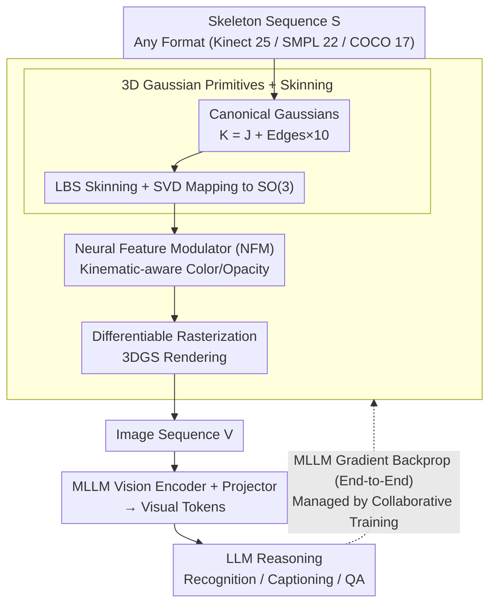

# General Skeleton Understanding: Differentiable Rendering and MLLMs

**Conference**: ICML 2026  
**arXiv**: [2603.18003](https://arxiv.org/abs/2603.18003)  
**Code**: https://github.com/wangzy01/SkeletonLLM  
**Area**: Multimodal VLM / 3D Vision / Human Understanding  
**Keywords**: Skeleton Understanding, Differentiable Rendering, Multimodal Large Language Models (MLLMs), Action Recognition, Format Agnosticism

## TL;DR
MLLMs are enabled to understand diverse skeleton formats by rendering skeleton sequences into images, achieving general skeleton understanding and resolving cross-modal and format heterogeneity issues.

## Background & Motivation

**Background**: MLLMs demonstrate strong performance in vision-language tasks but primarily process visual modalities like images/videos, lacking direct understanding of structured non-visual data such as skeletons. Furthermore, skeleton data suffers from severe format fragmentation, e.g., Kinect v2 (25 joints), MoCap (22 SMPL joints), and 2D pose estimation (17 COCO joints).

**Limitations of Prior Work**: Traditional methods follow two main paradigms: feature-text alignment (e.g., CLIP-based alignment, which compresses skeleton encoder outputs into single vectors, causing representation bottlenecks) and LLM discretization (e.g., MotionGPT, which uses VQ-VAE to quantify motion into codebooks, which is lossy and highly format-dependent). Both fail to fully activate the visual reasoning capabilities of MLLMs.

**Key Challenge**: There is a modality mismatch between skeletons (structured coordinates) and MLLMs (native image understanding). Additionally, cross-format generalization requirements prevent model architectures from being tied to specific skeleton topologies.

**Goal**: Design a unified framework allowing a single model to process any skeleton format while supporting multiple tasks such as recognition, description, and question answering.

**Key Insight**: Instead of compressing skeletons or quantizing them into discrete symbols, skeletons are "translated" into the native visual modality of MLLMs, directly leveraging their visual understanding capabilities.

**Core Idea**: A differentiable, format-agnostic skeleton renderer named DrAction is designed to render any skeleton sequence format into images. This allows gradients to flow back from the MLLM to the renderer, optimizing the rendering for downstream tasks.

## Method

### Overall Architecture
SkeletonLLM follows a three-stage "Render-Reason-Respond" pipeline. Given an input skeleton sequence $\mathbf{S}=\{\mathbf{p}_t\}_{t=1}^T$, the differentiable renderer DrAction renders it into an image sequence $\mathbf{V}=\{\mathbf{I}_t\}_{t=1}^{T'}$ (Render). Visual tokens are extracted via the MLLM vision encoder and projection layer for linguistic reasoning (Reason), finally generating recognition, description, or QA results (Respond). Internally, DrAction consists of Canonical Space Gaussian primitives, LBS skinning transformations, a Neural Feature Modulator (NFM), and differentiable rasterization. The entire pipeline is end-to-end differentiable, allowing task gradients to flow back to the renderer. This process is managed by a four-phase collaborative training strategy to transform a randomly initialized renderer into a visual interface optimized for MLLM interpretation.

### Key Designs

**1. 3D Gaussian Primitives + Skinning: Converting Any Skeleton Format to Differentiable Human Bodies**

To "translate" skeletons into images, a body representation is required that follows joint movement and supports differentiation. Instead of meshes, $K$ deformable 3D Gaussian primitives represent the body ($K = J + \text{edges} \times 10$: $J$ Gaussians at joints, others sampled along edges). These are defined in a canonical pose space. Movement for each joint $i$ is defined as a rigid transformation $\mathbf{T}_i \in \mathrm{SE}(3)$, propagated to Gaussians via Linear Blend Skinning (LBS). The blended rotation $\tilde{\mathbf{R}}_k = \sum_i w_{k,i} \mathbf{R}_i$ is projected back to $\mathrm{SO}(3)$ using SVD polar decomposition. Format agnosticism is achieved as $K$, $J$, and edges are dynamically read from the input, allowing the same mechanism to handle Kinect, SMPL, or COCO joints. Gaussians enable differentiable rendering, ensuring gradients flow back from the MLLM.

**2. Neural Feature Modulator (NFM): Capturing Dynamics in Static Appearances**

Static poses cannot distinguish between different stages of motion (e.g., "raising a hand" vs. "holding a hand up"). NFM adaptively modulates color and opacity based on local kinematics of each Gaussian. For Gaussian $k$, joint positions $p_k^t$ and velocities $v_k^t$ are aggregated and processed by a single-layer GRU for temporal modeling. It outputs residuals for RGB, opacity, and a saliency gate. Final opacity is $\alpha_k = \sigma(\alpha_k^{\mathrm{base}} + \Delta\alpha_k) \cdot \sigma(g_k)$. This highlights high-motion areas in the rendered image, encoding dynamic information into single-frame appearances.

**3. Four-phase Collaborative Training: Solving the "Cold Start" Rendering Problem**

A randomly initialized renderer produces noise that a pre-trained MLLM cannot interpret, preventing effective gradient flow. This is solved via four progressive phases: ① Alignment Pre-heating (freeze MLLM, optimize renderer for recognizable images); ② Discriminative Fine-tuning (binary classification on confusing action pairs to refine boundaries); ③ Causal Reasoning Distillation (teach "why" using step-by-step causal chains from a teacher model); ④ Recognition Refinement (freeze renderer, update projection and LoRA for final tasks).

## Key Experimental Results

### Main Results: Open-Vocabulary Action Recognition

| Dataset | Split | TDSM | MotionGPT | InternVL3-8B Baseline | SkeletonLLM | Gain |
|---------|-------|------|-----------|------------------|-------------|------|
| NTU-60 | 55/5 | 86.49 | 29.88 | 76.08 | **87.37** | +0.88% |
| NTU-60 | 30/30 | 25.88 | 8.57 | 26.95 | **37.84** | +11.96% |
| NTU-120 | 60/60 | 27.21 | 5.15 | 25.12 | **34.94** | +7.73% |

### Cross-Format Transfer Accuracy

| Source Format | Target Format | TDSM | MotionGPT | SkeletonLLM |
|---------------|---------------|------|-----------|------------|
| Kinect v2 (NTU-60) | Kinect v1 (NW-UCLA) | 43.19 | 10.35 | **68.50** |
| MoCap (HumanML3D) | Kinect v2 (NTU-60) | 23.15 | 12.40 | **54.80** |

### Key Findings
- The differentiability of DrAction is critical: with the same InternVL3-8B backbone, a fixed renderer yields 76.82% vs. 87.48% for differentiable DrAction.
- Training phase contributions: Removing CR-Distill leads to a 3.2% drop; removing Disc-FT leads to a 2.1% drop.
- Extreme sparse scenarios: In the 30/30 split challenge, SkeletonLLM improves by 41% relative to the InternVL3 baseline.

## Highlights & Insights
- **Elegant Modality Translation**: Rendering non-visual data as vision leverages the native strengths of MLLMs.
- **Universal Format-Agnostic Design**: Dynamic reading of Gaussian primitives and skinning weights allows seamless transfer across Kinect, MoCap, and 2D pose formats.
- **Progressive Collaborative Training**: The 4-phase strategy avoids gradient instability or rendering collapse during early training.

## Limitations & Future Work
- Computational costs for rendering are not analyzed in detail.
- Cross-dataset generalization is limited; the paper does not evaluate generalization across entirely different data sources.
- Insufficient support for multi-person scenarios; while the framework supports it, performance is not reported.

## Related Work & Insights
- **vs. Feature-Text Alignment (PURLS/TDSM)**: Ours preserves full spatio-temporal information via rendering and is not dependent on specific topologies.
- **vs. LLM Discretization (MotionGPT/MotionLLM)**: Ours is format-agnostic and lossless.
- **vs. Direct Encoding (SKI-LVLM)**: Ours uses end-to-end optimization where MLLM gradients guide the rendering process.

## Rating
- Novelty: ⭐⭐⭐⭐⭐ (The modality translation paradigm and format-agnostic differentiable rendering are pioneering.)
- Experimental Thoroughness: ⭐⭐⭐⭐⭐ (Covers multiple datasets, formats, and tasks; cross-format transfer is highly convincing.)
- Writing Quality: ⭐⭐⭐⭐ (Clear methodology, though some math derivations could be more concise.)
- Value: ⭐⭐⭐⭐⭐ (A general solution for skeleton-MLLM alignment with significant application potential.)

<!-- RELATED:START -->

## Related Papers

- [\[ICML 2026\] FreeRet: MLLMs as Training-Free Retrievers](freeret_mllms_as_training-free_retrievers.md)
- [\[ICML 2026\] Multimodal Continual Learning with MLLMs from Multi-scenario Perspectives](multimodal_continual_learning_with_mllms_from_multi-scenario_perspectives.md)
- [\[CVPR 2026\] Linking Perception, Confidence and Accuracy in MLLMs](../../CVPR2026/multimodal_vlm/linking_perception_confidence_and_accuracy_in_mllms.md)
- [\[ICML 2026\] iVGR: Internalizing Visually Grounded Reasoning for MLLMs with Reinforcement Learning](ivgr_internalizing_visually_grounded_reasoning_for_mllms_with_reinforcement_lear.md)
- [\[ICML 2026\] Injecting Distributional Awareness into MLLMs via Reinforcement Learning for Deep Imbalanced Regression](injecting_distributional_awareness_into_mllms_via_reinforcement_learning_for_dee.md)

<!-- RELATED:END -->
