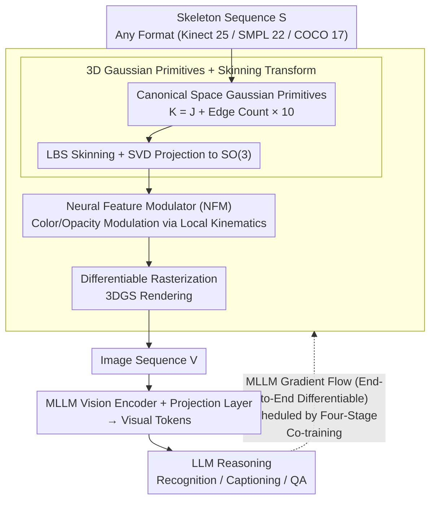

# Universal Skeleton Understanding: Differentiable Rendering and MLLMs

**Conference**: ICML 2026  
**arXiv**: [2603.18003](https://arxiv.org/abs/2603.18003)  
**Code**: https://github.com/wangzy01/SkeletonLLM  
**Area**: Multimodal VLM / 3D Vision / Human Understanding  
**Keywords**: Skeleton Understanding, Differentiable Rendering, Multimodal Large Language Models (MLLMs), Action Recognition, Format Agnosticism

## TL;DR
By rendering skeleton sequences into images, MLLMs are enabled to understand various skeleton data formats—achieving universal skeleton understanding and resolving cross-modal and format heterogeneity issues.

## Background & Motivation

**Background**: MLLMs exhibit strong performance in vision-language tasks but can only process visual modalities like images/videos, failing to directly understand structured non-visual data like skeletons. Furthermore, skeleton data faces severe format fragmentation—Kinect v2 has 25 joints, MoCap has 22 SMPL joints, and 2D pose estimation has 17 COCO joints.

**Limitations of Prior Work**: Traditional methods fall into two categories—feature-text alignment (e.g., CLIP alignment, which compresses skeleton encoder outputs into a single vector, creating a representation bottleneck) and LLM discretization (e.g., MotionGPT, which uses VQ-VAE to quantize motion into a codebook; quantization is lossy and the codebook is heavily dependent on specific formats). Neither approach fully activates the visual reasoning capabilities of MLLMs.

**Key Challenge**: There is a modality mismatch between skeletons and MLLMs—skeletons are structured coordinates, while MLLMs natively understand images. Additionally, cross-format generalization requires that the model architecture not be bound to a specific skeleton topology.

**Goal**: Design a unified framework that allows a single model to handle arbitrary skeleton formats, supporting multiple tasks such as recognition, captioning, and question answering.

**Key Insight**: Rather than compressing skeletons or quantizing them into discrete symbols, "translating" skeletons into the MLLM-native visual modality allows for the direct reuse of the MLLM's visual understanding capabilities.

**Core Idea**: Design a differentiable, format-agnostic skeleton renderer, DrAction, to render arbitrary skeleton sequences into images. This allows gradients to flow back from the MLLM to the renderer, optimizing the rendering for downstream tasks.

## Method

### Overall Architecture
The SkeletonLLM pipeline follows a three-stage "Render-Reason-Respond" process. Given an input skeleton sequence $\mathbf{S}=\{\mathbf{p}_t\}_{t=1}^T$, the differentiable renderer DrAction renders it into an image sequence $\mathbf{V}=\{\mathbf{I}_t\}_{t=1}^{T'}$ (Render). After passing through the MLLM vision encoder and projection layer to obtain visual tokens, language reasoning is performed (Reason), finally generating recognition, captioning, or QA results (Respond). Inside DrAction, the components include Canonical Space Gaussian Primitives, LBS Skinning Transform, Neural Feature Modulator (NFM), and Differentiable Rasterization. The entire process is end-to-end differentiable, allowing task gradients from the MLLM to return to the renderer. This backpropagation chain is scheduled by a four-stage co-training strategy to evolve the randomly initialized renderer into a visual interface that the MLLM can interpret and use to distinguish subtle actions.

### Key Designs

**1. 3D Gaussian Primitives + Skinning Transform: Turning Arbitrary Skeletons into Differentiable Human Representations**

To "translate" a skeleton into an image, a human representation is needed that can move with joints and be differentiably rendered. This work uses $K$ deformable 3D Gaussian primitives instead of meshes ($K = J + \text{edge count}\times 10$: $J$ Gaussians anchored at joints, with 10 others sampled along each bone), defined in a canonical pose space. The motion of each joint $i$ is represented as a rigid body transform $\mathbf{T}_i \in \mathrm{SE}(3)$. Joint motion is transferred to Gaussians via Linear Blend Skinning (LBS): blended rotations $\tilde{\mathbf{R}}_k = \sum_i w_{k,i} \mathbf{R}_i$ are projected back to $\mathrm{SO}(3)$ using SVD polar decomposition since the weighted sum may not be a valid rotation. Format agnosticism stems from this design—the number of Gaussians $K$, joints $J$, and edges are dynamically read from the input skeleton, allowing the same mechanism to handle Kinect's 25 joints, SMPL's 22 joints, or COCO's 17 joints. For formats without orientation info, $\mathbf{R}_i=\mathbf{I}_3$ is used, degrading to pure translation. Using Gaussians instead of meshes is crucial for supporting differentiable rendering, enabling gradients to flow from the MLLM back to the representation.

**2. Neural Feature Modulator (NFM): Animating Renderings to Distinguish Motion Phases**

Correct poses are not enough—a static image cannot distinguish between "hand raising" and "hand stopping" if they share the same pose. The NFM addresses this by adaptively modulating color and opacity based on the local kinematics of each Gaussian. For Gaussian $k$, it aggregates the position $p_k^t$ and velocity $v_k^t$ (calculated via finite difference) of its associated joints. These are concatenated with base features and passed through a single-layer GRU for temporal modeling, outputting RGB residuals, opacity residuals, and a saliency gate. The final opacity is $\alpha_k = \sigma(\alpha_k^{\mathrm{base}} + \Delta\alpha_k) \cdot \sigma(g_k)$. This highlights high-motion areas in the rendered image, encoding dynamic information originally requiring multiple frames directly into single-frame appearance, allowing the downstream MLLM to immediately capture motion-salient regions.

**3. Four-Stage Co-training: Solving the "Random Renderer vs. Pre-trained MLLM" Dilemma**

A randomly initialized renderer initially produces noise that a pre-trained MLLM cannot interpret, preventing useful gradient flow—a "chicken-and-egg" problem. This work resolves it through four progressive stages: ① Alignment Warm-up: Freeze the MLLM and optimize only the renderer so it produces images the MLLM can recognize; ② Discriminative Fine-tuning: Use confusing action pairs for binary classification to push the renderer towards discriminative boundaries; ③ Causal Reasoning Distillation: Use a teacher model to generate step-by-step causal chains to teach the model "why" an action is performed; ④ Recognition Refinement: Freeze the matured renderer and update only the projection layer and LoRA for task finalization. These stages advance from "visual recognition" to "discriminative boundaries" to "causal understanding" and finally "task refinement," avoiding gradient instability and prevents rendering collapse into meaningless patterns.

## Key Experimental Results

### Main Results: Open-Vocabulary Action Recognition

| Dataset | Split | TDSM | MotionGPT | InternVL3-8B Baseline | SkeletonLLM | Gain |
|--------|------|------|-----------|------------------|-------------|------|
| NTU-60 | 55/5 | 86.49 | 29.88 | 76.08 | **87.37** | +0.88% |
| NTU-60 | 30/30 | 25.88 | 8.57 | 26.95 | **37.84** | +11.96% |
| NTU-120 | 60/60 | 27.21 | 5.15 | 25.12 | **34.94** | +7.73% |

### Cross-Format Transfer Accuracy

| Source Format | Target Format | TDSM | MotionGPT | SkeletonLLM |
|--------|---------|------|-----------|------------|
| Kinect v2 (NTU-60) | Kinect v1 (NW-UCLA) | 43.19 | 10.35 | **68.50** |
| MoCap (HumanML3D) | Kinect v2 (NTU-60) | 23.15 | 12.40 | **54.80** |

### Key Findings
- The criticality of DrAction’s differentiability—using the same InternVL3-8B backbone, a fixed renderer achieves 76.82%, while differentiable DrAction reaches 87.48%.
- Contribution of training stages—removing CR-Distill leads to a 3.2% drop, and removing Disc-FT leads to a 2.1% drop.
- Extreme sparse scenarios—the 30/30 split is the most rigorous challenge, where SkeletonLLM achieves a 41% relative improvement over InternVL3.

## Highlights & Insights
- **Elegant Modality Translation**: Rendering non-visual data into vision directly leverages the native strengths of MLLMs.
- **Generic Design for Format Agnosticism**: The number of Gaussian primitives and joint fusion weights are dynamically read from the input skeleton, achieving seamless cross-format transfer between Kinect, MoCap, and 2D poses for the first time.
- **Progressive Co-training Strategy**: The 4-stage division of labor prevents initial gradient instability and rendering collapse.

## Limitations & Future Work
- The computational cost of rendering is not analyzed in detail.
- Limited cross-dataset generalization—the paper does not evaluate generalization across completely different data sources.
- Insufficient support for multi-person scenarios—the framework is designed to support multi-person input, but performance in such scenarios was not reported in experiments.

## Related Work & Insights
- **vs. Feature-Text Alignment (PURLS/TDSM)**: Ours preserves full spatio-temporal information through rendering, whereas previous methods often depend on specific topologies.
- **vs. LLM Discretization (MotionGPT/MotionLLM)**: Ours is format-agnostic and incurs no information loss.
- **vs. Direct Encoding (SKI-LVLM)**: Ours uses end-to-end optimization where MLLM gradients guide the rendering process.

## Rating
- Novelty: ⭐⭐⭐⭐⭐  The modality translation paradigm is novel, and format-agnostic differentiable rendering is a first.
- Experimental Thoroughness: ⭐⭐⭐⭐⭐  Covers multiple datasets, formats, and tasks; cross-format transfer results are particularly convincing.
- Writing Quality: ⭐⭐⭐⭐  Methodology is clear, though some mathematical derivations could be more concise.
- Value: ⭐⭐⭐⭐⭐  Provides a universal solution for skeleton-MLLM alignment with significant application potential.

<!-- RELATED:START -->

## Related Papers

- [\[ICML 2026\] FreeRet: MLLMs as Training-Free Retrievers](freeret_mllms_as_training-free_retrievers.md)
- [\[ICML 2026\] Multimodal Continual Learning with MLLMs from Multi-scenario Perspectives](multimodal_continual_learning_with_mllms_from_multi-scenario_perspectives.md)
- [\[CVPR 2026\] Linking Perception, Confidence and Accuracy in MLLMs](../../CVPR2026/multimodal_vlm/linking_perception_confidence_and_accuracy_in_mllms.md)
- [\[ICML 2026\] Injecting Distributional Awareness into MLLMs via Reinforcement Learning for Deep Imbalanced Regression](injecting_distributional_awareness_into_mllms_via_reinforcement_learning_for_dee.md)
- [\[ICML 2026\] SLQ: Bridging Modalities via Shared Latent Queries for Retrieval with Frozen MLLMs](slq_bridging_modalities_via_shared_latent_queries_for_retrieval_with_frozen_mllm.md)

<!-- RELATED:END -->
