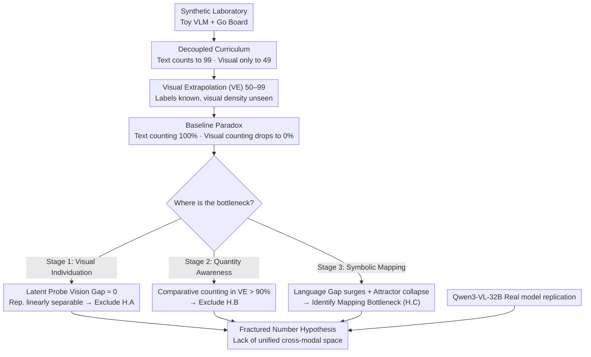

# Revealing the Visual Counting Bottleneck in Vision-Language Models

**Conference**: ICML 2026  
**arXiv**: [2605.30170](https://arxiv.org/abs/2605.30170)  
**Code**: https://github.com/Russellpang/semproj  
**Area**: Multimodal VLM  
**Keywords**: Visual Counting, Systematic Generalization, Symbolic Mapping, VLM, Out-of-Distribution Generalization

## TL;DR
By decomposing visual counting into three cognitive stages, this work discovers that the root cause of VLM counting failure lies not in visual perception or numerical understanding, but in the symbolic mapping stage—specifically, the inability to project visual representations to the correct text tokens, reflecting the lack of a unified cross-modal numerical representation space.

## Background & Motivation

**Background**: Large-scale VLMs excel at interpolation tasks but perform poorly on systematic generalization tasks, particularly visual counting.

**Limitations of Prior Work**: When the number of objects in an image exceeds the training distribution, VLM performance collapses from near-perfect accuracy to near-random guessing, yet the specific cause of this failure remains unclear.

**Key Challenge**: Models can perfectly learn recursive counting rules in the text domain (counting to 99) but fail to generalize to 50 objects after being trained on only 49 in the visual domain—indicating a severe fracture between textual and visual capabilities.

**Goal**: (1) Identify the specific bottleneck of counting failure; (2) Rule out visual perception or numerical reasoning as the root cause; (3) Locate the failure at the symbolic mapping stage.

**Key Insight**: Decompose visual counting into three stages—visual individuation, quantity awareness, and symbolic mapping—and verify each using linear probe techniques in both synthetic environments and actual foundation models.

**Core Idea**: Demonstrate through a decoupled diagnostic framework (Vision Gap and Language Gap) that models internally retain correct visual numerical representations but fail to map them to corresponding text tokens, supporting the "Fractured Number Hypothesis."

## Method

### Overall Architecture
A two-tier experimental design: first, rigorous control of training distributions in a synthetic laboratory (self-trained lightweight Toy VLM + Go board dataset), followed by replication and verification on a state-of-the-art foundation model (Qwen3-VL-32B). The primary diagnostic line decomposes visual counting into three cognitive stages—visual individuation, quantity awareness, and symbolic mapping—corresponding to three mutually exclusive hypotheses A/B/C. Using Vision Gaps measured by latent number probes, Stage 1 (perceptual blindness) is excluded; using comparative counting tasks, Stage 2 (loss of quantity signal) is excluded. Finally, the surge in Language Gap and the collapse of predictions into "attractors" pinpoint the failure to Stage 3 (symbolic mapping), supporting the "Fractured Number Hypothesis."

### Key Designs

**1. Decoupled Training Curriculum: Arbitrarily creating an extrapolation zone where labels are known but visual density is unseen**

To isolate cross-modal issues from noise, the training distribution must be precisely controlled. The authors design a two-stage curriculum simulating VLM pre-training dynamics: Stage 1 (Language Pre-training) allows the decoder to master the recursive successor function (counting to 99), while Stage 2 (Visual Alignment) restricts visual training to $N \le 49$. This creates a critical Visual Extrapolation (VE) zone (50–99)—where the model knows the labels "50" and "51" on the text side but has never seen the corresponding visual object density. Compared to using noise masking in real datasets, this artificial misalignment of "textual knowledge vs. visual experience" cleanly isolates the cross-modal fracture.

**2. Latent Number Probe Diagnostic Tool: Bypassing the language decoder to measure numerical information in visual representations**

Merely observing whether the output digits are correct cannot determine which stage failed. The authors train a linear classifier $f_{probe}: \mathbb{R}^d \to \{0,1\}$ to detect the presence of objects at each position in the visual encoder output, aggregated into a latent number $N_H = \sum_{i=1}^L f_{probe}(z_i)$. Crucially, the probe is trained only in-distribution ($N \le 49$) and evaluated in the extrapolation zone. Two gaps are defined: Vision Gap $|N_H - N_G|$ measures perceptual error, and Language Gap $|N_H - N_P|$ measures alignment error in the language module. If the Vision Gap is near 0 in the VE zone while the Language Gap surges, it proves the visual representation itself is intact but fails to be translated into text—pinpointing the failure to the symbolic mapping stage.

**3. Comparative Counting Task to Verify Quantity Awareness: Replacing "generating numbers" with "judging quantity equality"**

Even if explicit counting fails, quantity signals may persist but fail during generation. The authors convert the enumeration task into binary classification—the model only needs to judge if the cardinalities of two inputs are identical without generating specific numerical tokens. This bypasses the symbolic bottleneck to test if numerical perception is preserved. Results show that even when explicit counting accuracy is 0% in the VE zone, the comparative task maintains >90% accuracy, proving the quantity signal is not lost; the failure originates solely from symbolic mapping at the generation end. These three orthogonal methods rule out "perceptual blindness" and "reasoning loss," confirming the symbolic mapping bottleneck and the "Fractured Number Hypothesis."

## Key Experimental Results

### Main Results

| Evaluation Set | Visual Counting Accuracy | Text Counting Accuracy | Implication |
| :--- | :--- | :--- | :--- |
| In-Distribution (ID, 0-49) | 100% | 100% | Perfect within range |
| Visual Extrapolation (VE, 50-99) | 0% | 100% | Textual ability doesn't map to vision |
| Full Extrapolation (FE, 100-120) | 0% | ~99% | Textual prior alone is insufficient |

### Ablation Study (Diagnostic Metrics)

| Stage | Vision Gap | Language Gap | Conclusion |
| :--- | :--- | :--- | :--- |
| Visual Individuation (H.A) | ≈0 (Linearly separable) | High (>0) | Not a perceptual failure |
| Quantity Awareness (H.B) | Low | High (Comp. Task >90%) | Not a reasoning loss |
| Symbolic Mapping (H.C) | Low | High (Attractor collapse) | **Confirms symbolic mapping bottleneck** |

### Key Findings
- The visual encoder maintains robust, linearly separable numerical representations in the extrapolation regime, ruling out perceptual blindness.
- Even when explicit counting fails, the model can accurately judge whether quantities across different modalities are equal in comparative tasks.
- Counting failure is structured rather than random noise—predictions collapse into "attractors" (the visual training boundary 49, textual priors 90/99, or low-frequency hallucinations like 9).
- Attention heads activated for visual vs. textual counting are almost entirely disjoint (95.7% different), suggesting the model uses two isolated "counting subroutines."
- Verification on Qwen3-VL shows the same separation persists despite trillion-token pre-training, indicating this is an architectural characteristic rather than a scaling issue.

## Highlights & Insights
- **Elegant Decomposition Framework**: Transforms counting failure from a black-box symptom into a three-stage analysis, pinpointing symbolic mapping via orthogonal experiments.
- **Creative Application of Latent Probes**: Linear probes combined with intervention analysis not only detect the presence of information but also establish causal links.
- **Theoretical Insight of the "Fractured Number Hypothesis"**: Reveals that the fundamental VLM bottleneck lies in representation unification rather than raw computational power.

## Limitations & Future Work
- The Go board task in synthetic experiments, while strictly controlled, is simplified.
- Verification was primarily conducted on the Qwen3-VL architecture; generalizability to other VLM architectures is unknown.
- The paper diagnoses the problem but does not provide a definitive architectural solution.
- The prevalence of this bottleneck in higher-order reasoning tasks beyond counting remains to be verified.

## Related Work & Insights
- **vs. Systematic Generalization**: Prior work focused on visual distribution shifts; this work systematically decomposes multimodal generalization within the VLM framework, identifying a representation fracture between language and vision.
- **vs. VLM Benchmarking**: Existing evaluations only report accuracy; this work uses mechanistic interpretability (linear probes + circuit analysis) to reveal structural defects masked by accuracy metrics.

## Rating
- Novelty: ⭐⭐⭐⭐⭐  First rigorous decomposition of VLM counting failure into three stages with causal diagnostics, proposing the Fractured Number Hypothesis.
- Experimental Thoroughness: ⭐⭐⭐⭐⭐  Dual-layer verification (synthetic + real) + latent probes + intervention analysis + circuit tracing.
- Writing Quality: ⭐⭐⭐⭐⭐  Clear logical chain with progressive elimination of hypotheses.
- Value: ⭐⭐⭐⭐⭐  Provides deep insight into multimodal model reliability, guiding future VLM design and safety research.

<!-- RELATED:START -->

## Related Papers

- [\[ICML 2026\] 3ViewSense: Spatial and Mental Perspective Reasoning from Orthographic Views in Vision-Language Models](3viewsense_spatial_and_mental_perspective_reasoning_from_orthographic_views_in_v.md)
- [\[ICML 2026\] VisionPulse：多模态推理中的动态视觉稀疏化](visionpulse_dynamic_visual_sparsity_for_efficient_multimodal_reasoning.md)
- [\[ICML 2026\] Hyper-ICL: Attention Calibration with Hyperbolic Anchor Distillation for Multimodal ICL](hyper-icl_attention_calibration_with_hyperbolic_anchor_distillation_for_multimod.md)
- [\[ICML 2026\] Dimension-Free Multimodal Sampling via Preconditioned Annealed Langevin Dynamics](dimension-free_multimodal_sampling_via_preconditioned_annealed_langevin_dynamics.md)
- [\[ICML 2026\] ATHA: 通过打破尾部对齐改进 CLIP 在源数据无关跨域小样本上的适配](improving_clip_adaptation_by_breaking_tail_alignment_for_source-free_cross-domai.md)

<!-- RELATED:END -->
