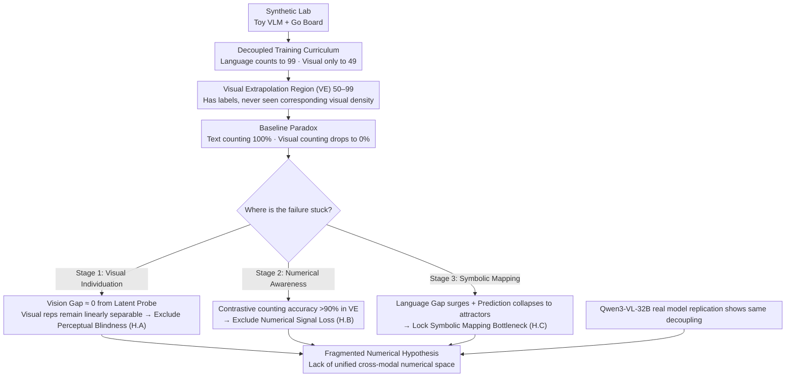

# Unveiling Visual Counting Bottlenecks in Vision-Language Models

**Conference**: ICML 2026  
**arXiv**: [2605.30170](https://arxiv.org/abs/2605.30170)  
**Code**: https://github.com/Russellpang/semproj  
**Area**: Multimodal VLM  
**Keywords**: Visual counting, systematic generalization, symbolic mapping, VLM, out-of-distribution generalization

## TL;DR
By decomposing visual counting into three cognitive stages, this study discovers that the root cause of VLM counting failure lies not in visual perception or numerical understanding, but in the symbolic mapping stage where visual representations fail to project to the correct text tokens, reflecting the lack of a unified cross-modal numerical representation space.

## Background & Motivation

**Background**: Large VLMs perform excellently in interpolation tasks but poorly on systematic generalization tasks, particularly visual counting.

**Limitations of Prior Work**: When the number of objects in an image exceeds the training distribution, VLM performance collapses from near-perfect accuracy to near-random guessing, yet the specific reasons for failure remain unclear.

**Key Challenge**: Models can perfectly learn recursive counting rules in the text domain (counting to 99), but after being trained on only 49 objects in the visual domain, they cannot generalize to 50 objects—indicating a severe fracture between text and visual capabilities.

**Goal**: (1) Identify specific bottlenecks in counting failure; (2) exclude visual perception or numerical reasoning as the root cause; (3) locate the failure in the symbolic mapping stage.

**Key Insight**: Decompose visual counting into three stages—visual individuation, numerical awareness, and symbolic mapping—verifying each through linear probe techniques in synthetic environments and actual foundation models.

**Core Idea**: Use a decoupled diagnostic framework (Vision Gap and Language Gap) to prove that the model internally retains correct visual numerical representations but cannot map them to corresponding text tokens—supporting the "Fragmented Numerical Hypothesis."

## Method

### Overall Architecture
A two-tier experimental design is employed: first, training a controllable synthetic lab (self-trained lightweight Toy VLM + Go board dataset) with strictly controlled training distributions, then replicating and verifying findings on a state-of-the-art foundation model (Qwen3-VL-32B). The diagnostic main line involves splitting visual counting into three cognitive stages—visual individuation, numerical awareness, and symbolic mapping—corresponding to three mutually exclusive hypotheses A/B/C. Using the Vision Gap measured by latent number probes to exclude stage 1 (perceptual blindness), identifying numerical awareness through contrastive counting tasks to exclude stage 2 (loss of numerical signals), and finally, observing the surge in Language Gap and prediction collapse into "attractors" to lock the failure to the stage 3 symbolic mapping, supporting the "Fragmented Numerical Hypothesis."

### Key Designs

**1. Decoupled Training Curriculum: Artificially creating an extrapolation zone of "knowing labels but never seeing visual density"**

To isolate cross-modal issues from noise, the training distribution must be precisely controlled. The authors design a two-stage curriculum simulating VLM pre-training dynamics: Stage 1 language pre-training allows the decoder to master recursive successor functions (able to count to 99), while Stage 2 visual alignment restricts visual training to $N \le 49$. This creates a critical visual extrapolation zone (50–99)—the model knows labels like "50" and "51" on the text side but has never seen the corresponding visual object density. Compared to creating difficulty through noise masking in real datasets, this artificial misalignment between "textual knowledge and visual experience" cleanly isolates cross-modal fractures for study.

**2. Latent Number Probe Diagnostic Tool: Bypassing the language decoder to directly measure numerical information in visual representations**

Simply looking at whether the output numbers are correct cannot determine which stage failed. The authors train a linear classifier $f_{probe}: \mathbb{R}^d \to \{0,1\}$ to detect the presence of objects at each position in the visual encoder output, aggregating into a latent number $N_H = \sum_{i=1}^L f_{probe}(z_i)$. Crucially, the probe is only trained in-distribution ($N \le 49$) and then evaluated in the extrapolation zone, defining two gaps: Vision Gap $|N_H - N_G|$ measures perceptual error, and Language Gap $|N_H - N_P|$ measures language module alignment error. If the Vision Gap is near 0 in the extrapolation zone while the Language Gap surges, it indicates the visual representation itself is fine, and the problem lies in its failure to be correctly translated into text—precisely nailing the failure to the symbolic mapping stage.

**3. Contrastive Counting Task to Verify Numerical Awareness: Replacing "generating numbers" with "judging equality of two quantities"**

Even if explicit counting fails, numerical signals might still exist but get stuck in the generation phase. The authors change the enumeration task to binary classification—the model only needs to judge whether the cardinalities of two inputs are the same without generating specific numerical tokens. This bypasses the symbolic expression bottleneck to directly test if numerical awareness is preserved. The result shows that even with 0% accuracy in explicit counting in the visual extrapolation zone, the model maintains $>90\%$ accuracy in contrastive tasks, proving numerical signals are not lost and failure originates purely from the symbolic mapping at the generation end. These three orthogonal methods systematically exclude "perceptual blindness" and "reasoning loss," pinning the blame on symbolic mapping and supporting the "Fragmented Numerical Hypothesis."

## Key Experimental Results

### Main Results

| Evaluation Set | Visual Counting Accuracy | Text Counting Accuracy | Meaning |
|---------|--------------|---------------|------|
| In-Distribution (ID, 0-49) | 100% | 100% | Perfect within training range |
| Visual Extrapolation (VE, 50-99) | 0% | 100% | Language ability does not automatically map to vision |
| Full Extrapolation (FE, 100-120) | 0% | ~99% | Textual prior alone is insufficient |

### Diagnostic Metrics

| Stage | Vision Gap | Language Gap | Conclusion |
|------|-----------|-------------|------|
| Visual Individuation (H.A) | ≈0 (Linearly separable) | Surge (>0) | Not a perceptual failure |
| Numerical Awareness (H.B) | Low | High, Contrastive task >90% | Not a loss of reasoning |
| Symbolic Mapping (H.C) | Low | High, Prediction collapses to "attractors" | **Confirmed Symbolic Mapping Bottleneck** |

### Key Findings
- Visual encoders maintain robust, linearly separable numerical representations in extrapolation regimes, ruling out perceptual blindness.
- Even when explicit counting fails, models can accurately judge the equality of quantities across different modalities in contrastive tasks.
- Counting failure is not random noise but structured—predictions consistently collapse to "attractors" (visual training boundary 49, textual priors 90/99, or low-frequency hallucinations like 9).
- Attention heads activated for visual vs. textual counting show almost zero overlap (95.7% different), suggesting models use two isolated "counting subroutines."
- Verification on Qwen3-VL shows the same decoupling persists even after trillion-token pre-training, indicating this is an architectural trait rather than a scaling issue.

## Highlights & Insights
- **Sophisticated Decomposition Framework**: Transforms counting failure from a single black-box diagnosis into a three-stage analysis, pinpointing symbolic mapping through orthogonal experiments.
- **Creative Application of Latent Probes**: Combining linear probes with intervention analysis not only detects the presence of information but also establishes a causal link.
- **"Fragmented Numerical Hypothesis" Theoretical Insight**: Reveals that the fundamental bottleneck of VLMs lies not in computational power but in representational alignment and unity.

## Limitations & Future Work
- The Go board task in synthetic experiments is strictly controlled but simplified.
- Verified primarily on the Qwen3-VL foundation model; the situation in other VLM architectures remains to be explored.
- The paper diagnoses the problem but does not provide a definitive solution.
- The universality of this bottleneck in higher-order reasoning tasks beyond counting remains to be verified.

## Related Work & Insights
- **vs Systematic Generalization Literature**: Previous work focused on visual distribution shift; this study systematically decomposes multimodal generalization within the VLM framework for the first time, identifying representational fractures between language and vision.
- **vs VLM Benchmark Evaluation**: Existing evaluations only report accuracy metrics; this study dives deep into internal mechanisms through interpretability (linear probes + circuit analysis) to reveal structural defects masked by accuracy.

## Rating
- Novelty: ⭐⭐⭐⭐⭐ First to strictly decompose VLM counting failure into three stages using causal diagnostic tools and proposing the Fragmented Numerical Hypothesis.
- Experimental Thoroughness: ⭐⭐⭐⭐⭐ Two-tier verification on synthetic and real models + latent probes + intervention analysis + circuit tracking.
- Writing Quality: ⭐⭐⭐⭐⭐ Clear logical chain with progressive exclusion of three diagnostic hypotheses.
- Value: ⭐⭐⭐⭐⭐ Profound understanding of multimodal model reliability, providing important guidance for VLM design and safety research.

<!-- RELATED:START -->

## Related Papers

- [\[ICML 2026\] VisionPulse：多模态推理中的动态视觉稀疏化](visionpulse_dynamic_visual_sparsity_for_efficient_multimodal_reasoning.md)
- [\[ICML 2026\] Hyper-ICL: Attention Calibration with Hyperbolic Anchor Distillation for Multimodal ICL](hyper-icl_attention_calibration_with_hyperbolic_anchor_distillation_for_multimod.md)
- [\[ICML 2026\] Dimension-Free Multimodal Sampling via Preconditioned Annealed Langevin Dynamics](dimension-free_multimodal_sampling_via_preconditioned_annealed_langevin_dynamics.md)
- [\[ICML 2026\] ATHA: 通过打破尾部对齐改进 CLIP 在源数据无关跨域小样本上的适配](improving_clip_adaptation_by_breaking_tail_alignment_for_source-free_cross-domai.md)
- [\[ICML 2026\] Med-Scout: Curing MLLMs' Geometric Blindness in Medical Perception via Geometry-Aware RL Post-Training](med-scout_curing_mllms_geometric_blindness_in_medical_perception_via_geometry-aw.md)

<!-- RELATED:END -->
