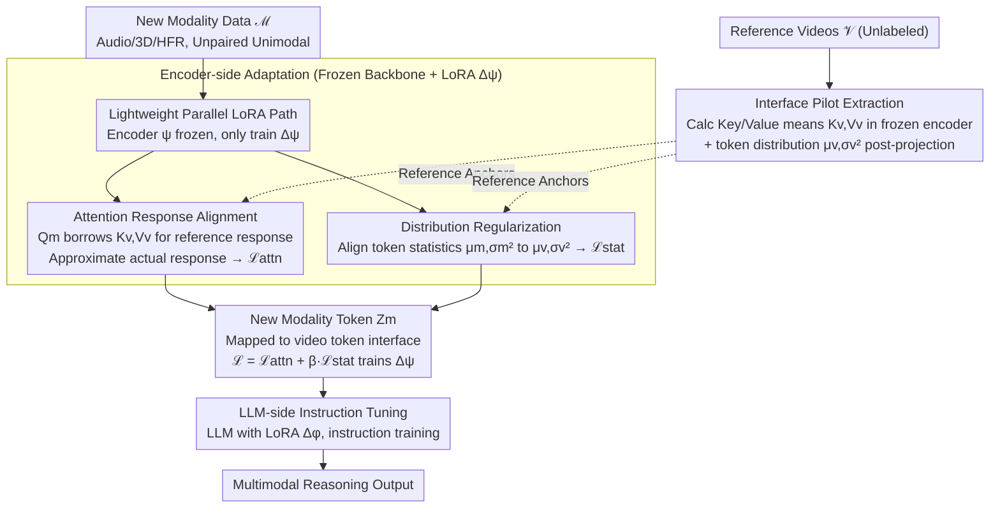

# V-LynX: Token Interface Alignment for VideoX LLMs

**Conference**: ICML 2026  
**arXiv**: [2606.00508](https://arxiv.org/abs/2606.00508)  
**Code**: To be confirmed  
**Area**: Multimodal VLM / Modality Adaptation  
**Keywords**: Video LLM, Modality Adaptation, Lightweight Adaptation, Token Interface, Multimodal Alignment

## TL;DR
V-LynX discovers the **continuous token interface (manifold)** within Video LLMs—a geometric prior carved by the visual encoder and projection layer that is compatible with the LLM's internal operation space. By utilizing lightweight LoRA (68.7M parameters) and **unpaired unimodal data**, V-LynX efficiently integrates new modalities (audio, 3D, high-frame-rate video) into pre-trained Video LLMs, achieving a CIDEr of 145.7 vs. PAVE's 134.5 on AVSD with 46% fewer parameters.

## Background & Motivation

**Background**: Video LLMs demonstrate excellent performance in RGB video understanding, but most only support RGB + text, lacking support for other sensory signals such as audio, 3D geometry, and high-frame-rate video. Existing expansion methods (e.g., PAVE) require designing heavy modality-specific encoders, complex fusion mechanisms, and paired multimodal supervision for each new modality, leading to parameter explosion and increased architectural complexity.

**Limitations of Prior Work**:
- Training large modality-specific encoders for each new modality results in linear growth of parameter costs.
- Obtaining paired multimodal data (e.g., audio-video-text triplets) for alignment is difficult and expensive.
- Retraining encoders easily triggers catastrophic forgetting, disrupting existing video-language alignment.

**Key Challenge**: The visual pathway of a Video LLM (encoder + projection layer) carves a geometric prior compatible with the LLM's internal operation space rather than just mapping images to a fixed vocabulary. How can this prior be utilized to adapt new modalities without reconstructing the entire pathway?

**Goal**: To answer a fundamental question—how to effectively reuse the internalized visual pathway of a Video LLM to adapt to new modalities while avoiding catastrophic forgetting and data bottlenecks.

**Key Insight**: The authors found that the visual encoder and projection layer of Video LLMs actually carve a **continuous geometric space** (termed the token interface). This space acts as a bridge between perception and fixed vocabulary constraints, allowing the LLM to process continuous visual signals as independent non-symbolic entities. New modality inputs only need to be mapped to this existing token interface.

**Core Idea**: Through a lightweight LoRA parallel pathway and a distribution alignment strategy (attention response alignment + statistical distribution regularization), provide a seamless adaptation of new modality representations to the video-induced token interface using only unimodal unpaired data.

## Method

### Overall Architecture
Three-stage process:
1. **Interface Pilot Extraction**: Extract how the pre-trained Video LLM processes video tokens (mean of attention Key/Value, mean and variance of token distribution after the projection layer) from a batch of reference videos to serve as target anchors for new modality adaptation.
2. **Encoder-side Adaptation**: Integrate lightweight parallel LoRAs ($\Delta\psi$) into the frozen visual encoder. By performing attention response alignment and distribution regularization on new modality inputs, their internal activation within the encoder approximates video-compatible attention behavior while producing distribution-compatible tokens.
3. **LLM-side Instruction Tuning**: Add LoRAs ($\Delta\phi$) to the LLM and perform instruction tuning to enable the LLM to reason using the new modality tokens.

### Key Designs

**1. Lightweight Parallel LoRA Path: Visual backbone frozen, minimal learnable parameters for new modalities**

Training a large encoder for every new modality causes linear parameter expansion and risks wiping out existing video alignment (catastrophic forgetting). V-LynX reuses rather than reconstructs: new modality inputs follow $\mathbf{Z}_m=p_\theta(g_{\psi+\Delta\psi}(\mathbf{X}_m))$, where the encoder backbone $\psi$ is frozen and only a LoRA increment $\Delta\psi$ is trained. This inherits the pre-trained video knowledge in $\psi$ while flexibly adapting to new modality characteristics via $\Delta\psi$, adding only 68.7M parameters (compared to 127–475M in PAVE). Freezing the main pathway is crucial for anti-forgetting, while low-rank increments ensure parameter efficiency.

**2. Attention Response Alignment: Borrowing video Key-Value priors for alignment without paired data**

The core insight is that the Video LLM's encoder and projection layer have already carved a continuous token interface. New modalities just need to learn "how to ask questions in this video space" without rebuilding the path. Specifically, given a query $Q_m^{(l)}$ from a new modality, a reference response $\tilde{O}_m^{(l)}=\text{Attn}(Q_m^{(l)},K_v^{(l)},V_v^{(l)})$ is calculated using video-piloted reference Key-Values $(K_v^{(l)},V_v^{(l)})$. The actual response $O_m^{(l)}=\text{Attn}(Q_m^{(l)},K_m^{(l)},V_m^{(l)})$ is forced to converge to it via loss $\mathcal{L}_{\text{attn}}=\sum_l\|O_m^{(l)}-\tilde{O}_m^{(l)}\|_1$. Since the visual "world" (Key-Value) on the reference side remains stable, cross-modal alignment no longer requires paired sequence supervision. This functional-level (attention response) alignment preserves original video semantics better than direct feature similarity. Removing this component causes a 4.6% drop in performance.

**3. Distribution Regularization: Aligning new modality token statistics for LLM compatibility**

The token distribution after the projection layer is what the LLM directly "sees." If the distributions do not match, LLM output becomes abnormal. However, forcing exact feature alignment might erase the unique characteristics of the new modality. V-LynX adopts a compromise—aligning only the statistics: pre-calculated video token distributions $(\mu_v,\sigma_v^2)$ constrain the new modality distribution $(\mu_m,\sigma_m^2)$ via $\mathcal{L}_{\text{stat}}=\|\mu_v-\mu_m\|_2+\|\sigma_v^2-\sigma_m^2\|_2$. Aligning only mean and variance ensures the LLM can process the tokens while maintaining the degrees of freedom in the feature space of the new modality.

### Loss & Training
$\mathcal{L}_{V\text{-LynX}} = \mathcal{L}_{\text{attn}} + \beta \cdot \mathcal{L}_{\text{stat}}$. LoRA rank $r = 64$. Subsequently, the LLM LoRA is trained via standard supervised fine-tuning (instruction tuning).

## Key Experimental Results

### Main Results

| Task | Dataset | Metric | PAVE-0.5B | V-LynX-0.5B | PAVE-7B | V-LynX-7B | Gain / Reduction |
|------|--------|------|----------|------------|---------|-----------|--------|
| **Audio-Visual QA** | AVSD | CIDEr | 134.5 | **145.7** (+8.3%) | 152.9 | **163.0** (+6.6%) | -46% params vs PAVE-0.5B |
| Audio-Visual QA | AVQA | Acc. | 90.4 | **93.1** | 93.8 | **94.2** | |
| **3D Reasoning** | ScanQA | CIDEr | 84.2 | **87.1** | 103.4 | **107.4** | -80% params vs PAVE-0.5B |
| 3D Reasoning | ScanQA | EM@1 | 23.1 | **26.4** (+14.3%) | 29.1 | **29.7** | |
| **HFR Video** | VideoMME | Avg. | 46.0 | **52.8** (+14.8%) | 59.9 | **62.7** | -81% params vs PAVE-0.5B |

### Ablation Study (ScanQA)

| Configuration | CIDEr | BLEU-4 | EM@1 | Note |
|------|-------|--------|------|------|
| V-LynX (Full) | 87.1 | 14.3 | 26.4 | Full model |
| w/o Attention Alignment | 81.0 | 11.8 | 23.5 | -4.6% (Key component) |
| w/o Distribution Regularization | 86.2 | 13.4 | 25.6 | -0.9% (Auxiliary stability) |
| w/o Interface Adaptation | 77.3 | 10.9 | 22.4 | -12.7% (Most critical) |

### Key Findings
- **Attention alignment is the primary driver**: Removing it leads to a 4.6% drop, the largest among all components, highlighting the importance of "alignment within the encoder."
- **Robustness of LoRA rank**: Even with rank=8, it reaches 86.1 CIDEr; rank=64 is optimal at 87.1. Low-rank adaptation is sufficient to capture modal adaptation information.
- **Reference videos do not need to be in-distribution**: Using audio-related videos (57k) as references actually reached 87.7 CIDEr. The interface is robust and does not require strictly in-distribution reference sets, significantly lowering deployment difficulty.
- **Parameter-efficient scalability**: The 0.5B model with 68.7M extra parameters outperforms the 7B version of PAVE (256.7M). V-LynX-7B (195.0M) uses 59% fewer parameters than PAVE-7B (475.0M) while achieving better performance.

## Highlights & Insights
- **Discovery of the Token Interface**: The core contribution is the discovery and formalization of the continuous manifold inside Video LLMs. t-SNE visualizations showing the relationship between frame and vocabulary embeddings reveal this "soft token" space, providing a theoretical foundation for multimodal expansion across other LLMs (Image-Text, 3D-Text).
- **Clever design for alignment without sequences**: Traditional alignment requires paired triplets (A-B-C). V-LynX achieves alignment using unimodal data by using video Key-Values as "reference anchors" at the attention level, drastically reducing data costs.
- **Trade-off between Distribution and Features**: Distribution regularization is more subtle than direct feature similarity alignment—it preserves the freedom of the new modality space while ensuring statistical properties match, avoiding semantic loss from over-alignment.

## Limitations & Future Work
- All experiments are based on the LLaVA-OV backbone; generalizability across other Video LLMs (e.g., VideoChat3, Qwen-Video) has not been verified.
- Although reference videos do not need to be strictly in-distribution, they still require manual selection. Adaptive selection of the most informative reference set could further reduce costs.
- Multimodal fusion is still additive (training LoRAs for Audio and 3D separately); simultaneous fusion of more than three modalities and potential interference remains unexplored.

## Related Work & Insights
- **vs PAVE** (Liu et al. 2025): PAVE uses independent encoders + cross-attention, requiring paired data and extra parameters. V-LynX reuses frozen encoders + distribution alignment, reducing parameters by 59% (up to 81% for 0.5B) while improving performance—essentially using geometric constraints to replace complex architecture.
- **vs Video-LLaMA / VideoLLaMA2**: These support modalities by extending audio encoders or integrating prefab encoders (ImageBind), following the "encoder stacking" paradigm. V-LynX innovates by "reusing rather than adding."
- **vs Parameter-Efficient Prompting** (Li & Liang 2021): Inspired by soft tokens, but focuses on multimodal adaptation at the representation level rather than parameter efficiency at the prompt layer.

## Rating
- Novelty: ⭐⭐⭐⭐⭐  Discovery of Token Interface + elegant distribution alignment; achieving cross-modal alignment with unimodal data is a breakthrough.
- Experimental Thoroughness: ⭐⭐⭐⭐  Four task dimensions + comprehensive ablation and benchmarking; limited to the LLaVA-OV backbone.
- Writing Quality: ⭐⭐⭐⭐  Clear logic and detailed method description; occasional redundant paragraphs.
- Value: ⭐⭐⭐⭐⭐  Efficient parameterization + practical unpaired data solution + generalizable theoretical perspective; significant contribution to both engineering and science.

<!-- RELATED:START -->

## Related Papers

- [\[ICML 2026\] RESTORE: 通过矫正失真改进视觉 Token 缩减以提升 MLLM 推理效率](improving_visual_token_reduction_via_rectifying_distortions_for_efficient_multim.md)
- [\[ICML 2026\] Deep Pre-Alignment for VLMs](deep_pre-alignment_for_vlms.md)
- [\[ICML 2026\] DenseMLLM: Standard Multimodal LLMs for Dense Prediction](densemllm_standard_multimodal_llms_for_dense_prediction.md)
- [\[CVPR 2026\] On Token's Dilemma: Dynamic MoE with Drift-Aware Token Assignment for Continual Learning of Large Vision Language Models](../../CVPR2026/multimodal_vlm/on_tokens_dilemma_dynamic_moe_with_drift-aware_token_assignment_for_continual_le.md)
- [\[ICLR 2026\] Sparsity Forcing: Reinforcing Token Sparsity of MLLMs](../../ICLR2026/multimodal_vlm/sparsity_forcing_reinforcing_token_sparsity_of_mllms.md)

<!-- RELATED:END -->
