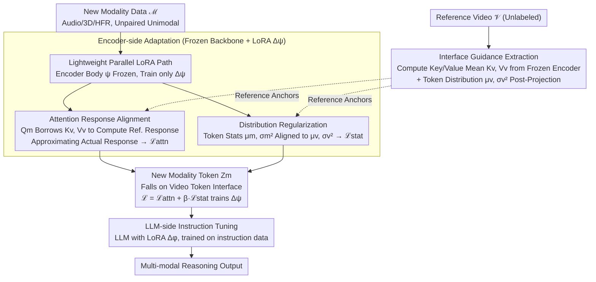

# V-LynX: Token Interface Alignment for VideoX LLMs

**Conference**: ICML 2026  
**arXiv**: [2606.00508](https://arxiv.org/abs/2606.00508)  
**Code**: To be confirmed  
**Area**: Multi-modal VLM / Modality Adaptation  
**Keywords**: Video LLM, Modality Adaptation, Lightweight Adaptation, Token Interface, Multi-modal Alignment

## TL;DR
V-LynX discovers a **continuous token interface (manifold)** within Video LLMs—a geometric prior carved by the vision encoder and projection layer that is compatible with the LLM's internal operation space. By utilizing this interface, V-LynX efficiently integrates new modalities (audio, 3D, high-frame-rate video) into pre-trained Video LLMs using only lightweight LoRA (68.7M parameters) and **unpaired unimodal data**, achieving a CIDEr of 145.7 vs PAVE's 134.5 on AVSD with 46% fewer parameters.

## Background & Motivation

**Background**: Video LLMs demonstrate excellent performance in RGB video understanding, but most support only RGB and text, lacking support for other sensory signals such as audio, 3D geometry, and high-frame-rate video. Existing expansion methods (e.g., PAVE) require designing heavy modality-specific encoders, complex fusion mechanisms, and paired multi-modal supervision for each new modality, leading to parameter inflation and increased architectural complexity.

**Limitations of Prior Work**:
- Training a large modality-specific encoder for every new modality causes linear growth in parameter costs.
- The requirement for paired multi-modal data (e.g., audio-video-text triplets) for alignment is difficult and expensive to satisfy.
- Re-training encoders can easily trigger catastrophic forgetting, disrupting existing video-language alignment.

**Key Challenge**: The vision pathway (encoder + projection layer) of a Video LLM does not merely map images to a fixed vocabulary; rather, it learns a geometric prior compatible with the LLM's internal operation space. The challenge lies in how to utilize this prior to adapt to new modalities without rebuilding the entire pathway.

**Goal**: This work aims to answer a fundamental question—how to effectively reuse the internalized vision pathway of a Video LLM to adapt to new modalities while avoiding catastrophic forgetting and data bottlenecks.

**Key Insight**: The authors discover that the vision encoder and projection layer of a Video LLM actually carve out a **continuous geometric space** (termed a token interface). This space acts as a bridge between perception and fixed vocabulary constraints, allowing the LLM to process continuous visual signals as independent non-symbolic entities—mapping new modality inputs into this existing token interface is sufficient.

**Core Idea**: By using a lightweight LoRA parallel pathway and a distribution alignment strategy (attention response alignment + statistical distribution regularization), new modality representations are seamlessly adapted to the video-induced token interface using only unimodal, unpaired data.

## Method

### Overall Architecture
Three stages:
1. **Interface Guidance Extraction**: Extract the processing behavior for video tokens from a pre-trained Video LLM using a set of reference videos (calculating attention Key/Value means, and token distribution mean and variance after the projection layer) to serve as target anchors for new modality adaptation.
2. **Encoder-side Adaptation**: Parallel lightweight LoRA ($\Delta\psi$) is integrated into the frozen vision encoder. Through attention response alignment and distribution regularization on new modality inputs, its internal encoder activations are made to mimic video-modality attention behavior while producing distribution-compatible tokens.
3. **LLM-side Instruction Tuning**: LoRA ($\Delta\phi$) is added to the LLM, which is then trained via instruction tuning to enable the LLM to reason using the new modality tokens.

### Key Designs

**1. Lightweight Parallel LoRA Path: Frozen vision pathway with minimal learnable parameters for new modalities**

Training a large encoder for every new modality leads to linear parameter expansion and risks washing away existing video alignment (catastrophic forgetting). V-LynX chooses reuse over reconstruction: new modality inputs follow $\mathbf{Z}_m=p_\theta(g_{\psi+\Delta\psi}(\mathbf{X}_m))$, where the encoder body $\psi$ remains frozen, and only a LoRA increment $\Delta\psi$ is trained. This inherits the pre-trained video knowledge in $\psi$ while flexibly adapting to new modality characteristics via $\Delta\psi$, adding only 68.7M parameters (compared to PAVE's 127–475M). Freezing the main pathway is key to preventing forgetting, while the low-rank increment ensures parameter efficiency.

**2. Attention Response Alignment: Borrowing video Key-Value priors for alignment without paired data**

The core insight is that the Video LLM's encoder and projection layer have already carved out a continuous token interface; new modalities only need to learn "how to ask questions in this video space." Specifically, given the Query $Q_m^{(l)}$ of a new modality, instead of using its own Key-Value, it uses the video-guided reference Key-Value $(K_v^{(l)},V_v^{(l)})$ to compute a reference response $\tilde{O}_m^{(l)}=\text{Attn}(Q_m^{(l)},K_v^{(l)},V_v^{(l)})$. The actual response $O_m^{(l)}=\text{Attn}(Q_m^{(l)},K_m^{(l)},V_m^{(l)})$ is then forced to approach this reference via $\mathcal{L}_{\text{attn}}=\sum_l\|O_m^{(l)}-\tilde{O}_m^{(l)}\|_1$. Since the visual "world" (Key-Value) on the reference side remains stable, cross-modal alignment no longer requires paired sequence supervision. This functional-level alignment is more effective at preserving original video semantics than direct feature similarity. Removing this component results in a 4.6% performance drop.

**3. Distribution Regularization: Aligning new modality token statistics for LLM compatibility**

Tokens after the projection layer are directly "seen" by the LLM. If distributions do not match, the LLM output becomes abnormal. However, overly aggressive feature alignment might erase the unique characteristics of the new modality. V-LynX adopts a compromise—aligning only statistics: it pre-computes the video token distribution $(\mu_v, \sigma_v^2)$ and constrains the new modality token distribution $(\mu_m, \sigma_m^2)$ to approach it using $\mathcal{L}_{\text{stat}}=\|\mu_v-\mu_m\|_2+\|\sigma_v^2-\sigma_m^2\|_2$. Aligning means and variances while allowing the specific features to vary ensures the LLM can process the tokens while preserving modality-specific information.

### Loss & Training
$\mathcal{L}_{V\text{-LynX}} = \mathcal{L}_{\text{attn}} + \beta \cdot \mathcal{L}_{\text{stat}}$. The LoRA rank is set to $r = 64$. Subsequently, the LLM LoRA is trained via standard supervised fine-tuning (instruction tuning).

## Key Experimental Results

### Main Results

| Task | Dataset | Metric | PAVE-0.5B | V-LynX-0.5B | PAVE-7B | V-LynX-7B | Parameter Reduction |
|------|--------|------|----------|------------|---------|-----------|--------|
| **Audio-Visual QA** | AVSD | CIDEr | 134.5 | **145.7** (+8.3%) | 152.9 | **163.0** (+6.6%) | -46% vs PAVE-0.5B |
| Audio-Visual QA | AVQA | Acc. | 90.4 | **93.1** | 93.8 | **94.2** | |
| **3D Reasoning** | ScanQA | CIDEr | 84.2 | **87.1** | 103.4 | **107.4** | -80% vs PAVE-0.5B |
| 3D Reasoning | ScanQA | EM@1 | 23.1 | **26.4** (+14.3%) | 29.1 | **29.7** | |
| **High-Frame-Rate Video** | VideoMME | Avg. | 46.0 | **52.8** (+14.8%) | 59.9 | **62.7** | -81% vs PAVE-0.5B |

### Ablation Study (ScanQA)

| Configuration | CIDEr | BLEU-4 | EM@1 | Description |
|------|-------|--------|------|------|
| V-LynX (Full) | 87.1 | 14.3 | 26.4 | Full model |
| w/o Attn. Alignment | 81.0 | 11.8 | 23.5 | -4.6% (Key component) |
| w/o Dist. Regularization | 86.2 | 13.4 | 25.6 | -0.9% (Stability aid) |
| w/o Interface Adaptation | 77.3 | 10.9 | 22.4 | -12.7% (Most critical) |

### Key Findings
- **Attention alignment is the primary driver**: Removing attention alignment leads to a 4.6% drop, demonstrating the importance of "aligning within the encoder."
- **Robustness of LoRA rank**: Even with rank=8, the model achieves 86.1 CIDEr, with rank=64 being optimal at 87.1—low-rank adaptation is sufficient for modality alignment.
- **Reference videos do not require identical distribution**: Using audio-related videos (57k) as references actually achieved 87.7 CIDEr, indicating the interface is robust and does not require strictly in-distribution reference sets.
- **Parameter-efficient scalability**: The 0.5B model using 68.7M extra parameters outperforms the 7B version of PAVE (256.7M); V-LynX-7B (195.0M) uses 59% fewer parameters than PAVE-7B (475.0M) while performing better.

## Highlights & Insights
- **Discovery of the Token Interface**: The core contribution is the formalization of the continuous manifold within Video LLMs. t-SNE visualizations of frame vs. vocabulary embeddings reveal this "soft token" space, providing a theoretical foundation for multi-modal expansion across other domains (Image-Text, 3D-Text).
- **Alignment without Paired Sequences**: While traditional alignment requires A-B-C triplets, V-LynX uses video Key-Values as "reference anchors" at the attention layer to align unimodal data, significantly reducing data costs.
- **Distribution vs. Feature Trade-off**: Distribution regularization is more subtle than direct feature similarity alignment—it preserves the freedom of the new modality's characteristic space while ensuring statistical compatibility to avoid semantic loss from over-alignment.

## Limitations & Future Work
- Experiments are based on the LLaVA-OV backbone; generalizability across other Video LLMs (e.g., VideoChat3, Qwen-Video) remains to be verified.
- While the choice of reference videos is flexible, it still requires manual specification; adaptive selection of the most informative reference set could further reduce costs.
- Multi-modality fusion is currently additive (training separate LoRAs for audio and 3D); interference when fusing more than three modalities simultaneously has not been explored.
- Future Work: Validate the universal token interface theory across multiple backbones; use active learning for adaptive reference video selection; explore Pareto optimality during simultaneous multi-modal alignment.

## Related Work & Insights
- **vs PAVE** (Liu et al. 2025): PAVE uses independent encoders and cross-attention fusion requiring heavy paired data; V-LynX reuses the frozen main encoder with distribution alignment, using up to 81% fewer parameters while achieving higher performance by replacing complex architecture with geometric constraints.
- **vs Video-LLaMA / VideoLLaMA2**: These follow the "encoder stacking" paradigm via ImageBind or specific audio encoders; V-LynX innovates by "reusing rather than adding."
- **vs Parameter-Efficient Prompting**: Inspired by soft tokens but applied at the representation level for modality adaptation rather than just the prompting layer.

## Rating
- Novelty: ⭐⭐⭐⭐⭐  Discovery of the Token Interface and the concise distribution alignment design are highly innovative.
- Experimental Thoroughness: ⭐⭐⭐⭐  Extensive tasks (Audio / 3D / HFR / Multi-view) and robust ablations, though limited to the LLaVA-OV backbone.
- Writing Quality: ⭐⭐⭐⭐  Clear logic and detailed methodology.
- Value: ⭐⭐⭐⭐⭐  Efficient parameterization and a practical no-paired-data alignment scheme provide significant contributions to both engineering and science in the VLM field.

<!-- RELATED:START -->

## Related Papers

- [\[ICML 2026\] RESTORE: 通过矫正失真改进视觉 Token 缩减以提升 MLLM 推理效率](improving_visual_token_reduction_via_rectifying_distortions_for_efficient_multim.md)
- [\[ICML 2026\] Deep Pre-Alignment for VLMs](deep_pre-alignment_for_vlms.md)
- [\[NeurIPS 2025\] SCOPE: Saliency-Coverage Oriented Token Pruning for Efficient Multimodal LLMs](../../NeurIPS2025/multimodal_vlm/scope_saliency-coverage_oriented_token_pruning_for_efficient_multimodel_llms.md)
- [\[ICML 2026\] DenseMLLM: Standard Multimodal LLMs for Dense Prediction](densemllm_standard_multimodal_llms_for_dense_prediction.md)
- [\[ICML 2026\] Gated Relational Alignment via Confidence-based Distillation for Efficient VLMs](gated_relational_alignment_via_confidence-based_distillation_for_efficient_vlms.md)

<!-- RELATED:END -->
