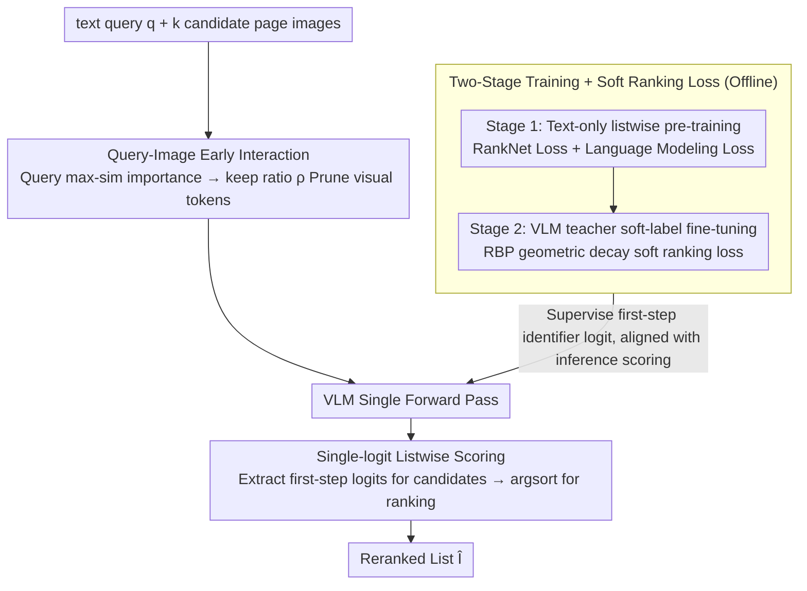

# Very Efficient Listwise Multimodal Reranking for Long Documents

**Conference**: ICML 2026  
**arXiv**: [2605.11864](https://arxiv.org/abs/2605.11864)  
**Code**: <https://github.com/dukesun99/ZipRerank>  
**Area**: Information Retrieval / Multimodal RAG / Efficient Inference  
**Keywords**: listwise reranking, VLM, visual token pruning, single-step decoding, teacher distillation

## TL;DR
ZipRerank simultaneously eliminates the two major bottlenecks of listwise reranking in VLMs—"excessive visual token sequence length" and "sequential token-by-token ranking output in autoregressive decoding." By utilizing query-aware token pruning and single-logit ranking, it reduces LLM inference latency on MMDocIR by an order of magnitude while matching or exceeding the current SOTA, MM-R5.

## Background & Motivation
**Background**: Vision-centric long document retrieval (M-RAG, Document VQA) typically adopts a "retrieve and rerank" two-stage architecture. The first stage (DSE, ColPali, etc.) performs large-scale similarity retrieval; the second-stage reranker further refines the top-$k$ candidate pages. Listwise rerankers process all candidates at once and are theoretically more efficient than pointwise ones. The recent MM-R5 achieved SOTA on MMDocIR by introducing CoT reasoning.

**Limitations of Prior Work**: The practicality of methods like MM-R5 is hampered by two latency bottlenecks: (i) Prefill length explosion: each candidate page is a high-resolution image contributing hundreds to thousands of visual tokens, easily exceeding 10,000 tokens for $k=10$ candidates; (ii) Autoregressive decoding: the output length of CoT + ranking grows linearly with $k$, and sequential dependencies cannot be bypassed by KV caching. Consequently, MM-R5 takes 3.82s per reranking, making it difficult to deploy in real-time M-RAG.

**Key Challenge**: The tension between "accuracy (requiring long context + reasoning chains)" and "latency (requiring sequence shortening + single-step output)." Pruning visual tokens risks losing critical evidence, while removing CoT risks losing ranking capability.

**Goal**: (i) Decompose latency into prefill and decode components using latency decomposition and optimize them separately; (ii) Design a single-step listwise scoring mechanism to eliminate autoregression; (iii) Introduce query-aware visual pruning to resolve prefill explosion; (iv) Learn robust listwise behavior even under weak supervision (where VQA provides only one positive example).

**Key Insight**: The authors noted an interesting two-stage strategy—one can first learn "general listwise behavior" on large-scale text-only reranking data, and then perform soft supervision on multimodal data using a strong VLM teacher, decoupling "learning to rank" from "learning multimodality." They also observed that generating a full ranking sequence is unnecessary during inference; the first-step logits of candidate identifiers (A, B, C...) are sufficient for ordering.

**Core Idea**: Training uses a "two-stage approach (text-only listwise pre-training + VLM teacher soft-label multimodal fine-tuning)," while inference employs "query-aware visual pruning + single-logit scoring," compressing listwise multimodal reranking into a single forward pass.

## Method

### Overall Architecture
ZipRerank addresses the sluggishness of VLM listwise reranking. Given a text query $\bm{q}$ and $k$ candidate page images $\bm{I}=(I_1,\dots,I_k)$ from the first-stage retrieval, it outputs a reranked list $\hat{\bm{I}}=(I_{\pi(1)},\dots,I_{\pi(k)})$. It models the latency source as $F(n,u)\approx L(c_{\text{att}}dn^2+c_{\text{ffn}}d^2n)+uLdn\cdot c_{\text{dec}}$—where prefill grows quadratically with visual token count $n$, and decode grows linearly with generation length $u$. The approach tackles each term: inference-side query-aware pruning reduces $n$, while single-logit scoring sets $u$ to 1. The training-side two-stage process (text-only pre-training + VLM teacher soft-label fine-tuning) injects ranking capability into the model, allowing it to assign comparable scores to candidate identifiers (A, B, ...) via single-token logits even under weak supervision.

### Key Designs

**1. Two-Stage Training + Soft Ranking Loss: Decoupling "General Ranking" and "Visual Alignment"**

Multimodal document retrieval data inherently contains only one positive instance (VQA annotation). Directly applying hard listwise supervision often leads to overfitting teacher noise. Thus, the authors split learning into two stages. Stage 1 involves fully supervised pre-training on text-only reranking corpora (where passages are rendered into page-like images), using the RankNet loss $\mathcal{L}_{\text{ranknet}}=\sum_{r_i<r_j}w_{i,j}\log(1+\exp(s_j-s_i))$ (with weights $w_{i,j}=1/(r_i+r_j)$) alongside a language modeling loss $\mathcal{L}_{\text{LM}}$ to establish general listwise capability. Stage 2 uses multimodal VQA-style data with GPT-5 as a teacher to generate full candidate rankings. To handle potential teacher noise, rather than hard labels, a soft ranking loss $\mathcal{L}_{\text{softrank}}=-\sum_i q_i\log p_i$ is introduced. The target distribution $q_{\pi(k)}=\gamma^k/\sum_{\ell=0}^{m-1}\gamma^\ell$ follows a geometric decay based on Rank-Biased Precision ($\gamma\in(0,1)$ controls tolerance for lower ranks). This geometric decay target anchors the true positive while assigning gradually decreasing weights to plausible candidates, aligning with the RBP assumption that users browse from top to bottom, making it robust to teacher noise. Both stages directly supervise the first-step identifier logit, aligning perfectly with the inference scoring protocol.

**2. Query-Image Early Interaction: Pruning Irrelevant Visual Tokens via Query Semantics**

Many patches in long document pages are blank, decorative, or contain chart regions irrelevant to the query, consuming $O(n^2)$ compute in attention. ZipRerank filters these tokens before they enter the attention mechanism. It first runs the LLM on the "prompt prefix until the first image token" to extract $N_q$ hidden states $\bm{H}_q\in\mathbb{R}^{N_q\times D}$ corresponding to the query. For each candidate image $i$, it calculates the max-sim importance $a_{i,j}=\max_{1\le t\le N_q}\cos(\bm{h}_t,\bm{v}_{i,j})$ for its pre-computed visual tokens $\bm{V}_i$. Tokens are then pruned based on a keep ratio $\rho$, retaining the top-$\mathrm{round}(\rho N_i)$ tokens to form $\tilde{\bm{V}}_i$. This reduces prefill complexity from $O(n^2)$ to $O((\rho n)^2)$. Pruned tokens retain original RoPE positional encodings, and prefix computation is reused via KV caching, making query hidden state extraction virtually zero-overhead. Using max-sim instead of mean-pooling preserves critical patches (e.g., specific numbers or key phrases) that might be highly correlated with even a single query token. Theoretical analysis in the appendix proves that when the tail mass $\varepsilon$ of pruned tokens in the original attention is small, the change in attention output is bounded by $O(\varepsilon)$, ensuring pruning safety.

**3. Single-logit Listwise Scoring: One Forward Pass + argsort Replacing Autoregressive Decoding**

Autoregressive rerankers must re-attend to the long context at each step, and KV caching cannot prevent the number of steps from growing linearly with $k$. Decoding thus becomes the second latency bottleneck. ZipRerank compresses this into a single step: during training, the model treats the first token of the target ranking as the scoring key point, using RankNet/Softrank to supervise the logit $s_i$ for each candidate identifier token $t_i$ at this step. During inference, a single forward pass yields the first-step logit vector $\bm{z}\in\mathbb{R}^{|\mathcal{V}|}$. The ranking is obtained via $\pi=\mathrm{argsort}_{\downarrow}(z_{t_1},\dots,z_{t_k})$, completely eliminating decoding latency. This is sufficient because listwise ranking is inherently about relative preference; a single logit encodes the relative position of a candidate among all others, provided the training objective is aligned. This approach, validated by Gangi Reddy 2024 for text, is extended here to VLM listwise reranking for the first time.

### Loss & Training
The total losses for the two stages are $\mathcal{L}_{\text{stage1}}=\mathcal{L}_{\text{LM}}+\lambda_1\mathcal{L}_{\text{ranknet}}$ and $\mathcal{L}_{\text{stage2}}=\mathcal{L}_{\text{LM}}+\lambda_2\mathcal{L}_{\text{softrank}}$, respectively. During inference, $u=1$ and $n$ is controlled by the keep ratio $\rho$, allowing for a smooth trade-off between precision and latency.

## Key Experimental Results

### Main Results
On page-level retrieval tasks across 9 domains in MMDocIR, using DSE-wiki-ss as the first-stage retriever to rerank top candidates, Recall@1/3/5 and LLM latency (seconds per query) were recorded:

| Method | Macro R@3 | Micro R@3 | Latency (s) |
|------|-----------|-----------|----------|
| DSE-wiki-ss (Retriever) | 69.5 | 70.2 | – |
| UniME (Listwise) | 70.9 | 71.4 | 0.24 |
| LamRA (Listwise) | 77.6 | 77.8 | 0.53 |
| MM-R5 (CoT) | 79.1 | 79.0 | 3.82 |
| GPT-5-mini | 88.0 | 88.3 | 23.38 |
| **ZipRerank** | **84.8** | **84.5** | **0.36** |
| ZipRerank-50% (Aggressive pruning) | 83.4 | 83.4 | 0.30 |

ZipRerank outperforms MM-R5 across the board while reducing latency from 3.82s to 0.36s (approx. $10.6\times$ acceleration). It also narrows the R@3 gap with GPT-5-mini from ~9 points to ~3.2 points while being $65\times$ faster.

### Ablation Study

| Configuration | Key Metrics | Description |
|------|---------|------|
| Full ZipRerank | Best | Two-stage training + Soft ranking + Token pruning + Single logit scoring |
| w/o Stage 1 Text Pre-training | Significant drop | Lacks general listwise capacity; difficult to learn ranking from weak multimodal supervision |
| w/o Soft-Ranking (using hard label) | drop | Direct propagation of teacher noise; overfits sub-optimal ranks |
| w/o Query-Aware Pruning (Full tokens) | Latency surge ~3-5× | Slight accuracy gain, proving pruned tokens are mostly redundant |
| w/o Single-Token Decoding (Autoregressive) | Latency doubled | Little change in accuracy, making single-logit scoring highly cost-effective |
| Different keep ratios $\rho\in\{0.3,0.5,0.7,1.0\}$ | Smooth trade-off | $\rho=0.5$ is Pareto optimal on MMDocIR |

### Key Findings
- Single-logit scoring is virtually harmless to accuracy but provides massive latency gains, suggesting that effective information for listwise ranking can indeed be concentrated in the first-step logit. This aligns with the intuition that reasoning chains provide optimization directions, while the final rank is a 1-token decision.
- Query-aware token pruning is another primary lever for time savings; $\rho=0.5$ results in almost no performance drop while reducing prefill complexity by nearly three-quarters. Visible drops only appear when $\rho$ is reduced to 30%, indicating that roughly 50-70% of visual tokens in MMDocIR page images are redundant.
- Robustness gains from soft ranking loss are most apparent in domains with small datasets or high teacher noise, proving that listwise ranking need not be hard; soft supervision is better suited for knowledge distillation.
- ZipRerank generally outperforms MM-R5 by about 5 points across 9 domains, though it is weaker in the News domain, likely due to high candidate similarity (different pages on the same topic), suggesting future work on domain-adaptive pruning thresholds.

## Highlights & Insights
- Decomposing latency as $F(n,u)\approx L(c_{\text{att}}dn^2+c_{\text{ffn}}d^2n)+uLdn\cdot c_{\text{dec}}$ in Section 3 as a motivation is rare work that explains "why it's slow" with a single formula. Subsequent designs address each term: pruning for $n$ and single-logit for $u$, turning the "accuracy-latency" trade-off into two tunable hyperparameters ($\rho$ and target decoding length).
- The "text-first, multimodal-second" two-stage training combined with "teacher soft labels + geometric decay target" is an elegant paradigm for learning ranking behavior under the real-world constraints of weak multimodal supervision but abundant text resources.
- Max-sim visual pruning can be interpreted as a "tight upper bound of smooth attention pooling." The authors provide an $O(\varepsilon)$ attention output perturbation bound, a level of theoretical sanity checking rarely seen in efficient VLM literature.

## Limitations & Future Work
- Single-logit scoring is naturally limited by token vocabulary: when $k$ is large (candidates > alphabet), the identifier set must be expanded, potentially conflicting with tokenizer subwords; the paper does not discuss cases where $k>26$.
- Query-aware pruning poses higher risks for domains with "dense visual details" (e.g., academic figures, dense text PDFs). Evaluation was primarily on general MMDocIR, lacking domain-adaptive $\rho$ strategies.
- Stage 2 relies on GPT-5 as a teacher to generate listwise soft labels; its distillation cost and teacher accessibility are engineering hurdles. When the teacher's ranking ability is limited, the "upper bound" of the soft target is capped.
- No end-to-end comparison was made with recent hybrid retrievers (e.g., multi-vector ColPali + token reduction) for full-stack retrieval + reranking.
- Evaluation was limited to the MMDocIR benchmark; performance in true long-document (hundreds of pages) or cross-document (M-RAG merging candidates from multiple docs) scenarios remains unverified.

## Related Work & Insights
- **vs MM-R5 (Xu et al. 2025)**: MM-R5 uses CoT reasoning for SOTA but suffers from dual bottlenecks of autoregression and long context (3.82s latency). ZipRerank addresses both with single-logit + token pruning, proving the benefits of reasoning chains can be distilled into the first-step logit.
- **vs FIRST / RankZephyr (Gangi Reddy 2024)**: Single-logit scoring was previously validated for text-only listwise ranking. ZipRerank extends this to multimodality and adds query-aware visual token pruning.
- **vs Light-ColPali / token reduction work**: These optimize the first-stage retriever. ZipRerank complementarily optimizes the second-stage reranker; the two can be stacked for a more efficient full-stack system.
- **Insight**: (i) The "latency decomposition -> targeted reduction" methodology is broadly applicable to VLM inference optimization; (ii) "Teacher soft labels + geometric decay" serves as a general template for distilling ranking behavior under weak supervision; (iii) Query-aware visual pruning could become a standard preprocessing step for all query-conditioned VLM tasks.

## Rating
- Novelty: ⭐⭐⭐⭐ Single-logit scoring and max-sim visual pruning are not new individually, but their combination for multimodal listwise reranking, paired with two-stage distillation, constitutes a systematic innovation.
- Experimental Thoroughness: ⭐⭐⭐⭐ Comprehensive evaluation across 9 domains, 3 recall metrics, multiple baselines, and ablations, though limited to a single benchmark.
- Writing Quality: ⭐⭐⭐⭐⭐ Driven by a latency decomposition formula that motivates the design, with theoretical sanity checks for each component.
- Value: ⭐⭐⭐⭐⭐ Reduces latency by an order of magnitude for MMDocIR/M-RAG without loss of precision; highly applicable to production RAG systems with open-source code.

<!-- RELATED:START -->

## Related Papers

- [\[AAAI 2026\] URaG: Unified Retrieval and Generation in Multimodal LLMs for Efficient Long Document Understanding](../../AAAI2026/multimodal_vlm/urag_unified_retrieval_and_generation_in_multimodal_llms_for.md)
- [\[CVPR 2025\] Multimodal OCR: Parse Anything from Documents](../../CVPR2025/multimodal_vlm/multimodal_ocr_parse_anything_from_documents.md)
- [\[AAAI 2026\] OIDA-QA: A Multimodal Benchmark for Analyzing the Opioid Industry Documents Archive](../../AAAI2026/multimodal_vlm/oida-qa_a_multimodal_benchmark_for_analyzing_the_opioid_industry_documents_archi.md)
- [\[ICML 2026\] FlowNar: Scalable Streaming Narration for Long-Form Videos](flownar_scalable_streaming_narration_for_long-form_videos.md)
- [\[CVPR 2026\] MSJoE: Jointly Evolving MLLM and Sampler for Efficient Long-Form Video Understanding](../../CVPR2026/multimodal_vlm/msjoe_jointly_evolving_mllm_and_sampler_for_efficient_long-form_video_understand.md)

<!-- RELATED:END -->
