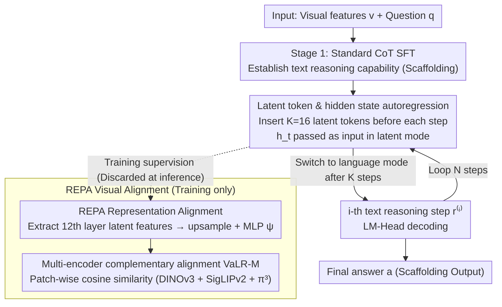

# Vision-aligned Latent Reasoning for Multi-modal Large Language Model

**Conference**: ICML 2026  
**arXiv**: [2602.04476](https://arxiv.org/abs/2602.04476)  
**Code**: Available on project page (provided at the end of the paper)  
**Area**: Multimodal VLM / Visual Reasoning / Test-time scaling  
**Keywords**: Latent space reasoning, Visual alignment, REPA, MLLM, Test-time scaling

## TL;DR
This paper proposes VaLR: inserting several "latent tokens" before each step of MLLM CoT reasoning and performing representation alignment (REPA) on these tokens using patch features from visual encoders like DINOv3, SigLIP, or π³. This mechanism continuously "feeds back" visual information to the model during long-chain reasoning, increasing the accuracy of Qwen2.5-VL on VSI-Bench from 33.0% to 52.9%, and for the first time enabling MLLMs to exhibit "longer reasoning, higher accuracy" test-time scaling behavior.

## Background & Motivation

**Background**: Existing MLLMs (e.g., Qwen2.5-VL, LLaVA series) generally treat visual features as "initial context"—stuffing them once into the sequence head and then letting the LLM backbone perform pure text CoT reasoning. While effective for short-context VQA, this approach fails in tasks requiring long-chain reasoning (e.g., multi-view spatial reasoning, mathematical geometry).

**Limitations of Prior Work**: The authors provide direct evidence in Figure 2's "Reasoning Length Analysis": as Ocean-R1's generation length grows from 100 to 300 tokens on MMVP, accuracy drops from 62.7% to 56.5%. Other latent reasoning methods (Monet, CoVT, LVR) also collapse on long-chains. In other words, the "test-time scaling law" (longer thinking → higher accuracy) enjoyed by text LLMs reverses in the multimodal domain to "long chain = more hallucinations."

**Key Challenge**: The root cause is the **progressive decay of visual signals**. For every additional text token generated autoregressively, the attention weight on the initial visual tokens is diluted. After generating hundreds of reasoning tokens, the model has almost "forgotten" the image. Early solutions injecting image tokens as fixed prefixes (CoVT, Monet) cannot solve this because visual information remains only at the start of the sequence.

**Goal**: Design a mechanism that "reactivates" the model's perception of the image **before every step of CoT reasoning**, without relying on external visual encoder calls at test time (to avoid inference overhead) while preserving long-chain reasoning capabilities.

**Key Insight**: Inspired by latent reasoning in the LLM domain (Coconut) and REPA (using external visual features to supervise intermediate layers in diffusion), the authors hypothesize: **by aligning the intermediate hidden states of the MLLM with patch features of a frozen visual encoder during training**, the model can learn to "generate visual anchors" itself, maintaining visual grounding during test time without external encoders.

**Core Idea**: Insert $K$ special latent tokens as "visual checkpoints" before each text reasoning step. During training, use patch features from encoders like DINOv3 to supervise the hidden states corresponding to these latent tokens via cosine similarity, allowing latent tokens to autonomously "refresh visual memory."

## Method

### Overall Architecture
VaLR undergoes two-stage SFT on a standard MLLM (Qwen2.5-VL-7B). During inference, the sequence follows $v, q \to (\ell_{[1:K]}^{(1)}, r^{(1)}, \ell_{[1:K]}^{(2)}, r^{(2)}, \cdots) \to a$, i.e., visual features + question → ($K$ latent tokens + $i$-th step text reasoning) × $N$ steps → final answer. Latent token segments are bounded by `<latent>` / `</latent>`. In latent mode, the model uses the previous hidden state $h_t$ directly as the next input embedding (bypassing the LM-Head and token embedding table); in language mode, it reverts to standard token embedding input. Each latent segment is forced back to language mode after a fixed $K=16$ steps. Training is divided into two stages: Stage 1 uses standard CoT SFT to build text reasoning capabilities (scaffolding); Stage 2 inserts latent tokens and applies REPA visual alignment—which exists only during training and is discarded during inference.

### Key Designs

**1. Latent Token and Hidden State Autoregression: Reserving K "thinking slots" for internal characterization before each reasoning step.**

Pure language CoT forces all intermediate states into discrete tokens, creating an information bottleneck too narrow for rich visual details. VaLR adds a "scratchpad": during preprocessing, CoT is rewritten from $v,q\to(r^{(i)})_{i=1}^N\to a$ to $v,q\to(\ell_{[1:K]}^{(i)},r^{(i)})_{i=1}^N\to a$, inserting $K$ latent tokens before each reasoning step. During forward passes, upon reaching `<latent>`, the next input embedding uses the last hidden state directly $E_{t+1}=[E_t;h_t]$ instead of $E_{t+1}=[E_t;e(x_{t+1})]$. This allows the model to perform $K=16$ steps in continuous hidden space before decoding text. This continuous transfer preserves more visual detail, serving as a dedicated space for visual anchoring.

**2. REPA Representation Alignment to External Visual Encoders: Supervising latent tokens with patch features to "internalize" visual grounding.**

Latent tokens must carry visual information. VaLR adopts the REPA approach: for step $i$, $K$ latent features $\mathbf{F}_{\text{MLLM}}^{(i)}$ are extracted from an intermediate layer (defaulting to the 12th layer), upsampled to match the patch count $P$ of the visual encoder, projected via MLP $\psi$, and aligned with $\mathbf{F}_\phi^{(i)}=\phi(I^{(i)})$ using patch-wise cosine similarity:

$$\mathcal{L}_{\text{REPA}}=-\frac{1}{NP}\sum_{i,p}\text{sim}(\hat{\mathbf{F}}_{\text{MLLM}}^{(i)}[p,:],\mathbf{F}_\phi^{(i)}[p,:])$$

Crucially, the external encoder is only used during training; latent tokens learn to produce visually aligned features autonomously. Ablations show this is vital: removing visual alignment drops accuracy from 41.5% to 34.0% (parity with vanilla SFT), while using self-supervised encoders like DINOv3 outperforms Qwen’s native encoder by 1.9%, indicating the "alignment objective" itself is the key.

**3. Multi-encoder Complementary Alignment (VaLR-M): Aligning multiple semantic/geometric encoders to store heterogeneous visual knowledge.**

Different encoders excel in different visual subspaces. VaLR-M defines $\mathcal{L}_{\text{REPA}}^{\text{multi}}=\frac{1}{M}\sum_m\mathcal{L}_{\text{REPA}}^{(m)}$, assigning a separate projection head $\psi_m$ to each encoder $\phi_m$. The paper utilizes DINOv3 (fine-grained appearance), SigLIPv2 (semantics), and π³ (3D geometry). Controlled experiments show clear division of labor: π³ contributes most to 3D multi-view tasks (+10pt+), while DINOv3/SigLIPv2 boost perception tasks like BLINK/MMVP, with the combination achieving a SOTA 52.9%. This explicitly injects "expert knowledge" into the latent space, effectively distilling a mini multi-view visual backbone inside the MLLM.

### Loss & Training
A two-stage curriculum is used: Stage 1 performs standard SFT on 450K CoT VQA data (mixture of Zebra-CoT / CogCoM / etc.) with $\mathcal{L}_{\text{CE}}$ loss. Stage 2 adds latent tokens and REPA on the same data, with total loss $\mathcal{L} = \mathcal{L}_{\text{CE}} + \lambda \mathcal{L}_{\text{REPA}}$, where $\lambda = 0.5$ and $K = 16$. In both stages, the native vision encoder is frozen while the decoder is trained (Stage 2 also trains the projection MLP). Training uses 4×A100, DeepSpeed Zero-2, AdamW, and learning rates of 1e-5 / 2e-6.

## Key Experimental Results

### Main Results
Evaluated on VSI-Bench (multi-view 3D spatial reasoning) across 8 sub-tasks and 5 perception benchmarks against GPT-4o, Claude-4, Qwen2.5-VL base, and three latent reasoning baselines.

| Model | VSI-Bench Avg | BLINK | MMVP | V* | CVBench |
|------|---------------|-------|------|-----|---------|
| GPT-4o | 34.0 | 63.0 | 68.7 | 42.9 | 79.2 |
| Qwen2.5-VL-7B (base) | 33.0 | 55.7 | 56.0 | 76.4 | 74.5 |
| + vanilla SFT | 33.7 | 56.6 | 58.7 | 78.0 | 77.0 |
| + Monet (latent baseline) | 14.0 | 49.1 | 50.0 | 83.3 | 71.1 |
| + CoVT | 18.6 | 56.0 | 58.7 | 78.0 | 80.0 |
| + VaLR-S (DINOv3) | 41.5 | 63.1 | 60.3 | 86.4 | 83.1 |
| + VaLR-M (Multi-encoder) | **52.9** | **64.7** | 60.3 | **86.9** | **87.6** |

VaLR-M improves the base model by +19.9% on VSI-Bench, outperforming GPT-4o by 18.9 points. Notably, existing latent reasoning methods (Monet, CoVT, LVR) collapse to 14-19% on 3D tasks, highlighting that latent reasoning without visual re-injection is insufficient.

### Ablation Study

| Configuration | VSI-Bench | BLINK | MMVP | V* |
|------|-----------|-------|------|-----|
| Qwen2.5-VL-7B | 33.0 | 55.7 | 56.0 | 76.4 |
| + vanilla SFT | 33.7 | 56.6 | 58.7 | 78.0 |
| + VaLR w/o VA (No alignment) | 34.0 | 57.1 | 56.7 | 75.9 |
| + VaLR w/ QE (Native encoder) | 39.6 | 58.9 | 60.0 | 81.7 |
| + VaLR (DINOv3) | 41.5 | 63.1 | 60.3 | 86.4 |

Alignment layer positioning experiments (Front/Middle/Last at layers 4/12/27) show the 12th layer (middle) is optimal, consistent with studies showing visual information concentration in MLLM middle layers.

### Key Findings
- **REPA is the Key**: Without alignment, VaLR degrades to vanilla SFT; alignment provides the +8pt+ gain. Latent tokens are merely "carriers"; the magic lies in explicitly feeding visual signals into the intermediate layers.
- **Emergence of Test-time Scaling**: VaLR is the only method where accuracy scales with reasoning length; others collapse after a certain point.
- **Expert Collaboration**: π³ boosts 3D tasks, while DINOv3/SigLIP boost perception. Their effects are additive, suggesting latent space is vast enough for multi-source knowledge.
- **Data Scaling**: VaLR reaches the V* performance of vanilla SFT (trained on 450K data) using only 50K data, showing >20× faster convergence.

## Highlights & Insights
- Combines "latent reasoning" and "REPA" to address the core bottleneck: visual signal decay in long-chain MLLM reasoning.
- **No external encoders are needed at inference**, providing high engineering value. The visual alignment capability is distilled into the MLLM's intermediate layers.
- The concept of "visual refresh slots" via latent tokens can be generalized to other scenarios like long-context document RAG or long video description.
- π³'s contribution to 3D tasks shows latent alignment naturally accommodates "non-linguistic" visual properties, offering a path for 3D/tactile/audio integration without captioning.

## Limitations & Future Work
- The number of latent tokens $K=16$ is fixed; adaptive budgets based on reasoning step "visual hunger" remain unexplored.
- Reliance on synthetic CoT data (Zebra-CoT, etc.) may lead to overfitting on specific distributions; impact on non-reasoning VQA is not fully assessed.
- Training with multiple encoders increases compute requirements (multiple ViT-L forward passes), which scales poorly for 32B/72B models.
- π³ requires multi-view inputs, making it inapplicable for single-image VQA; the full range of visual representation families for latent alignment is yet to be explored.
- While test-time scaling is observed, the "marginal utility" curve for reasoning budget vs. gain is not systematically characterized for industrial deployment.

## Related Work & Insights
- **vs. CoVT / Monet**: These use static prefix injection; VaLR uses dynamic re-injection, avoiding the performance collapse seen in multi-view tasks.
- **vs. Coconut**: Coconut performs latent reasoning in pure text LLMs without visual supervision; VaLR extends this and solves visual information loss via REPA.
- **vs. REPA**: Original REPA was for diffusion models; VaLR adapts it to autoregressive MLLM latent tokens.
- **vs. Visual CoT / Imagine-then-Reason**: These explicitly generate images/tokens, which is computationally expensive and limited by generator quality. VaLR achieves the same goal in latent space, being more lightweight and controllable.

## Rating
- Novelty: ⭐⭐⭐⭐ — Excellent combination of latent reasoning and REPA, though components exist independently.
- Experimental Thoroughness: ⭐⭐⭐⭐⭐ — Comprehensive evaluation across 6 benchmarks and full ablations on architecture and scaling.
- Writing Quality: ⭐⭐⭐⭐ — Very clear motivation; Figure 2 is highly effective.
- Value: ⭐⭐⭐⭐⭐ — Significant VSI-Bench gains (+19.9pt) with zero additional inference overhead.

<!-- RELATED:START -->

## Related Papers

- [\[ICML 2026\] CG-MLLM: Captioning and Generating 3D Content via Multi-modal Large Language Models](cg-mllm_captioning_and_generating_3d_content_via_multi-modal_large_language_mode.md)
- [\[CVPR 2026\] Joint-Aligned Latent Action: Towards Scalable VLA Pretraining in the Wild](../../CVPR2026/multimodal_vlm/joint-aligned_latent_action_towards_scalable_vla_pretraining_in_the_wild.md)
- [\[ICLR 2026\] Multi-modal Data Spectrum: Multi-modal Datasets are Multi-dimensional](../../ICLR2026/multimodal_vlm/multi-modal_data_spectrum_multi-modal_datasets_are_multi-dimensional.md)
- [\[ICML 2026\] Referring Multiple Regions with Large Multimodal Models via Contextual Latent Steering](referring_multiple_regions_with_large_multimodal_models_via_contextual_latent_st.md)
- [\[ICML 2026\] Model-Dowser: Data-Free Importance Probing to Mitigate Catastrophic Forgetting in Multimodal Large Language Models](model-dowser_data-free_importance_probing_to_mitigate_catastrophic_forgetting_in.md)

<!-- RELATED:END -->
