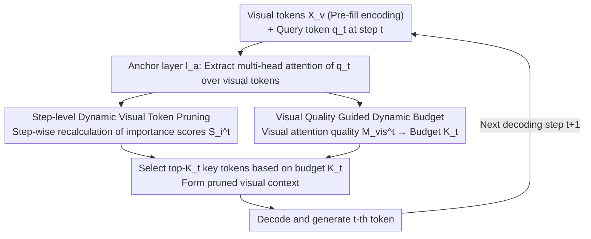

# VisionPulse: Dynamic Visual Sparsification in Multimodal Reasoning

**Conference**: ICML 2026  
**arXiv**: [2605.31457](https://arxiv.org/abs/2605.31457)  
**Code**: TBD  
**Area**: Multimodal VLM  
**Keywords**: Visual token pruning, Inference efficiency, Dynamic budget allocation, Multimodal reasoning

## TL;DR
VisionPulse proposes a training-free step-level dynamic visual token pruning framework. By adaptively adjusting the number of retained tokens based on evolving visual dependencies at each decoding step, it maintains inference accuracy while keeping only 5% of visual tokens, effectively reducing reasoning length by 11.2%.

## Background & Motivation

**Background**: Large Multimodal Models (LMMs) perform exceptionally in multi-step reasoning tasks, yet inference latency remains a critical bottleneck. Existing visual token compression methods primarily perform a single pruning operation during the pre-filling stage.

**Limitations of Prior Work**: This "static pruning" assumes that the relevance of selected visual tokens remains unchanged throughout the reasoning process. During the pre-filling stage, the model's attention to visual input is often low; a fixed subset selected at this stage might discard tokens that become crucial in subsequent reasoning steps while retaining redundant visual context during text-dominant steps.

**Key Challenge**: The demand for visual evidence is highly dependent on the current reasoning state rather than remaining constant. Some steps require extensive visual evidence, while others are primarily driven by linguistic reasoning.

**Goal**: Design a step-level dynamic visual token pruning framework capable of adjusting the set of retained tokens at each decoding step based on current visual dependencies.

**Key Insight**: Empirical analysis reveals a strong positive correlation between the quality of visual attention at each decoding step and the number of effectively activated visual tokens. This lightweight signal can be used to predict the optimal budget for each step.

**Core Idea**: Shift visual token pruning from a "pre-filling one-time decision" to "step-wise dynamic selection," utilizing visual attention quality to calculate the token retention budget for each step.

## Method

### Overall Architecture
VisionPulse is a training-free framework that transforms visual token selection from a "one-time decision during pre-filling" to a "gradual re-selection during decoding." Visual tokens $X_v$ are encoded normally during pre-filling. Subsequently, for every generated token, a re-selection occurs: at the $t$-th decoding step, the attention of the current query token $q_t$ toward various visual tokens is captured at a specific **anchor layer** $l_a$. This information is used on one path to calculate the **importance score** $S_i^t$ for each visual token (step-level dynamic pruning) and on another path to convert the overall **visual attention quality** $M_{\mathrm{vis}}^{t}$ into a **dynamic budget** $K_t$, representing how many tokens should be retained (visual quality guidance). Finally, the top-$K_t$ most critical tokens are selected to form the pruned visual context for decoding the current token before proceeding to the next iteration. The entire process reuses existing model attention statistics without any additional training.

### Key Designs

**1. Step-level dynamic visual token pruning: Re-selecting at each decoding step instead of once during pre-filling**

The risk of static pruning is the assumption that visual tokens selected during pre-filling remain relevant throughout reasoning. However, initial visual attention is often low, and fixed subsets may miss tokens that only become critical later. VisionPulse moves selection to every decoding step: for the visual token set $X_v = \{v_1, ..., v_N\}$, at an **anchor layer** $l_a$ (where pruning begins), the importance is calculated at step $t$ as $S_i^t = \frac{1}{H}\sum_{h=1}^{H}A_{t,h}^{(l_a)}(q_t, v_i)$ (multi-head average attention of the current query token over visual tokens). The top $K_t$ tokens are then selected: $X_v^t = \{v_i \mid i \in \text{Top-}K_t(\{S_i^t\}_{i=1}^N)\}$. Unlike static schemes, $K_t$ is not fixed—it precisely tracks "how many tokens are needed for this step," mapping fine-grained needs to each step.

**2. Dynamic budget guided by visual attention quality: Using a lightweight signal to determine retention**

To determine $K_t$, this work identifies an empirical signal: the visual attention quality $M_{\mathrm{vis}}^{t} = \frac{1}{H}\sum_{h=1}^{H}m_{t,h}^{\mathrm{vis}}$ (where $m_{t,h}^{\mathrm{vis}} = \sum_{i=1}^{N_v}A_{t,h}^{(l_a)}(q_t, v_i)$ is the sum of attention for that head over all visual tokens) has a strong positive correlation (0.82-0.95) with the number of actually activated visual tokens. It is converted into a budget $K_t = M_{\mathrm{vis,max}}^t \cdot N_v$, with temperature $\tau < 1$ controlling pruning aggressiveness. Steps with high visual demand automatically retain more tokens, while text-dominant steps are pruned aggressively, driven by existing attention statistics without requiring a complex importance predictor.

**3. Coupled bottleneck: Why on-demand pruning saves computation and shortens reasoning**

This is the core insight distinguishing this work from pure efficiency research: redundant visual context carries a **dual cost**. The first is computational: the total cost $\mathcal{F}_{\text{total}} \approx L \cdot [(p+v)(8d^2+4md)+4d(p+v)^2]_{\text{prefill}} + L \cdot \sum_{t=1}^{g}[(8d^2+4md)+4d(p+v+t)]_{\text{decoding}}$ has quadratic complexity regarding generation length $g$ and initial context $(p+v)$. In multimodal scenarios where $v \gg p$, visual tokens are the dominant term. The second, more critical cost is that full visual context introduces irrelevant visual cues at every step, distracting the model and inducing unnecessary reasoning steps or even incorrect paths. VisionPulse's on-demand pruning achieves a "dual win": removing irrelevant tokens saves computation and naturally shortens the reasoning chain. This explains the counter-intuitive phenomenon where incorrect pruning strategies simultaneously degrade accuracy and prolong reasoning due to increased interference.

## Key Experimental Results

### Main Results

| Method | Visual Token Ratio | CharXiv Gen Length ↓ | Accuracy ↑ | InfoVQA Gen Length ↓ | Accuracy ↑ | ChartQA Gen Length ↓ | Accuracy ↑ | Avg Length Change | Avg Acc |
|------|-------------------|------------------------|--------|------------------|--------|------------------|--------|---------------------|---------|
| Baseline (Full) | 100% | 4068.0 | 47.60% | 623.1 | 84.37% | 510.0 | 77.12% | - | - |
| VisionZip | ≤10% | 4986.2 | 13.90% | 2533.3 | 22.66% | 2039.7 | 30.24% | +54.2% | -39.7% |
| FastV | ≤10% | 5960.1 | 12.70% | 2963.6 | 20.63% | 1485.5 | 16.28% | +63.2% | -47.6% |
| LOOK-M | ≤10% | 5555.2 | 19.80% | 2694.1 | 40.94% | 2007.1 | 57.68% | +54.2% | -24.5% |
| **VisionPulse** | **≤10%** | **3770.7** | **47.30%** | **530.7** | **83.62%** | **422.9** | **76.72%** | **-12.3%** | **-0.6%** |
| **VisionPulse** | **≤5%** | **3645.1** | **45.20%** | **665.0** | **81.90%** | **510.0** | **75.16%** | **-11.2%** | **-1.8%** |

### Ablation Study

| Config | Avg Visual Ratio | RealWorld QA Acc | MMVet Acc | MIA-Bench Acc | Avg Length Reduction | Avg Acc Change |
|-----------|------------------|--------|--------|--------|---------------------|------------|
| Full Model | 100% | 72.81% | 60.96% | 93.44% | - | - |
| FastV Static | 5.0% | 54.12% | 24.27% | 75.03% | +22.2% | -32.5% |
| VisionPulse Fixed 1% | ~1% | 71.90% | 49.17% | 92.03% | +27.9% | -6.2% |
| VisionPulse Fixed 5% | 5.0% | 72.81% | 59.45% | 93.22% | -7.6% | -0.8% |
| VisionPulse Random Budget | 3.0% | 69.28% | 58.02% | 91.49% | +0.2% | -3.7% |
| **VisionPulse Dynamic** | **1.9%** | **72.54%** | **59.00%** | **95.09%** | **-16.6%** | **-0.3%** |

### Key Findings
- Under extreme pruning (≤5% token retention), VisionPulse almost fully preserves original performance (accuracy drop of only 0.3-1.8%), whereas existing static methods drop by 24.5-50.9%.
- By removing irrelevant visual information based on actual step-wise demand, VisionPulse shortens average reasoning length by 11.2-12.3%.
- Incorrect pruning strategies exhibit a paradoxical phenomenon: reducing accuracy while increasing inference costs (LOOK-M at 5% retention saw length increase by 108% while accuracy dropped by 38.6%).
- The dynamic budget maintains accuracy with only a 0.3% drop at an average retention rate of 1.9%.

## Highlights & Insights
- **Empirical Support for Key Insights**: Figure 1 visualizes the dynamic changes in visual attention quality, deriving method design from observed phenomena.
- **Computationally Elegant Budgeting**: Uses visual attention quality as a lightweight signal to predict token retention per step, avoiding complex learners.
- **Discovery and Solution of Coupled Bottlenecks**: Reveals that redundant visual information not only adds computation but also induces erroneous reasoning.
- **Generality and Transferability**: Built upon FastV's importance calculation but theoretically adaptable to any other token scoring scheme.

## Limitations & Future Work
- Only effective at inference time; cannot be further optimized via joint learning.
- Temperature parameters require manual tuning.
- Simplification of computational cost analysis (assuming uniform complexity distribution across layers).
- Primarily tested on CoT reasoning tasks; effectiveness on other multimodal tasks requires validation.
- Improvements: Multi-level pruning; adaptive temperature schedulers; integration into multimodal instruction fine-tuning stages.

## Related Work & Insights
- **vs VisionZip**: Single-shot pruning; Ours uses step-wise pruning in intermediate layers to capture changing demands.
- **vs FastV**: Upgrades one-time decisions to step-wise adaptation; improves accuracy retention from 60-70% to 98%+.
- **vs LOOK-M**: Ours goes beyond at a finer granularity (every generation step) and a more dynamic dimension.
- **Insight**: The perspective of "step-level multimodal demand" can be extended to dynamic selection of text tokens or joint multimodal budget allocation.

## Rating
- Novelty: ⭐⭐⭐⭐⭐ Fundamental shift from "fixed pruning" to "step-wise dynamic pruning."
- Experimental Thoroughness: ⭐⭐⭐⭐⭐ 7 benchmarks + 7 comparison methods + comprehensive ablation + cross-LMM backbone validation.
- Writing Quality: ⭐⭐⭐⭐⭐ Clear logical chain; key findings presented with contrasting tables.
- Value: ⭐⭐⭐⭐⭐ Directly reduces inference cost and improves reasoning reliability; training-free and easy to deploy.

<!-- RELATED:START -->

## Related Papers

- [\[ICML 2026\] CSMR (Look on Demand): A Cognitive Scheduling Framework for Visual Evidence Acquisition in Multimodal Reasoning](look_on_demand_a_cognitive_scheduling_framework_for_visual_evidence_acquisition_.md)
- [\[ICML 2026\] Learn to Think: Improving Multimodal Reasoning through Vision-Aware Self-Improvement Training](learn_to_think_improving_multimodal_reasoning_through_vision-aware_self-improvem.md)
- [\[CVPR 2026\] ReaGEN: Adaptive Generation of Structured Chains-of-Thought for Efficient Multimodal Reasoning](../../CVPR2026/multimodal_vlm/reagen_adaptive_generation_of_structured_chains-of-thought_for_efficient_multimo.md)
- [\[ICML 2026\] Dimension-Free Multimodal Sampling via Preconditioned Annealed Langevin Dynamics](dimension-free_multimodal_sampling_via_preconditioned_annealed_langevin_dynamics.md)
- [\[ICML 2026\] Hyper-ICL: Attention Calibration with Hyperbolic Anchor Distillation for Multimodal ICL](hyper-icl_attention_calibration_with_hyperbolic_anchor_distillation_for_multimod.md)

<!-- RELATED:END -->
