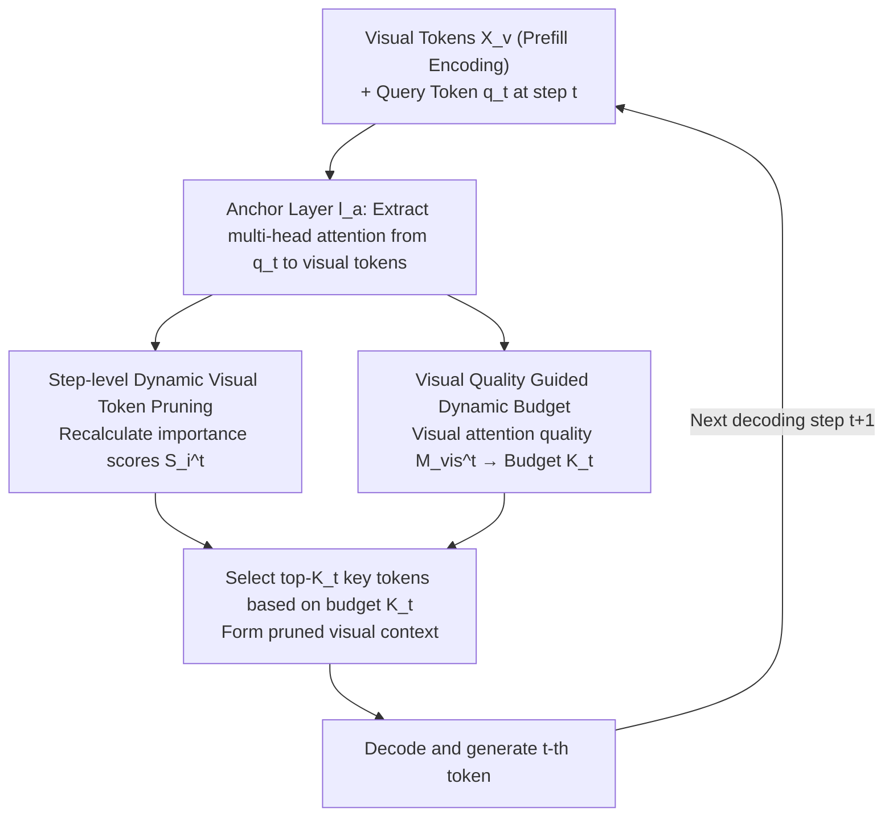

# VisionPulse: Dynamic Visual Sparsification in Multimodal Reasoning

**Conference**: ICML 2026  
**arXiv**: [2605.31457](https://arxiv.org/abs/2605.31457)  
**Code**: TBD  
**Area**: Multimodal VLM  
**Keywords**: Visual Token Pruning, Inference Efficiency, Dynamic Budget Allocation, Multimodal Reasoning

## TL;DR
VisionPulse proposes a training-free, step-level dynamic visual token pruning framework. By adaptively adjusting the number of retained tokens based on changing visual dependencies at each decoding step, it maintains inference accuracy while retaining only 5% of visual tokens, reducing inference length by 11.2%.

## Background & Motivation

**Background**: Large Multimodal Models (LMMs) excel in multi-step reasoning tasks, but inference latency remains a critical bottleneck. Existing visual token compression methods primarily perform a single pruning operation during the prefilling stage.

**Limitations of Prior Work**: This "static pruning" assumes that the relevance of selected visual tokens remains constant throughout the entire inference process. During prefilling, the model's attention to visual input is low; a fixed subset selected at this stage may discard tokens that become crucial in later reasoning steps, while retaining redundant visual context during text-dominated steps.

**Key Challenge**: Visual evidence requirements are highly dependent on the current reasoning state rather than remaining constant. Some steps require extensive visual evidence, while others are primarily driven by linguistic reasoning.

**Goal**: Design a step-level dynamic visual token pruning framework that can adjust the set of retained tokens at each decoding step based on current visual dependencies.

**Key Insight**: Empirical analysis reveals a strong positive correlation between the quality of visual attention and the number of effectively activated visual tokens at each decoding step. This lightweight signal can be used to predict the optimal budget for every step.

**Core Idea**: Transform visual token pruning from a "one-time prefilling decision" into "step-wise dynamic selection," utilizing visual attention quality to calculate the token retention budget for each step.

## Method

### Overall Architecture
VisionPulse is a training-free framework that shifts visual token selection from a one-time prefilling decision to a step-wise re-evaluation during decoding. Visual tokens $X_v$ are encoded normally during prefilling. Subsequently, for every generated token, the selection is redone: at the $t$-th decoding step, attention from the current query token $q_t$ to each visual token is extracted at an **anchor layer** $l_a$. One path calculates the **importance score** $S_i^t$ for each visual token (step-level dynamic pruning), while another path converts the overall **visual attention quality** $M_{\mathrm{vis}}^{t}$ into a **dynamic budget** $K_t$ (visual quality guidance) for the current step. Finally, the top-$K_t$ most critical tokens are selected to form the pruned visual context to decode the current token. The entire process reuses existing attention statistics without additional training.

### Key Designs

**1. Step-level Dynamic Visual Token Pruning: Re-selection at every decoding step**

The risk of static pruning is the assumption that visual tokens selected during prefilling remain relevant. VisionPulse moves selection to every decoding step: for visual tokens $X_v = \{v_1, ..., v_N\}$, importance is calculated at an **anchor layer** $l_a$ at step $t$ as $S_i^t = \frac{1}{H}\sum_{h=1}^{H}A_{t,h}^{(l_a)}(q_t, v_i)$. The top $K_t$ tokens are then selected: $X_v^t = \{v_i \mid i \in \text{Top-}K_t(\{S_i^t\}_{i=1}^N)\}$. Unlike static schemes, $K_t$ is not fixed—it precisely tracks the fine-grained visual requirements of each step.

**2. Visual Attention Quality Guided Dynamic Budget: Determining retention via lightweight signals**

To determine $K_t$, this work identifies a strong signal: the visual attention quality $M_{\mathrm{vis}}^{t} = \frac{1}{H}\sum_{h=1}^{H}m_{t,h}^{\mathrm{vis}}$ (where $m_{t,h}^{\mathrm{vis}} = \sum_{i=1}^{N_v}A_{t,h}^{(l_a)}(q_t, v_i)$) correlates strongly (0.82-0.95) with the number of activated visual tokens. This is converted to a budget $K_t = M_{\mathrm{vis,max}}^t \cdot N_v$, with temperature $\tau < 1$ controlling pruning aggressiveness.

**3. Coupled Bottleneck: Why on-demand pruning improves both efficiency and accuracy**

Redundant visual context imposes a **dual cost**. First is computation: total overhead $\mathcal{F}_{\text{total}}$ is quadratic relative to sequence length and initial context. In multimodal settings, $v \gg p$, making visual tokens the dominant factor. The second cost is more critical: redundant context introduces noise unrelated to the current query, inducing unnecessary reasoning steps or incorrect paths, thereby lengthening the reasoning chain. VisionPulse's on-demand pruning addresses both by removing irrelevant tokens, saving computation while shortening the reasoning chain.

## Key Experimental Results

### Main Results

| Method | Visual Token Ratio | CharXiv Gen Length ↓ | Accuracy ↑ | InfoVQA Gen Length ↓ | Accuracy ↑ | ChartQA Gen Length ↓ | Accuracy ↑ | Avg Length Change | Avg Accuracy |
|------|-------------------|------------------------|--------|------------------|--------|------------------|--------|---------------------|---------|
| Baseline (Full) | 100% | 4068.0 | 47.60% | 623.1 | 84.37% | 510.0 | 77.12% | - | - |
| VisionZip | ≤10% | 4986.2 | 13.90% | 2533.3 | 22.66% | 2039.7 | 30.24% | +54.2% | -39.7% |
| FastV | ≤10% | 5960.1 | 12.70% | 2963.6 | 20.63% | 1485.5 | 16.28% | +63.2% | -47.6% |
| LOOK-M | ≤10% | 5555.2 | 19.80% | 2694.1 | 40.94% | 2007.1 | 57.68% | +54.2% | -24.5% |
| **Ours** | **≤10%** | **3770.7** | **47.30%** | **530.7** | **83.62%** | **422.9** | **76.72%** | **-12.3%** | **-0.6%** |
| **Ours** | **≤5%** | **3645.1** | **45.20%** | **665.0** | **81.90%** | **510.0** | **75.16%** | **-11.2%** | **-1.8%** |

### Ablation Study

| Configuration | Avg Visual Ratio | RealWorld QA Acc | MMVet Acc | MIA-Bench Acc | Avg Gen Length Reduc | Avg Acc Change |
|-----------|------------------|--------|--------|--------|---------------------|------------|
| Full Model | 100% | 72.81% | 60.96% | 93.44% | - | - |
| FastV (Static) | 5.0% | 54.12% | 24.27% | 75.03% | +22.2% | -32.5% |
| Ours (Fixed 1%) | ~1% | 71.90% | 49.17% | 92.03% | +27.9% | -6.2% |
| Ours (Fixed 5%) | 5.0% | 72.81% | 59.45% | 93.22% | -7.6% | -0.8% |
| Ours (Random Budget) | 3.0% | 69.28% | 58.02% | 91.49% | +0.2% | -3.7% |
| **Ours (Dynamic Budget)** | **1.9%** | **72.54%** | **59.00%** | **95.09%** | **-16.6%** | **-0.3%** |

### Key Findings
- Under extreme pruning (≤5%), VisionPulse retains nearly full performance (0.3-1.8% drop), while static methods drop 24.5%-50.9%.
- Removing irrelevant information shortens reasoning length by 11.2%-12.3% on average.
- Incorrect pruning strategies lead to a paradoxical outcome: decreased accuracy alongside increased reasoning cost.
- Dynamic budgeting maintains accuracy with only a 0.3% drop at an average 1.9% retention rate.

## Highlights & Insights
- **Empirical Support**: Visualizations demonstrate the dynamic fluctuations in visual attention quality, grounding the method's design.
- **Elegant Budgeting**: Utilizes lightweight attention statistics to predict per-step token retention, avoiding complex learned predictors.
- **Solving Coupled Bottlenecks**: Reveals that redundant visual information not only adds computation but also induces reasoning errors.

## Limitations & Future Work
- Operational only during inference; cannot be optimized via joint learning.
- Manual tuning of temperature parameters is required.
- Simplified computational cost analysis (assumes uniform layer complexity).
- Primary focus on CoT reasoning; effects on other multimodal tasks require validation.
- Future directions: Multi-level pruning; adaptive temperature scheduling; integration into multimodal instruction tuning.

## Related Work & Insights
- **vs. VisionZip/FastV**: Upgrades one-time decisions to multi-step adaptation, improving accuracy retention from 60-70% to 98%+.
- **vs. LOOK-M**: Surpasses prior work in granularity (every generation step) and dynamism.
- **Insight**: The "step-level multimodal demand" perspective can be extended to dynamic text token selection or joint multimodal budget allocation.

## Rating
- Novelty: ⭐⭐⭐⭐⭐ Fundamental shift from fixed to step-level dynamic pruning.
- Experimental Thoroughness: ⭐⭐⭐⭐⭐ 7 benchmarks, 7 baselines, and cross-LMM validation.
- Writing Quality: ⭐⭐⭐⭐⭐ Clear logical chain with high-contrast comparative results.
- Value: ⭐⭐⭐⭐⭐ Direct reduction of inference cost and improvement in reliability; training-free and easy to deploy.

<!-- RELATED:START -->

## Related Papers

- [\[ICML 2026\] Dimension-Free Multimodal Sampling via Preconditioned Annealed Langevin Dynamics](dimension-free_multimodal_sampling_via_preconditioned_annealed_langevin_dynamics.md)
- [\[ICML 2026\] Hyper-ICL: Attention Calibration with Hyperbolic Anchor Distillation for Multimodal ICL](hyper-icl_attention_calibration_with_hyperbolic_anchor_distillation_for_multimod.md)
- [\[ICML 2026\] Large Vision-Language Models Get Lost in Attention](large_vision-language_models_get_lost_in_attention.md)
- [\[ICML 2026\] V-LynX: Token Interface Alignment for VideoX LLMs](v-lynx_token_interface_alignment_for_videox_llms.md)
- [\[ICML 2026\] CG-MLLM: Captioning and Generating 3D Content via Multi-modal Large Language Models](cg-mllm_captioning_and_generating_3d_content_via_multi-modal_large_language_mode.md)

<!-- RELATED:END -->
