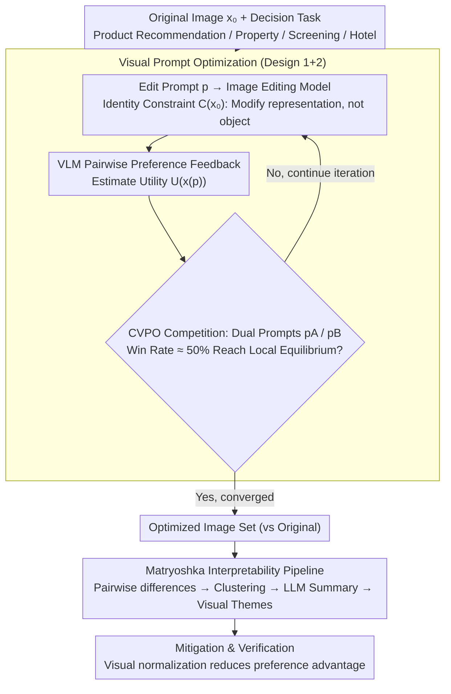

# Visual Persuasion: What Influences the Decisions of Vision-Language Models?

**Conference**: ICML 2026  
**arXiv**: [2602.15278](https://arxiv.org/abs/2602.15278)  
**Code**: https://github.com/MaggieCherepLabs  
**Area**: Multimodal VLM  
**Keywords**: Visual Persuasion, VLM Decision-making, Visual Preferences, Prompt Optimization, Interpretability

## TL;DR
This paper systematically uses image editing models to modify visual attributes (maintaining semantic invariance) and discovers significant visual preferences in VLMs. It proposes three visual prompt optimization methods to reveal these preferences, develops an automatic interpretability pipeline to understand the visual themes driving decisions, and mitigates risks through visual normalization.

## Background & Motivation

**Background**: Current VLM evaluation primarily focuses on functional metrics, but in practical applications, VLMs are deployed as agent systems to make critical decisions—such as automatically recommending products, screening candidates, and evaluating real estate.

**Limitations of Prior Work**: Existing VLM evaluations lack a deep understanding of the structure of a model's visual preferences. Research shows LLM agents are highly sensitive to text prompts, but the vulnerability of VLM visual preferences is poorly understood. When these models run autonomously, any hidden visual preferences could be maliciously exploited or lead to large-scale bias.

**Key Challenge**: How to systematically discover and quantify VLM visual preferences? Traditional approaches (collecting large datasets of natural variations) are high-cost and have incomplete coverage.

**Goal**: (1) Develop systematic methods to reveal VLM visual preferences; (2) Quantitatively evaluate the impact of these preferences on model decision-making; (3) Identify and explain the visual themes driving decisions; (4) Propose mitigation strategies.

**Key Insight**: Contemporary image editing models (Gemini 3, Qwen-Image-Edit) provide fine-grained visual controllability. These models can be used to iteratively modify images while optimizing the editing direction through VLM pairwise selection feedback—essentially exploring the model's hidden utility function.

**Core Idea**: Treat the VLM decision function as a hidden visual utility landscape and infer and explore this landscape through "revealed preference"—systematic editing and pairwise comparison.

## Method

### Overall Architecture
Three stages—(1) **Visual Prompt Optimization**: Starting from original images, use image editing models to iteratively modify images based on optimization feedback until local equilibrium is reached; (2) **Auto-Interpretability Pipeline**: Abstract the differences between optimized and original images into high-level visual themes through multi-stage aggregation (Matryoshka summarization); (3) **Mitigation & Verification**: Test the effectiveness of visual normalization.

### Key Designs

**1. Optimization under Identity Constraints: Modify representation, not the object**

To detect the visual preferences of a VLM, it is necessary to ensure the edited image remains the "same thing"; otherwise, the optimizer might cheat—directly replacing the object with another one the VLM prefers to trick it into a high score. This paper uses an identity constraint set $\mathcal{C}(x_0) = \{x \in \mathcal{X}: I(x, x_0) = 1\}$ to define this, formulating the optimization as $\max_{p \in \mathcal{P}} U_\tau(x(p))$ s.t. $x(p) \in \mathcal{C}(x_0)$. This means searching for edit prompts $p$ that maximize the VLM utility $U_\tau$ only within the "semantic-preserving" image subset. Thus, all edits only change the presentation (lighting, angle, layout, style) rather than the essence of the object, ensuring revealed preferences reflect tendencies toward "how to present" rather than "what to replace."

**2. Three Competitive Visual Prompt Optimizations (VTG/VFD/CVPO): Exploring utility functions under noisy feedback**

VLM preference feedback is pairwise and noisy, making stable convergence in discrete edit prompt spaces difficult. All three methods follow a "propose-evaluate" loop but differ in stopping mechanisms: VisualTextGrad (VTG) uses an LLM critic to produce text gradient feedback but fails to stop effectively in noise; VisualFeedbackDescent (VFD) uses multi-critic voting for stabilization but requires an average of 24.9 iterations. This paper proposes Competitive Visual Prompt Optimization (CVPO), which models optimization as a competition—maintaining two competitor prompts $p_A, p_B$ simultaneously and performing consistency checks with $k$ judges each round. It stops when the win rate approaches 50% (indicating the prompts are indistinguishable and have reached local equilibrium). This stopping condition allows CVPO to average only 17.4 iterations, reducing costs by 63% while achieving optimal results on most models.

**3. Matryoshka Multi-stage Interpretability Pipeline: Abstracting pixel differences into readable visual themes**

Finding "which image the VLM prefers" is insufficient; one must explain which visual features it favors. This pipeline performs recursive abstraction in two stages: the first stage uses the VLM to compare original and optimized images pair-by-pair to generate fine-grained difference descriptions; the second stage embeds these descriptions, clusters them by similarity, and uses an LLM to summarize each cluster. "Matryoshka" refers to how high-level clusters are derived from summaries of lower-level clusters, nesting layers while maintaining traceability. This allows for both automatic generation of explanations for thousands of optimized images and drilling down from high-level themes back to specific image pairs. An interesting byproduct is that different optimization methods often converge to similar visual themes, suggesting that the detected preferences are stable properties of the VLM itself rather than artifacts of a specific method.

## Key Experimental Results

### Main Results: Evaluation of Optimization Effectiveness

| Dataset/Task | Original Image | Zero-shot Edit | Optimized | Gain (vs Original) |
|------------|--------|----------|-------|--------------|
| Product Recommendation | 0.27 ± 0.03 | 0.48 ± 0.02 | 0.55 ± 0.02 | +78% |
| Property Search | 0.31 ± 0.02 | 0.51 ± 0.02 | 0.62 ± 0.02 | +100% |
| Candidate Screening | 0.29 ± 0.03 | 0.47 ± 0.02 | 0.58 ± 0.02 | +100% |
| Hotel Booking | 0.26 ± 0.03 | 0.52 ± 0.02 | 0.61 ± 0.02 | +135% |

### Comparison of Optimization Methods

| VLM | VTG | VFD | CVPO | Best-Suboptimal Diff |
|-----|-----|-----|------|-------------|
| Qwen-3-VL 235B | 0.131 | 0.601 | 0.771 | +0.170 |
| GPT-5 Mini | 0.190 | 0.561 | 0.766 | +0.205 |
| Gemini 3 Flash | 0.140 | 0.604 | 0.761 | +0.157 |
| GPT-4o | 0.179 | 0.566 | 0.749 | +0.183 |
| Claude Sonnet 4.5 | 0.310 | 0.603 | 0.594 | -0.010 |

### Key Findings
- Zero-shot editing is already significantly effective—basic prompts can increase selection probability by 0.2-0.4.
- CVPO is the most stable—outperforming VFD on 7 out of 9 VLMs.
- Significant efficiency differences—VTG used 100% budget, VFD 74.6%, while CVPO used only 36.9%.
- Human study validation (N=154): CVPO optimized results ranked highest in human head-to-head comparisons.
- Convergence of visual themes—Different optimization methods converge to similar themes, implying stable VLM properties.
- Incompleteness of mitigation strategies—Visual normalization reduces the advantage but cannot eliminate it entirely.

## Highlights & Insights
- **Methodological Innovation**: First systematic extension of prompt optimization to the visual domain; the CVPO competitive framework and equilibrium stopping condition are ingenious designs.
- **Multi-layered Evidence System**: 1.8M+ API calls, 125k+ generated images, 4 task domains, human validation, and auto-interpretability.
- **Key Insight "Hidden Optimization of Presentation Materials"**: Reveals a critical risk in AI governance—if image optimization is maliciously exploited, it can systematically manipulate VLM agent decisions.
- **Reusable Design Thinking**: Matryoshka summarization, identity constraints, and competitive framework are all generalizable.

## Limitations & Future Work
- High computational requirements limit scalability.
- Boundaries for identity maintenance are blurred (ethical tensions in background/attire).
- Limited scale of human validation (N=154).
- Using images from the same optimization set for prompt distillation may affect external validity.
- Future work: Study VLM adversarial robustness training; develop visual auditing tools; extend to multimodal scenarios; research VLM preference variance.

## Related Work & Insights
- **vs Adversarial Examples**: Adversarial research seeks minimal perceptible perturbations; this work focuses on perceptually significant but semantically preserved natural variations.
- **vs Behavioral ML & Agent Evaluation**: Prior work is in the text domain; this work extends to the visual domain and develops the first systematic discovery method.
- **vs Prompt Optimization Literature (TextGrad, Feedback Descent)**: This work extends the principles of feedback gradients to the multimodal domain.
- **vs Auto-Interpretability**: This work uses similar ideas to explain black-box VLM behavioral outputs, serving as a complementary external interpretability method.

## Rating
- Novelty: ⭐⭐⭐⭐⭐  First systematic use of visual prompt optimization to explore hidden VLM visual preferences.
- Experimental Thoroughness: ⭐⭐⭐⭐⭐  Large-scale experiments with a complete chain of evidence; the only minor flaw is the limited human sample size.
- Writing Quality: ⭐⭐⭐⭐  Clear logic and detailed explanation of methodology.
- Value: ⭐⭐⭐⭐⭐  Significant real-world implications for AI safety and governance.

<!-- RELATED:START -->

## Related Papers

- [\[ICML 2026\] VisionPulse：多模态推理中的动态视觉稀疏化](visionpulse_dynamic_visual_sparsity_for_efficient_multimodal_reasoning.md)
- [\[ICML 2026\] Hyper-ICL: Attention Calibration with Hyperbolic Anchor Distillation for Multimodal ICL](hyper-icl_attention_calibration_with_hyperbolic_anchor_distillation_for_multimod.md)
- [\[ICML 2026\] Dimension-Free Multimodal Sampling via Preconditioned Annealed Langevin Dynamics](dimension-free_multimodal_sampling_via_preconditioned_annealed_langevin_dynamics.md)
- [\[ICML 2026\] Immuno-VLM: Immunizing Large Vision-Language Models via Generative Semantic Antibodies for Open-World Trustworthiness](immuno-vlm_immunizing_large_vision-language_models_via_generative_semantic_antib.md)
- [\[ICML 2026\] Multimodal Continual Learning with MLLMs from Multi-scenario Perspectives](multimodal_continual_learning_with_mllms_from_multi-scenario_perspectives.md)

<!-- RELATED:END -->
