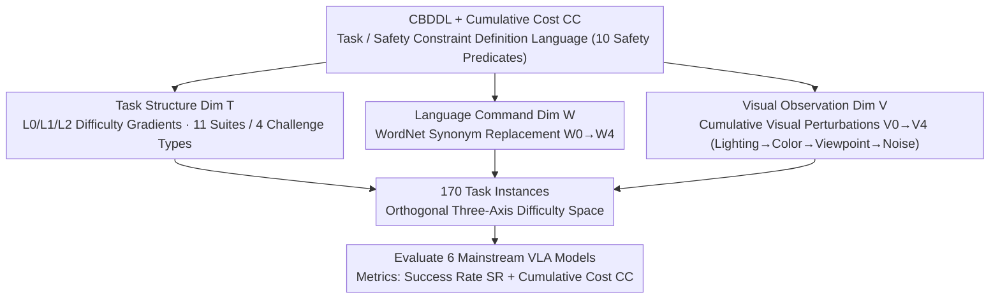

# VLA-Arena: An Open-Source Framework for Evaluating Vision-Language-Action Models

**Conference**: ICML 2026  
**arXiv**: [2512.22539](https://arxiv.org/abs/2512.22539)  
**Code**: https://github.com/VLA-Arena/VLA-Arena  
**Area**: Robotics / Vision-Language-Action Models / Agent  
**Keywords**: Vision-Language-Action Models, Benchmark Evaluation, Robotic Manipulation, Generalization Performance, Safety Constraints

## TL;DR
VLA-Arena proposes a structured VLA benchmark—systematically quantifying difficulty through three orthogonal dimensions: task structure, language command, and visual observation. With 170 tasks, it reveals key deficiencies in generalization, visual perception, and safety of existing VLA models.

## Background & Motivation

**Background**: VLA models are rapidly evolving—from RT-1 and RT-2 to the latest $\pi_0$ and UniVLA, demonstrating cross-embodiment, cross-scene, and long-term manipulation capabilities. However, their capability boundaries and failure modes lack quantitative characterization.

**Limitations of Prior Work**: Existing robotics benchmarks (LIBERO, VLABench, RoboCasa) face three major issues: (1) Task designs are oversimplified with a single complexity level definition; (2) They focus either on noise robustness or task generalization, making it difficult to understand model performance under concurrent multi-dimensional challenges; (3) They neglect safety constraints and operate in ideal environments.

**Key Challenge**: Does high performance on in-distribution tasks (L0) truly reflect the model's generalization capability? Does the model work through robust multimodal understanding or fragile pattern matching?

**Goal**: Design a benchmark capable of systematically quantifying VLA capability boundaries, distinguishing true language-vision-action understanding from superficial pattern memory, and evaluating safety.

**Key Insight**: Control task difficulty simultaneously through three orthogonal dimensions—task structural complexity, linguistic instruction semantic variation, and visual observation system perturbations.

**Core Idea**: Construct a "three-axis difficulty space" benchmark system. By using structured, controllable, and reproducible task designs, the evaluation of VLA is upgraded from binary "pass/fail" judgments to fine-grained diagnosis of "where the capability frontier lies."

## Method

### Overall Architecture
VLA-Arena employs a **structured task design**: at the base layer, **CBDDL (Constrained Behavior Definition Language)** is used to uniformly define tasks, dynamic entities, and safety constraints. Above this, difficulty is instantiated through **three orthogonal dimensions**: (1) **Task Structure Dimension (T-axis)**: 170 tasks organized into 11 suites across four challenge categories (Safety / Distractor / Generalization / Long-horizon), each with L0/L1/L2 difficulty levels; (2) **Language Command Dimension (W-axis)**: W0–W4 step-wise instruction perturbations using WordNet synonym replacement; (3) **Visual Observation Dimension (V-axis)**: V0–V4 cumulative visual perturbations (lighting → color → viewpoint → noise). These three axes are mutually orthogonal and independently adjustable, forming a quantifiable difficulty space evaluated via Success Rate (SR) and Cumulative Cost (CC).

### Key Designs

**1. CBDDL (Constrained Behavior Definition Language) + Cumulative Cost: Making Safety Constraints First-Class Citizens**

Existing VLA benchmarks focus almost exclusively on task success in ideal environments, ignoring collisions, dropped objects, or torque limits. CBDDL extends standard BDDL to support dynamic entities, perturbations, and safety predicates. "Safety" is precisely defined using 10 categories of safety predicates. The companion Cumulative Cost (CC) accounts for both instantaneous and terminal hazards:

$$CC(\tau) = \sum_{t=0}^{L-1} c^{inst}(s_t, a_t) + \alpha \cdot c^{term}(s_L),$$

where $\alpha=10$ weights terminal hazards more heavily. This allows the benchmark to distinguish between "completing the task while violating safety constraints" and "truly safe success."

**2. Task Structure Dimension (T-axis): Using L0/L1/L2 Gradients to Expose "Memorization Masquerading as Generalization"**

The T-axis defines "inherent difficulty" as the **distance from the training distribution**, segmented into three gradients: L0 represents in-distribution skills (direct instructions, familiar placements); L1 represents near-distribution generalization (scaling of quantities, new instances of the same category, distractors, simple safety constraints); L2 represents out-of-distribution challenges (new workflows, placements violating learned affordances, dense distractors/obstacles, strict safety constraints). If a model excels at L0 but drops significantly at L1/L2, it reveals a reliance on memory rather than generalization.

**3. Principled Language Perturbation (WordNet-based): Exposing Keyword Rote Learning**

If a VLA simply maps keywords to actions, it lacks true linguistic understanding. VLA-Arena identifies semantic slots (action, target, location) and replaces them with WordNet synonyms of semantic distance 1. The difficulty levels W0 (original) to W4 (4 slots replaced) quantify the reliance on rote memorization. A robust model should be invariant to synonymous rewording.

**4. Cumulative Hierarchical Visual Perturbation (V0–V4): Pinpointing Collapse Points in Visual Robustness**

Visual challenges are decomposed into cumulative levels: V0 (Standard) → V1 (Lighting) → V2 (Color Randomization) → V3 (Viewpoint Shift) → V4 (Gaussian Noise). This ladder identifies specifically where a model fails. For example, $\pi_0$ drops from 0.8 to 0.2 SR on the StatePreservation task at level V3, indicating a reliance on fragile pixel-level shortcuts.

## Key Experimental Results

### Main Results: Six Mainstream VLA Models

| Task Dimension | Model | L0-SR | L1-SR | L2-SR | L1+L2 Drop | Key Finding |
|----------------|-------|-------|-------|-------|------------|-------------|
| Safety-StaticObstacles | $\pi_0$ | 1.0 | 0.7 | 0.3 | 70% | strongest models collapse at L2 |
| Safety-StaticObstacles | OpenVLA | 0.6 | 0.6 | 0.0 | 100% | Unable to handle L2 multi-obstacles |
| Distractor | $\pi_0$ | 0.9 | 0.1 | 0.0 | 100% | Distractors significantly impact performance |
| Extrapolation-UnseenObjects | $\pi_0$ | 0.8 | 0.5 | 0.0 | 100% | Complete failure on new objects |
| Long Horizon | $\pi_0$ | 0.9 | 0.0 | 0.0 | 100% | Unable to compose skills |

### Ablation Study

| Task Type | Perturbation Dimension | W0 | W2 | W4 | Trend | Insight |
|-----------|------------------------|-----|-----|-----|-------|---------|
| StatePreservation | Language | 0.8 | 0.8 | 0.7 | Flat | Relies on visual cues |
| StatePreservation | Visual | 0.8 | 0.7 | 0.1 | Steep Drop | Collapses at V3+V4 |
| UnseenObjects | Language | 0.8 | 0.4 | 0.1 | Monotonic Decrease | Requires true understanding |
| UnseenObjects | Visual | 0.8 | 0.5 | 0.0 | Steep Drop | Visual is equally fatal |

### VLM vs. VLA Visual Grounding Gap

| Visual Level | Qwen3-VL-8B Localization Accuracy | VLA Average Drop |
|--------------|-----------------------------------|------------------|
| V0 | 100% | - |
| V1 | 100% | 13.5% |
| V2 | 100% | 24.0% |
| V3 | 96.7% | 30.5% |
| V4 | 93.3% | 50.5% |

**Key Finding**: Reveals "catastrophic forgetting"—fine-tuning causes VLAs to abandon general visual concepts. While the VLM drops only 6.7% at V4, the VLA drops 50.5%, suggesting the model relearns inversions for specific pixel distributions rather than retaining robust representations.

### Key Findings
- Memorization over generalization—all models perform well at L0 but typically drop 50%-100% at L1-L2.
- Visual shortcuts are rampant—$\pi_0$ drops from 0.8 to 0.2 at V3 in the StatePreservation task.
- Lack of semantic understanding—language perturbations lead to monotonic decreases in UnseenObjects (0.8 → 0.1).
- Sim-to-Real Validation: Performance degradation (60% → 3.3%) and increased safety violations (0/10 → 4/10) on a real Franka robot mirror simulation results.

## Highlights & Insights
- **Power of Orthogonal Design**: Independent yet orthogonal dimensions precisely isolate reasons for failure.
- **Innovation of CBDDL + CC**: Safety is integrated into the benchmark definition; CC penalizes both transient hazards and terminal failures.
- **Principled Language Perturbation**: WordNet-driven replacement is more natural and controllable than random templates.
- **Rigor in Sim-to-Real**: Real Franka robot experiments validate the translatability of simulation results.
- **Ranking Reversal**: Different models leading at different difficulty levels proves that each level provides non-redundant insights.

## Limitations & Future Work
- VLA-Arena is based on MuJoCo, offering limited real-scene coverage.
- Dataset scale is insufficient to completely eliminate the data influence of fine-tuning.
- Synonym replacement is WordNet-based, providing limited support for non-English languages.
- "Skill composition" in the long-horizon dimension is relatively simple (max 3 sub-skills).
- Future Work: Multi-embodiment learning; dynamic environments; open vocabulary; online learning evaluation.

## Related Work & Insights
- **vs. LIBERO/RoboCasa**: Ours introduces the "three-axis difficulty space" and safety dimension, greatly enhancing diagnostic capability.
- **vs. VLABench**: VLABench emphasizes language diversity but lacks structural task depth; VLA-Arena decomposes tasks via orthogonal dimensions.
- **vs. LIBERO-Pro/Plus**: Ours is more systematic, providing hierarchical W0-W4 and V0-V4 diagnostics.
- **Insight**: Benchmark design should evolve from "what can be done" to "where are the boundaries"; safety must be a first-class citizen.

## Rating
- Novelty: ⭐⭐⭐⭐⭐ (First to combine three-axis orthogonal difficulty with W/V hierarchical probes.)
- Experimental Thoroughness: ⭐⭐⭐⭐⭐ (6 VLA models + 170 tasks + Real Franka validation + detailed ablations.)
- Writing Quality: ⭐⭐⭐⭐⭐ (Clear logic and well-designed visuals.)
- Value: ⭐⭐⭐⭐⭐ (Structural impact on the VLA research community.)

<!-- RELATED:START -->

## Related Papers

- [\[ICCV 2025\] VQ-VLA: Improving Vision-Language-Action Models via Scaling Vector-Quantized Action Tokenizers](../../ICCV2025/multimodal_vlm/vq-vla_improving_vision-language-action_models_via_scaling_vector-quantized_acti.md)
- [\[ICML 2026\] VLANeXt: A Recipe for Building Robust VLA Models](vlanext_recipes_for_building_strong_vla_models.md)
- [\[ICCV 2025\] CoA-VLA: Improving Vision-Language-Action Models via Visual-Textual Chain-of-Affordance](../../ICCV2025/multimodal_vlm/coavla_improving_visionlanguageaction_models_via_visualtext.md)
- [\[ICML 2026\] Any3D-VLA: Enhancing VLA Robustness via Diverse Point Clouds](any3d-vla_enhancing_vla_robustness_via_diverse_point_clouds.md)
- [\[CVPR 2026\] SIMPACT: Simulation-Enabled Action Planning using Vision-Language Models](../../CVPR2026/multimodal_vlm/simpact_simulation-enabled_action_planning_using_vision-language_models.md)

<!-- RELATED:END -->
