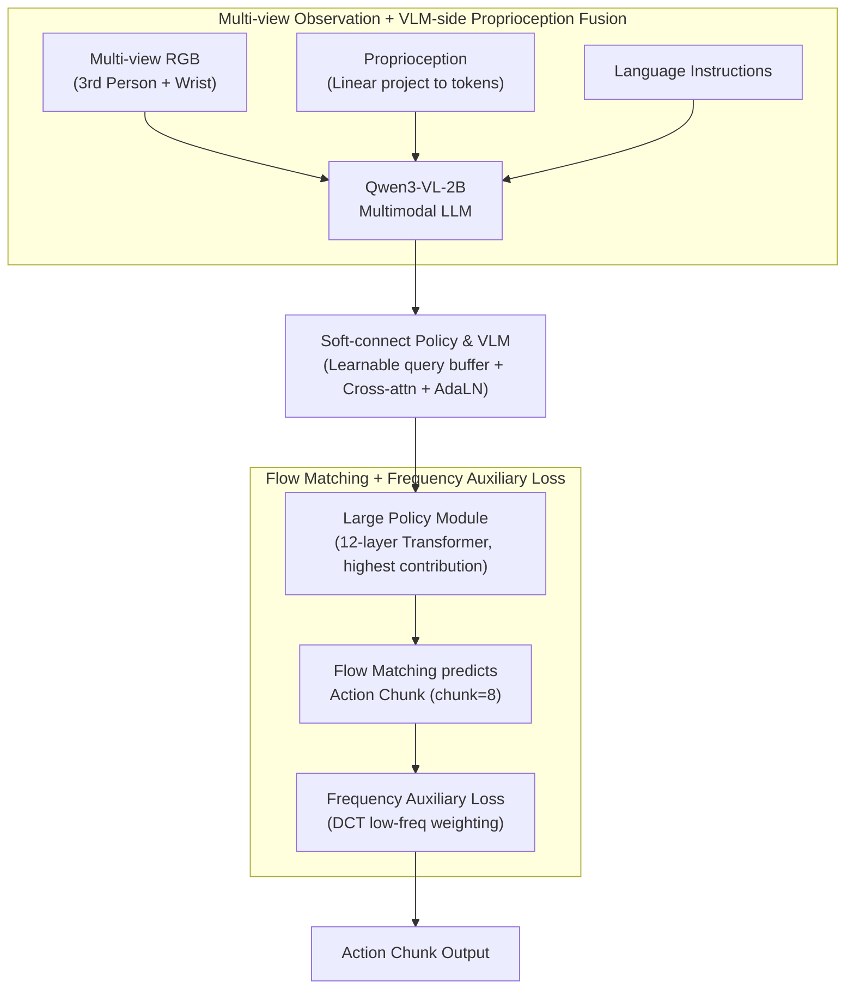

# VLANeXt: A Recipe for Building Robust VLA Models

**Conference**: ICML 2026  
**arXiv**: [2602.18532](https://arxiv.org/abs/2602.18532)  
**Code**: https://github.com/DravenALG/VLANeXt  
**Area**: Embodied AI / VLA / Robot Learning  
**Keywords**: Vision-Language-Action Models, Robot Learning, VLA Design Space, Multimodal Fusion, Instruction-conditioned Control

## TL;DR
This paper systematically explores the design space of VLA models, distilling 12 key design principles from over 500 controlled experiments to construct the efficient and powerful VLANeXt model. It surpasses SOTA on the LIBERO benchmark and validates these design principles through real-world robot tasks.

## Background & Motivation

**Background**: VLA models leverage pretrained VLMs to provide visual and linguistic understanding for general-purpose robot policy learning. Numerous VLA models have been proposed (RT-2, OpenVLA, π series, etc.), but their training protocols and evaluation settings vary significantly.

**Limitations of Prior Work**: The VLA field remains in a "primordial soup" stage—rich in ideas but lacking systematicity. Diverse approaches utilize different VLM backbones, architectural designs, and loss functions, making fair comparisons difficult.

**Key Challenge**: How to systematically compare VLA design choices within a unified framework to distinguish which designs are truly effective?

**Goal**: To revisit the VLA design space under a unified framework and evaluation protocol to identify reproducible and generalizable design recipes.

**Key Insight**: The study evolves from RT-2 across three dimensions—fundamental components, perception factors, and action modeling. This systematic ablation path clearly demonstrates the contribution of each design choice.

**Core Idea**: Gradually optimize designs through large-scale controlled experiments (>500 runs) under a unified evaluation protocol, integrating fragmented VLA methodologies into 12 actionable design principles.

## Method

### Overall Architecture
VLANeXt is not a single new architecture proposed in isolation, but a "recipe endpoint" evolved through systematic ablations starting from an RT-2-style minimalist baseline across three dimensions: fundamental components, perception factors, and action modeling. The final pipeline feeds multi-view RGB (3rd-person + wrist), proprioception, and language instructions into a Qwen3-VL-2B multimodal LLM. The outputs from each LLM layer transition via a "soft-connect" (learnable query buffer + cross-attention + adaLN for timestep injection) to a 12-layer large policy module (the most significant fundamental component, providing a +33.8% gain over the baseline). The policy module uses flow matching to predict action chunks of length 8, with an integrated frequency-domain auxiliary loss to suppress trajectory jitter. The diagram below illustrates the data flow from top to bottom.

### Key Designs

**1. Multi-view Observation + VLM-side Proprioception Fusion: Injecting state into VLM rather than the policy module**

Robot proprioception (joint angles, gripper state) and multi-view observations must be integrated, but the injection point is critical. While multi-view RGB passes through the VLM's image encoder, proprioception is linearly projected into tokens and fed into the VLM alongside visual tokens. The key is fusing at the VLM level rather than waiting for the policy module. This is because the alignment between state information and visual instructions is higher at the VLM level (98.0% vs. 96.2% at the policy level), while multi-view input supplements geometric cues missing from single views (91.8% → 97.6%). This finding directly addresses the common ambiguity in VLA designs regarding where to insert proprioception.

**2. Soft-connect Policy Module and VLM: A flexible bridge between text representation and action prediction spaces**

The "text token reuse" in RT-2 is a hard connection prone to underfitting, while the "complete decoupling" in MetaQuery can lead to information loss. Soft-connect adopts a middle path: it maintains a layered connection but inserts a set of learnable query buffers between the VLM and the policy module. VLM layer outputs interact with policy queries via cross-attention, and timestep information is conditioned via adaLN. This allows information to transition smoothly between the two representation spaces. This modification achieved a peak performance of 56.2% on LIBERO-plus, 2.5% higher than loose coupling.

**3. Flow Matching + Frequency Auxiliary Loss: Modeling action chunks as continuous time series with frequency-domain regularization**

Action chunk prediction (chunk=8) is essentially predicting a continuous time series. In high-performance regimes, regression losses are surpassed by flow matching; thus, the primary loss uses flow matching to model continuous action distributions. An auxiliary frequency-domain loss is added: actions are transformed via DCT, with higher weights assigned to low-frequency components: $L_{\text{freq}} = \text{MSE}(\text{DCT}(\hat{a}), \text{DCT}(a))$, where the weight $w(\text{freq}) \propto 1/(\text{freq}+1)$. This Borrows the insight from time-series forecasting that "low frequencies are the backbone, while high frequencies are noise." Penalizing high-frequency deviations prevents the model from overfitting to trajectory jitter, reaching 99.0% performance (+1% over pure regression) with negligible training overhead.

## Key Experimental Results

### Main Results

| Method | LIBERO (%) | LIBERO-plus (%) | Model Size |
|------|-----------|----------------|--------|
| OpenVLA | 76.5 | 15.6 | 7B |
| OpenVLA-OFT | 97.1 | 69.6 | 7B |
| π₀ | 86.0 | 53.6 | 11B |
| π₀-Fast | 85.5 | 61.6 | 7B |
| NORA | 87.9 | 39.0 | Unknown |
| UniVLA | 95.2 | 42.9 | Unknown |
| FLOWER | 96.9 | N/A | Unknown |
| **VLANeXt** | **97.4** | **83.9** | **2.5B** |

VLANeXt surpasses all baselines with a 2.5B model size (approx. 1/3 the size of OpenVLA-OFT).

### Ablation Study

| Design Dimension | Configuration | LIBERO (%) | LIBERO-plus (%) |
|--------|------|-----------|-----------------|
| **Fundamental Components** | Single-layer head + text token reuse | 19.8 | <5.0 |
| | Separate policy head (2 layers) | 30.2 | 16.6 |
| | Large policy module (12 layers) | 64.4 | 34.0 |
| | +Action chunking (chunk=8) | 74.6 | 43.4 |
| | +Flow matching loss | 80.0 | 45.0 |
| | +Qwen3-VL-2B backbone | 90.0 | 53.7 |
| | +Soft-connect | 91.8 | 56.2 |
| **Perception Factors** | +Multi-view | 97.6 | 80.5 |
| | +VLM-side Proprioception | 98.0 | 87.7 |
| **Action Modeling** | +Frequency auxiliary loss | 99.0 | 93.1 |

### Key Findings
- The large policy module provides the largest contribution (+33.8%).
- A strong VLM backbone (+10.0%) is superior to simply increasing parameters.
- Perception factors (multi-view + proprioception) contribute a combined +13.0%.
- The frequency-domain loss is simple yet effective, with negligible computational cost.
- Video history is not beneficial—adding temporal history actually decreased performance (91.8% → 85.0%).
- Proprioception placement is sensitive—VLM-level injection significantly outperforms policy-module injection (98.0% vs. 96.2%).

## Highlights & Insights
- **Systematic Design Exploration**: 500+ controlled experiments decompose the VLA design space. The "recipe" mindset offers more methodological value to the community than isolated innovations.
- **Deep Insights into Multimodal Fusion**: Proprioception should be fused on the VLM side rather than the policy side, with multi-view observations providing geometric compensation.
- **Time-Series Concept Transfer**: Transferring frequency-domain regularization from time-series forecasting to action generation significantly improves robustness against perturbations in LIBERO-plus.
- **Efficiency-Performance Balance**: The 2.5B VLANeXt is significantly smaller than the 7B OpenVLA-OFT but achieves superior performance.
- **Contribution to Open Source**: The release of a unified, lightweight framework lowers the barrier to entry for VLA research.

## Limitations & Future Work
- Evaluation is limited to two simulation benchmarks (LIBERO/LIBERO-plus), with small sample sizes for real-robot validation.
- Dataset characteristics—LIBERO primarily features manipulation tasks and lacks diverse scenarios like navigation.
- Computational efficiency—inference latency and VRAM usage for the 2.5B model were not detailed.
- Future improvements: Cross-embodiment and cross-task design transfer; adaptive fusion strategies; integration with online learning; in-depth analysis of the frequency loss mechanism.

## Related Work & Insights
- **vs. RT-2/OpenVLA**: VLANeXt surpasses the 7B OpenVLA-OFT at a 2.5B scale through optimized design details.
- **vs. π Series**: π uses tight coupling at 11B; VLANeXt's soft-connect is more lightweight and performs better.
- **vs. World Model Methods (WorldVLA)**: While auxiliary tasks add +2%, they triple training time; VLANeXt uses frequency loss to achieve a better efficiency-performance balance.

## Rating
- Novelty: ⭐⭐⭐⭐ Systematic exploration of the VLA design space; significant methodological contribution.
- Experimental Thoroughness: ⭐⭐⭐⭐⭐ 500+ controlled tests + 2 simulation benchmarks + real-robot validation + detailed ablations.
- Writing Quality: ⭐⭐⭐⭐ Clear framework and smooth design evolution.
- Value: ⭐⭐⭐⭐⭐ Sets an example for transitioning the VLA field from fragmented exploration to systematic design.

<!-- RELATED:START -->

## Related Papers

- [\[ICML 2026\] VLA-Arena: An Open-Source Framework for Evaluating Vision-Language-Action Models](vla-arena_an_open-source_framework_for_benchmarking_vision-language-action_model.md)
- [\[CVPR 2026\] MERLIN: Building Low-SNR Robust Multimodal LLMs for Electromagnetic Signals](../../CVPR2026/multimodal_vlm/merlin_building_low-snr_robust_multimodal_llms_for_electromagnetic_signals.md)
- [\[ICML 2026\] Any3D-VLA: Enhancing VLA Robustness via Diverse Point Clouds](any3d-vla_enhancing_vla_robustness_via_diverse_point_clouds.md)
- [\[ICML 2026\] Self-Captioning Multimodal Interaction Tuning: Amplifying Exploitable Redundancies for Robust Vision Language Models](self-captioning_multimodal_interaction_tuning_amplifying_exploitable_redundancie.md)
- [\[ICML 2026\] TRAP: Hijacking CoT Reasoning of VLA for Targeted Behavior Attacks via Adversarial Patches](trap_hijacking_vla_cot-reasoning_via_adversarial_patches.md)

<!-- RELATED:END -->
