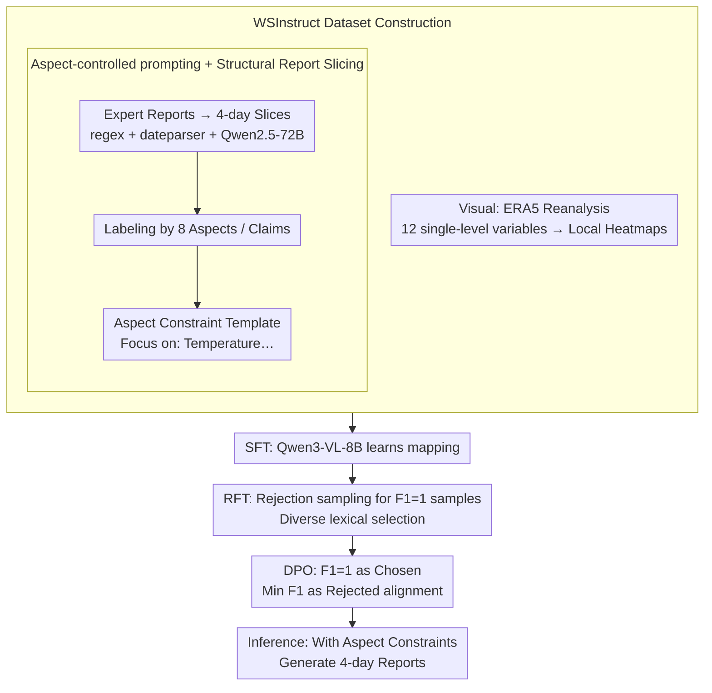

# WeatherSyn: An Instruction Tuning MLLM For Weather Forecasting Report Generation

**Conference**: ICML 2026  
**arXiv**: [2605.07522](https://arxiv.org/abs/2605.07522)  
**Code**: https://github.com/compasszzn/WeatherSyn (Available)  
**Area**: Multimodal VLM / Weather AI / Report Generation  
**Keywords**: Weather Forecasting Report, Instruction Tuning, aspect-controlled prompting, RFT, DPO

## TL;DR
WeatherSyn decomposes the weather forecaster's report writing process into a multimodal instruction task of "observe images → list key points → produce draft." The authors first constructed the WSInstruct dataset, covering 31 US cities and 8 types of weather elements. Subsequently, a three-stage fine-tuning process (SFT→RFT→DPO) was applied to Qwen3-VL-8B. The results demonstrate that an 8B open-source model consistently outperforms closed-source models such as GPT-5-Nano and Claude-3.7-Sonnet across multiple evaluation metrics, showing zero-shot generalization to unseen cities.

## Background & Motivation

**Background**: Traditional weather forecasting reports rely on meteorologists reading hundreds of variable fields from Numerical Weather Prediction (NWP) models, coupled with collective discussions of observation data for manual writing. This process suffers from information overload, low efficiency, and subjective bias. While MLLMs have been explored for weather captioning (e.g., WeatherQA, OmniEarth-Bench, Omni-Weather), they typically focus on severe weather events or use classification/multiple-choice formats, failing to address the daily operational challenge of generating multi-day open-ended forecasting reports directly from initial atmospheric fields.

**Limitations of Prior Work**: (1) Data scarcity: There is a lack of publicly available "paired visual images + expert-written reports." (2) Lack of constraints in open-ended generation: Different reports for the same weather scenario may emphasize different dimensions (temperature, wind, humidity). Without aspect control, models tend to generate homogenized reports dominated by high-frequency elements, making fine-grained alignment evaluation against ground truth impossible. (3) Existing weather-specific MLLMs may show decent reference-based metrics for free-text generation, but score nearly zero in LLM-judge and expert evaluations, indicating fluent but factually incorrect sentences.

**Key Challenge**: Open-ended forecasting reports must simultaneously satisfy "factual accuracy" (consistency with initial atmospheric fields) and "expressive diversity" (closeness to expert writing styles). Small-scale manually written SFT data only teaches the model to memorize specific phrasing, leading to a dilemma: either grammatical correctness with missing key points, or complete key points with rigid phrasing.

**Goal**: (1) Formalize "weather forecasting report generation" as a WFR task and construct the first instruction tuning dataset. (2) Design a training scheme that systematically surpasses closed-source models on an 8B open-source backbone. (3) Verify model robustness across cities, regions, and multiple time steps.

**Key Insight**: The high quality of expert reports stems from structural organization by aspect (temperature, wind, frontal systems, etc.) before composing coherent text. The authors inject these aspects as explicit prompt constraints during training and inference. Using post-training methods like RFT and DPO, "factual correctness" is decoupled from "expressive diversity"—RFT is used to supplement linguistic diversity, while DPO locks in factual accuracy.

**Core Idea**: Structure the open-ended report problem using aspect-controlled prompting, and progressively inject "accuracy" and "diversity" into a single 8B VLM through a three-stage SFT→RFT→DPO process.

## Method

### Overall Architecture
The core of WeatherSyn consists of the WSInstruct dataset and a three-stage training pipeline. WSInstruct comprises: (i) Visual side: Local heatmaps of 12 single-level variables (e.g., temperature, precipitation, wind) cropped from ERA5 reanalysis data per city. (ii) Textual side: 4-day open-ended reports written by experts, sliced into daily sub-reports and labeled with aspects/claims. Training proceeds in three stages: SFT for "image-to-aspect report" mapping; RFT using rejection sampling to inject diverse but factually correct synthetic reports; and DPO using "high F1 reports" as chosen and "low F1 reports" as rejected samples for preference alignment. During inference, aspect constraints are similarly attached to ensure alignable evaluation.

### Key Designs

**1. Aspect-controlled prompting + Structural Report Slicing: Template-driven structuring**

Without constraints, models are dominated by the distribution of elements in the training set and collapse into the most frequent categories, leading to homogenization and inability to perform fine-grained alignment evaluation. The reports are structured by converting relative expressions like "Today" into absolute dates via regex and dateparser. Qwen-2.5-72B is used to slice reports into 4 consecutive daily sub-reports. Reports are then labeled according to 8 expert-defined aspects (temperature, wind, humidity, frontal system, pressure system, wave pattern, wind flow system, event) and fine-grained claims. The prompt template follows: `<<date, weekday>> Report:\n## Focus on: Temperature, Humidity`. The results are decisive: without aspect constraints, the hit rate is only 0.16; with constraints only at training but not inference, it drops to 0.12 (collapsing to "event"); whereas constraints at both stages achieve 0.94.

**2. RFT: Injecting diverse but factually correct phrasing**

SFT data is small and linguistically monotonous, causing models to memorize phrases rather than underlying meteorological phenomena. For the 2017–2020 subset, the SFT model samples 40 candidates at temperature 0.9. Qwen-2.5-72B extracts claims to calculate step-level F1, retaining only F1=1 sub-reports. Four distance metrics (Edit distance, TF-IDF, Jaccard, Sentence-BERT cosine) are used to select candidates furthest from the original ground truth. These are compiled into augmented samples $\mathcal{D}_\text{RFT}$ for Qwen3-VL-8B. The training utilizes masked next-token loss:
$$\mathcal{L}_\text{VLM} = -\mathbb{E}_{(Q,I,\{R^i\}_{i=1}^N)\sim\mathcal{D}} \left[\sum_{i=1}^N \log p_\theta(R^i \mid I, Q)\right]$$
where $N$ is adaptive based on candidate votes. This reinforces image-text alignment for long-tail aspects like Wave Pattern and Wind Flow System, increasing weighted F1 by 0.15–0.17.

**3. DPO: Locking factual correctness with F1 preference signals**

RFT improves diversity, but the Top-1 ratio in LLM-judge and expert evaluation remains at 11%–16%. For the 2021 subset, the RFT model samples 40 candidates to calculate step-level F1. Sub-reports with F1=1 are used as chosen $\mathcal{Y}_w$, and those with the lowest F1 as rejected $\mathcal{Y}_l$, yielding 1241 pairs. The standard DPO objective is optimized:
$$\mathcal{L}_\text{DPO}(\pi_\theta, \pi_\text{ref}) = -\mathbb{E}\left[\log \sigma\left(\beta \log \frac{\pi_\theta(\mathcal{Y}_w|x)}{\pi_\text{ref}(\mathcal{Y}_w|x)} - \beta \log \frac{\pi_\theta(\mathcal{Y}_l|x)}{\pi_\text{ref}(\mathcal{Y}_l|x)}\right)\right]$$
The reference model is fixed as $\mathcal{M}_\text{RFT}$. Using objective F1 signals directly linked to meteorological claims is more cost-effective and task-specific than human RLHF. Post-DPO, the Top-1 ratio in LLM evaluation doubles from 0.16 to 0.33.

### Loss & Training
- Stage 1 (SFT): $\mathcal{L}_\text{VLM}$, $N=1$, mixed training on all 31 cities.
- Stage 2 (RFT): $\mathcal{L}_\text{VLM}$, $N$ determined by adaptive voting, $\mathcal{D}_\text{RFT}$ contains 20,412 visual samples.
- Stage 3 (DPO): Standard DPO objective, $\mathcal{M}_\text{RFT}$ as reference.
- Evaluation: 2017–2021 training, 2022 test set with 1292 entries.

## Key Experimental Results

### Main Results
Comprehensive comparison on the WSInstruct test set (selected metrics):

| Model | BLEU-1 | ROUGE-L | Auto F1 | LLM Fact.Cons. (Top-1) | Expert Fact.Cons. (Top-1) |
|---|---|---|---|---|---|
| GPT-5.2 Thinking (2-shot) | 0.12 | 0.12 | 0.49 | 0.06 | 0.07 |
| Gemini-3 Pro Preview (2-shot) | 0.37 | 0.28 | 0.60 | 0.24 | 0.29 |
| Claude-3.7-Sonnet (2-shot) | 0.09 | 0.10 | 0.51 | 0.02 | 0.01 |
| WeatherQA (Qwen3-VL-8B) | 0.19 | 0.15 | 0.36 | 0.01 | 0.01 |
| **WeatherSyn (Ours-SFT)** | 0.43 | 0.31 | 0.55 | 0.11 | 0.11 |
| **WeatherSyn-RFT** | 0.43 | 0.31 | 0.59 | 0.16 | 0.17 |
| **WeatherSyn-DPO** | **0.44** | **0.32** | **0.59** | **0.33** | **0.29** |

Weighted F1 across 8 aspects (partial): WeatherSyn-DPO shows significant gains (>5pp) in complex aspects such as Pressure System (0.72), Frontal System (0.36), and Event (0.67), matching or surpassing Gemini-3 Pro.

### Ablation Study

| Configuration (Aspect Control) | Avg Hit Rate | Description |
|---|---|---|
| Train ✗ / Test ✗ | 0.16 | Distribution-dominated, ignores low-frequency aspects |
| Train ✓ / Test ✗ | 0.12 | Collapses to most frequent "event" aspect |
| Train ✓ / Test ✓ | **0.94** | Explicit constraints are essential for training and inference |

| Training Stage | LLM Fact.Cons. Top-1 | Avg Aspect F1 |
|---|---|---|
| SFT only | 0.11 | 0.55 |
| + RFT | 0.16 | 0.59 |
| + DPO | 0.33 | 0.59 |

### Key Findings
- Reference-based metrics (BLEU/ROUGE) and claim-based metrics often exhibit inverse correlation. WeatherQA has a BLEU-1 of 0.19 (higher than Claude), yet LLM Fact.Cons. is only 0.01. BLEU is deemed unsuitable for open-ended weather reports; claim-based F1 should be the primary metric.
- RFT primarily improves aspect F1 (factual coverage via diversity), while DPO increases Top-1 ratios in LLM/expert evaluations (factual precision preference). The functions are complementary.
- While F1 decays from day 1 to day 4, RFT significantly mitigates temporal decay for difficult aspects like Frontal System and Event, suggesting the model captures underlying dynamics rather than surface phrasing.
- Generalization: Scaling to unseen cities (even across climate zones/continents) shows WeatherSyn (Zero-shot) outperforms GPT-5-Nano/Claude (2-shot), indicating the acquisition of "region-agnostic meteorological laws."
- The performance gap is wider in climatically complex cities like Honolulu (maritime island) and Flagstaff (high-altitude plateau), showing advantages in difficult scenarios.

## Highlights & Insights
- **Aspect-controlled prompting as an engineering tool**: This simple modification raised the hit rate from 16% to 94%. This "explicit outline" paradigm is transferable to any open-ended domain report generation (finance, medicine, law).
- **Three-stage SFT→RFT→DPO for mid-sized VLMs**: RFT addresses "diversity" and DPO solves "factual precision." This pipeline bypasses expensive human preference annotations by utilizing synthetic data paths.
- **Objective signals for DPO preferences**: Constructing chosen/rejected pairs using step-level F1 is cost-effective and more targeted than standard RLHF for structured generation tasks.
- **Interpretable evaluation system**: Five complementary evaluation systems were used, highlighting that BLEU/ROUGE are misleading for domain-specific writing. Claim F1, LLM judge, and expert judge provide a robust benchmark sample.

## Limitations & Future Work
- The dataset is limited to 31 US cities. Expansion to global coverage is planned, but cross-climate zone transferability remains a challenge.
- Only initial atmospheric fields are used as visual input, missing multi-timestep forecasts from NWP. Incorporating HRES multi-step predictions is a potential future research direction.
- DPO improvement varies across aspects; some aspects (Frontal System) saw slight declines, suggesting that single global F1 signals might obscure conflicts between aspects. Aspect-conditioned rewards could be explored.
- Dependence on LLM-as-judge carries self-preference risks. Although expert evaluation was used for calibration, the sample size (144) was limited.

## Related Work & Insights
- **vs WeatherQA (Ma et al., 2024)**: WeatherQA focuses on MCQs/captioning for severe events, whereas WSInstruct generates multi-day open reports. WeatherSyn-DPO (F1=0.59) significantly outperforms WeatherQA (F1=0.36) on structured tasks.
- **vs Omni-Weather (Zhou et al., 2025)**: Omni-Weather focuses on radar precipitation nowcasting; the two are complementary in terms of visual resolution and textual structure.
- **Insights**: The pipeline—structuring domain knowledge into aspects, extracting claims for evaluation, and using F1 for DPO preferences—is applicable to CT reports, satellite disaster assessments, and financial reports.

## Rating
- Novelty: ⭐⭐⭐⭐ The task definition and aspect-controlled prompting are novel; the training pipeline (SFT+RFT+DPO) is a strong application of modern techniques.
- Experimental Thoroughness: ⭐⭐⭐⭐⭐ Includes five complementary evaluations, multi-dimensional analysis, and comprehensive ablations.
- Writing Quality: ⭐⭐⭐⭐ Detailed dataset construction; clear methodology, although some LaTeX formatting is slightly cluttered.
- Value: ⭐⭐⭐⭐ The first public dataset and open-source 8B model to outperform closed-source baselines in weather report generation, offering high engineering value.

<!-- RELATED:START -->

## Related Papers

- [\[ACL 2025\] MEIT: Multimodal Electrocardiogram Instruction Tuning on Large Language Models for Report Generation](../../ACL2025/multimodal_vlm/meit_multimodal_electrocardiogram_instruction_tuning_on_large_language_models_fo.md)
- [\[ICCV 2025\] MetaMorph: Multimodal Understanding and Generation via Instruction Tuning](../../ICCV2025/multimodal_vlm/metamorph_multimodal_understanding_and_generation_via_instruction_tuning.md)
- [\[ICML 2026\] Decentralized Instruction Tuning: Conflict-Aware Splitting and Weight Merging](decentralized_instruction_tuning_conflict-aware_splitting_and_weight_merging.md)
- [\[ICLR 2026\] Omni-Weather: A Unified Multimodal Model for Weather Radar Understanding and Generation](../../ICLR2026/multimodal_vlm/omni-weather_a_unified_multimodal_model_for_weather_radar_understanding_and_gene.md)
- [\[CVPR 2026\] Streaming Video Instruction Tuning (Streamo)](../../CVPR2026/multimodal_vlm/streaming_video_instruction_tuning.md)

<!-- RELATED:END -->
