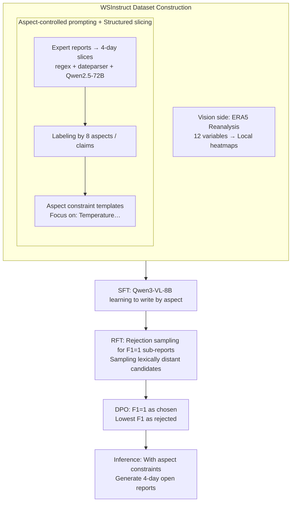

# WeatherSyn: An Instruction Tuning MLLM For Weather Forecasting Report Generation

**Conference**: ICML 2026  
**arXiv**: [2605.07522](https://arxiv.org/abs/2605.07522)  
**Code**: https://github.com/compasszzn/WeatherSyn (Available)  
**Area**: Multimodal VLM / AI for Weather / Report Generation  
**Keywords**: Weather forecasting reports, instruction tuning, aspect-controlled prompting, RFT, DPO

## TL;DR
WeatherSyn decomposes the weather forecaster's writing process into a multimodal instruction task of "observing maps → listing key points → drafting reports." The authors establish the WSInstruct dataset covering 31 US cities and 8 weather elements, then perform a three-stage fine-tuning (SFT→RFT→DPO) on Qwen3-VL-8B. This allows an 8B open-source model to consistently outperform closed-source models such as GPT-5-Nano and Claude-3.7-Sonnet across various metrics, demonstrating zero-shot generalization to unseen cities.

## Background & Motivation

**Background**: Traditional weather forecasting reports rely on meteorologists reading hundreds of variable fields from Numerical Weather Prediction (NWP) models, followed by human synthesis and collective discussion. This process suffers from information overload, low efficiency, and subjective bias. While MLLMs have been explored for weather captioning (WeatherQA, OmniEarth-Bench, Omni-Weather), prior work either focuses solely on severe weather events or utilizes classification/multiple-choice formats, failing to address the daily operational task of generating multi-day open-ended reports directly from initial atmospheric fields.

**Limitations of Prior Work**: (1) Data scarcity—publicly available "paired visual images + expert-written reports" are nearly non-existent. (2) Lack of constraints in open-ended generation—reports for the same scenario may emphasize different dimensions (temperature, wind, humidity). Without aspect control, models tend to generate homogeneous reports dominated by high-frequency elements and cannot be evaluated using fine-grained alignment with ground truth. (3) Existing weather MLLMs show deceptively high reference metrics on free text, but LLM-judge and expert evaluations are near zero, indicating fluent but factually incorrect sentences.

**Key Challenge**: Open-ended forecasting reports must satisfy both "factual accuracy" (consistency with initial atmospheric fields) and "expressive diversity" (proximity to expert writing styles). Small-scale manually written SFT data only teaches models to memorize specific phrasing, leading to a dichotomy between "grammatically correct but incomplete points" and "complete points but rigid phrasing."

**Goal**: (1) Formulate "weather forecasting report generation" as a WFR task and construct the first instruction tuning dataset. (2) Design a training scheme that allows an 8B backbone to systematically surpass closed-source models. (3) Verify model robustness across cities, regions, and multiple time steps.

**Key Insight**: The authors observe that expert reports are high-quality because forecasters first organize thoughts by aspects (temperature, wind, fronts, etc.) before composing text. By injecting aspects as explicit prompt constraints during training and inference, and utilizing post-training methods like RFT/DPO, "factual correctness" and "expressive diversity" can be decoupled—RFT supplements lexical diversity, while DPO locks in factual accuracy.

**Core Idea**: Structuralize the open-ended report problem through aspect-controlled prompting, then inject "accuracy" and "diversity" into an 8B VLM via a three-stage SFT→RFT→DPO pipeline.

## Method

### Overall Architecture
WeatherSyn centers on the WSInstruct dataset and three-stage training. WSInstruct consists of: (i) Vision side—local heatmaps of 12 single-level variables (e.g., temperature, precipitation, wind) cropped from ERA5 reanalysis data by city. (ii) Text side—expert-written 4-day reports, sliced into daily sub-reports and annotated with aspects/claims. Training follows three stages: SFT for mapping visuals to reports by aspect; RFT using rejection sampling to inject "factually correct but lexically diverse" synthetic reports; and DPO using "high F1 reports" as chosen and "low F1 reports" as rejected samples for preference alignment. Inference also includes aspect constraints to ensure alignable evaluation.

### Key Designs

**1. Aspect-controlled prompting + Structured report slicing: Enforcing a "Date→Aspect→Text" template**

Without constraints, models collapse into the most frequent elements of the training distribution. The authors structuralize reports by converting relative expressions (e.g., "Today") to absolute dates. Qwen-2.5-72B slices them into 4 consecutive daily sub-reports. Reports are then labeled by 8 expert-defined aspects (temperature, wind, humidity, frontal system, pressure system, wave pattern, wind flow system, event) and fine-grained claims. The prompt template follows `<<date, weekday>> Report:\n## Focus on: Temperature, Humidity`. This is crucial: without aspect constraints, the hit rate is only 0.16; with constraints in both training and inference, it reaches 0.94, enabling fine-grained evaluation.

**2. RFT: Injecting "factually correct but lexically diverse" samples via rejection sampling**

SFT data is limited and linguistically repetitive. RFT takes the 2017–2020 subset and generates 40 candidates via the SFT model (temp 0.9). Qwen-2.5-72B extracts claims to calculate step-level F1, retaining only F1=1 sub-reports. Among these "factually correct" samples, the one with the largest lexical distance (Edit distance, TF-IDF, Jaccard, Sentence-BERT) from the ground truth is chosen as an augmented sample $\mathcal{D}_\text{RFT}$. Training uses masked next-token loss:
$$\mathcal{L}_\text{VLM} = -\mathbb{E}_{(Q,I,\{R^i\}_{i=1}^N)\sim\mathcal{D}} [\sum_{i=1}^N \log p_\theta(R^i \mid I, Q)]$$
The strategy strengthens image-text alignment by showing that the same meteorological field can be reasonably expressed in multiple ways, boosting weighted F1 for long-tail aspects like Wave Pattern and Wind Flow System by 0.15–0.17.

**3. DPO: Locking factual accuracy using F1 as preference signal**

While RFT improves diversity, the Top-1 ratio in LLM-judge/expert evaluation remains low (11%–16%). DPO is applied on the 2021 subset: 40 candidates are sampled per instance to calculate step-level F1. F1=1 samples form the chosen $\mathcal{Y}_w$ and the lowest F1 samples form the rejected $\mathcal{Y}_l$, resulting in 1241 preference pairs. The standard DPO objective is optimized:
$$\mathcal{L}_\text{DPO}(\pi_\theta, \pi_\text{ref}) = -\mathbb{E}[\log \sigma(\beta \log \tfrac{\pi_\theta(\mathcal{Y}_w|x)}{\pi_\text{ref}(\mathcal{Y}_w|x)} - \beta \log \tfrac{\pi_\theta(\mathcal{Y}_l|x)}{\pi_\text{ref}(\mathcal{Y}_l|x)})]$$
Using an automated signal linked directly to meteorological claims is more efficient than human annotation. Post-DPO, the Top-1 ratio in LLM evaluation nearly doubles from 0.16 to 0.33.

### Loss & Training
- Stage 1 (SFT): $\mathcal{L}_\text{VLM}$ with $N=1$, trained on all 31 cities.
- Stage 2 (RFT): $\mathcal{L}_\text{VLM}$ where $N$ is adaptive based on candidate voting. Total images $\mathcal{I} = 20412$.
- Stage 3 (DPO): Standard DPO objective with $\mathcal{M}_\text{RFT}$ as the reference model.
- Evaluation: Trained on 2017–2021, tested on 1292 instances from 2022.

## Key Experimental Results

### Main Results
Comparison on the WSInstruct test set:

| Model | BLEU-1 | ROUGE-L | Auto F1 | LLM Fact.Cons. (Top-1) | Expert Fact.Cons. (Top-1) |
|---|---|---|---|---|---|
| GPT-5.2 Thinking (2-shot) | 0.12 | 0.12 | 0.49 | 0.06 | 0.07 |
| Gemini-3 Pro Preview (2-shot) | 0.37 | 0.28 | 0.60 | 0.24 | 0.29 |
| Claude-3.7-Sonnet (2-shot) | 0.09 | 0.10 | 0.51 | 0.02 | 0.01 |
| WeatherQA (Qwen3-VL-8B) | 0.19 | 0.15 | 0.36 | 0.01 | 0.01 |
| **WeatherSyn (SFT)** | 0.43 | 0.31 | 0.55 | 0.11 | 0.11 |
| **WeatherSyn-RFT** | 0.43 | 0.31 | 0.59 | 0.16 | 0.17 |
| **WeatherSyn-DPO** | **0.44** | **0.32** | **0.59** | **0.33** | **0.29** |

Weighted F1 across 8 aspects: WeatherSyn-DPO shows significant gains (>5pp) in complex aspects such as Pressure System (0.72) and Frontal System (0.36), matching or exceeding Gemini-3 Pro.

### Ablation Study

| Configuration (Aspect Control) | Avg Hit Rate | Description |
|---|---|---|
| Train ✗ / Test ✗ | 0.16 | Driven by training distribution, ignores low-frequency aspects |
| Train ✓ / Test ✗ | 0.12 | Collapses to the most frequent "event" aspect |
| Train ✓ / Test ✓ | **0.94** | Explicit constraints are essential for both training and inference |

| Training Stage | LLM Fact.Cons. Top-1 | Avg Aspect F1 |
|---|---|---|
| SFT only | 0.11 | 0.55 |
| + RFT | 0.16 | 0.59 |
| + DPO | 0.33 | 0.59 |

### Key Findings
- Reference-based metrics (BLEU/ROUGE) often negatively correlate with factuality metrics. WeatherQA has higher BLEU than Claude but near-zero Fact.Cons., suggesting BLEU is unsuitable for weather reports; claim-based F1 is a better indicator.
- RFT primarily boosts aspect F1 (fact coverage via diversity), while DPO boosts Top-1 preference (fact precision). The two stages are complementary.
- Model performance decays gradually from day 1 to day 4, but RFT significantly mitigates temporal decay in difficult aspects like Frontal System and Event.
- Generalization: When trained on half the cities and tested on the other half, zero-shot WeatherSyn outperforms 2-shot GPT-5-Nano/Claude. This suggests the model learns "region-agnostic meteorological laws."
- The advantage of WeatherSyn is most pronounced in topographically complex cities like Honolulu or Flagstaff.

## Highlights & Insights
- **Aspect-controlled prompting is an undervalued engineering tool**: Simply adding aspect constraints improves the hit rate from 16% to 94%. This blueprint for "explicitly outlining for the generator" is transferable to other open-domain report generation tasks (finance, medical, legal).
- **The SFT→RFT→DPO pipeline is a standard for mid-sized VLMs**: By using RFT for diversity and DPO for precision, the authors replace expensive RLHF with cheaper synthetic data paths.
- **Objective signals for DPO preference**: Constructing chosen/rejected pairs via step-level F1 is cost-effective and task-specific, offering a generalizable approach for structured generation.
- **Five complementary evaluation systems**: The authors clarify that BLEU/ROUGE are misleading and instead report Auto claim, Human-refined claim, LLM judge (aggregated), and Expert judge metrics, setting a benchmark for domain-specific writing.

## Limitations & Future Work
- Dataset only covers 31 US cities. Generalization to tropical or polar climates remains unverified.
- Only initial atmospheric fields are used as visual input; the model does not exploit multi-step forecasts from NWP (though Appendix E.1 indicates potential gains from HRES multi-step inputs).
- DPO improvement is inconsistent across aspects; some aspects (e.g., Frontal System) slightly regressed after DPO, suggesting a single global F1 signal may mask inter-aspect conflicts.
- Dependence on LLM-as-judge (GPT-5, Gemini, Claude, DeepSeek aggregation) carries self-preference risks. Expert evaluation, while used for calibration, has a limited sample size.
- Real-world deployment requires handling dynamic updates (hourly ERA5) and continuous temporal generation.

## Related Work & Insights
- **vs WeatherQA (Ma et al., 2024)**: WeatherQA focuses on multiple-choice/captioning for severe events; WSInstruct generates daily open-ended reports. Even with the same Qwen3 backbone, WeatherSyn-DPO significantly outperforms WeatherQA due to aspect structuring and post-training.
- **vs Omni-Weather (Zhou et al., 2025)**: Omni-Weather focuses on radar precipitation nowcasting; this work focuses on multiple variables and multi-day reports.
- **Insight**: The pipeline "Structuring domain knowledge as aspects → Automatic claim extraction for evaluation → Using F1 for DPO" is applicable to any "image/data to report" task, such as CT reports, disaster assessment, or financial analysis.

## Rating
- Novelty: ⭐⭐⭐⭐ The task definition and aspect control are novel, though the training pipeline (SFT+RFT+DPO) follows recent common practices.
- Experimental Thoroughness: ⭐⭐⭐⭐⭐ Comprehensive evaluation across five systems, multi-dimensional analysis (aspects, geography, time), and full ablations.
- Writing Quality: ⭐⭐⭐⭐ Detailed dataset construction and clear methodology.
- Value: ⭐⭐⭐⭐ Significant engineering reference value for AI weather applications.

<!-- RELATED:START -->

## Related Papers

- [\[ACL 2025\] MEIT: Multimodal Electrocardiogram Instruction Tuning on Large Language Models for Report Generation](../../ACL2025/multimodal_vlm/meit_multimodal_electrocardiogram_instruction_tuning_on_large_language_models_fo.md)
- [\[ICML 2026\] Decentralized Instruction Tuning: Conflict-Aware Splitting and Weight Merging](decentralized_instruction_tuning_conflict-aware_splitting_and_weight_merging.md)
- [\[ICCV 2025\] MetaMorph: Multimodal Understanding and Generation via Instruction Tuning](../../ICCV2025/multimodal_vlm/metamorph_multimodal_understanding_and_generation_via_instruction_tuning.md)
- [\[CVPR 2026\] Streaming Video Instruction Tuning (Streamo)](../../CVPR2026/multimodal_vlm/streaming_video_instruction_tuning.md)
- [\[ICML 2026\] SAME: Stabilized Mixture-of-Experts for Multimodal Continual Instruction Tuning](same_stabilized_mixture-of-experts_for_multimodal_continual_instruction_tuning.md)

<!-- RELATED:END -->
