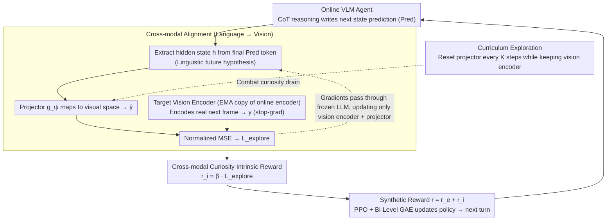

# What You Think is What You See: Driving Exploration in VLM Agents via Visual-Linguistic Curiosity (GLANCE)

**Conference**: ICML 2026 Spotlight  
**arXiv**: [2605.03782](https://arxiv.org/abs/2605.03782)  
**Code**: Not yet public (None)  
**Area**: Multimodal VLM / Reinforcement Learning / Agent Exploration  
**Keywords**: VLM agent, curiosity-driven exploration, cross-modal alignment, internal world model, curiosity drain

## TL;DR
GLANCE introduces a "think-see alignment" self-supervised head to VLM agent reinforcement learning. It maps the "next-state prediction" produced in the LLM's CoT through a lightweight projector to the actual next-frame representation encoded by an EMA target vision encoder. The gap between prediction and reality serves simultaneously as an intrinsic curiosity reward, a training signal for the vision encoder, and an alignment loss to "ground" the internalized world model. Combined with a curriculum exploration mechanism that periodically resets the projector to combat curiosity drain, GLANCE consistently outperforms existing exploitation-only VLM-RL methods across five agentic tasks.

## Background & Motivation

**Background**: Current VLM agents (such as VAGEN, InternVL-Agent, etc.) increasingly tend to internalize "world modeling" within their strategies. They use explicit CoT every turn to write structured reasoning like `<Obs>s_t</Obs><Res>z_t</Res><Pred>s_{t+1}</Pred>` and then provide an action `<Ans>a_t</Ans>`, learning an integrated reasoning-action policy through PPO-like algorithms combined with sparse extrinsic rewards.

**Limitations of Prior Work**: However, these methods essentially "passively exploit visited states"—the agent only refines reasoning on states it has already traversed, lacking a mechanism to actively seek out "areas where the model's understanding is unclear." In sparse reward tasks (such as Sokoban puzzles or 3D navigation), a pseudo-success failure mode often occurs where the agent perfectly describes a dead end but never attempts an alternative path. Meanwhile, traditional curiosity methods (ICM, BYOL-Explore, Latent Curiosity) only focus on vision-to-vision prediction errors, which are entirely decoupled from the VLM's internalized linguistic world model. Even if visual representations are learned well, linguistic reasoning may still suffer from persistent hallucinations.

**Key Challenge**: The world model of VLM agents has migrated from "external RNN/Transformers" to the LLM's internal CoT, yet curiosity mechanisms remain stuck in external vision-only forms. When these two are misaligned, the agent falls into one of two failure modes: (a) linguistic hallucination where the visual representation cannot perceive the predicted state; (b) rich visual representations while linguistic reasoning remains detached from physical reality.

**Goal**: Construct a unified objective where "what the agent thinks" must predict "what the agent sees," transforming prediction failures into active exploration motivation while addressing the "curiosity drain" problem where curiosity signals decay too quickly during long-term training.

**Key Insight**: The authors leverage the cross-modal signal of "linguistic prediction vs. visual reality." The hidden state of the VLM at the `<Pred>` token is itself the model's semantic-level hypothesis of the future. By projecting this into visual space and aligning it with the true next-frame representation, the prediction error naturally serves as: (i) an alignment loss (forcing the vision encoder to learn semantically actionable features), (ii) supervision for grounding the internalized world model, and (iii) an intrinsic curiosity reward—killing three birds with one stone.

**Core Idea**: Replace "visual past ↔ visual future" with the cross-modal prediction error between "linguistic hypothesis ↔ visual reality," making curiosity an "active falsification" process rather than "random search."

## Method

### Overall Architecture
GLANCE treats the VLM agent as a policy under a partially observable MDP $(\mathcal{S}, \mathcal{A}, \mathcal{O}, T, R, Z, \gamma)$, constructing an online-target twin-stream architecture: (i) **Online VLM agent** $\boldsymbol{\theta} = (\mathbf{v}, \boldsymbol{\ell})$ including a trainable vision encoder $f_\mathbf{v}$, a frozen LLM backbone $\Lambda_\boldsymbol{\ell}$, and a lightweight projector $g_\boldsymbol{\psi}$; (ii) **Momentum target network** $\boldsymbol{\phi}$ as an EMA copy of the vision encoder. During each turn $t$, the online agent generates a CoT $\Phi_t$ containing a state prediction $s_{t+1}$, taking the hidden state $h_{t+1} \in \mathbb{R}^d$ of the final token in the `<Pred>` segment as the "linguistic hypothesis." After executing action $a_t$ to obtain $o_{t+1}$, the target network encodes the real next frame as $y_{t+1} = \text{sg}(f_\phi(o_{t+1}))$. The online side uses the projector to obtain $\hat{y}_{t+1} = g_\psi(h_{t+1})$, and the normalized MSE between the two yields $\mathcal{L}_\text{explore}$. This loss is backpropagated to update $g_\psi$ and $f_\mathbf{v}$ (with the LLM frozen) while acting as an intrinsic reward $r_t^i = \beta \cdot \mathcal{L}_\text{explore}$ added to the extrinsic reward $r_t^e = r_t^\text{task} + r_t^\text{reason} + r_t^\text{format}$. The following diagram illustrates this "think-see alignment" self-supervised loop:

### Key Designs

**1. Linguistic-to-Visual Cross-modal Alignment: Translating linguistically formulated "future guesses" to visual space for alignment with the real next frame**

Traditional visual self-supervision (e.g., BYOL/SPR) only permits "vision-to-vision" prediction, which cannot guarantee that linguistic reasoning and visual perception refer to the same entities. GLANCE captures the "linguistic prediction vs. visual reality" cross-modal signal: the hidden state $h_{t+1}$ from the last layer of the Transformer at the end of the `<Pred>s_{t+1}</Pred>` CoT segment serves as the "linguistically encoded future state." This is mapped to visual space via $g_\psi$ to obtain $\hat{y}_{t+1}$. The target vision encoder $f_\phi$, updated via EMA $\phi \leftarrow \alpha \phi + (1-\alpha) \mathbf{v}$, encodes the actual next frame $y_{t+1}$. The alignment loss utilizes BYOL-style normalized MSE $\mathcal{L}_\text{explore} = \|\frac{\hat{y}_{t+1}}{\|\hat{y}_{t+1}\|_2} - \text{sg}(\frac{y_{t+1}}{\|y_{t+1}\|_2})\|_2^2$. Selective gradient routing allows gradients to pass through the frozen LLM to update $g_\psi$ and the online vision encoder $f_\mathbf{v}$, grounding the world model into physical reality while avoiding language drift.

**2. Cross-modal Curiosity as Intrinsic Reward: Reusing alignment error as an intrinsic reward to drive active falsification**

Standard curiosity mechanisms like ICM focus solely on visual prediction errors, remaining decoupled from LLM reasoning. GLANCE directly utilizes $\mathcal{L}_\text{explore}$ as an intrinsic reward $r_t^i = \beta \cdot \mathcal{L}_\text{explore}(\mathbf{v}, \boldsymbol{\psi}, t)$, which is combined with extrinsic rewards into $r_t = r_t^e + r_t^i$ and processed via PPO with Bi-Level GAE for hierarchical credit assignment. Intuitively, a high $\mathcal{L}_\text{explore}$ indicates a significant gap between the linguistic prediction and visual reality, identifying a "known unknown" worth exploring. Conversely, low-loss regions represent familiar states.

**3. Curriculum Exploration: Periodically resetting the projector to combat curiosity drain**

The authors identified a new collapse mode: due to the strong semantics of the LLM backbone, a lightweight projector can easily overfit linguistic hidden states to "surface visual features" early in training. This causes $\mathcal{L}_\text{explore}$ to rapidly approach zero, making the agent falsely perceive that it has "mastered the environment"—a phenomenon termed "curiosity drain." GLANCE periodically re-initializes the weights of the projector $g_\psi$ while retaining the evolving vision encoder $f_\mathbf{v}$. The new projector is forced to re-calibrate using the increasingly rich features of the vision encoder, re-exposing fine-grained differences that were previously smoothed out by the old projector.

### Loss & Training
The total optimization objective follows two paths:
- **Self-supervised path**: $\min_{\mathbf{v}, \boldsymbol{\psi}} \mathcal{L}_\text{explore}$, with the LLM frozen.
- **RL path**: PPO maximizes $\mathcal{J}(\boldsymbol{\theta}) = \mathbb{E}[\sum_t \gamma^t r_t]$ where $r_t = r_t^e + r_t^i$, using Bi-Level GAE to propagate turn-level rewards to tokens.
The LLM remains frozen; only the projector, vision encoder, and trainable RL adapter layers are updated. The target network is updated via EMA $\phi \leftarrow \alpha \phi + (1-\alpha) \mathbf{v}$. Curriculum resets of the projector occur every $K$ iterations.

## Key Experimental Results

### Main Results
Tasks include Grid Puzzles, Sokoban, 3D Navigation, Object Manipulation (PrimitiveSkill), and SVG Reconstruction, using Qwen2.5-VL-3B as the backbone. Metrics include success rates and DINO+DreamSim perceptual similarity for SVG.

| Benchmark | VAGEN (exploitation-only) | GLANCE (Ours) | Note |
|---|---|---|---|
| Sokoban | Baseline | Significant Gain | Sparse reward + long horizon; high curiosity benefit |
| 3D Navigation | Baseline | Significant Gain | Strong visual partial observability |
| PrimitiveSkill | Baseline | Significant Gain | Requires predicting physical consequences |
| Grid Puzzles | Baseline | Significant Gain | Tight reasoning-perception coupling |
| SVG Reconstruction | Baseline | Significant Gain | Averaged DINO+DreamSim |

Experiments with "zero extrinsic rewards" ($r_t^e = 0$) demonstrate that GLANCE can still learn meaningful exploration strategies, whereas exploitation-only baselines fail to initiate learning entirely.

### Ablation Study

| Configuration | Observation | Explanation |
|---|---|---|
| Full GLANCE | Stable training; $\mathcal{L}_\text{explore}$ decays and is re-triggered by curriculum | Full model performance |
| w/o Curriculum Exploration | $\mathcal{L}_\text{explore}$ collapses to ≈0 early; exploration stops | Confirms presence of "curiosity drain" |
| w/o Cross-modal Alignment (Vision-only BYOL) | Visual representations learned, but linguistic hallucinations persist | Highlights necessity of linguistic hidden state query |
| w/o EMA Target (Online target) | Representation collapse | Confirms necessity of EMA + stop-grad |

### Key Findings
- Cross-modal curiosity can operate independently of extrinsic rewards.
- Curriculum resetting of the projector is essential to avoid the "pseudo-equilibrium" of curiosity drain.
- Selective gradient routing (freezing the LLM while training the encoder/projector) is the key engineering trick for integrating self-supervised loss into VLMs.

## Highlights & Insights
- **Unified Objective**: Using a single $\mathcal{L}_\text{explore}$ for intrinsic rewards, visual representation learning, and world model grounding is an elegant, minimal design.
- **`<Pred>` Token Hidden State as Query**: This naturally bridges the "internal world model" of VLMs with "self-supervised alignment," leveraging the architectural unique features of VLM agents.
- **Curiosity Drain Concept**: The systematic discussion of projector overfitting in front of a rich semantic backbone provides a valuable solution (curriculum resets) for any alignment architecture involving small adapters and large frozen models.

## Limitations & Future Work
- Code is not yet public, making hyperparameters ($\beta$, $K$, $\alpha$) difficult to determine for reproduction.
- Experiments are limited to Qwen2.5-VL-3B; the scaling behavior with larger backbones or different vision encoders (e.g., SigLIP-2) remains unverified.
- Defining the linguistic hypothesis as only the final token of the `<Pred>` segment might ignore information distributed throughout the segment; attention pooling could be an alternative.
- Online updates to the vision encoder during RL might degrade pre-trained zero-shot visual capabilities.

## Related Work & Insights
- **vs ICM / RND / Latent Curiosity**: Replaces "vision-to-vision" prediction errors with "language-to-vision" alignment to directly supervise the internalized world model.
- **vs BYOL-Explore**: While adopting the BYOL framework, GLANCE replaces the visual query with LLM hidden states to ground reasoning.
- **vs VAGEN / InternVL-Agent**: GLANCE provides a plug-and-play exploration module for these exploitation-only frameworks.

## Rating
- **Novelty**: ⭐⭐⭐⭐⭐ (Unified "think-see" objective + curiosity drain analysis).
- **Experimental Thoroughness**: ⭐⭐⭐⭐ (Strong ablation and zero-reward tests across diverse tasks).
- **Writing Quality**: ⭐⭐⭐⭐ (Clear motivation and consistent narrative).
- **Value**: ⭐⭐⭐⭐ (Practical exploration enhancement for VLM-RL training).

<!-- RELATED:START -->

## Related Papers

- [\[ACL 2026\] Revisit What You See: Revealing Visual Semantics in Vision Tokens to Guide LVLM Decoding](../../ACL2026/multimodal_vlm/revisit_what_you_see_revealing_visual_semantics_in_vision_tokens_to_guide_lvlm_d.md)
- [\[ACL 2026\] "I See What You Did There": Can Large Vision-Language Models Understand Multimodal Puns?](../../ACL2026/multimodal_vlm/i_see_what_you_did_there_can_large_vision-language_models_understand_multimodal_.md)
- [\[ACL 2025\] I See What You Mean: Co-Speech Gestures for Reference Resolution in Multimodal Dialogue](../../ACL2025/multimodal_vlm/i_see_what_you_mean_co-speech_gestures_for_reference_resolution_in_multimodal_di.md)
- [\[CVPR 2026\] Aligning What Vision-Language Models See and Perceive with Adaptive Information Flow](../../CVPR2026/multimodal_vlm/aif_adaptive_information_flow_vlm.md)
- [\[CVPR 2026\] See, Think, Act: Teaching Multimodal Agents to Effectively Interact with GUI by Identifying Toggles](../../CVPR2026/multimodal_vlm/see_think_act_teaching_multimodal_agents_to_effectively_interact_with_gui_by_ide.md)

<!-- RELATED:END -->
