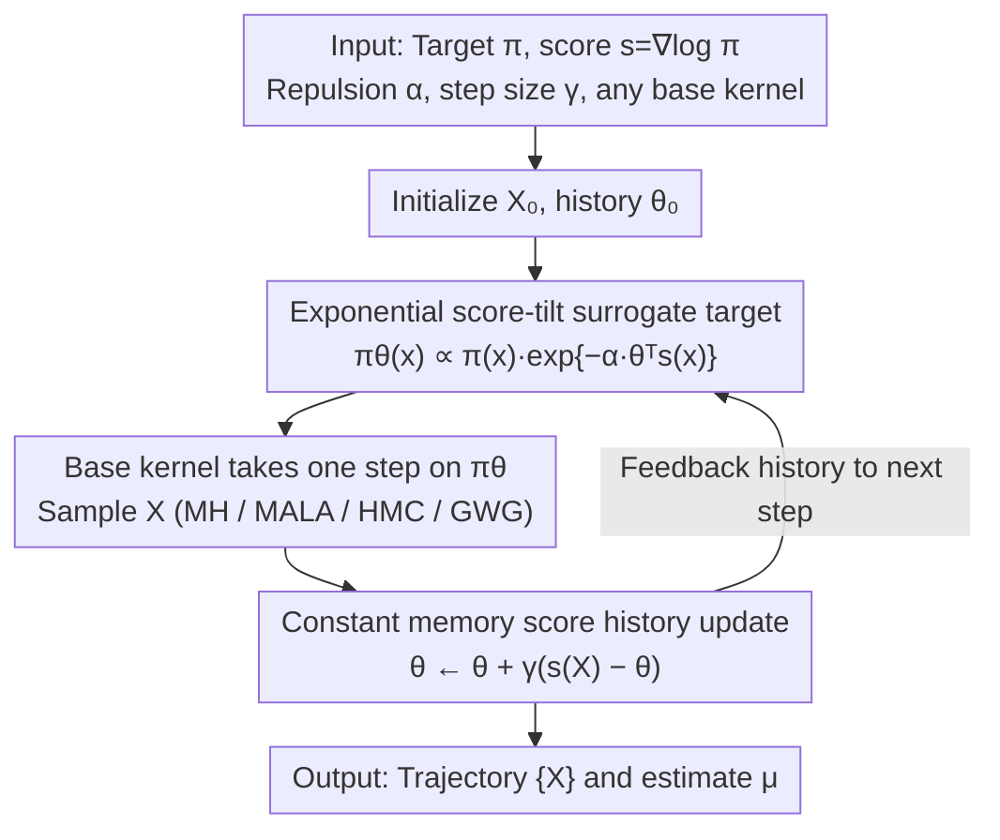

# Score-Repellent Monte Carlo: Toward Efficient Non-Markovian Sampler with Constant Memory in General State Spaces

**Conference**: ICML 2026 Spotlight  
**arXiv**: [2604.22948](https://arxiv.org/abs/2604.22948)  
**Code**: To be confirmed  
**Area**: Scientific Computing / MCMC / Probabilistic Inference  
**Keywords**: MCMC, non-Markovian sampling, score-tilt, self-repulsion, stochastic approximation CLT  

## TL;DR
SRMC utilizes a $d$-dimensional running score average (rather than an $|\mathcal{X}|$-dimensional empirical measure) to record history. This history is then incorporated into an exponential score-tilt to construct a surrogate target $\pi_\theta$ that "repels already visited regions." By wrapping this around any base MCMC kernel, the authors implement a non-Markovian, low-variance, normalization-free sampler with constant memory in general state spaces.

## Background & Motivation
**Background**: MCMC is a cornerstone tool for everything from Bayesian inference to EBM sampling. However, complex targets (multi-modal posteriors, rugged energy landscapes, large discrete configuration spaces) often lead to "theoretical ergodicity but practical entrapment": the chain oscillates repeatedly in the same region, leading to strongly correlated samples and unreliable estimates. Recent work on sampling efficiency has primarily focused on refining the Markov kernel itself—using locally informed proposals/balancing (Zanella, GWG) in discrete domains, and Langevin, HMC, or non-reversible samplers in continuous domains.

**Limitations of Prior Work**: The aforementioned approaches are memoryless—the kernel does not "remember" having visited a location 100 times already. Non-Markovian routes have clean theory in finite state spaces: SRRW and HDT use the empirical measure $\hat{\delta}_n = \frac{1}{n+1}\sum_i \delta_{X_i}$ to feedback into the kernel, achieving near-zero variance as the repulsion strength $\alpha$ increases while remaining normalization-free. However, $\hat{\delta}_n$ is an $|\mathcal{X}|$-dimensional object: exponentially large on $\{0,1\}^d$ and an infinite-dimensional measure in continuous domains, making it impossible to store.

**Key Challenge**: To trade "remembering history" for variance reduction, one must store information; for it to be storable, it must be $O(\text{const})$. Yet, history is essentially a distribution over the entire state space—how can it be compressed into constant dimensions while maintaining theoretical properties (asymptotic unbiasedness + diminishing variance)? Existing compromises either require large buffers (Stein self-repulsive requires storing historical samples) or importance reweighting (adaptive biasing potentials), losing the simplicity of being normalization-free.

**Goal**: Construct a generic wrapper that (i) maintains $O(d)$ memory; (ii) is compatible with any base MCMC (MH, Langevin, HMC, GWG); (iii) remains normalization-free; and (iv) provides theoretical guarantees for CLT and $\alpha$-scaling, extending the near-zero-variance properties of SRRW/HDT to general state spaces.

**Key Insight**: The Stein identity states that $\mathbb{E}_{X\sim\pi}[s(X)] = 0$ (where $s = \nabla\log\pi$), meaning "for a well-explored chain, the time average of the score should be close to 0." If a chain constantly dwells in a certain region, the score directions in that region will accumulate a bias—the running average of the score, $\theta_n$, serves as a "detector for the chain's deviation from the true distribution." This immediately collapses an $|\mathcal{X}|$-dimensional statistic into $d$ dimensions.

**Core Idea**: Use $\theta_n \in \mathbb{R}^d$ (running average of the score) as the history summary, then use an exponential tilt $\pi_\theta(x) \propto \pi(x)\exp\{-\alpha \theta^\top s(x)\}$ to penalize "directions over-visited in the past" to obtain a surrogate target. The base kernel runs one step on $\pi_{\theta_n}$, and then $\theta_{n+1}$ is updated, repeating the cycle.

## Method

### Overall Architecture
SRMC acts as a thin wrapper. Given a target $\pi(x)\propto e^{-U(x)}$, score $s(x) = -\nabla U(x)$, repulsion strength $\alpha \geq 0$, step size sequence $\gamma_n = (n+1)^{-\rho}$ ($\rho \in (1/2, 1]$, Robbins-Monro conditions), and any base kernel $P_q$ (MH/MALA/HMC/GWG are all viable). In iteration $n$: (1) Construct the surrogate $\pi_{\theta_n}(x) \propto \pi(x)\exp\{-\alpha\theta_n^\top s(x)\}$ using the current history $\theta_n$; (2) Sample $X_{n+1}$ using $P_{\pi_{\theta_n}}$; (3) Update history using a first-order recurrence $\theta_{n+1} = \theta_n + \gamma_{n+1}(s(X_{n+1}) - \theta_n)$. This mechanism only adds $d$-dimensional memory ($\theta_n$) and one score evaluation. The entire pipeline is a **non-Markovian feedback loop**: new scores from sampling are fed back into the history $\theta$, which in turn reshapes the next surrogate target, pushing the chain away from visited regions.

### Key Designs

**1. Constant memory score-running history $\theta_n$: Replacing $|\mathcal{X}|$-dimensional empirical measures with $d$-dimensional vectors**

SRRW/HDT were confined to finite state spaces because they required storing the $|\mathcal{X}|$-dimensional empirical measure $\hat\delta_n$. The breakthrough in SRMC comes from the Stein identity $\mathbb{E}_\pi[s]=0$: for a well-explored chain, the score's time average should converge to 0. Thus, the running average $\theta_n\in\mathbb{R}^d$ is a natural detector of deviation. $\theta_n$ is a weighted moving average of past scores $\{s(X_i)\}_{i\leq n}$; $\rho=1$ yields a simple time average, while $\rho<1$ weights recent samples more heavily, being more sensitive to temporary entrapment. It satisfies $\theta_n - \mathbb{E}_\pi[s(X)] = \int_\mathcal{X}[\frac{1}{n+1}\sum_i\delta_{X_i}(x) - \pi(x)]s(x)dx$, essentially the projection of the deviation between the empirical distribution and $\pi$ onto the score space. This collapses storage and computation from exponential/infinite dimensions to constant dimensions, while the Stein identity ensures $\theta^\star=0$ is the equilibrium, naturally calibrating the estimate.

**2. Exponential score-tilt surrogate target $\pi_\theta$: Folding historical deviation into a "repulsive" surrogate**

Once the deviation detector $\theta$ is defined, it must be converted into a force that drives the sampler away from old regions. The authors use an exponential tilt $\pi_\theta(x)\propto\pi(x)\exp\{-\alpha\theta^\top s(x)\}$. When the chain repeatedly visits a metastable basin, $\theta$ aligns with the concentrated score direction of that basin. Points $x$ inside the basin ($\theta^\top s(x)>0$) are down-weighted by $\exp\{-\alpha\theta^\top s(x)\}<1$, while points outside are relatively lifted. For MH, this only requires multiplying the acceptance ratio by $e^{-\alpha\theta^\top[s(y)-s(x)]}$; the normalization constant $Z_\theta$ cancels out. For Langevin/HMC, the score is replaced by the surrogate score $s_\theta(x)=s(x)-\alpha\nabla_x s(x)\theta=-\nabla U(x)+\alpha\nabla^2 U(x)\theta$, where the Hessian-vector product can be cheaply approximated via autodiff or finite differences $(\nabla U(x+\epsilon\theta)-\nabla U(x))/\epsilon$. This choice is normalization-free, naturally generalizes score-based exponential families, and is plug-and-play with existing kernels.

**3. Coupled SA analysis + CLT & $O(1/\alpha)$ variance decay: Extending zero-variance to general state spaces**

To provide theoretical grounding, the authors prove convergence and a joint CLT on $\mathcal{X}=\mathbb{R}^d$ and quantify variance scaling with $\alpha$. They frame $\vartheta_n=(\theta_n,\mu_n)$ (where $\mu_n$ is the running estimate of $\mathbb{E}_\pi[f(X)]$) as a stochastic approximation $\vartheta_{n+1}=\vartheta_n+\gamma_{n+1}H(\vartheta_n,X_{n+1})$, where $H$ is controlled Markovian noise. Under Assumption 1 ($L$-Lipschitz score + superlinear tail growth of $U$ + asymptotically normal Hessian) and Assumption 2 (uniform drift of the kernel + Lipschitz continuity in $\theta$), Theorem 3.3 shows $\vartheta_n\to(0,\mu)$ a.s. and $\gamma_n^{-1/2}(\vartheta_n-\vartheta^\star)\xrightarrow{d}\mathcal{N}(0,\Sigma_\vartheta)$. Crucially, Proposition 3.4 proves $\Sigma_{\theta\theta}(\alpha)=O(1/\alpha)$ and is non-increasing in $\alpha$. For Gaussian targets, this scaling transfers directly to the sample mean, yielding near-zero variance. This upgrades stability from a mere assumption (as in earlier SRRW work) to a provable conclusion for MH/MALA.

### Loss & Training
There is no training loss—SRMC is a sampling algorithm. Practical hyperparameters include: $\rho \in \{0.6, 0.8\}$ (to prevent $\gamma_n$ from decaying too quickly), $\epsilon \approx \alpha$ (finite difference scale), and $\alpha$ chosen such that $\alpha|\theta_n^\top s(X_n)|$ is moderate to avoid over-tilting. In discrete domains, the discrete Stein operator $s_i(x) = \pi(x^{(i,K-x_i)})/\pi(x) - 1$ is used to maintain $\mathbb{E}_\pi[s] = 0$. For high-dimensional EBMs (e.g., Static MNIST), a relaxed gradient is used as a score proxy.

## Key Experimental Results

### Main Results
MSE comparison for sample mean estimation on a 10D continuous target (100 independent trials, $\alpha \in \{0,0.01,0.1,1,2,5\}$):

| Target | Sampler | Best $\alpha$ | MSE Gain vs Baseline | Notes |
|------|---------|--------------|---------------------|------|
| Correlated Gaussian (10D) | MALA → SR-MALA | $\alpha=2{-}5$ | Moderate reduction | Holds for both step and CPU time |
| Correlated Gaussian | HMC → SR-HMC | $\alpha=2{-}5$ | Significant reduction, lowest MSE | $\alpha=5$ optimal |
| Bayesian Logistic Regression | MALA → SR-MALA | $\alpha=1{-}2$ | ~5× MSE reduction | $\alpha=5$ too aggressive |
| Bayesian Logistic Regression | HMC → SR-HMC | $\alpha \approx 1{-}2$ | Fastest MSE decay | $\alpha=5$ over-tilted |

Discrete EBM (Static MNIST, $\{0,1\}^{784}$, 100 parallel chains initialized from a '7'):

| Metric | Baseline GWG | SR-GWG ($\alpha=10^{-4}$) | Relative Change |
|------|--------------|---------------------------|---------|
| Cumulative KL (↓) | 4.16 | 0.68 | **−84%** |
| Batch Vendi Score (↑) | 2.6 | 6.4 | **+146%** |
| Mode Escape (Steps) | Never escaped | ~2500 steps | — |
| Diversity (10k steps) | Mostly '7' | Covers multiple digit classes | Significant exploration |

### Ablation Study

| Configuration | Key Observation |
|------|---------|
| $\alpha = 0$ | Recovers base sampler, verifying the wrapper structure. |
| Moderate $\alpha \uparrow$ | MSE/KL decreases monotonically, matching $O(1/\alpha)$ theory. |
| $\alpha$ too large | Rejection rates spike; the optimal $\alpha$ is usually moderate, not maximal. |
| $\rho = 1$ vs $\rho < 1$ | $\rho < 1$ is more stable during transients; $\rho = 1$ adapts too slowly. |
| $\epsilon$ scale | $\epsilon \sim \alpha$ is stablest for finite-difference Hessian-vector products. |

### Key Findings
- Theoretically, $\Sigma_{\theta\theta}(\alpha) = O(1/\alpha)$ translates to the same scaling for $\Sigma_X(\alpha)$ in Gaussian targets; experiments confirm MSE decreases with $\alpha$ until saturation.
- For non-linear targets, there is an "optimal working zone" for $\alpha$; over-tilting leads to high rejection rates.
- On discrete EBMs, the improvement in mode-mixing (84% KL reduction) is a victory of mode coverage rather than local estimation precision.
- SRMC advantages are more pronounced with fewer parallel chains, suggesting it can replace massive parallelization when compute is limited.

## Highlights & Insights
- **"Using score time-average instead of visit counts" is the paper's most elegant idea**: Collapsing $|\mathcal{X}|$ to $d$ via the Stein identity is a powerful insight. This paradigm of using low-dimensional statistics to track distribution deviation could transition to adaptive optimization or RL.
- **Engineering value of the plug-and-play wrapper**: MH, MALA, HMC, ULA, and GWG are all compatible without modifying their internal logic or losing their normalization-free property.
- **Efficiency of Hessian-vector products**: The use of finite differences $(\nabla U(x+\epsilon\theta) - \nabla U(x))/\epsilon$ makes it possible to apply SRMC to models without analytical Hessians with only one extra score evaluation.
- **Solid Theoretical Contribution**: Translating general SA theorems into verifiable MCMC drift conditions and proving stability without assuming bounded iterates is a substantial upgrade over prior non-Markovian theory.

## Limitations & Future Work
- For general non-Gaussian targets, there is no closed-form dependence for $\Sigma_{\mu\mu}(\alpha)$, requiring empirical tuning.
- "Moderate $\alpha$ is best" phenomenon for non-linear targets lacks a fully automated scheduling mechanism.
- Discrete domain theory requires an exact Stein score, but high-dimensional practice (MNIST) relies on a relaxed gradient proxy; there is a gap between theory and practice here.
- Per-step overhead: For HMC with many leapfrog steps, the extra score evaluation for the tilt may diminish the variance gains when viewed in terms of CPU time.

## Related Work & Insights
- **vs SRRW/HDT-MCMC**: These are limited to finite spaces due to $|\mathcal{X}|$-dimensional storage. SRMC is the "continuous/high-dimensional discrete" successor.
- **vs Stein self-repulsive**: The latter requires a sample buffer and is only unbiased with an infinite buffer. SRMC has constant memory and is unbiased for finite $\alpha$.
- **vs Metadynamics**: Those methods require density accumulation and reweighting; SRMC is inherently normalization-free.
- **vs Adam-style SGLD**: While both modify drift with running averages, SRMC modifies the *target* rather than just the dynamics, making it applicable to any base sampler.

<!-- RELATED:START -->

## Related Papers

- [\[ACL 2026\] Adaptive Planning for Multi-Attribute Controllable Summarization with Monte Carlo Tree Search](../../ACL2026/nlp_generation/adaptive_planning_for_multi-attribute_controllable_summarization_with_monte_carl.md)
- [\[AAAI 2026\] Structured Language Generation Model: Loss Calibration and Formatted Decoding for Efficient Text](../../AAAI2026/nlp_generation/structured_language_generation_model_loss_calibration_and_formatted_decoding_for.md)
- [\[ICLR 2026\] Logit-KL Flow Matching: Non-Autoregressive Text Generation with Sampling-Mixing Inference](../../ICLR2026/nlp_generation/logitkl_flow_matching_nonautoregressive_text_generation_via_samplinghybrid_infer.md)
- [\[ICML 2026\] Characterizing the Effect of Noise in Language Generation in the Limit](characterizing_the_effect_of_noise_in_language_generation_in_the_limit.md)
- [\[ICLR 2026\] FS-DFM: Fast and Accurate Long Text Generation with Few-Step Diffusion Language Model](../../ICLR2026/nlp_generation/fs-dfm_fast_and_accurate_long_text_generation_with_few-step_diffusion_language_m.md)

<!-- RELATED:END -->
