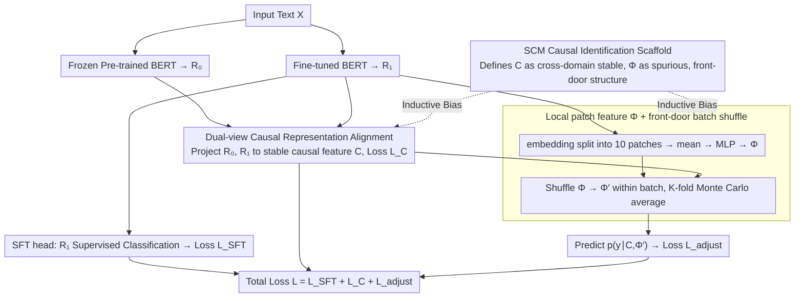

# Causal Fine-Tuning under Latent Confounded Shift

**Conference**: ICML 2026  
**arXiv**: [2410.14375](https://arxiv.org/abs/2410.14375)  
**Code**: https://github.com/jialin-yu/CausalFineTuning (Available)  
**Area**: NLP Understanding / Causal Representation Learning / Out-of-Distribution Generalization  
**Keywords**: Causal Fine-Tuning, Latent Confounding, Front-door Adjustment, Single-domain Generalization, BERT

## TL;DR
This paper proposes Causal Fine-Tuning (CFT): an SCM-inspired decomposition of "high-level stable features $C$ + low-level confounding-sensitive features $\Phi$" is embedded into standard BERT fine-tuning. By utilizing a front-door style do-calculus adjustment for prediction, it significantly outperforms single-domain generalization baselines such as SFT/SWA/WISE under text spurious correlation injection attacks.

## Background & Motivation
**Background**: Downstream adaptation for foundation models (BERT/GPT/CLIP) almost exclusively follows a black-box route of "full-parameter SFT or LoRA + ERM," treating all input features equally.

**Limitations of Prior Work**: When training data contains spurious correlations driven by latent variables (e.g., the "Amazon" label being strongly correlated with positive sentiment), models learn shortcuts. If the spurious correlation flips during deployment (e.g., Amazon reviews become predominantly negative), model performance collapses. Traditional invariant methods like IRM require multi-domain labels or environment annotations, making them ineffective for single-domain data.

**Key Challenge**: In standard fine-tuning $p(y\mid x;\sigma)=\sum_u p(y\mid u,x)\,p(u\mid x;\sigma)$, where $p(u\mid x;\sigma)$ changes with the environment, single-domain observations can neither identify $u$ nor obtain environment labels. Minimax robust optimization under such "unseen confounding" is either unidentifiable or overly conservative.

**Goal**: Under single-domain fine-tuning, decompose input representations into (i) a cross-environment stable causal component $C$ and (ii) an environment-sensitive low-level local component $\Phi$, and "extract" the dependency on $\Phi$ through do-calculus adjustment.

**Key Insight**: Treat the pre-trained LM itself as "another implicit environment"—the frozen model provides $R_0$, and the fine-tuned model provides $R_1$. The discrepancy between these two views naturally exposes which dimensions are sensitive to the training domain and which are stable across domains.

**Core Idea**: Use an SCM as an inductive bias, stipulating that $R_0, R_1$ explain consistency through a shared stable causal latent variable $C$, while low-level local features $\Phi$ carry spurious correlations. Then, use front-door adjustment $p(y\mid \mathrm{do}(x))=\sum_{\Phi',x'} p(y\mid\Phi',C)\,p(\Phi'\mid x')\,p(x')$ and perform Monte-Carlo estimation by shuffling $\Phi$ within the batch.

## Method

### Overall Architecture
The training phase maintains two BERT models simultaneously: a frozen pre-trained model $p(r_0\mid x)$ and a fine-tuned model $p(r_1\mid x)$. Each sample passes through three heads: (1) SFT head for supervised classification on $R_1$; (2) Causal head to learn the mapping from $(R_0, R_1)$ to the stable causal representation $C$; (3) Local head to extract $\Phi$ from the embedding layer of $R_1$. The final predictor $p(y\mid C, \Phi)$ estimates the do-calculus Monte-Carlo adjustment by shuffling $\Phi$ within the mini-batch $K=20$ times. During inference, the frozen model is discarded, and $C$ is estimated solely from $R_1$, keeping the model size identical to standard SFT.

### Key Designs

**1. SCM-based Causal Identification Scaffold: Mapping "Stable vs. Variant" features into an identifiable graph**

Single-domain data can neither identify the latent variable $u$ nor obtain environment labels, making minimax robust optimization either unidentifiable or overly conservative. The authors structure the problem using an SCM (Fig. 2(b)): high-level stable semantics $C$ + low-level confounding features $\Phi$ + unobservable confounding $U_S, U_\Phi$ + environment $\sigma$. It is assumed that $\sigma$ affects $R_1$ only via $S_1$, and the influence of $\Phi$ on $Y$ passes entirely through $C$ (front-door structure). C is then formulated as an invariant projection $p(C \mid R_0) \approx p(C \mid R_1)$ leveraging Von Kügelgen’s identifiability theorem.

The value of this graph lies in precisely equating "train-test distribution discrepancy" to "changes in $p(u \mid x; \sigma)$," thereby demonstrating that $p(y \mid \mathrm{do}(x))$ can be derived from $p(y \mid \Phi, C)$ and the marginal $p(x)$ under single-domain conditions. The problem transforms from being "robust to all $\sigma$" (minimax, overly conservative) to training under a "maximum entropy default environment following $\mathrm{do}(x)$," which is both identifiable and not overly pessimistic.

**2. Dual-view Causal Representation Alignment $\mathcal{L}_C$: Treating the pre-trained model as a "free second environment"**

IRM-like invariance methods require multiple real environments, yet environment labels in NLP are almost impossible to define. The authors' insight is that the frozen pre-trained model providing $R_0$ and the fine-tuned model providing $R_1$ naturally form a pair of pseudo-environments. Their differences expose which dimensions are sensitive to the training domain versus those that are cross-domain stable. Both views are projected into the same stable causal space $C$, minimizing $\mathcal{L}_C = \mathbb{E} \|p(c \mid r_0) - p(c \mid r_1)\|_2^2 - H(p(c \mid r_0)) - H(p(c \mid r_1))$. The first term enforces cross-view invariance, while the negative entropy terms prevent the representation from collapsing to a constant.

**3. Local patch feature $\Phi$ + front-door batch shuffle: Implementing do-calculus with a single line of shuffling**

Isolating $C$ is insufficient; the causal path of spurious correlation must be severed. The authors extract local low-level features from the embedding layer of the fine-tuned model as a proxy for spurious correlations: the token sequence is divided into 10 non-overlapping patches, and after mean pooling, $\Phi = \mathrm{MLP}(\frac{1}{10}\sum_i p_i)$ is obtained. Shuffling $\Phi$ randomly within the mini-batch to get $\Phi' \sim \hat{p}_B(\Phi)$ and computing $\mathbb{E}_{\Phi'}[p(y \mid C, \Phi')]$ via $K=20$ Monte Carlo averages effectively breaks the active collider path $\sigma \to S_1 \to R_1 \leftrightarrow \Phi \leftrightarrow Y$. This pulls the prediction from $p(y \mid x)$ back to $p(y \mid \mathrm{do}(x))$.

### Loss & Training
The total objective is $\mathcal{L} = \mathcal{L}_{\text{SFT}} + \mathcal{L}_C + \mathcal{L}_{\text{adjust}}$, where $\mathcal{L}_{\text{adjust}}$ is the cross-entropy loss based on the shuffled $\Phi'$. The optimizer used is AdamW with a learning rate of $5 \times 10^{-5}$ for 10 epochs, initialized with BERT-base. A frozen copy is kept for $R_0$ extraction and discarded after training.

## Key Experimental Results

### Main Results

| Dataset | Test Spurious 10% | SFT | SWA | WISE | CFT |
| :--- | :--- | :--- | :--- | :--- | :--- |
| Yelp (Exp1, stop-word attack) | F1 | 49.24 | 62.92 | 55.91 | **58.40** (+9.16 vs SFT) |
| Amazon (Exp1) | F1 | 49.33 | 59.75 | 50.40 | **56.40** (+7.07) |
| Amazon (Exp2, data-source attack) | F1 | 37.78 | 47.41 | 31.83 | **49.22** (+11.44) |

On ID (90% spurious), CFT is nearly tied with SWA/SFT. However, as OOD becomes more extreme (spurious ratio decreasing from 70% to 10%), the advantage of CFT increases. Under original noise scales of 4× and 8×, the margin by which CFT outperforms SWA expands further.

### Ablation Study

| Configuration | Spurious 10% F1 (Amazon) | Description |
| :--- | :--- | :--- |
| Full CFT | 56.40 | Causal decomposition + do-calculus |
| CFT-N (no do-shuffle, direct conditioning on $\Phi$) | 48.00 | Retains active collider; OOD degrades to SFT level |
| CFT-C (prediction using $C$ only) | 53.40 | Stronger than SFT but weaker than full; $\Phi$ adjustment contributes |
| CFT-$\Phi$ (prediction using $\Phi$ only) | 12.40 | Almost random; confirms $\Phi$ captures spurious correlations |
| CFT (identical view $R_1, R_1$) | 37.24 | Failure mode: method degrades to SFT without dual-view signals |

### Key Findings
- Predicting with $\Phi$ alone on OOD is nearly random (19/12 F1), confirming it carries spurious signals. Adjustment is necessary for the model to withstand distribution flips.
- Replacing the dual-view signal with identical views (failure mode) immediately reduces the method to SFT levels, indicating the "dual-view + invariance constraint" is the primary driver of representation decomposition.
- The stronger the shift, the more CFT outperforms SWA. While SWA and CFT are comparable under default noise, CFT leads significantly under 4×/8× noise, suggesting structural causal methods are more stable than general regularization under severe distribution drift.

## Highlights & Insights
- **Pre-trained models as "free environments"**: Traditional causal invariance methods (IRM/REx) require collecting multiple real environments. This paper leverages the frozen vs. fine-tuned views to achieve alignment using Theorem 4.4 (Von Kügelgen), saving data collection costs in NLP where environment labels are hard to define.
- **Front-door + batch shuffle for minimal do-calculus implementation**: Implementing $p(y \mid \mathrm{do}(x))$ as a single line of code—shuffling $\Phi$ within a mini-batch—is a clever, low-cost way to break implicit collider paths.
- **SCM as Inductive Bias**: The authors clarify that $C/\Phi$ are empirical estimates rather than ground-truth variables from a data-generating graph. The failure mode experiments provide a diagnostic signal (degrading to SFT when $C \approx \Phi$), showing a pragmatic approach.

## Limitations & Future Work
- The study primarily uses text sentiment classification with manually injected spurious cues, which may not cover real-world multi-source confounding (hospitals, platforms, languages).
- It assumes a front-door structure (the effect of $\Phi$ on $Y$ passes entirely through $C$). If $\Phi$ has a direct causal path to $Y$ in reality, identification no longer holds.
- Batch-based Monte Carlo estimation with $K=20$ shuffles only models the distribution within a batch; $p(\Phi)$ estimation across batches still relies on i.i.d. sampling.
- Future work may extend this to multi-modal scenarios where confounding variables may exist in one modality but interact with another.

## Related Work & Insights
- **vs. IRM/V-REx**: IRM series require multiple domains and environment labels. This method uses "pseudo-environments" from pre-trained/fine-tuned pairs, making it applicable to single-domain data.
- **vs. SWA/WISE**: SWA/WISE are general flat-minima/parameter interpolation regularizers. While comparable to CFT under moderate shifts, they are outperformed as distribution drift intensifies, highlighting the advantage of structured causal adjustment over geometric regularization.
- **vs. Back-door Causal Attention**: Back-door methods require observed confounders. This work uses front-door adjustment for "latent confounding + text" scenarios, providing a plug-and-play fine-tuning module for do-calculus adjustment beyond ERM.

## Rating
- Novelty: ⭐⭐⭐⭐ Combining front-door adjustment with dual-view alignment of pre-trained/fine-tuned models is innovative.
- Experimental Thoroughness: ⭐⭐⭐ Covers multiple datasets and shift intensities, but lacks validation on natural (non-synthetic) distribution shifts.
- Writing Quality: ⭐⭐⭐⭐ Clear progression from causal graphs to theorems and algorithms, with a careful distinction between the identification scaffold and learned proxies.
- Value: ⭐⭐⭐⭐ Provides a plug-and-play causal robustness solution for single-domain NLP fine-tuning, highly relevant for addressing dataset artifacts.

<!-- RELATED:START -->

## Related Papers

- [\[NeurIPS 2025\] Weak-to-Strong Generalization under Distribution Shifts](../../NeurIPS2025/nlp_understanding/weak-to-strong_generalization_under_distribution_shifts.md)
- [\[ACL 2026\] Lost in the Prompt Order: Revealing the Limitations of Causal Attention in Language Models](../../ACL2026/nlp_understanding/lost_in_the_prompt_order_revealing_the_limitations_of_causal_attention_in_langua.md)
- [\[ICML 2026\] Controlling the Risk of Corrupted Contexts for Language Models via Early-Exiting](controlling_the_risk_of_corrupted_contexts_for_language_models_via_early-exiting.md)
- [\[ACL 2026\] LexRel: Benchmarking Legal Relation Extraction for Chinese Civil Cases](../../ACL2026/nlp_understanding/lexrel_benchmarking_legal_relation_extraction_for_chinese_civil_cases.md)
- [\[ACL 2026\] MetFuse: Figurative Fusion between Metonymy and Metaphor](../../ACL2026/nlp_understanding/metfuse_figurative_fusion_between_metonymy_and_metaphor.md)

<!-- RELATED:END -->
