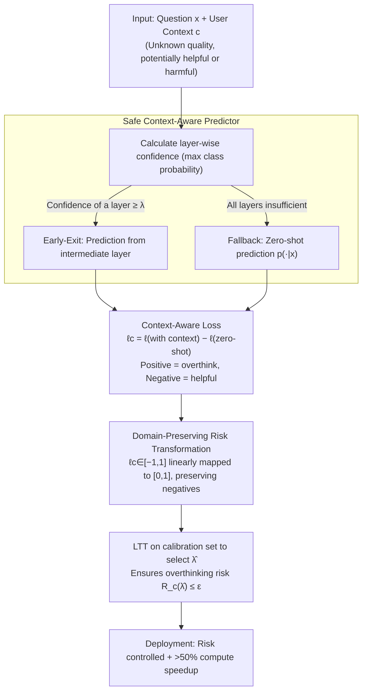

# Controlling the Risk of Corrupted Contexts for Language Models via Early-Exiting

**Conference**: ICML 2026  
**arXiv**: [2510.02480](https://arxiv.org/abs/2510.02480)  
**Code**: https://github.com/andreawynn/controlling-corrupted-context-risk  
**Area**: NLP Understanding / LLM Security / Adaptive Inference  
**Keywords**: Corrupted Context, Early-Exiting, Distribution-Free Risk Control, Overthinking, Learn-then-Test

## TL;DR
This paper formalizes the problem where "user-provided corrupted contexts degrade LLM performance" as a risk control task. By using zero-shot performance as a "safety baseline," combining dynamic early-exit (predicting at intermediate layers to avoid late-layer overthinking of harmful contexts) with a context-aware loss and an improved Learn-then-Test framework (preserving negative loss values via risk transformation rather than clipping), this method guarantees risk $\leq$ user-specified $\epsilon$ while achieving $> 50\%$ computational acceleration across 9 tasks.

## Background & Motivation

**Background**: LLMs adapt to tasks using user-provided context via prompt tuning or in-context learning. However, corrupted contexts (unintentional mislabeling, malicious injection, task mis-specification) can significantly degrade output quality. This risk is particularly severe in medical/clinical deployment scenarios (e.g., mislabeling by a busy nurse or bias from a clinician).

**Limitations of Prior Work**: (1) Existing hallucination mitigation often relies on output post-processing or full fine-tuning, lacking a principled safeguard against arbitrary user contexts; (2) Halawi et al. (2024) noted that LLMs overthink harmful inputs—intermediate layers may be correct while deep layers are dragged astray by harmful context; they proposed pruning attention heads, but fixed pruning cannot guarantee risk levels; (3) Existing early-exit works (like CALM) focus on acceleration rather than safety and do not treat zero-shot as a safe baseline.

**Key Challenge**: User context quality is unknown—it may be helpful (should be utilized for performance + speed) or harmful (should be discarded to fallback to zero-shot). A framework that adapts to both ends is required.

**Goal**: (1) Formalize "robustness to corrupted contexts" as a risk control problem; (2) Use zero-shot performance as an anchored safe baseline; (3) Control risk while gaining efficiency via dynamic early-exit and specialized loss/risk design; (4) Provide theoretical guarantees and empirical validation across 9 tasks and 5 models.

**Key Insight**: It is observed that (a) overthinking primarily occurs in deep layers, which early-exiting naturally avoids; (b) falling back to zero-shot when confidence is insufficient serves as a robust safeguard; (c) the context-aware loss $\ell_c = \ell(\bar y_\lambda(x,c), y) - \ell(\hat y(x), y)$ quantifies "gain/loss from context"—positive values indicate overthinking, while negative values indicate helpfulness; (d) the Learn-then-Test (LTT) framework can handle non-monotonic risks but requires loss $\in[0,1]$. This paper extends it to negative losses using a risk-preserving transformation.

**Core Idea**: A safe context-aware predictor $\bar p_\lambda$ uses early-exiting for predictions. If confidence is insufficient across all layers, it falls back to zero-shot. LTT is used to select $\hat\lambda$ to ensure overthinking risk $\leq \epsilon$.

## Method

### Overall Architecture

Given a base LLM $p$ and $(x, c) \rightarrow p(\cdot|x, c)$:
1. **Safe context-aware predictor** $\bar p_\lambda$: Calculates confidence $\mathfrak{C}_l$ layer-by-layer. If $\geq \lambda$, it exits early; otherwise, it falls back to zero-shot $p(\cdot | x)$.
2. **Context-aware loss** $\ell_c(\lambda; x, y, c) = \ell(\bar y_\lambda(x,c), y) - \ell(\hat y(x), y)$: Positive values = overthink, negative values = helpful.
3. **Risk control**: Uses LTT on a calibration set to select $\hat\lambda$ such that $R_c(\hat\lambda) \leq \epsilon$.
4. **Risk-preserving transformation**: Linearly transforms $\ell_c \in [-1, 1]$ to $[0, 1]$ (without clipping) to preserve negative value information.

### Key Designs

**1. Safe Context-Aware Predictor: Exit when confident, fallback when not**

Since context quality is unknown, the predictor must adapt. The authors calculate $\mathfrak{C}_l=\max_k p_l(k|x,c)$ layer-by-layer. The first layer meeting $\ge\lambda$ outputs the prediction (avoiding deep-layer overthinking). If no layer is confident, it falls back to zero-shot $p_L(\cdot|x)$. This integrates "acceleration" and "safety" into a single predictor by using the reliable zero-shot behavior as a safety net.

**2. Context-Aware Loss: Measuring overthinking against zero-shot**

To control risk, one must measure if the context is helpful. The authors define $\ell_c(\lambda;x,y,c)=\ell(\bar y_\lambda(x,c),y)-\ell(\hat y(x),y)$. This measures the loss difference between "prediction with context" and "zero-shot prediction without context." Positive values signify the context corrupted the result, while negative values signify it helped. Unlike standard early-exit losses that compare against a potentially corrupted full-forward pass, the zero-shot baseline provides a neutral reference.

**3. Domain-Preserving Risk Transformation: Enabling LTT with negative losses**

Learn-then-Test requires $\ell\in[0,1]$, but $\ell_c$ is naturally negative when context is helpful. Previous methods clipped negative values to 0, losing "better than zero-shot" information and making LTT overly conservative. This paper uses a linear transformation $\ell'=(\ell_c-a)/(b-a)$ and $\epsilon'=(\epsilon-a)/(b-a)$ to map $\ell_c\in[-1,1]$ to $[0,1]$. They prove that selecting $\hat\lambda$ in this transformed space controls the original risk $R(\ell)\le\epsilon$, allowing for more aggressive early-exiting and 50%+ higher efficiency compared to clipping.

## Key Experimental Results

### Main Results across 9 Tasks and 5 Models (Excerpt)

| Task | Llama-3-8B baseline | + Early-Exit (Loss-Clip) | **+ Ours** | Risk Controlled ✓ |
|------|----------|--------|--------|------|
| AG News | 84.2 (Slow) | 78.5 (Fast but conservative) | **84.0** (Fast and ε≤0.05) | ✓ |
| Financial | 79.3 | 73.8 | **78.9** | ✓ |
| TE-Hate | 65.4 | 58.7 | **64.8** | ✓ |
| SQuAD-v2.0 (open-ended) | 71.2 | 64.5 | **70.7** | ✓ |

Risk transformation prevents over-conservatism, maintaining accuracy while significantly reducing latency.

### Efficiency Gain (vs. CALM clip baseline)

| Task | Our Speedup | Clip Speedup |
|------|--------|--------|
| AG News | **2.1×** | 1.3× |
| Financial | **1.8×** | 1.2× |
| TE-Atheism | **1.9×** | 1.2× |
| SQuAD-v2 | **1.7×** | 1.1× |

Ours consistently provides >50% additional speedup over clipping, with all tasks achieving >1.7×.

### Risk Validation
Across all task × model × $\epsilon$ ∈ {0.01, 0.05, 0.1}: Empirical risk consistently stays $\leq \epsilon$, proving DFRC is effective and independent of the mixture ratio of helpful/harmful context.

### Selective Fallback
On unsafe (unanswerable) questions, the fallback frequency is **3.3×** higher than on safe ones (3.0% vs. 0.9%). When fallback occurs, zero-shot outperforms early-exit in 71% of cases.

### Key Findings
- **Zero-shot as a safe baseline is critical**: Formalizing the utility of context relative to zero-shot makes the risk control framework viable.
- **Risk-preserving transformation vs. Clipping**: Clipping makes LTT too conservative; transformation preserves signals, increasing speedup by 50%+.
- **Consistency**: The method is model-agnostic and data-agnostic, benefiting everything from LLaMA-2/3 to LayerSkip variants.
- **Selective fallback**: Fallback frequency correlates strongly with unsafe-ness (3.3×).

## Highlights & Insights
- **First principled DFRC for user context risk**: Moves beyond heuristic post-processing for hallucinations to provide statistical $\epsilon$-control guarantees, crucial for high-stakes deployment (medical, legal, finance).
- **Zero-shot as safety baseline is a clever framing**: Anchoring "safe behavior" to zero-shot bridges the gap between "knowing little" and "being deceived."
- **Risk-preserving transformation**: A small but important methodological improvement that extends LTT to losses including negative values, applicable to any "safety + efficiency" risk control scenario.
- **Efficiency as a free byproduct**: Achieves safety + 2× speedup, proving that safety and efficiency are not always a trade-off if the framework is designed correctly.

## Limitations & Future Work
- Dependency on confidence-based exiting; confidence may be unstable in certain tasks like open-ended generation.
- If zero-shot itself is poor on a task, the fallback cannot save performance.
- LTT requires a calibration set $\mathcal{D}_{\text{cal}}$; distribution shifts might invalidate calibration.
- Only validated on classification and open-domain QA; multi-turn dialogue or agent tasks remain unexplored.
- Vulnerability to adversarial context specifically designed to trick the early-exit mechanism was not analyzed.

## Related Work & Insights
- **vs. CALM (Schuster 2022)**: CALM uses early-exit for speed, but its loss clipping is overly conservative. This paper uses risk-preserving transformation + zero-shot fallback.
- **vs. Halawi 2024 (attention head pruning)**: That work uses fixed pruning; this paper uses dynamic exiting with DFRC guarantees.
- **vs. Conformal Prediction**: While CP provides prediction set coverage guarantees, this work provides broader risk control guarantees.
- **Insight**: The "zero-shot as safe baseline" concept can be generalized to any scenario where user input might be harmful (e.g., RAG using a baseline LLM as fallback, or tool-use agents falling back to no-tool execution).

## Rating
- Novelty: ⭐⭐⭐⭐ Combination of DFRC, early-exit, and zero-shot fallback is novel.
- Experimental Thoroughness: ⭐⭐⭐⭐⭐ 9 tasks × 5 models + theoretical validation + ablation on transformation is comprehensive.
- Writing Quality: ⭐⭐⭐⭐⭐ Clear formalization and intuitive figures.
- Value: ⭐⭐⭐⭐⭐ Directly addresses high-stakes LLM deployment with a win-win for risk guarantee and efficiency.

<!-- RELATED:START -->

## Related Papers

- [\[ACL 2026\] The Imperfective Paradox in Large Language Models](../../ACL2026/nlp_understanding/the_imperfective_paradox_in_large_language_models.md)
- [\[AAAI 2026\] Language Models and Logic Programs for Trustworthy Tax Reasoning](../../AAAI2026/nlp_understanding/language_models_and_logic_programs_for_trustworthy_tax_reasoning.md)
- [\[ACL 2026\] AdapTime: Enabling Adaptive Temporal Reasoning in Large Language Models](../../ACL2026/nlp_understanding/adaptime_enabling_adaptive_temporal_reasoning_in_large_language_models.md)
- [\[ACL 2026\] Lost in the Prompt Order: Revealing the Limitations of Causal Attention in Language Models](../../ACL2026/nlp_understanding/lost_in_the_prompt_order_revealing_the_limitations_of_causal_attention_in_langua.md)
- [\[ACL 2026\] Table Question Answering in the Era of Large Language Models: A Comprehensive Survey](../../ACL2026/nlp_understanding/table_question_answering_in_the_era_of_large_language_models_a_comprehensive_sur.md)

<!-- RELATED:END -->
