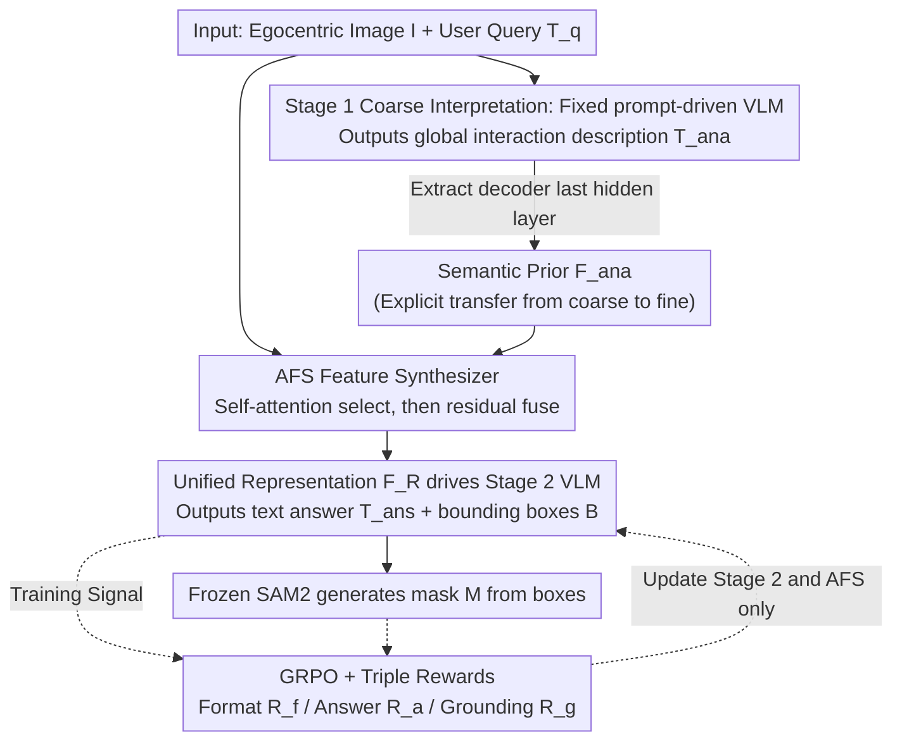

# EARL: Towards a Unified Analysis-Guided Reinforcement Learning Framework for Egocentric Interaction Reasoning and Pixel Grounding

**Conference**: ICML 2026  
**arXiv**: [2605.14742](https://arxiv.org/abs/2605.14742)  
**Code**: https://github.com/yuggiehk/EARL  
**Area**: Egocentric Vision / MLLM / Pixel-level Grounding / Reinforcement Learning (GRPO)  
**Keywords**: Ego-IRG, coarse-to-fine, Analysis-guided Feature Synthesizer, multi-faceted rewards, SAM2

## TL;DR
EARL utilizes a two-stage MLLM framework of "coarse interpretation and fine response" to consolidate egocentric interaction reasoning tasks (description + Q&A + pixel mask) into a unified pipeline. The first stage outputs a global interaction description of the full image and treats the last hidden state as a semantic prior. This is injected into the second stage through a novel Analysis-guided Feature Synthesizer (AFS). The system is jointly trained via GRPO with a triple-reward mechanism (format/answer/grounding accuracy), outperforming Seg-Zero by 8.37% cIoU on Ego-IRGBench.

## Background & Motivation

**Background**: Egocentric vision (FPV) research has become a focal point due to the popularity of wearable devices (GoPro, Aria, etc.). Currently, research mainly treats sub-tasks like "action recognition," "image captioning," and "human-object interaction detection" **independently**, or uses MLLMs end-to-end for Ego-IRG (interaction reasoning and grounding)—which requires generating (i) a global interaction analysis text, (ii) an answer to a user query, and (iii) pixel masks for involved entities simultaneously given an egocentric image and a query.

**Limitations of Prior Work**: (1) Conventional MLLMs (Qwen2.5-VL/InternVL3) struggle with Ego data, with cIoU stalling in the 20-30% range, failing to learn the geometric constraints of "hand-object" interactions in egocentric views. (2) Specialized Ego-IRG methods like ANNEXE generate good analysis text (CIDEr 1.49) but still only achieve 36% cIoU in grounding. (3) RL-based models like Seg-Zero / Seg-R1 achieve around 57% in general reasoning segmentation but lack the "interaction context" priors specific to egocentric tasks.

**Key Challenge**: The **information flow is disconnected** between the analysis (understanding) and response (answer+grounding) stages. While the former might understand "a hand is holding a cup," the latter starts from scratch to re-read the image for the query. Simply concatenating the two stages introduces "noisy prior" issues: not all features from the analysis stage are useful, and blind fusion can degrade grounding.

**Goal**: To explicitly pass semantic information from the coarse analysis to the fine response stage, design a fusion module capable of selective prior utilization, and use RL to jointly optimize heterogeneous objectives: "textual correctness" and "bounding box accuracy."

**Key Insight**: The authors observe that the last hidden embedding of the VLM decoder in the analysis stage serves as a natural "interaction semantic prior" (global interaction descriptor $\mathbf{F}_{ana}$). Noise contamination can be avoided by designing a "select-then-fuse" module.

**Core Idea**: Use a coarse-to-fine two-stage process + AFS (refining analysis priors via self-attention before adding them to primary features) + GRPO multi-faceted rewards to uniformly solve textual, box, and mask outputs.

## Method

### Overall Architecture
Input: An egocentric image $\mathcal{I}$ + user query $T_q$. The pipeline consists of two stages:

- **Stage 1 (coarse-grained interpretation)**: Driven by a fixed prompt $T_a$ = "Please analyze the interactions of hands and objects in detail," the VLM decoder $\mathcal{D}_{vlm}$ outputs a global description $T_{ana}$. The **key byproduct** is the last hidden layer acting as a global descriptor $\mathbf{F}_{ana}$. This stage is trained via standard cross-entropy loss.
- **Stage 2 (fine-grained response)**: Another VLM decoder $\mathcal{D}_{vlm}^{\prime}$ (Qwen2.5VL-7B) provides the text answer $T_{ans}$ and bounding boxes $\mathcal{B}$ for the query; boxes are fed into a frozen SAM2 to obtain final masks $\mathcal{M}$. $\mathbf{F}_{ana}$ is injected into the primary features via AFS between the stages. This stage is trained using GRPO with a triple reward.

### Key Designs

**1. Coarse-to-fine stages + Explicit Semantic Prior Transfer: Starting the second stage with "pre-understood" context**

Naive two-stage cascades only append the analysis text $T_{ana}$ to the second-stage prompt, losing significant information during the "understanding $\rightarrow$ response" transition. EARL extracts the last hidden state of $\mathcal{D}_{vlm}$ as a global interaction descriptor $\mathbf{F}_{ana}\in\mathbb{R}^{bs\times dim_i}$. This is sent to the AFS alongside query encoding $\mathcal{E}_t^{\prime}(T_q)$ and visual encoding $\mathcal{E}_v(\mathcal{I})$ to obtain a unified representation $\mathbf{F}_R=\mathcal{F}_s(\mathcal{E}_v(\mathcal{I}),\mathcal{E}_t^{\prime}(T_q),\mathbf{F}_{ana})$, which drives the answer, box, and mask. Using hidden states avoids textual bottlenecks, maintains high information density, and naturally aligns with the second-stage feature space.

**2. Analysis-guided Feature Synthesizer (AFS): Select-then-Fuse to block "noisy priors"**

Directly concatenating or cross-attending $\mathbf{F}_{ana}$ to the main features $\mathbf{F}_{emb}$ (the vision-text aligned output of Qwen2.5-VL) would introduce irrelevant dimensions from the analysis stage. AFS first re-weights the prior: an MLP $\phi_m$ reduces $\mathbf{F}_{ana}$ to $dim$ dimensions followed by LayerNorm, reshapes it to $bs\times h\times w$ ($h=w=\sqrt{dim}$), and uses convolutions to generate $\mathcal{Q},\mathcal{K},\mathcal{V}$. After a self-attention step $\mathbf{F}=\text{softmax}(\mathcal{Q}\mathcal{K}^\top/\sqrt{dim})\mathcal{V}$ to re-weight tokens, it is passed through MLP $\phi_m^{\prime}$ and added to main features via a residual link: $\mathbf{F}_{out}=\mathbf{F}_{emb}+\phi_m^{\prime}(\mathbf{F})$. This selective mechanism passes important semantics while suppressing noise.

**3. GRPO + Triple Rewards: Optimizing heterogeneous text, box, and mask structures in one output**

Balancing "textual accuracy" (semantic) and "box precision" (geometric) is difficult for SFT, and DPO requires paired samples. EARL uses Group Relative Policy Optimization (GRPO) to weigh three signals: format reward $\mathcal{R}_f$ (template compliance), answer reward $\mathcal{R}_a$ (semantic correlation of $T_{ans}$ with GT), and grounding reward $\mathcal{R}_g$ (IoU between the SAM2-generated mask and GT mask). GRPO uses the mean reward of $K$ rollouts in a group as a baseline, avoiding the need for a critic. During training, vision/text encoders and SAM2 are frozen; only $\mathcal{D}_{vlm}^{\prime}$ and AFS are updated.

### Loss & Training
- Stage 1: Cross-entropy loss $\mathcal{L}_{des}$ supervises $T_{ana}$.
- Stage 2: GRPO optimizes expected rewards $\mathbb{E}[\mathcal{R}_f+\mathcal{R}_a+\mathcal{R}_g]$ with a K-rollout group baseline. Backbone is Qwen2.5VL-7B; mask generator is SAM2.

## Key Experimental Results

### Main Results

Ego-IRGBench test set (metrics: Analysis M/CIDEr, Answer M/CIDEr, grounding cIoU):

| Method | Type | Analysis CIDEr | Answer CIDEr | cIoU |
|------|------|---------------|--------------|------|
| Qwen2.5VL-7B | General | 0.119 | 2.477 | 23.71 |
| InternVL2.5-7B | General | 0.044 | 1.533 | 27.21 |
| ANNEXE | Ego-Specific | 1.494 | 2.590 | 36.02 |
| Sa2VA-8B | Grounding-Specific | 0.115 | 2.656 | 32.69 |
| Seg-R1-7B | RL Grounding | 0.289 | 2.483 | 46.10 |
| Seg-Zero | RL Grounding | 0.049 | 2.380 | 57.11 |
| **EARL** | Ego + RL | **1.522** | **6.682** | **65.48** |
| vs. Prev. SOTA | | +0.028 | +1.682 | **+8.37** |

OOD Testing (EgoHOS dataset, cross-dataset direct evaluation):

| Method | Total cIoU | Left Hand | Right Hand | Two-hand Objects |
|------|---------|-----------|------------|------------------|
| LISA | 22.46 | 28.93 | 33.06 | 18.10 |
| Sa2VA-8B | 37.63 | 48.56 | 45.82 | 37.04 |
| **EARL** | *Ref. Paper* | - | - | - |

### Ablation Study

Ablations focused on AFS and reward design (details in Sec 4.3):

| Configuration | Answer CIDEr | cIoU | Description |
|------|--------------|------|------|
| Qwen2.5VL-7B baseline | 2.477 | 23.71 | No coarse analysis |
| ANNEXE (Two-stage, no AFS/GRPO) | 2.590 | 36.02 | Cascade without hidden injection |
| EARL (full) | 6.682 | 65.48 | Full methodology |

### Key Findings
- **Significant Answer CIDEr jump (+1.68)**: An unexpected byproduct—explicitly injecting analysis hidden states significantly improves textual answer accuracy, not just grounding.
- **+8.37 pp cIoU gain from Ego Knowledge**: While Seg-Zero reaches 57% with general images, EARL hits 65% with ego-analysis priors, validating the "understand then ground" philosophy.
- **OOD Leadership**: Success on EgoHOS demonstrates that AFS learns transferable egocentric interaction knowledge rather than just overfitting Ego-IRGBench.
- Analysis quality (M=0.541) remains consistent with Sa2VA, showing grounding gains come from "explicit prior transfer" rather than just improved analysis.

## Highlights & Insights
- **Using VLM decoder hidden states as explicit semantic priors is a practical technique**: Unlike textual cascades (information loss) or shared weights (strong coupling), EARL finds a effective middle ground. This trick is applicable to any "understand then act" MLLM task.
- **Select-then-fuse pattern for noisy priors**: The AFS design—lightweight self-attention for selection followed by residual addition—effectively handles the engineering challenge of "hidden-state-as-prior."
- **GRPO for Heterogeneous Outputs**: Normalizing and combining format, semantic, and geometric rewards for group-baseline training avoids the complexity of training a critic.

## Limitations & Future Work
- **Slight Analysis CIDEr drop (-0.021)**: Using GRPO to optimize Stage 2 might slightly suppress Stage 1 analysis diversity—a noted trade-off.
- **Dependency on SAM2**: Errors in SAM2 (e.g., low light/blur) can contaminate the reward signal; EARL currently cannot train mask heads independently.
- **Inference Latency**: The two-stage serial process doubles latency, requiring distillation for real-time AR/robotic applications.
- **Video Stream Validation**: Testing has been limited to single frames; video-level Ego-IRG is more relevant for actual applications.

## Related Work & Insights
- **vs. ANNEXE**: Both use two stages, but ANNEXE's textual cascade limits grounding to 36%; EARL's explicit hidden transfer + GRPO reaches 65%.
- **vs. Seg-Zero / Seg-R1**: These lack ego-specific "hand-object-action" priors; EARL's +8.37 cIoU gain proves the importance of domain-specific understanding.
- **vs. Sa2VA**: Sa2VA relies on general pixel capabilities without interaction context; EARL demonstrates that ego-tasks require "understanding before segmentation."

## Rating
- Novelty: ⭐⭐⭐⭐ 
- Experimental Thoroughness: ⭐⭐⭐⭐⭐ 
- Writing Quality: ⭐⭐⭐⭐ 
- Value: ⭐⭐⭐⭐

<!-- RELATED:START -->

## Related Papers

- [\[AAAI 2026\] Connecting the Dots: Training-Free Visual Grounding via Agentic Reasoning](../../AAAI2026/object_detection/connecting_the_dots_training-free_visual_grounding_via_agent.md)
- [\[ICML 2025\] Outlier Gradient Analysis: Efficiently Identifying Detrimental Training Samples for Deep Learning Models](../../ICML2025/object_detection/outlier_gradient_analysis_efficiently_identifying_detrimental_training_samples_f.md)
- [\[ECCV 2024\] Nonverbal Interaction Detection](../../ECCV2024/object_detection/nonverbal_interaction_detection.md)
- [\[CVPR 2026\] PALM: Progress-Aware Policy Learning via Affordance Reasoning for Long-Horizon Robotic Manipulation](../../CVPR2026/object_detection/palm_progress-aware_policy_learning_via_affordance_reasoning_for_long-horizon_ro.md)
- [\[CVPR 2026\] See What We Cannot See: A Geo-guided Reasoning Benchmark for Object Counting under Adverse Earth Observation Conditions](../../CVPR2026/object_detection/see_what_we_cannot_see_a_geo-guided_reasoning_benchmark_for_object_counting_unde.md)

<!-- RELATED:END -->
