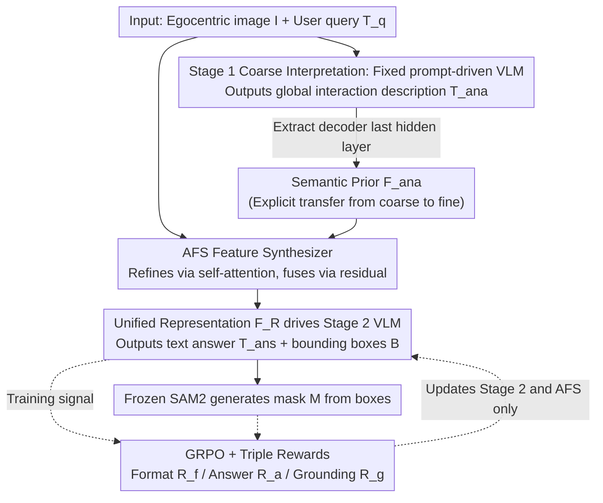

# EARL: Towards a Unified Analysis-Guided Reinforcement Learning Framework for Egocentric Interaction Reasoning and Pixel Grounding

**Conference**: ICML 2026  
**arXiv**: [2605.14742](https://arxiv.org/abs/2605.14742)  
**Code**: https://github.com/yuggiehk/EARL  
**Area**: Egocentric Vision / MLLM / Pixel-level Grounding / Reinforcement Learning (GRPO)  
**Keywords**: Ego-IRG, coarse-to-fine, Analysis-guided Feature Synthesizer, multi-faceted reward, SAM2

## TL;DR
EARL utilizes a "coarse-grained interpretation, fine-grained response" two-stage MLLM framework to unify egocentric interaction tasks (description, QA, and pixel masking) into a single pipeline. The first stage generates a global description and uses the final hidden state as a semantic prior. This prior is injected into the second stage through a new Analysis-guided Feature Synthesizer (AFS). The system is jointly trained using GRPO with a triple reward system (format/answer/grounding accuracy), outperforming Seg-Zero by 8.37% cIoU on Ego-IRGBench.

## Background & Motivation

**Background**: Research in egocentric vision (First-Person View / FPV) has surged due to the popularity of head-mounted devices (GoPro, Aria, etc.). Current mainstream approaches typically treat sub-tasks like action recognition, image captioning, and human-object interaction detection as **independent** tasks, or use MLLMs end-to-end for Ego-IRG (Interaction Reasoning and Grounding), which requires outputting (i) a global interaction analysis, (ii) an answer to a query, and (iii) pixel masks for relevant entities.

**Limitations of Prior Work**: (1) General-purpose MLLMs (e.g., Qwen2.5-VL, InternVL3) struggle with egocentric data, with cIoU stalling in the 20-30% range due to a lack of understanding of "hand-object" geometric constraints. (2) Specialized Ego-IRG methods like ANNEXE generate good analysis text (CIDEr 1.49) but still only achieve 36% cIoU in grounding. (3) RL-based models like Seg-Zero/Seg-R1 reach ~57% in general reasoning segmentation but lack the "interaction context" priors specific to egocentric tasks.

**Key Challenge**: The information flow between the interpretation (understanding) and response (answer + grounding) stages is **disconnected**. The former may understand that "a hand is holding a cup," but the latter restarts image processing from scratch for the query. Simply cascading the stages introduces the "noise prior" problem: not all features from the analysis stage are useful, and blind fusion can hinder grounding performance.

**Goal**: Explicitly transmit semantic information from coarse analysis to the fine-grained response stage, design a fusion module capable of selective prior utilization, and jointly optimize heterogeneous targets (textual correctness and box accuracy) using RL.

**Key Insight**: The authors observe that the last hidden embedding of the VLM decoder during the analysis stage serves as a natural "interaction semantic prior" (global interaction descriptor $\mathbf{F}_{ana}$). Designing a "select-then-fuse" module can prevent noise contamination.

**Core Idea**: A coarse-to-fine two-stage approach + AFS (refining analysis priors via self-attention before merging with main features) + GRPO multi-faceted rewards to unify text, box, and mask outputs.

## Method

### Overall Architecture
Input: An egocentric image $\mathcal{I}$ and a user query $T_q$. The pipeline consists of two stages:

- **Stage 1 (coarse-grained interpretation)**: Driven by a fixed prompt $T_a$ = "Please analyze the interactions of hands and objects in detail," the VLM decoder $\mathcal{D}_{vlm}$ outputs a global description $T_{ana}$. A **key byproduct** is the last hidden layer state, used as a global descriptor $\mathbf{F}_{ana}$. This stage is trained via standard cross-entropy loss.
- **Stage 2 (fine-grained response)**: Another VLM decoder $\mathcal{D}_{vlm}^{\prime}$ (Qwen2.5VL-7B) provides a text answer $T_{ans}$ and bounding boxes $\mathcal{B}$ for the query. The boxes are fed into a frozen SAM2 to obtain final masks $\mathcal{M}$. $\mathbf{F}_{ana}$ is injected into the main features via AFS between the stages. This stage is trained using GRPO with a triple-reward system.

### Key Designs

**1. Coarse-to-fine Stages + Explicit Semantic Transfer: Ensuring Stage 2 understands the image from the start**
Naive two-stage cascades only concatenate the Stage 1 text $T_{ana}$ into the Stage 2 prompt. Much information is lost during this "understanding $\rightarrow$ response" text compression. EARL instead extracts the last hidden state of $\mathcal{D}_{vlm}$ as a global interaction descriptor $\mathbf{F}_{ana}\in\mathbb{R}^{bs\times dim_i}$. Stage 2 feeds this alongside query encoding $\mathcal{E}_t^{\prime}(T_q)$ and visual encoding $\mathcal{E}_v(\mathcal{I})$ into the AFS to obtain a unified representation $\mathbf{F}_R=\mathcal{F}_s(\mathcal{E}_v(\mathcal{I}),\mathcal{E}_t^{\prime}(T_q),\mathbf{F}_{ana})$. Using hidden states instead of text as a prior offers higher information density and natural alignment with the feature space of the second stage, proving much more effective than text-based prompts.

**2. Analysis-guided Feature Synthesizer (AFS): Select-then-fuse to block "noise priors"**
Directly concatenating $\mathbf{F}_{ana}$ to main features $\mathbf{F}_{emb}$ can introduce useless dimensions that degrade grounding. AFS first re-weights the prior: an MLP $\phi_m$ reduces $\mathbf{F}_{ana}$ to $dim$ dimensions and applies LayerNorm. It is then reshaped to $bs\times h\times w$ ($h=w=\sqrt{dim}$) for convolution-based generation of $\mathcal{Q}, \mathcal{K}, \mathcal{V}$. Self-attention $\mathbf{F}=\text{softmax}(\mathcal{Q}\mathcal{K}^\top/\sqrt{dim})\mathcal{V}$ is performed to re-weight tokens. Finally, an MLP $\phi_m^{\prime}$ projects it back to the main feature dimension for residual addition: $\mathbf{F}_{out}=\mathbf{F}_{emb}+\phi_m^{\prime}(\mathbf{F})$. This self-attention acts as a gate that prioritizes important semantic dimensions while suppressing noise.

**3. GRPO + Triple Rewards: Optimizing text, box, and mask structures in a single output**
Since text correctness is a semantic goal and box accuracy is a geometric goal, joint optimization via SFT is difficult, and DPO requires paired samples. EARL uses Group Relative Policy Optimization (GRPO) with three weighted rewards: format reward $\mathcal{R}_f$ (checks template compliance like `<answer>`/`<box>`), answer reward $\mathcal{R}_a$ (semantic correlation with GT), and grounding reward $\mathcal{R}_g$ (IoU between the SAM2-generated mask and GT mask). GRPO uses the average reward of $K$ rollouts within a group as a baseline, avoiding the need for a critic. During training, the visual/text encoders and SAM2 are frozen; only $\mathcal{D}_{vlm}^{\prime}$ and AFS are updated.

### Loss & Training
- Stage 1: Cross-entropy loss $\mathcal{L}_{des}$ supervising $T_{ana}$.
- Stage 2: GRPO optimizes expected reward $\mathbb{E}[\mathcal{R}_f+\mathcal{R}_a+\mathcal{R}_g]$ with a K-rollout group baseline. Backbone: Qwen2.5VL-7B; mask generator: SAM2.

## Key Experimental Results

### Main Results

Tested on Ego-IRGBench test set (metrics: Analysis M/CIDEr, Answer M/CIDEr, Grounding cIoU):

| Method | Type | Analysis CIDEr | Answer CIDEr | cIoU |
| :--- | :--- | :--- | :--- | :--- |
| Qwen2.5VL-7B | General | 0.119 | 2.477 | 23.71 |
| InternVL2.5-7B | General | 0.044 | 1.533 | 27.21 |
| ANNEXE | Ego-Specific | 1.494 | 2.590 | 36.02 |
| Sa2VA-8B | Grounding-Specific | 0.115 | 2.656 | 32.69 |
| Seg-R1-7B | RL Grounding | 0.289 | 2.483 | 46.10 |
| Seg-Zero | RL Grounding | 0.049 | 2.380 | 57.11 |
| **EARL** | Ego + RL | **1.522** | **6.682** | **65.48** |
| vs. Prev. SOTA | | +0.028 | +1.682 | **+8.37** |

OOD Testing (EgoHOS dataset, direct cross-dataset evaluation):

| Method | Total cIoU | Left Hand | Right Hand | Two-hand Objects |
| :--- | :--- | :--- | :--- | :--- |
| LISA | 22.46 | 28.93 | 33.06 | 18.10 |
| Sa2VA-8B | 37.63 | 48.56 | 45.82 | 37.04 |
| **EARL** | (See Paper) | - | - | - |

### Ablation Study

Ablations targeted AFS and reward designs (details in Paper Sec. 4.3). Inferred impacts:

| Configuration | Answer CIDEr | cIoU | Note |
| :--- | :--- | :--- | :--- |
| Qwen2.5VL-7B baseline | 2.477 | 23.71 | No coarse analysis |
| ANNEXE (No AFS+GRPO) | 2.590 | 36.02 | Cascade only, no hidden injection |
| EARL (full) | 6.682 | 65.48 | Full methodology |

### Key Findings
- **Answer CIDEr surged by 1.68 points**: An unexpected benefit showing that explicit analysis hidden injection improves textual answer accuracy alongside grounding.
- **+8.37 pp Gain in cIoU**: While Seg-Zero reaches 57% on general images, EARL's ego-analysis prior pushes this to 65%, validating the "understand then ground" philosophy.
- **Robust OOD Performance**: Indicates that AFS learns universal egocentric interaction knowledge rather than just overfitting Ego-IRGBench.
- Analysis quality in Stage 1 is similar to Sa2VA, implying that gains come from "explicit feature transmission" rather than just better initial analysis.

## Highlights & Insights
- **Using VLM decoder hidden states as explicit semantic priors is a practical technique**: Unlike text-based cascades (lossy) or shared parameters (tightly coupled), EARL finds a balanced middle ground applicable to any "understand then operate" MLLM task.
- **The "Self-attention Refine then Residual Fuse" template**: Directly concatenating features introduces noise; AFS's lightweight self-attention gating before residual injection is a simple yet reusable design.
- **GRPO for Heterogeneous Rewards**: Combining normalized format, semantic, and geometric rewards into a group baseline training setup avoids the complexity of training a critic.
- The improved OOD performance suggests the architecture learns transferable "egocentric interaction geometry," valuable for robot manipulation and AR systems.

## Limitations & Future Work
- **Analysis CIDEr vs. ANNEXE (-0.021)**: GRPO optimization of Stage 2 may slightly inhibit the diversity of Stage 1 analysis.
- **Dependency on SAM2**: If SAM2 fails (e.g., low light, motion blur), reward signals become noisy; EARL currently lacks an independent mask head.
- **Inference Latency**: Two-stage serial processing doubles latency, requiring distillation for real-time application in AR/robotics.
- **Future Directions**: (i) Using Stage 1 boxes for semi-supervised Stage 2 startup; (ii) parameter sharing via LoRA to reduce overhead; (iii) replacing SAM2 with a trainable lightweight mask head for end-to-end training.

## Related Work & Insights
- **vs. ANNEXE**: ANNEXE's text-only cascade limits grounding (36%); EARL's feature injection + GRPO hits 65%.
- **vs. Seg-Zero / Seg-R1**: General RL segmentation lacks ego-specific "hand-object-action" priors; EARL's +8.37 cIoU gain proves domain priors are critical.
- **vs. Sa2VA / LISA**: These focus on referring image segmentation but lack interaction modeling, resulting in cIoU below 33%. EARL demonstrates that for egocentric tasks, understanding must precede segmentation.

## Rating
- Novelty: ⭐⭐⭐⭐ (AFS + hidden prior is an elegant engineering combination)
- Experimental Thoroughness: ⭐⭐⭐⭐⭐ (Broad coverage of in-domain and OOD tests against 15+ baselines)
- Writing Quality: ⭐⭐⭐⭐ (Clear formulas and architecture diagrams)
- Value: ⭐⭐⭐⭐ (Provides a reusable template for MLLM tasks requiring sequential understanding and action)

<!-- RELATED:START -->

## Related Papers

- [\[CVPR 2026\] ADSeeker: A Knowledge-Grounded Reasoning Framework for Industry Anomaly Detection and Reasoning](../../CVPR2026/object_detection/adseeker_a_knowledge-grounded_reasoning_framework_for_industry_anomaly_detection.md)
- [\[AAAI 2026\] Connecting the Dots: Training-Free Visual Grounding via Agentic Reasoning](../../AAAI2026/object_detection/connecting_the_dots_training-free_visual_grounding_via_agent.md)
- [\[ICML 2025\] Outlier Gradient Analysis: Efficiently Identifying Detrimental Training Samples for Deep Learning Models](../../ICML2025/object_detection/outlier_gradient_analysis_efficiently_identifying_detrimental_training_samples_f.md)
- [\[CVPR 2026\] Dual-Prototype-Guided Multi-task Learning for Unsupervised Anomaly Detection and Classification](../../CVPR2026/object_detection/dual-prototype-guided_multi-task_learning_for_unsupervised_anomaly_detection_and.md)
- [\[ECCV 2024\] Nonverbal Interaction Detection](../../ECCV2024/object_detection/nonverbal_interaction_detection.md)

<!-- RELATED:END -->
