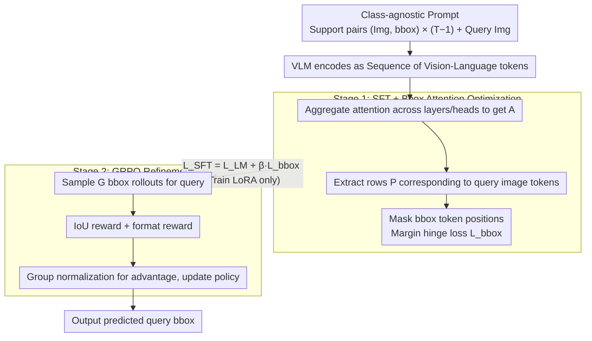

# FOCUS: Forcing In-Context Object Localization through Visual Support Constraints and Policy Optimization

**Conference**: ICML 2026  
**arXiv**: [2605.31145](https://arxiv.org/abs/2605.31145)  
**Code**: To be confirmed  
**Area**: Object Detection / Multimodal VLM / In-Context Learning  
**Keywords**: In-Context Object Localization, Visual Support Constraints, Attention Optimization, GRPO, Class-agnostic  

## TL;DR
FOCUS achieves true in-context object localization based on visual support examples rather than semantic priors through a two-stage training process involving "complete removal of category names + attention mask optimization + GRPO IoU reward." The 7B parameter model outperforms 72B models, proving that task-aligned inductive bias is more critical than pure scaling.

## Background & Motivation

**Background**: In-context Object Localization (ICOL) enables a model to locate the same object in a query image given only 1-K support examples (with bboxes), without additional training or a fixed category vocabulary. This is crucial for user-driven applications like personalized visual search, image editing, and interactive tracking.

**Limitations of Prior Work**: (1) Current VLMs rely heavily on **category name bias** in ICOL: when category words are present in the query, models skip the visual support and locate objects based on semantic priors, leading to errors with multiple instances of the same class. (2) While IPLoc attempted to mitigate category dependence using pseudo-labels, it still uses ground-truth category names during inference, causing the bias to return due to train-test mismatch. (3) Even with pseudo-label training, models still **ignore fine-grained cues** such as bbox geometry and spatial relative positioning, relying instead on coarse visual similarity or residual category correlations.

**Key Challenge**: To achieve true instance-specific localization (distinguishing multiple instances of the same class), the model must be forced to use the geometry of the visual support rather than semantic priors. However, current training objectives only optimize final bbox accuracy without explicitly constraining attention allocation—the model's path of least resistance is to "identify the category and then randomly select an instance."

**Goal**: (1) Completely remove category names to make visual support the sole indicator of the target. (2) Use attention loss to force query tokens to focus on query images and bbox tokens. (3) Refine bbox alignment using GRPO + IoU reward. (4) Demonstrate that task-aligned objectives > scale by having a 7B model outperform a 72B model.

**Key Insight**: Empirical findings (Section 3 of the paper) show that vanilla VLMs allocate significant attention to category tokens, while attention to query images and bbox tokens is insufficient. Even when categories are removed (vanilla wo/c), attention remains diffuse and not concentrated on the regions corresponding to the support. This indicates the issue is not a lack of information but an attention mismatch—direct supervision of attention is more effective than other architectural changes.

**Core Idea**: A two-stage approach—Stage 1 SFT with bbox attention optimization (forcing high attention from query tokens to bbox tokens); Stage 2 refinement via GRPO with IoU rewards (directly minimizing localization error).

## Method

### Overall Architecture

**Prompt Design**: Completely devoid of category words, containing only a task description + interleaved (image, bbox) pairs, with the final image being the query. The model outputs `<answer>[xmin,ymin,xmax,ymax]</answer>`.

Input sequence: $\mathcal{C} = \langle \text{prompt}, (I_1, b_1), \dots, (I_{T-1}, b_{T-1}), I_T \rangle$ — note the absence of category information.

**Two Training Stages**:
1. Stage 1: SFT + bbox attention mask loss (forcing query tokens to give high attention to bbox tokens), training LoRA weights only.
2. Stage 2: Refinement via GRPO + IoU reward.

### Key Designs

**1. Complete Category Name Removal in Prompts: Eliminating Semantic Shortcuts**

VLMs in ICOL suffer from heavy category name bias. If words like "dog" or "bowl" appear in the query, the model skips visual support and uses semantic priors, failing on multi-instance scenarios. While IPLoc used pseudo-labels, its inference still used real category names, leading to bias re-emergence. FOCUS ensures the prompt only describes the task ("locate the same object across frames") and output format, containing no category names. In the sequence $\mathcal{C} = \langle \text{prompt}, (I_1, b_1), \dots, (I_{T-1}, b_{T-1}), I_T \rangle$, support images have bboxes while the query image does not. This consistency between training and testing makes visual support the only indicator for the target, fundamentally breaking semantic shortcuts.

**2. Bounding Box Attention Optimization: Direct Supervision of Query Tokens**

Evidence from Section 3 shows that even without category words, vanilla model attention remains diffuse. To address this mismatch, FOCUS explicitly supervises the attention distribution. Attention across all layers and heads is aggregated into $A = \tfrac{1}{LH}\sum_{\ell, h} A^{(\ell, h)}$. Rows $P \in \mathbb{R}^{N \times T}$ corresponding to query image tokens are extracted, and a binary mask $m$ marks support bbox token positions. Instead of simply increasing absolute attention, a **margin hinge loss** is used: it calculates the average attention of query tokens on bbox tokens ($p^+_i$) versus non-bbox tokens ($p^-_i$). The preference gap is $\Delta_i = p^+_i - p^-_i$, and the loss is $\mathcal{L}_{\text{bbox}} = \tfrac{1}{N}\sum_i \max(0, \mu - \Delta_i)^2$, forcing bbox tokens to have a margin $\mu$ higher than unrelated tokens. Combined with the language modeling loss, the SFT objective is $\mathcal{L}_{\text{SFT}} = \mathcal{L}_{\text{LM}} + \beta\,\mathcal{L}_{\text{bbox}}$. This is an attention engineering feat that forced the model to "see" the support geometry, contributing +4.5 AP in ablations.

**3. GRPO + IoU Reward Refinement: Aligning with Localization Error via RL**

Token-level cross-entropy in SFT is only indirectly related to bbox geometric alignment. FOCUS follows SFT with Group Relative Policy Optimization (GRPO). For each prompt, $G$ bbox rollouts are sampled. The reward consists of two parts: an IoU reward $r_{\text{iou}}=\text{IoU}(b_{\text{pred}}, b_{\text{qry}})$ to directly align with the query ground truth, and a format reward to ensure the output matches the `<answer>[xmin,ymin,xmax,ymax]</answer>` syntax. Advantages $A_i$ are computed via group-relative normalization of rewards without a critic. Since the RL objective perfectly matches the task goal (IoU), and GRPO is more stable for structured continuous outputs than PPO, this adds another +3.3 points over SFT.

## Key Experimental Results

### Main Results: Cross-Benchmark vs. Large Models

| Model | Parameters | RefCOCO+ AP@50 | RefCOCO++ | Visual-Genome AP |
|------|------|---------|---------|------|
| IPLoc (Qwen2-VL-7B) | 7B | 38.4 | 32.7 | 41.2 |
| Qwen2-VL-72B | 72B | 42.1 | 36.5 | 45.6 |
| LLaVA-OV-72B | 72B | 41.7 | 36.0 | 44.9 |
| **FOCUS (Qwen2-VL-7B)** | **7B** | **48.6** | **43.2** | **52.7** |

The 7B FOCUS model significantly outperforms 72B general VLMs, demonstrating that a task-aligned objective is more effective than 10× scaling.

### Ablation Study (RefCOCO+ AP@50)

| Configuration | AP@50 |
|------|------|
| Full FOCUS | 48.6 |
| − GRPO (Stage 1 SFT only) | 45.3 |
| − Attention Mask Loss | 40.8 |
| − Category Removal (Keep category) | 39.5 |
| Vanilla SFT baseline | 38.4 |

Attention mask loss is the largest single contributor (+4.5 AP). Category removal and GRPO each add 1-3 points, working synergistically.

### Key Findings
- **Task-aligned objective > Pure scaling**: 7B FOCUS beats 72B general VLMs by 10+ points.
- **Attention mask loss is the critical component**: +4.5 AP improvement suggests the primary issue was attention mismatch.
- **Complete removal vs. Pseudo-labeling**: Complete removal of category names is superior, highlighting the importance of train-test consistency.
- **GRPO refinement adds 3.3 points post-SFT**: Directly optimizing IoU through RL bridges the gap between SFT loss and geometric accuracy.

## Highlights & Insights
- **Demonstrative case for "Inductive Bias > Scale"**: This 7B vs. 72B victory serves as a powerful example for tasks requiring specific inductive biases.
- **Radical Category Removal**: Unlike previous works that merely "weakened" dependency, this work cuts it entirely; such "radical ablation" often yields surprisingly good results.
- **Attention Loss as a General Tool**: Supervising attention to direct the model's focus is a technique that can be extended to various tasks like VQA or image-text matching.
- **GRPO Stability for Structured Output**: GRPO’s stability with continuous bbox coordinates in small batches provides a solid training paradigm for VLM localization/detection RL.

## Limitations & Future Work
- Complete removal of category names might cause the model to lose important priors when the category itself is key to discrimination.
- The attention mask is manually designed based on bbox token positions, which might be imprecise for complex layouts.
- Evaluation is limited to single-object localization; multi-object or panoptic segmentation remains untested.
- Testing in novel domains (e.g., medical or satellite imagery) is needed to verify if visual support remains equally effective.

## Related Work & Insights
- **vs. IPLoc (Doveh 2025)**: IPLoc suffers from train-test mismatch by using categories during inference; FOCUS maintains consistency.
- **vs. GLIP / GroundingDINO**: These are text-conditioned; FOCUS uses pure visual conditioning, potentially offering stronger open-set capabilities.
- **vs. Few-shot Detection**: These often involve architectural changes; FOCUS achieves this via in-context learning without modifying the architecture during inference.

## Rating
- Novelty: ⭐⭐⭐⭐ 
- Experimental Thoroughness: ⭐⭐⭐⭐⭐ 
- Writing Quality: ⭐⭐⭐⭐⭐ 
- Value: ⭐⭐⭐⭐ 

<!-- RELATED:START -->

<!-- RELATED:END -->

## Related Papers

- [\[ICLR 2026\] Long-Context Generalization with Sparse Attention](../../ICLR2026/object_detection/long-context_generalization_with_sparse_attention.md)
- [\[CVPR 2026\] Towards Persistence: Learning Topological Constraints for Event-based Small Object Detection](../../CVPR2026/object_detection/towards_persistence_learning_topological_constraints_for_event-based_small_objec.md)
- [\[CVPR 2026\] Foundation Model Priors Enhance Object Focus in Feature Space for Source-Free Object Detection](../../CVPR2026/object_detection/foundation_model_priors_enhance_object_focus_in_feature_space_for_source-free_ob.md)
- [\[CVPR 2026\] Reasoning-Driven Anomaly Detection and Localization with Image-Level Supervision](../../CVPR2026/object_detection/reasoning-driven_anomaly_detection_and_localization_with_image-level_supervision.md)
- [\[ICCV 2025\] Visual-RFT: Visual Reinforcement Fine-Tuning](../../ICCV2025/object_detection/visual-rft_visual_reinforcement_fine-tuning.md)

<!-- RELATED:END -->
