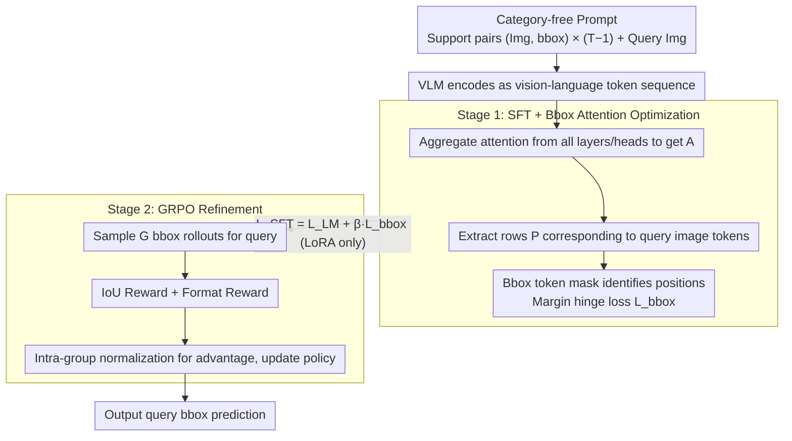

# FOCUS: Forcing In-Context Object Localization through Visual Support Constraints and Policy Optimization

**Conference**: ICML 2026  
**arXiv**: [2605.31145](https://arxiv.org/abs/2605.31145)  
**Code**: To be confirmed  
**Area**: Object Detection / Multimodal VLM / In-Context Learning  
**Keywords**: In-context Object Localization, Visual Support Constraints, Attention Optimization, GRPO, Category-agnostic  

## TL;DR
FOCUS uses a two-stage training approach—"complete removal of category names + attention mask optimization + GRPO IoU reward"—to force VLMs to perform in-context object localization based on visual support examples rather than semantic priors. The 7B parameter model outperforms 72B models, proving that task-aligned inductive bias is more important than pure scaling.

## Background & Motivation

**Background**: In-context Object Localization (ICOL) enables a model to locate the same object in a query image by looking at 1-K support examples (with bboxes) without requiring training or a category vocabulary. This is crucial for user-driven applications like personalized visual search, image editing, and interactive tracking.

**Limitations of Prior Work**: (1) Current VLMs rely heavily on **category name bias** in ICOL. When a query contains category words, the model skips visual supports and locates based on semantic priors, leading to errors when multiple instances of the same category are present. (2) While IPLoc uses pseudo-label training to reduce category dependence, it still uses ground-truth category names during inference; this train-test mismatch causes the bias to return. (3) Even with pseudo-label training, models still **ignore fine-grained clues** like bbox geometry and spatial relative positions, relying instead on coarse visual similarity or residual category correlations.

**Key Challenge**: To achieve true instance-specific localization (distinguishing between multiple instances of the same category), the model must be forced to use the geometry of the visual support rather than semantic priors. However, current training objectives only optimize final bbox accuracy without explicit constraints on attention allocation—the model's "path of least resistance" is to identify the category and then randomly select an instance.

**Goal**: (1) Completely remove category names to make visual support the sole target indicator; (2) Use attention loss to force query tokens to attend to query images and bbox tokens; (3) Refine bbox alignment using GRPO + IoU reward; (4) Demonstrate that a 7B model surpassing a 72B model proves that task-aligned objective > scale.

**Key Insight**: Empirical findings (Section §3) show that vanilla VLMs allocate significant attention to category tokens, while attention to query images and bbox tokens is insufficient. Even when categories are removed (vanilla wo/c), attention remains diffuse and is not concentrated on the support-corresponding regions. This indicates the problem is not a lack of information but an attention mismatch—direct supervision of attention is more effective than other modifications.

**Core Idea**: A two-stage process—Stage 1: SFT with bbox attention optimization (forcing query tokens to give high attention to bbox tokens); Stage 2: GRPO with IoU reward fine-tuning (directly minimizing localization error).

## Method

### Overall Architecture

**Prompt Design**: Completely free of category words, containing only a task description + interleaved (image, bbox) pairs, with the final image being the query. The model outputs `<answer>[xmin,ymin,xmax,ymax]</answer>`.

Input Sequence: $\mathcal{C} = \langle \text{prompt}, (I_1, b_1), \dots, (I_{T-1}, b_{T-1}), I_T \rangle$ — Note the absence of category information.

**Two-stage Training**:
1. Stage 1: SFT + bbox attention mask loss (forcing query tokens to allocate high attention to bbox tokens), training only LoRA weights.
2. Stage 2: GRPO + IoU reward fine-tuning.

### Key Designs

**1. Category-free Prompting: Cutting off the semantic shortcut at the root**

VLMs rely heavily on category name bias in ICOL. As long as words like "dog" or "bowl" appear in the query, the model skips visual support and locates targets based on semantic priors, failing when multiple same-category instances exist. While works like IPLoc use pseudo-labels to weaken this dependency, they reintroduce ground-truth category names at inference, allowing the bias to return due to train-test mismatch. FOCUS removes all category words from the prompt, which only describes the task ("locate the same object across frames") and the output format. In the sequence $\mathcal{C} = \langle \text{prompt}, (I_1, b_1), \dots, (I_{T-1}, b_{T-1}), I_T \rangle$, support images are paired with bboxes, and query images are left for prediction. Both training and testing are category-free, making visual support the sole indicator and fundamentally breaking the semantic shortcut.

**2. Bounding Box Attention Optimization: Explicitly supervising where query tokens should look**

Evidence in Section §3 shows that even without category words, vanilla model attention remains diffuse and does not concentrate on support regions. The issue is attention mismatch, not lack of information. FOCUS explicitly supervises the attention distribution: first, attention from all layers and heads is aggregated as $A = \tfrac{1}{LH}\sum_{\ell, h} A^{(\ell, h)}$. The rows $P \in \mathbb{R}^{N \times T}$ corresponding to query image tokens are extracted, and a binary mask $m$ marks the positions of support bbox tokens. Instead of blindly increasing absolute attention, a **margin hinge loss** is used: the average attention of each query token on bbox tokens $p^+_i$ and non-bbox tokens $p^-_i$ is calculated to find the preference gap $\Delta_i = p^+_i - p^-_i$. The loss $\mathcal{L}_{\text{bbox}} = \tfrac{1}{N}\sum_i \max(0, \mu - \Delta_i)^2$ then forces bbox tokens to have attention at least a margin $\mu$ higher than irrelevant tokens. This is combined with the language modeling loss for SFT: $\mathcal{L}_{\text{SFT}} = \mathcal{L}_{\text{LM}} + \beta\,\mathcal{L}_{\text{bbox}}$ (updating only LoRA weights). This is an attention engineering feat rather than an architectural change, yet it is the largest contributor to performance (+4.5 AP), forcing the model to truly "see the support geometry" rather than shallow category patterns.

**3. GRPO + IoU Reward Refinement: Direct alignment of localization error with RL**

Token-level cross-entropy in SFT is only indirectly related to bbox geometric alignment; the model's most efficient solution may not be geometrically optimal. After SFT convergence, FOCUS applies GRPO (Group Relative Policy Optimization): $G$ bbox rollouts are sampled for each prompt. The reward consists of two parts—an IoU reward $r_{\text{iou}}=\text{IoU}(b_{\text{pred}}, b_{\text{qry}})$ to directly align with query ground truth, and a format reward to ensure the output matches the `<answer>[xmin,ymin,xmax,ymax]</answer>` syntax. Advantages $A_i$ are obtained through intra-group mean/variance normalization, eliminating the need for a critic. The RL objective matches the task objective (IoU), and GRPO is more stable than PPO for structured continuous outputs like bbox coordinates under small batch sizes. Adding GRPO after SFT provides an additional 3.3-point gain, filling the gap between SFT loss and direct IoU alignment.

## Key Experimental Results

### Main Results: Cross-benchmark vs. Large Models

| Model | Parameters | RefCOCO+ AP@50 | RefCOCO++ | Visual-Genome AP |
|------|------|---------|---------|------|
| IPLoc (Qwen2-VL-7B) | 7B | 38.4 | 32.7 | 41.2 |
| Qwen2-VL-72B | 72B | 42.1 | 36.5 | 45.6 |
| LLaVA-OV-72B | 72B | 41.7 | 36.0 | 44.9 |
| **FOCUS (Qwen2-VL-7B)** | **7B** | **48.6** | **43.2** | **52.7** |

The 7B FOCUS significantly outperforms 72B general VLMs—demonstrating that a task-aligned objective is more effective than 10× scaling.

### Ablation Study (RefCOCO+ AP@50)

| Configuration | AP@50 |
|------|------|
| Full FOCUS | 48.6 |
| − GRPO (Stage 1 SFT only) | 45.3 |
| − Attention Mask Loss | 40.8 |
| − Category-free (Category included) | 39.5 |
| Vanilla SFT baseline | 38.4 |

Attention mask loss is the largest single contributor (+4.5); category-free prompting and GRPO each add 1-3 points; the three components are synergistic.

### Key Findings
- **Task-aligned objective > Pure scaling**: 7B + FOCUS outperforms 72B general VLMs by 10+ points.
- **Attention mask loss is a critical component**: +4.5 AP influence, larger than GRPO alone (+3.3); confirms the issue is primary attention mismatch.
- **Complete category removal vs. Pseudo-label**: Complete removal outperforms the partial (pseudo-label) approach; train-test consistency is key.
- **GRPO refinement adds 3.3 points after SFT**: Directly optimizing IoU with RL addresses the indirect alignment of SFT loss.

## Highlights & Insights
- **Demonstrative case for "Inductive Bias > Scale"**: 7B beating 72B is a powerful example—encouraging for work focusing on specific inductive biases.
- **Thoroughness of Category Removal**: Unlike previous "weakening" of category dependency, this work cuts it entirely; such "radical ablation" often yields unexpectedly strong results.
- **Attention Loss as a General Tool**: Treating attention as a supervisable object to structurally guide model focus can be generalized to any task with clear "where to look" requirements (VQA, image-text matching, etc.).
- **GRPO Stability for Structured Output**: For continuous outputs like bbox coordinates, GRPO is more stable than PPO in small-batch settings, providing a training paradigm useful for all VLM localization/detection RL.

## Limitations & Future Work
- Complete category removal may cause the model to lose important priors in scenarios where category is key to discrimination—a "task-aware" use of categories might be more balanced.
- The attention mask is manually designed based on bbox token positions; it may be inaccurate for long prompts or complex layouts.
- Evaluated only on single-object localization; extensions to multi-object or panoptic segmentation were not tested.
- Validated only on RefCOCO series and VG; the effectiveness of visual support in novel domains (medical, satellite) is untested.
- Constraints of the 7B model size; pushing further may require larger bases or more refined attention supervision.

## Related Work & Insights
- **vs. IPLoc (Doveh 2025)**: IPLoc uses pseudo-labels but ground-truth categories at inference, causing train-test mismatch; FOCUS consistently removes categories.
- **vs. GLIP / GroundingDINO**: These are text-conditioned grounding models; FOCUS uses pure visual conditioning, offering stronger open-set capabilities.
- **vs. Few-shot Detection**: Those involve episodic/meta-learning or architectural changes; FOCUS achieves this via in-context learning with no architectural changes.
- **Insight**: All "where should the VLM look" problems should consider explicit attention supervision; the "complete removal of shortcuts" strategy (vs. partial weakening) is often more effective in de-biasing.

## Rating
- Novelty: ⭐⭐⭐⭐ The combination of Attention mask + GRPO + Category-free is new, though attention supervision has precedents.
- Experimental Thoroughness: ⭐⭐⭐⭐⭐ Comparison across multiple benchmarks and VLM scales + detailed ablation + attention visualization.
- Writing Quality: ⭐⭐⭐⭐⭐ Figure 1/2 attention visualizations provide decisive evidence; Section §3 failure analysis is solid.
- Value: ⭐⭐⭐⭐ ICOL is a practical VLM capability (personal search, image editing); 7B beating 72B is deployment-friendly.

<!-- RELATED:START -->

## Related Papers

- [\[ICLR 2026\] Long-Context Generalization with Sparse Attention](../../ICLR2026/object_detection/long-context_generalization_with_sparse_attention.md)
- [\[CVPR 2026\] Towards Persistence: Learning Topological Constraints for Event-based Small Object Detection](../../CVPR2026/object_detection/towards_persistence_learning_topological_constraints_for_event-based_small_objec.md)
- [\[CVPR 2026\] Foundation Model Priors Enhance Object Focus in Feature Space for Source-Free Object Detection](../../CVPR2026/object_detection/foundation_model_priors_enhance_object_focus_in_feature_space_for_source-free_ob.md)
- [\[CVPR 2026\] Reasoning-Driven Anomaly Detection and Localization with Image-Level Supervision](../../CVPR2026/object_detection/reasoning-driven_anomaly_detection_and_localization_with_image-level_supervision.md)
- [\[CVPR 2026\] PALM: Progress-Aware Policy Learning via Affordance Reasoning for Long-Horizon Robotic Manipulation](../../CVPR2026/object_detection/palm_progress-aware_policy_learning_via_affordance_reasoning_for_long-horizon_ro.md)

<!-- RELATED:END -->
