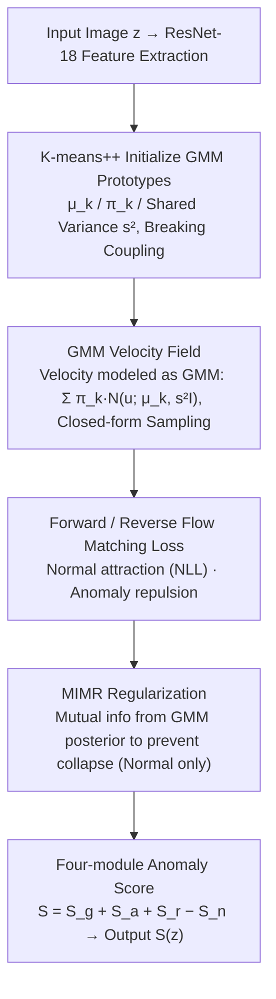

# Mixture Prototype Flow Matching for Open-Set Supervised Anomaly Detection

**Conference**: ICML 2026  
**arXiv**: [2605.02438](https://arxiv.org/abs/2605.02438)  
**Code**: https://github.com/fuyunwang/MPFM-OSAD  
**Area**: Anomaly Detection / Flow Matching / Prototype Learning  
**Keywords**: Open-Set Supervised Anomaly Detection, Flow Matching, Gaussian Mixture Prototypes, Mutual Information Regularization, OSAD

## TL;DR
MPFM replaces the traditional "unimodal Gaussian prototypes" in OSAD with a learnable **Gaussian Mixture Model (GMM) prototype space**. It uses flow matching to directly regress a velocity field in GMM form, augmented by a mutual information maximization regularization to prevent prototype collapse. The method outperforms all SOTA methods, including DRA, AHL, and DPDL, across 9 industrial and medical AD datasets under the 10/1 anomaly sample setting.

## Background & Motivation

**Background**: Anomaly detection is categorized into three paradigms: unsupervised AD (normal samples only), few-shot AD (minimal normal samples), and supervised AD (large-scale anomaly samples). Open-Set Supervised AD (OSAD) is a compromise: during training, a small number of labeled anomalies (image-level) and a large number of normal images are provided. At test time, the model must identify both **known and unseen** anomalies. Existing OSAD methods include: (a) data augmentation + outlier exposure (DRA), (b) heterogeneous simulation (AHL), and (c) prototype learning + generative dynamics (DPDL).

**Limitations of Prior Work**: DPDL, the third category and closest to current SOTA, uses a **simple unimodal Gaussian** as the prototype distribution for normal samples and "pulls" normal features toward these prototypes via a diffusion bridge. However, normal samples in industrial scenarios are inherently **multi-modal** (diverse sub-patterns, angles, or lighting within the same category). Forcing them into a unimodal Gaussian causes rare but legitimate normal sub-patterns to be misclassified as anomalies, creating high false positives and blurred decision boundaries.

**Key Challenge**: The model must maintain a **compact** density estimation for normal samples (high recall on normal) while ensuring the boundary **extrapolates to unseen anomaly** types (high recall on unknown anomalies). A unimodal Gaussian prior directly compromises the former, while discrete multiple Gaussians lack structural correlation, causing the model to lose semantic continuity between modes.

**Goal**: (1) Replace unimodal Gaussians with a **continuous, structured** multi-modal prototype space; (2) Ensure the flow matching velocity field itself is multi-modal rather than regressing a single mean vector; (3) Prevent multiple Gaussian components from collapsing into a single mode.

**Key Insight**: Explicitly model the prototype space as a GMM and use flow matching to learn a continuous transport mapping from the normal feature distribution to this GMM. A crucial observation is that under a standard linear noise schedule, a single-step reverse transition maintains GMM closure (closure of linear-Gaussian systems), allowing for closed-form step-wise sampling without numerical integration.

**Core Idea**: **Replace the single velocity vector with a GMM-form velocity field in flow matching, propagating the multi-modal prior from the prior through the transport dynamics, and utilize mutual information maximization to spread the GMM components.**

## Method

### Overall Architecture

Input: Training set $\mathcal{Z}_{tr} = \mathcal{Z}_{tr}^{n} \cup \mathcal{Z}_{tr}^{a}$ (normal $N$ samples + anomaly $M$ samples, $N \gg M$, image-level labels only); Output: Anomaly score $S(z)$ for test sample $z \in \mathcal{Z}_{te}$.

Mechanism:
1. **Feature Extraction**: ResNet-18 backbone $f: \mathcal{Z} \to \mathbb{R}^d$ maps images to 1D features.
2. **K-means++ GMM Initialization**: Run K-means++ on $\mathcal{F}_{tr}^{n}$ to obtain $K$ cluster centers $\mu_k$, mixing weights $\pi_k = |C_k| / N$, and shared variance $s^2 = \frac{1}{dN} \sum_k \sum_{i \in C_k} \| z_0^{n,i} - \mu_k \|_2^2$. This step breaks the coupled optimization cycle between the flow network and GMM parameters.
3. **Flow Matching Training**: Under a linear noise schedule $\alpha_t = 1-t, \sigma_t = t$, the velocity is $u = \frac{z_T - z_0}{t}$. Maximize the GMM velocity field likelihood for normal samples and **reverse** minimize it for anomalies (pushing anomalous velocity away from the normal distribution).
4. **MIMR Regularization**: Maximize the mutual information between the "prototype assignment $c$" and the "flowed feature $\psi(z_0^{n,i})$" for normal samples to ensure confident assignment and balanced usage.
5. **Four-Module Score Prediction**: Global $M_g$ (GMM NLL) + Local $M_a$ (top-O patch score) + Normal $M_n$ (global pooling) + Residual $M_r$ ($(\psi(z) - \mu_{c^*})/s$ via classification head). Inference: $S(z) = S_g + S_a + S_r - S_n$.

### Key Designs

**1. GMM-form Velocity Field (Core of MPFL): Propagating Multi-modality into Transport Dynamics**

This corresponds to the "GMM Velocity Field" node. Traditional methods like DPDL model the velocity field as a unimodal conditional Gaussian $q_\theta(u | z_t) = \mathcal{N}(u; \mu_\theta(z_t), s^2 I)$, regressing only one mean vector. This forces all normal samples toward a single mode, flattening the diverse sub-patterns in industrial scenes and causing false positives. MPFM establishes a mixture conditional velocity field $q_\theta(u | z_t^{n,i}) = \sum_{k=1}^K \pi_k(z_t^{n,i}; \theta) \mathcal{N}(u; \mu_k(z_t^{n,i}; \theta), s^2 I)$, where weights $\pi_k$ and means $\mu_k$ are functions of the current feature. Training uses NLL $\mathcal{L}_{NLL} = \mathbb{E} [-\log \sum_k \pi_k \mathcal{N}(u; \mu_k, s^2 I)]$ to align the predicted velocity distribution with the GMM. A key engineering feat is closed-form reverse sampling: under a linear noise schedule, the reverse transition $q_\theta(z_{t-\Delta t}^{n,i} | z_t^{n,i})$ remains a GMM, with coefficients $c_1, c_2, c_3$ determined solely by the schedule. This allows for analytical sampling without numerical ODE solvers.

**2. Forward / Reverse Flow Matching Loss: Simultaneous Attraction and Repulsion**

Normal samples follow the standard NLL $\mathcal{L}_{flow}^{n} = \mathbb{E}[-\log q_\theta(u | z_t^{n,i})]$ to be pulled into the GMM prototype space. Anomaly samples utilize the symmetric $\mathcal{L}_{flow}^{a} = \mathbb{E}[\log q_\theta(u | z_t^{a,i})]$, maximizing the NLL to push anomalous velocities away from the normal GMM. The anomaly "ground-truth velocity" $u^{a}$ is calculated using the same linear schedule as if it were normal, forcing the model to learn the distinction. Unlike traditional OSAD using contrastive loss in the final feature space, this repulsion acts on the entire transport trajectory, providing gradient signals at every step $t \in [0, T]$.

**3. MIMR Regularization: Preventing Collapse via GMM Posteriors**

Multiple Gaussian components may collapse into a single mode without explicit constraints. MIMR leverages the GMM's inherent posterior $p(c=k | \psi(z_0^{n,i})) = \frac{\pi_k \mathcal{N}(\psi(z_0^{n,i}); \mu_k, s^2 I)}{\sum_j \pi_j \mathcal{N}(\psi(z_0^{n,i}); \mu_j, s^2 I)}$ to maximize mutual information $I(\psi(z_0^{n,i}); c) = H(c) - H(c | \psi(z_0^{n,i}))$. The loss $\mathcal{L}_{mim} = \mathbb{E}[\sum_k p(c=k|\cdot) \log p(c=k|\cdot)] - \sum_k \pi_k \log \pi_k$ minimizes conditional entropy (enforcing confident assignment) and maximizes marginal entropy (enforcing balanced usage). This requires no additional discriminators or adversarial training.

### Loss & Training

Total Loss:
$\mathcal{L} = \underbrace{\mathcal{L}_{M_a} + \mathcal{L}_{M_n} + \mathcal{L}_{M_r} + \mathcal{L}_{M_g}}_{\text{Score Modules}} + \underbrace{\mathcal{L}_{flow}^{n} + \mathcal{L}_{flow}^{a}}_{\text{Flow Matching}} + \lambda \mathcal{L}_{mim}$.

The four score modules utilize Binary Cross-Entropy (BCE) loss and are trained jointly. $\lambda$ controls MIMR intensity. During inference, $S(z) = S_g(z) + S_a(z) + S_r(z) - S_n(z)$, where $S_n$ is subtracted as it represents "normality."

## Key Experimental Results

### Main Results

AUC across 9 datasets (MVTec AD / Optical / SDD / etc.) under the 10-anomaly sample general setting.

| Dataset | DRA | AHL | DPDL | **MPFM (Ours)** |
|--------|------|------|------|------|
| MVTec AD | 0.959±0.003 | 0.970±0.002 | 0.977±0.002 | **0.982±0.003** |
| Optical | 0.965±0.006 | 0.976±0.004 | 0.983±0.005 | **0.992±0.002** |
| SDD | 0.991±0.005 | — | — | (Best, see paper) |

MPFM ranks first or tied for first on all reported datasets, gaining 0.5 points over DPDL on MVTec AD.

### Ablation Study

| Configuration | Key Metric | Description |
|------|---------|------|
| Full MPFM | Best AUC | Complete model |
| w/o GMM | Significant Drop | Validates multi-modal velocity field (reduces to DPDL) |
| w/o MIMR | Moderate Drop | Validates anti-collapse regularization |
| w/o Reverse Flow Loss $\mathcal{L}_{flow}^{a}$ | Major Drop | Anomaly repulsion at the transport level is critical |

### Key Findings

- **Multi-modal velocity field is the primary contributor**: Removing the GMM structure results in the largest performance drop, confirming that unimodal Gaussians cannot capture normal sub-pattern diversity.
- **K-means++ initialization is crucial for convergence**: Coupled optimization of the flow network and GMM parameters is difficult without a good prior.
- **MIMR vs. Distance Regularization**: MIMR manages both confident assignment and balanced usage more effectively than simple mean-distance constraints.
- **Shared variance $s^2$ is an engineering stability trick**: Sharing $s$ across components prevents variance explosion or collapse in specific components.

## Highlights & Insights

- **Priors through Dynamics**: The major difference from prior "Prototype + Bridge" methods is that MPFM propagates multi-modality through the velocity field at every step, whereas others only enforce it at the endpoint.
- **Analytical Backward Sampling**: Preserving GMM closure in the linear-Gaussian system allows for inference without numerical ODE solvers, making the multi-modal field practical for deployment.
- **Negative Flow Likelihood for Repulsion**: Repulsion is elegantly implemented within the flow matching framework without extra modules or adversarial training.
- **Subtractive Score Composition**: Using $S = S_g + S_a + S_r - S_n$ incorporates the dual perspective of "looking like an anomaly" and "not looking like normal."

## Limitations & Future Work

- **Hyperparameter $K$**: The choice of $K$ currently requires K-means++ pre-processing and is not adaptive to different categories with varying sub-pattern counts.
- **Backbone Scaling**: Experiments were limited to ResNet-18; the impact of stronger backbones like CLIP or DINOv2 remains unexplored.
- **Anomaly MIMR Constraint**: Anomalies are not explicitly constrained to be "far" from being confident in any specific prototype in the MIMR loss.
- **Pixel-level Localization**: The evaluation focuses on image-level AUC, which does not cover industrial requirements for identifying "where" the anomaly is.

## Related Work & Insights

- **vs. DPDL**: DPDL uses discrete unimodal Gaussians and simple velocity vectors; MPFM uses structured GMMs and GMM velocity fields.
- **vs. DRA / AHL**: These rely on data augmentation to cover anomaly space; MPFM focuses on how to better model the normal distribution (orthogonal approach).
- **vs. Rectified Flow**: While Rectified Flow is generative, MPFM repurposes flow matching as a density estimator for discriminative representation learning.

## Rating
- Novelty: ⭐⭐⭐⭐ The combination of GMM velocity fields, MIMR, and reverse flow loss is a novel synthesis in OSAD.
- Experimental Thoroughness: ⭐⭐⭐⭐ Comprehensive across 9 datasets, though lacking pixel-level evaluation and diverse backbones.
- Writing Quality: ⭐⭐⭐⭐ Rigorous mathematical derivation and clear motivation.
- Value: ⭐⭐⭐⭐ Provides a robust new baseline for industrial AD with a transferable "priors through dynamics" design philosophy.

<!-- RELATED:START -->

## Related Papers

- [\[CVPR 2025\] Distribution Prototype Diffusion Learning for Open-set Supervised Anomaly Detection](../../CVPR2025/object_detection/distribution_prototype_diffusion_learning_for_open-set_supervised_anomaly_detect.md)
- [\[NeurIPS 2025\] Scalable, Explainable and Provably Robust Anomaly Detection with One-Step Flow Matching](../../NeurIPS2025/object_detection/scalable_explainable_and_provably_robust_anomaly_detection_with_one-step_flow_ma.md)
- [\[CVPR 2026\] GPFlow: Gaussian Prototype Probability Flow for Unsupervised Multi-Modal Anomaly Detection](../../CVPR2026/object_detection/gpflow_gaussian_prototype_probability_flow_for_unsupervised_multi-modal_anomaly_.md)
- [\[CVPR 2026\] UniSpector: Towards Universal Open-set Defect Recognition via Spectral-Contrastive Visual Prompting](../../CVPR2026/object_detection/unispector_towards_universal_open-set_defect_recognition_via_spectral-contrastiv.md)
- [\[CVPR 2026\] Complementary Prototype Mapping for Efficient Multimodal Anomaly Detection](../../CVPR2026/object_detection/complementary_prototype_mapping_for_efficient_multimodal_anomaly_detection.md)

<!-- RELATED:END -->
