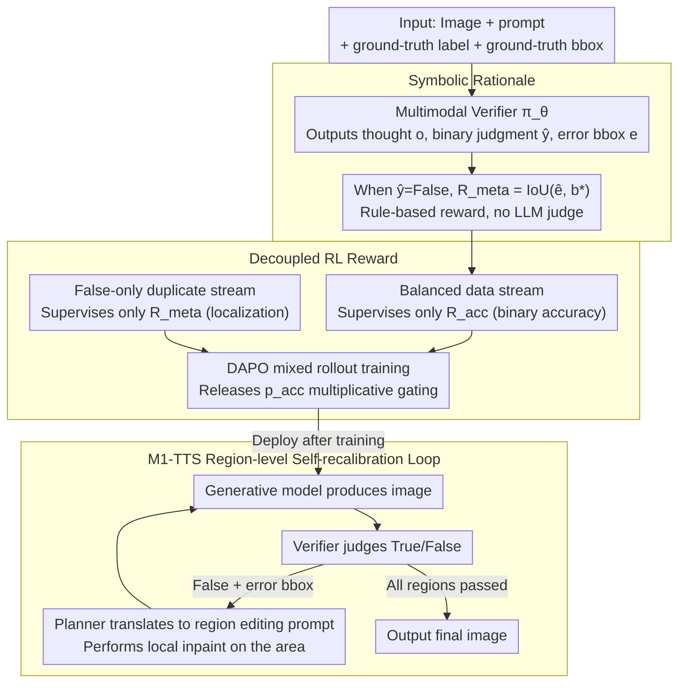

# OmniVerifier-M1: Multimodal Meta-Verifier with Explicit Structured Recalibration

**Conference**: ICML 2026  
**arXiv**: [2605.28805](https://arxiv.org/abs/2605.28805)  
**Code**: Repository link not provided in the paper (None)  
**Area**: Multimodal VLM / Visual Verification / Reinforcement Learning  
**Keywords**: Multimodal meta-verifier, Symbolic reward, Decoupled RL, Visual self-recalibration, RLVR  

## TL;DR
Aiming at the issues that multimodal visual verifiers output binary signals (True/False) that are too coarse and that textual explanations are prone to reward-hacking, this paper proposes OmniVerifier-M1. It utilizes symbolic outputs such as bounding boxes as meta-verification rationales instead of text to support rule-based rewards like IoU. Theoretically and experimentally, it proves that decoupling binary judgment and meta-verification into two independent reward streams (rather than a multiplicative joint reward) significantly improves SNR. Ultimately, the verifier is upgraded to an agentic system, M1-TTS, capable of driving region-level self-recalibration.

## Background & Motivation

**Background**: Multimodal Large Language Models (MLLMs) are becoming increasingly powerful in generation and reasoning, requiring a companion verifier to serve as a reliable source of reward or reflection signals for judging visual outcomes. Existing work roughly follows two branches: (i) traditional image reward models like RewardDance and UnifiedReward, which focus on text-to-image scoring; (ii) general visual verifiers like OmniVerifier, which use RLVR (Reinforcement Learning with Verifier Rewards) with binary judgments (True/False) as rewards for training.

**Limitations of Prior Work**: Pure binary judgment signals suffer from two major problems. First, supervision is only at the decision level, not the causal level; models can obtain full rewards by "guessing correctly" or capturing superficial patterns without being forced to learn fine-grained reasoning. Second, training verifiers with textual explanations as rationales requires an LLM judge for scoring, which is both slow and susceptible to reward hacking.

**Key Challenge**: To obtain fine-grained feedback, rationale supervision is necessary; however, textual rationales either require model evaluation (expensive + vulnerable to attacks) or rule-based evaluation (text is too open-ended for fixed rules). Simultaneously, the output spaces of binary judgment and meta-verification are naturally different—the former is discrete and low-entropy, while the latter is continuous and high-dimensional/fine-grained. Forcing them into a joint reward causes severe optimization conflicts.

**Goal**: (i) Identify a rationale form that is strictly rule-based and accurately expresses image errors; (ii) Solve the issue where the meta-verification gradient is "gated" by binary accuracy under a joint reward; (iii) Upgrade the verifier into an agent that drives region-level self-recalibration, closing the loop to the generative side.

**Key Insight**: Images are highly structured spatial representations, and errors can naturally be localized via symbolic representations like bounding boxes or keypoints. This allows for replacing model-based judges with rule-based rewards like IoU, eliminating reward hacking at the source. Furthermore, theoretically, the meta gradient in a joint reward is multiplicatively gated by binary accuracy $p_{acc}$; decoupling the two can restore the SNR.

**Core Idea**: **Symbolic rationale (bbox) + Decoupled RL reward** — use bboxes as meta-verification rationales to allow IoU to serve directly as a rule-based reward; separate binary judgment and meta-verification into two independent reward streams trained via mixed-data.

## Method

OmniVerifier-M1 follows the RLVR framework to train a pointwise multimodal verifier $\pi_\theta(I, P) \to (o, \hat y, e)$, where the output includes a thought process $o$, a binary judgment $\hat y$, and (only when $\hat y = \text{False}$) an error region localization $e$ (bbox). The methodology revolves around the core questions of "what rationale to use" and "how to combine rewards."

### Overall Architecture
Input: (image, prompt, ground-truth label, optional ground-truth bbox); Output: the verifier's $(o, \hat y, e)$. The reward consists of three parts: format reward $\mathcal{R}_f$ (requiring `<think>` tags), accuracy reward $\mathcal{R}_{acc} \in \{0,1\}$, and meta-verification reward $\mathcal{R}_{meta}$ (which equals IoU in the symbolic rationale scenario). Training is conducted using DAPO on OmniVerifier-7B and Qwen3-VL-8B for 80 steps using 16 A800-80G GPUs. The downstream application M1-TTS uses the verifier output as an agent tool: it first identifies the error region, then drives the generative model to perform region-level editing, iterating via replanning until convergence.

### Key Designs

**1. Symbolic Rationale: Using bboxes instead of text explanations as meta feedback**

Fine-grained supervision for verifiers requires rationales, but textual rationales necessitate another LLM judge for scoring, which is slow and prone to reward hacking. The authors' observation is: image errors are essentially spatial problems of "where it is wrong," which can naturally be localized by structured geometric objects like bboxes/points/lines. Therefore, a hard rule like IoU is used as the reward. Each training sample provides a ground-truth bbox and ground-truth text explanation alongside the binary label. The symbolic route uses $\mathcal{R}_{meta} = \text{IoU}(\hat b, b^*)$ to evaluate the verifier's output bbox, while the textual route uses Qwen3-4B as a judge for semantic equivalence. The model still provides a final verdict and a list of bboxes after `<think>`. Rule-based rewards prevent the model from "persuading" the IoU, eliminating reward hacking at the source and saving a judge model—actual measurements show reward calculation of 0.021 ms per sample vs. 20.2 ms for text (≈1000× faster), per-step training of 8.13 min vs. 10.27 min (~20% acceleration), and VRAM reduction from 56.9 GB to 48.6 GB, while total ViVerBench scores were nearly identical (0.661 vs. 0.662). Symbolic is a truly "equivalent but cheaper" alternative.

**2. Decoupled RL Reward: Splitting "Is it correct?" and "Where is the error?" into two independent reward streams**

Binary judgment is discrete and low-entropy, while meta-verification is continuous, high-dimensional, and fine-grained; forcing them into a joint reward creates optimization conflicts. In the original joint objective $\mathcal{R}_f + \mathcal{R}_{acc} \cdot (\mathbb{I}[y=\text{True}] + \mathbb{I}[y=\text{False}] \cdot \mathcal{R}_{meta})$, the meta gradient is only activated when $y=\hat y=\text{False}$. The Decoupled scheme changes this by mixing two data streams: the original 1:1 balanced dataset supervises only $\mathcal{R}_{acc}$, while all $y=\text{False}$ samples are duplicated to form a grounding-only subset that supervises only $\mathcal{R}_{meta}$. These two streams are mixed during RL rollouts. This is supported by solid theory: Lemma 5.1 / Theorem 5.2 prove that the meta gradient norm in joint training is multiplicatively gated by $p_{acc}(\theta)$; in early RL stages where $p_{acc} \ll 1$, meta-learning is nearly impossible. Theorem 5.3 further provides $\text{Var}(\mathcal{G}_{joint}) = p_{acc}\,\text{Var}(\mathcal{G}_{dec}) + p_{acc}(1-p_{acc})\|\mathbb{E}[\mathcal{G}_{dec}]\|^2$, and Corollary 5.4 derives the SNR upper bound $\text{SNR}(\mathcal{G}_{joint}) \le p_{acc}(\theta) \cdot \text{SNR}(\mathcal{G}_{dec})$, indicating the joint approach is strictly suboptimal. Decoupling removes this Bernoulli gate, restoring pure grounding gradients.

**3. M1-TTS: Upgrading the verifier from a "scorer" to an agent driving region-level self-recalibration**

Traditional multi-turn editing operates at a global level and is powerless against "semantic errors in a small piece of the image." With dispatchable symbolic feedback like bboxes, OmniVerifier-M1 can act as a fine-grained optimizer for an agent: in each round, the base model generates an image → the verifier judges True/False → if False, it provides the error bbox → a planner translates the bbox into a region-aware editing prompt fed back to the generative model → local inpainting/editing is performed on the area → the next round begins with continuous replanning/monitoring by the verifier until all regions pass. This extends the fine-grained advantage of meta-verification from the training phase to the inference phase, focusing precisely on the error region and closing the loop back to generation.

### Loss & Training
The RL algorithm uses DAPO (a variant of GRPO), with reward = format reward (indicator) + accuracy reward (0/1) + meta reward (IoU or model-based judge score). Decoupled training mixes two data streams: original balanced data computes $\mathcal{R}_f + \mathcal{R}_{acc}$, and duplicated False-only data computes $\mathcal{R}_f + \mathcal{R}_{meta}$. Advantages are estimated per rollout group within each dataset, using standard PPO clipping and KL regularization.

## Key Experimental Results

### Main Results
ViVerBench is a visual verification benchmark covering 16 subtasks across six categories: Concept Existence / Object Relation / World Dynamics / Image Annotation / State Value Evaluation / STEM, combined with RefCOCO to evaluate localization capabilities. The following table highlights key sub-items (extracted from Table 2):

| Model | Obj. | Attr. | Spat. | BBox | Point | Count | GUI | Chart | **Overall** |
|-------|------|-------|-------|------|-------|-------|-----|-------|-------------|
| OmniVerifier-7B (baseline) | 0.701 | 0.703 | 0.808 | 0.770 | 0.659 | 0.527 | 0.634 | 0.600 | 0.650 |
| OmniVerifier-7B (Joint) | 0.723 | 0.733 | 0.833 | 0.827 | 0.716 | 0.640 | 0.694 | 0.623 | 0.661 |
| OmniVerifier-7B (Decoupled) | **0.741** | **0.754** | **0.846** | **0.854** | **0.741** | **0.710** | **0.722** | **0.639** | **0.668** |

The same trend applies to the stronger Qwen3-VL-8B backbone: Decoupled > Joint > baseline; subtasks requiring fine-grained localization like BBox / Point / Count show the largest improvement (+8–18 percentage points), confirming that meta-verification supervision directly strengthens grounding capabilities.

### Ablation Study

| Configuration | ViVerBench | GPU VRAM (GB) | Reward Calc (ms/sample) | Training Time (min/step) | Response Length (token) |
|------|------------|---------------|-------------------------|---------------------|------------------|
| OmniVerifier-7B baseline | 0.650 | — | — | — | — |
| + Bbox (symbolic) | 0.661 | 48.6 | **0.021** | **8.13** | 384 |
| + Exp (textual) | 0.662 | 56.9 | 20.2 | 10.27 | 340 |
| Qwen3-VL-8B baseline | 0.654 | — | — | — | — |
| + Bbox | 0.671 | 49.9 | 0.021 | 8.74 | 516 |
| + Exp | 0.670 | 58.3 | 20.2 | 11.08 | 488 |

### Key Findings
- **Symbolic ≈ Textual on performance, but training costs differ drastically**: The gap between the two rationales in ViVerBench is < 0.001, but reward calculation is ~1000× faster, VRAM is reduced by ~15%, and training time is ~20% faster—demonstrating that bboxes can replace textual judgment losslessly.
- **Decoupled improvement is not due to "adding more data"**: The duplicated False data only considers $\mathcal{R}_{meta}$ and does not increase binary accuracy supervision; the improvement stems from the meta gradient being freed from the $p_{acc}$ gate.
- **Grounding subtasks benefit the most**: BBox 0.770→0.854, Count 0.527→0.710, Point 0.659→0.741, verifying that the fine-grained signal of meta-verification truly flows into the model's grounding ability.
- **M1-TTS is significantly superior to global multi-turn editing**: In region-level self-recalibration experiments, the agentic system driven by OmniVerifier-M1 is more efficient and has lower error rates than traditional global regeneration.

## Highlights & Insights
- **"Replacing free text with the inherent structure of images"**: Transforming the verifier's output from linguistic to symbolic (bbox / point) simultaneously addresses reward hacking, training efficiency, and localization precision—this is a prime example of leveraging the geometric structure of the task, transferable to any multimodal task with structured outputs (OCR, layout generation, UI operation).
- **Hardcore theoretical decomposition of Joint vs. Decoupled**: The use of Lemma + Theorem + Corollary to quantify "why joint fails" using SNR inequalities is much more convincing than general empirical "it works better" claims in RL papers; this framework can be generalized to any dual-task RL training involving "discrimination + explanation" (code generation, theorem proving).
- **Role upgrade from verifier to agentic optimizer**: M1-TTS upgrades the verifier from a "score provider" to an "action provider"—producing dispatchable region signals, offering a new paradigm for integrating RL-trained judge models into agent loops, which is directly valuable for controllable generation / safety alignment.

## Limitations & Future Work
- Experiments were only validated on two backbones, OmniVerifier-7B and Qwen3-VL-8B; whether the gap between joint and decoupled holds on larger models (30B+) (where $p_{acc}$ closer to 1 should reduce the gap) is not fully discussed.
- Bboxes are suitable for spatial errors of "where it is wrong" but not naturally applicable to errors without clear spatial boundaries, such as "inconsistent style" or "lighting mismatches"; further expansion into more symbolic forms (mask / color histogram / text-anchor combinations) is needed.
- M1-TTS depends on unified multimodal models that support region-level editing; for pure text-to-image diffusion pipelines, region editing still requires an additional inpainting pipeline.
- Training only ran for 80 steps with single benchmark evaluation; under long-term scaling, reward models might still degrade or be adaptively "bypassed" by the generator, requiring further research on long-term stability.

## Related Work & Insights
- **vs. OmniVerifier (Zhang et al. 2025)**: This paper is a direct upgrade—upgrading from "binary judgment only" to "bbox + decoupled meta" and pushing the verifier into an agentic closed loop; M1-TTS replaces the global editing scheme of OmniVerifier-TTS.
- **vs. DeepSeekMath-V2 / Wang et al. 2026**: They introduced meta-verification in math/language domains using textual rationales; this paper proves that symbolic is superior in the visual domain.
- **vs. RewardDance / UnifiedReward**: Traditional image reward models only output a scalar; this paper outputs a "judgment + localization + explanation" triplet, greatly improving supervise-ability.
- **vs. ReflectionFlow / OmniVerifier-TTS**: These perform global multi-turn reflective editing; this paper takes a region-level approach, with a granularity that is significantly finer and more friendly to complex compositional generation (multiple objects, spatial constraints).
- **Transferable Insights**: Any "judgment + explanation" RL task (math proof verifier, code review, safety audit) can benefit from decoupled training; any field allowing structured output (OCR, UI operation, layout generation) can consider using symbolic rationales instead of textual ones to simultaneously gain efficiency and resistance to reward hacking.

<!-- RELATED:START -->

## Related Papers

- [\[CVPR 2026\] Towards an Incremental Unified Multimodal Anomaly Detection: Augmenting Multimodal Denoising From an Information Bottleneck Perspective](../../CVPR2026/object_detection/towards_an_incremental_unified_multimodal_anomaly_detection_augmenting_multimoda.md)
- [\[NeurIPS 2025\] Structured Temporal Causality for Interpretable Multivariate Time Series Anomaly Detection](../../NeurIPS2025/object_detection/structured_temporal_causality_for_interpretable_multivariate_time_series_anomaly.md)
- [\[CVPR 2026\] Distribution-Aligned Multimodal Fusion for Robust Object Detection](../../CVPR2026/object_detection/distribution-aligned_multimodal_fusion_for_robust_object_detection.md)
- [\[CVPR 2026\] Complementary Prototype Mapping for Efficient Multimodal Anomaly Detection](../../CVPR2026/object_detection/complementary_prototype_mapping_for_efficient_multimodal_anomaly_detection.md)
- [\[NeurIPS 2025\] DETree: DEtecting Human-AI Collaborative Texts via Tree-Structured Hierarchical Representation Learning](../../NeurIPS2025/object_detection/detree_detecting_human-ai_collaborative_texts_via_tree-structured_hierarchical_r.md)

<!-- RELATED:END -->
