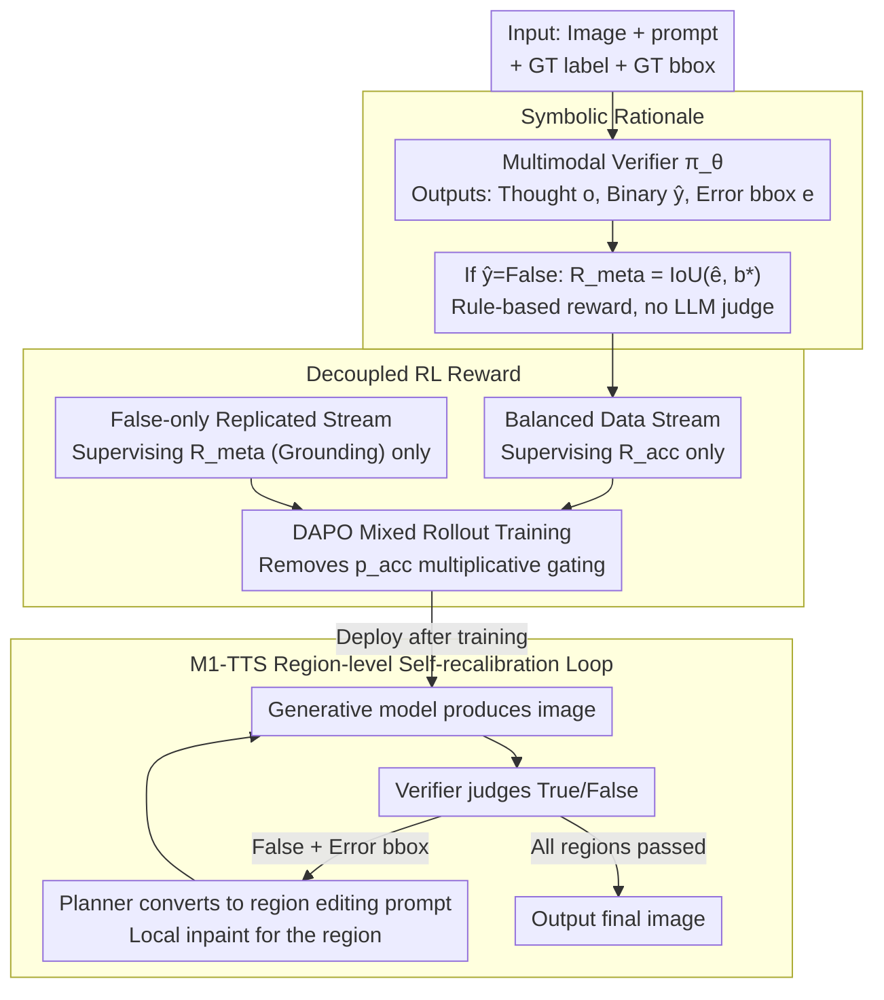

# OmniVerifier-M1: Multimodal Meta-Verifier with Explicit Structured Recalibration

**Conference**: ICML 2026  
**arXiv**: [2605.28805](https://arxiv.org/abs/2605.28805)  
**Code**: No repository link provided (None)  
**Area**: Multimodal VLM / Visual Verification / Reinforcement Learning  
**Keywords**: Multimodal meta-verifier, symbolic reward, decoupled RL, visual self-correction, RLVR  

## TL;DR
To address the issues of coarse True/False binary signals and the vulnerability of text explanations to reward-hacking in multimodal visual verifiers, this paper proposes OmniVerifier-M1. It replaces text with symbolic outputs such as bounding boxes as the meta-verification rationale to support rule-based rewards like IoU. Theoretically and experimentally, it demonstrates that decoupling binary judgment and meta-verification into two independent reward streams (rather than a multiplicative joint reward) significantly improves the SNR. Ultimately, the verifier is upgraded to an agentic system, M1-TTS, capable of driving region-level self-recalibration.

## Background & Motivation

**Background**: Multimodal Large Language Models (MLLMs) are becoming increasingly powerful in generation and reasoning, necessitating reliable verifiers as reward or reflection signal sources. Existing work generally follows two paths: (i) traditional image reward models like RewardDance and UnifiedReward, focused on text-to-image scoring; (ii) general visual verifiers like OmniVerifier, which use RLVR (Reinforcement Learning with Verifier Rewards) with binary judgments (True/False) as rewards.

**Limitations of Prior Work**: Pure binary signals face two major issues: first, supervision only reaches the decision level rather than the reasoning level, allowing models to receive full rewards by "guessing" or capturing surface patterns without learning fine-grained reasoning; second, using text explanations as rationales to train verifiers requires an LLM judge for scoring, which is both slow and prone to reward hacking.

**Key Challenge**: Granular feedback requires rationale supervision; however, text rationales require either model-based evaluation (expensive and vulnerable) or rule-based evaluation (difficult due to the open-ended nature of text). Furthermore, the output spaces of binary judgment and meta-verification are inherently different—the former is discrete and low-entropy, while the latter is continuous and high-dimensional. Forcing them into a joint reward causes severe optimization conflicts.

**Goal**: (i) Identify a rationale format that is strictly rule-governed and precisely expresses image errors; (ii) Solve the problem of meta-verification gradients being "gated" by binary accuracy under joint rewards; (iii) Upgrade the verifier into an agent capable of driving region-level self-recalibration in a closed-loop generation system.

**Key Insight**: Images are highly structured spatial representations, and errors can naturally be localized via symbolic representations like bounding boxes or keypoints. This allows for replacing model-based judges with rule-based rewards like IoU, eliminating reward hacking at the source. Moreover, theoretically, meta-gradients in joint rewards are multiplicatively gated by binary accuracy $p_{acc}$; decoupling the two restores the SNR.

**Core Idea**: **Symbolic rationale (bbox) + Decoupled RL reward** — Using bboxes as meta-verification rationales allows IoU to serve as a rule-based reward. Binary judgment and meta-verification are split into two independent reward streams trained via mixed data.

## Method

OmniVerifier-M1 trains a pointwise multimodal verifier $\pi_\theta(I, P) \to (o, \hat y, e)$ within the RLVR framework. The output includes a thought process $o$, a binary judgment $\hat y$, and (only when $\hat y = \text{False}$) an error region localization $e$ (bbox). The methodology revolves around "which rationale to use" and "how to combine rewards."

### Overall Architecture
Input consists of (image, prompt, ground-truth label, optional ground-truth bbox); the verifier outputs $(o, \hat y, e)$. The reward comprises three parts: format reward $\mathcal{R}_f$ (requiring `<think>` tags), accuracy reward $\mathcal{R}_{acc} \in \{0,1\}$, and meta-verification reward $\mathcal{R}_{meta}$ (which equals IoU in the symbolic rationale scenario). Training uses DAPO on OmniVerifier-7B and Qwen3-VL-8B for 80 steps using 16 A800-80G GPUs. For downstream applications, M1-TTS treats the verifier output as an agent tool: identifying error regions first, then driving a generative model for region-level editing with iterative replanning until convergence.

### Key Designs

**1. Symbolic Rationale: Using Bbox instead of text explanation for meta feedback**

Fine-grained supervision requires rationales, but text rationales necessitate an LLM judge, which is slow and vulnerable to hacking. The authors observe that image errors are fundamentally spatial "where" problems, naturally localizable via structured geometric objects like bboxes or points. Thus, IoU is used as a hard-rule reward. During training, symbolic samples provide GT bboxes, and the reward is $\mathcal{R}_{meta} = \text{IoU}(\hat b, b^*)$. Compared to textual rationales judged by Qwen3-4B, symbolic rewards are ~1000x faster (0.021 ms vs 20.2 ms per sample), reduce training time by ~20%, and lower VRAM usage from 56.9 GB to 48.6 GB, while maintaining nearly identical ViVerBench scores (0.661 vs 0.662). Symbolic is an "equivalent but cheaper" alternative.

**2. Decoupled RL Reward: Splitting accuracy and grounding into independent streams**

Binary judgment is discrete and low-entropy, while meta-verification is continuous and high-dimensional; joint rewards lead to optimization conflicts. In the original joint objective $\mathcal{R}_f + \mathcal{R}_{acc} \cdot (\mathbb{I}[y=\text{True}] + \mathbb{I}[y=\text{False}] \cdot \mathcal{R}_{meta})$, the meta gradient is only active when $y=\hat y=\text{False}$. The decoupled scheme mixes two streams: an original 1:1 balanced set supervising $\mathcal{R}_{acc}$, and a replicated $y=\text{False}$ subset supervising only $\mathcal{R}_{meta}$. Theorem 5.3 and Corollary 5.4 prove that $\text{SNR}(\mathcal{G}_{joint}) \le p_{acc}(\theta) \cdot \text{SNR}(\mathcal{G}_{dec})$, indicating joint training is strictly sub-optimal due to the Bernoulli gate. Decoupling restores grounding gradients.

**3. M1-TTS: Upgrading verifier from a "scorer" to an agent driving region-level self-recalibration**

Traditional multi-turn editing operates at the global level, struggling with specific localized semantic errors. With symbolic feedback, OmniVerifier-M1 acts as a fine-grained optimizer: the base model generates an image → verifier identifies errors → if False, error bboxes are provided → planner translates bboxes into region-aware prompts → local inpainting is performed. This extends the fine-grained advantage of meta-verification to the inference stage, focusing precision on error regions.

### Loss & Training
The RL algorithm uses DAPO (a GRPO variant). The reward equals format reward (indicator) + accuracy reward (0/1) + meta reward (IoU or model-based score). Mixed data streams are used: balanced data for $\mathcal{R}_f + \mathcal{R}_{acc}$, and False-only data for $\mathcal{R}_f + \mathcal{R}_{meta}$. Advantages are estimated within rollout groups, using standard PPO clipping and KL regularization.

## Key Experimental Results

### Main Results
ViVerBench covers 16 sub-tasks across 6 categories. RefCOCO is used for grounding evaluation. Selected results from Table 2:

| Model | Obj. | Attr. | Spat. | BBox | Point | Count | GUI | Chart | **Overall** |
|-------|------|-------|-------|------|-------|-------|-----|-------|-------------|
| OmniVerifier-7B (baseline) | 0.701 | 0.703 | 0.808 | 0.770 | 0.659 | 0.527 | 0.634 | 0.600 | 0.650 |
| OmniVerifier-7B (Joint) | 0.723 | 0.733 | 0.833 | 0.827 | 0.716 | 0.640 | 0.694 | 0.623 | 0.661 |
| OmniVerifier-7B (Decoupled) | **0.741** | **0.754** | **0.846** | **0.854** | **0.741** | **0.710** | **0.722** | **0.639** | **0.668** |

On the Qwen3-VL-8B backbone, Decoupled > Joint > Baseline holds. Fine-grained tasks like BBox, Point, and Count show the largest improvements (+8–18 points), confirming that meta-verification supervision strengthens grounding.

### Ablation Study

| Configuration | ViVerBench | VRAM (GB) | Reward Calc (ms/sample) | Train Time (min/step) | Response Length (tokens) |
|------|------------|---------------|-------------------------|---------------------|------------------|
| OmniVerifier-7B baseline | 0.650 | — | — | — | — |
| + Bbox (symbolic) | 0.661 | 48.6 | **0.021** | **8.13** | 384 |
| + Exp (textual) | 0.662 | 56.9 | 20.2 | 10.27 | 340 |

### Key Findings
- **Symbolic ≈ Textual in performance, but Costs Differ**: Differences on ViVerBench are < 0.001, but symbolic reward calculation is ~1000x faster, uses ~15% less VRAM, and is ~20% faster in training.
- **Decoupled Gain is not from "More Data"**: The replicated False-only data does not increase accuracy supervision; the gain comes from releasing meta gradients from $p_{acc}$ gating.
- **Grounding Sub-tasks Benefit Most**: Significant jumps in BBox, Count, and Point verify that meta-verification signals flow into the model's grounding capability.
- **M1-TTS beats Global Multi-turn Editing**: In region-level self-recalibration, the M1-driven system is more efficient and has lower error rates than traditional global regeneration.

## Highlights & Insights
- **"Replacing free-form text with domain-specific structures"**: Moving verifier outputs from linguistic to symbolic states (bbox/point) solves reward hacking, training efficiency, and localization precision simultaneously—utilizing geometric task structure to the fullest.
- **Hardcore Theoretical Analysis**: The use of SNR inequalities to quantify why joint training is sub-optimal provides more convincing evidence than empirical observation alone; this framework applies to any dual "discrimination + explanation" RL task.
- **Role Upgrade from Verifier to Agentic Optimizer**: M1-TTS upgrades the verifier from a score-provider to an action-provider. Providing actionable symbolic signals is a new paradigm for integrating RL-trained judges into agent loops.

## Limitations & Future Work
- Experiments were restricted to 7B and 8B backbones; the gap between joint and decoupled training may narrow as $p_{acc}$ approaches 1 for larger models.
- Bboxes are ideal for spatial errors but less applicable to errors without clear boundaries like "style inconsistency" or "improper lighting." Future work needs to explore more symbolic forms (masks, color histograms).
- M1-TTS requires multimodal models supporting region-level edits; for text-to-image diffusion pipelines, it still requires additional inpainting pipelines.

## Related Work & Insights
- **vs OmniVerifier (Zhang et al. 2025)**: This work is a direct upgrade, moving from "binary-only" to "bbox + decoupled meta" and extending the verifier into a closed-loop agent.
- **vs DeepSeekMath-V2**: While others use text rationales in the math/language domain, this work proves that symbolic rationales are superior in the visual domain.
- **vs ReflectionFlow / OmniVerifier-TTS**: While those use global-level reflection, this work adopts region-level, providing a granularity that is significantly more effective for complex compositional generation.
- **Transferable Insights**: Any dual "judgment + explanation" task (code review, math proof) can benefit from decoupled training. Any domain allowing structured output (OCR, UI navigation) should consider symbolic rationales over text for efficiency and robustness.

<!-- RELATED:START -->

## Related Papers

- [\[CVPR 2026\] Towards an Incremental Unified Multimodal Anomaly Detection: Augmenting Multimodal Denoising From an Information Bottleneck Perspective](../../CVPR2026/object_detection/towards_an_incremental_unified_multimodal_anomaly_detection_augmenting_multimoda.md)
- [\[NeurIPS 2025\] Structured Temporal Causality for Interpretable Multivariate Time Series Anomaly Detection](../../NeurIPS2025/object_detection/structured_temporal_causality_for_interpretable_multivariate_time_series_anomaly.md)
- [\[CVPR 2026\] Distribution-Aligned Multimodal Fusion for Robust Object Detection](../../CVPR2026/object_detection/distribution-aligned_multimodal_fusion_for_robust_object_detection.md)
- [\[CVPR 2026\] Complementary Prototype Mapping for Efficient Multimodal Anomaly Detection](../../CVPR2026/object_detection/complementary_prototype_mapping_for_efficient_multimodal_anomaly_detection.md)
- [\[NeurIPS 2025\] DETree: DEtecting Human-AI Collaborative Texts via Tree-Structured Hierarchical Representation Learning](../../NeurIPS2025/object_detection/detree_detecting_human-ai_collaborative_texts_via_tree-structured_hierarchical_r.md)

<!-- RELATED:END -->
