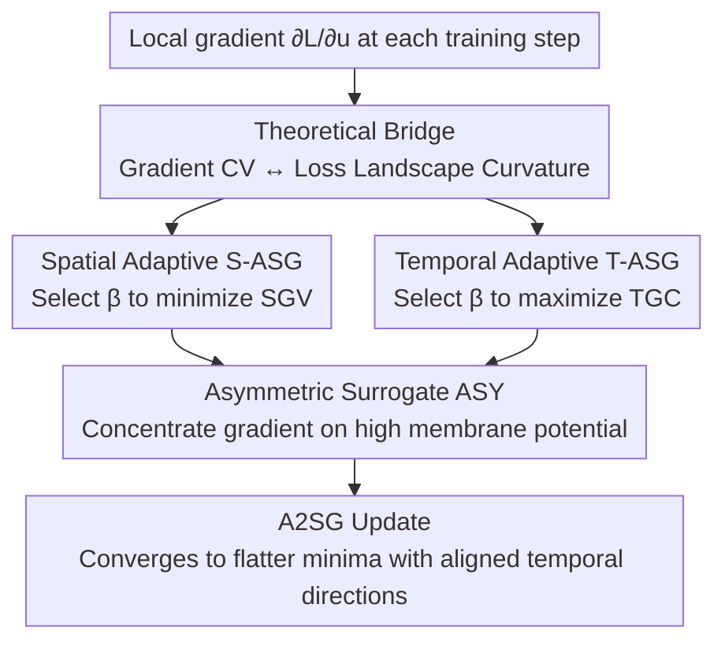

# A2SG: Adaptive and Asymmetric Surrogate Gradients for Training Deep Spiking Neural Networks

**Conference**: ICML2026  
**arXiv**: [2606.11236](https://arxiv.org/abs/2606.11236)  
**Code**: https://github.com/KIST-NCL/A2SG.git  
**Area**: Optimization / Spiking Neural Networks / Surrogate Gradient Training  
**Keywords**: Spiking Neural Networks, Surrogate Gradient, Flat Minima, Loss Curvature, Temporal Gradient Consistency

## TL;DR
To address the dual issues of "sharp loss landscapes" and "conflicting gradients across timesteps" in deep Spiking Neural Networks (SNNs) trained with surrogate gradients, this paper proposes a unified framework, A2SG. On one hand, it employs an adaptive effective window width (automatically adjusting $\beta$ based on Spatial Gradient Variation (SGV) and Temporal Gradient Consistency (TGC)) to suppress gradient variation and align directions across timesteps. On the other hand, it replaces symmetric surrogate functions with an asymmetric shape that allocates gradients based on membrane potential levels. It theoretically proves that asymmetric shapes exhibit lower variation than symmetric ones and that smaller local gradient variation leads to flatter loss landscapes, consistently improving accuracy and energy efficiency across CNN and Transformer-based SNNs.

## Background & Motivation
**Background**: Spiking Neural Networks (SNNs) operate using spikes, making them inherently low-power and considered the next generation of energy-efficient neural networks. Scaling them deep has enabled applications in image classification, segmentation, object detection, language modeling, and even Transformer architectures. These advancements rely almost entirely on "Direct Training based on Surrogate Gradients" (STBP, Spatio-Temporal Backpropagation)—since the spike firing function is non-differentiable, a smooth surrogate gradient $\partial s/\partial u$ must be used to approximate the derivative that should have been a Dirac delta.

**Limitations of Prior Work**: Although surrogate gradients make training deep SNNs feasible, there is an inherent mismatch with the true gradient. Existing improvements either fixate on "gradient sparsity" as an indirect indicator of training quality (controlled by window width adjustments in works by Lian, Lin, etc.) or incur extreme computational overhead (like Dspike using finite differences to align with the true gradient). Crucially, almost no research has explored the impact of the **surrogate gradient function's shape itself** on generalization.

**Key Challenge**: The authors trace the problem to the optimization level—deep SNNs trained with surrogate gradients converge to loss landscape regions much sharper than those of DNNs. The paper derives from the second-order chain rule that under symmetric, fixed-area surrogate functions, the Hessian magnitude of an SNN is $\Omega(x^2/\beta^2)$, whereas a DNN is only $\mathcal{O}(x^2)$. Since it is common to use narrow windows ($\beta<1$) to approximate the Dirac delta, this effectively scales the Hessian by $1/\beta^2$, forcing optimization into sharp regions. Combined with the binary and temporally sparse nature of spikes, gradients become highly concentrated with increased variation, further biasing towards sharp regions.

**Another Paradox**: In STBP, parameter updates sum the gradient contributions from all timesteps. If local gradient directions across timesteps are inconsistent, they generate conflicting signals—termed **temporal gradient confusion** by the authors. This causes optimization instability and degrades performance but has long been ignored.

**Goal**: Simultaneously heal both ailments—pull the loss landscape from sharp to flat and align gradient directions across timesteps.

**Key Insight**: Use a unified framework, A2SG, combining "Adaptive (Spatial + Temporal adaptive window width)" and "Asymmetric (gradient allocation based on membrane potential)" components. The former uses online metrics to automatically select $\beta$ to suppress variation and align directions; the latter modifies the function shape to further reduce gradient variation. Both are linked by a central theoretical thesis: **The smaller the Coefficient of Variation (CV) of local gradients, the flatter the loss landscape and the better the generalization.**

## Method

### Overall Architecture
A2SG does not change the network structure or add inference overhead; it only modifies the surrogate gradient during training. It first establishes a theoretical bridge—the CV of the local gradient $\partial L/\partial u$ directly determines the maximum eigenvalue of the Fisher Information Matrix (FIM), and thus the loss landscape curvature; hence, "reducing CV = finding flat minima." Centered on this, the framework performs two actions on the surrogate function at each training step: **adjusting the window width $\beta$** (Spatial adaptation S-ASG to suppress SGV and Temporal adaptation T-ASG to increase TGC) and **changing the window shape** (using asymmetric ASY instead of symmetric TRI/BOX to concentrate gradients on high-membrane-potential neurons). These synergize: S-ASG+ASY promotes flatness, T-ASG+ASY stabilizes directions, and the combined A2SG achieves robust convergence.

### Key Designs

**1. CV–Curvature Bridge: Proving "Reducing Gradient Variation" finds "Flat Minima"**

This is the theoretical foundation of the paper, answering "why adjusting gradient variation improves generalization." For a fully connected layer, the weight gradient vector is written as the Kronecker product of input and backpropagated error $\mathbf{g}=\mathbf{a}_{\mathrm{in}}\otimes\boldsymbol{\delta}$, thus the Fisher Information Matrix $\mathbf{F}=\mathbb{E}[\mathbf{g}\mathbf{g}^\top]$. After decomposing the error $\boldsymbol{\delta}$ into a mean plus zero-mean perturbation $\boldsymbol{\delta}=\mu\mathbf{1}+\boldsymbol{\epsilon}$, $\mathbf{F}$ decomposes into a rank-1 matrix $\mathbf{F_0}$ and a perturbation $\mathbf{R}$, where $\|\mathbf{R}\|_2 \le c\mu\,\mathrm{CV}(\delta)$. By matrix perturbation theory, the maximum eigenvalue of the FIM satisfies:

$$\lambda_{\max}(\mathbf{F}) \le \mu^2\lambda_{\max}\!\big(\mathbb{E}[(\mathbf{a}_{\mathrm{in}}\otimes\mathbf{1})(\mathbf{a}_{\mathrm{in}}\otimes\mathbf{1})^\top]\big) + c\mu^2\,\mathrm{CV}(\delta).$$

The maximum eigenvalue grows **linearly** with $\mathrm{CV}(\delta)$—reducing the local gradient's CV directly flattens the loss landscape. This bridge provides a unified goal for all subsequent operations on $\beta$ and shapes: suppressing CV.

**2. Spatial-Temporal Adaptive Window Width ST-ASG: Online Selection of $\beta$ via SGV and TGC**

To address sharp landscapes and temporal confusion, the authors define two observable metrics. **Spatial Gradient Variation (SGV)** (at the final timestep $T$ and layer $l$):

$$\mathrm{SGV}^{(l)}[T] := \frac{\mathrm{Var}(\boldsymbol{\delta}^l[T])}{\mathrm{Mean}(|\boldsymbol{\delta}^l[T]|)},$$

using variance instead of standard deviation for speed. **Temporal Gradient Consistency (TGC)** is the cosine similarity between local gradients of adjacent timesteps: $\mathrm{TGC}^{(l)}[t]:=\cos(\boldsymbol{\delta}^{(l)}[t], \boldsymbol{\delta}^{(l)}[t+1])$. Spatial adaptation minimizes SGV at the final timestep (where activation/gradients are relatively stable) to provide a reference direction; temporal adaptation then maximizes TGC for preceding timesteps to align them with this reference. Both use the effective window width $\beta$ as the control knob. Since these functions change unpredictably across layers and epochs, the authors use **Bayesian search** to robustly find the current optimal $\beta$.

**3. Asymmetric Surrogate Function ASY: Allocating Gradients by Membrane Potential to Further Reduce Variation**

Symmetric functions (TRI, BOX) allocate gradients only based on "distance from threshold," ignoring the neuron's integrate-and-fire dynamics. Consequently, the relative magnitude of accumulated membrane potential is not reflected in training. The authors propose an asymmetric surrogate:

$$\frac{\partial s}{\partial u}=f(u,\beta)=\frac{1}{2\beta}(u-V_{\mathrm{th}})+h,\quad u\in[V_{\mathrm{th}}-\beta,\,V_{\mathrm{th}}+\beta],$$

where $h$ is a gradient bias term across the window, controlling overall gradient magnitude (lower $h$ suppresses low-potential gradients, increasing sparsity). It assigns larger gradients to neurons with higher cumulative potential (closer to firing), concentrating the gradient on "truly active" regions and reducing waste in low-activity areas, further suppressing variation. **Theorem 4.1** proves that under certain constraints, the triangular function has the minimum CV in the symmetric family. **Theorem 4.2** further proves under Gaussian linear approximation that if $L\kappa>\sigma^2$ (where $L=b-a$ is window width and $\kappa=a-\mu$), then $\mathrm{CV}_{\mathrm{asy}}<\mathrm{CV}_{\mathrm{sym}}$. In experiments, this condition is gradually met across layers, and the gradient variance of ASY remains consistently lower than TRI.

### Loss & Training
A2SG does not change the task loss; it only replaces the surrogate gradient in STBP. In each training step: Bayesian search finds $\beta$ to minimize SGV at the final timestep as a reference; search finds $\beta$ to maximize TGC for preceding steps; the asymmetric ASY shape is used for all. The combination, A2SG, stabilizes optimization and leads to flat minima. Experiments cover CIFAR10/100, ImageNet, CIFAR10-DVS, and ADE20K, using both CNN and Transformer-based SNNs.

## Key Experimental Results

### Main Results
A2SG compared against existing adaptive surrogate methods, generally using only 4 timesteps.

| Dataset | Architecture | Method | Timesteps | Accuracy (%) |
|--------|------|------|--------|----------|
| CIFAR10 | ResNet18 | Dspike | 4 | 93.66 |
| CIFAR10 | ResNet19 | CPNG | 6 | 94.10 |
| CIFAR10 | ResNet19 | LSG | 4 | 95.17 |
| CIFAR10 | ResNet19 | ST-ASG (Ours) | 4 | 96.41 |
| CIFAR10 | ResNet19 | **A2SG (Ours)** | 4 | **96.74** |
| CIFAR100 | ResNet18 | Dspike | 4 | 73.35 |
| CIFAR100 | ResNet19 | CPNG | 6 | 75.37 |
| CIFAR100 | ResNet19 | LSG | 4 | 76.85 |
| CIFAR100 | ResNet19 | ST-ASG (Ours) | 4 | 80.46 |
| CIFAR100 | ResNet19 | **A2SG (Ours)** | 4 | **81.05** |

### Ablation Study

| Configuration | Function | Effect |
|------|---------|------|
| ST-ASG only | Spatial + Temporal Adaptation | Reached 80.46% on CIFAR100; single component outperforms SOTA |
| ASY only | Modified shape to reduce CV | Gradient variance consistently lower than TRI, validating Theorem 4.2 |
| Full A2SG | Synergy of both components | 81.05% on CIFAR100, 96.74% on CIFAR10; best performance |

### Key Findings
- **Reducing CV truly yields flat minima**: A2SG maintains low SGV and high TGC throughout training, and the maximum FIM eigenvalue across layers is consistently lower than controls, empirically confirming the "Lower CV → Lower Curvature" theory.
- **Narrow windows are a double-edged sword**: The Hessian magnitude $\Omega(x^2/\beta^2)$ indicates that narrow windows used to approximate the Dirac delta push SNNs into much sharper regions than DNNs—an overlooked root cause of SNN training difficulty.
- **TRI is sharper than BOX**: Under area normalization, the steeper slope of the triangular function implies higher curvature, converging to sharper regions than BOX, consistent with loss landscape visualizations.
- **Shape itself matters**: Changing symmetry to asymmetry to allocate gradients by membrane potential reduces variation without adding inference cost, an under-explored dimension.

## Highlights & Insights
- **From "Sparsity" to "Curvature"**: Previous adaptive methods focused on gradient sparsity as an indirect metric. This paper shifts the target to the theoretically grounded "Local Gradient CV ↔ Loss Curvature," making the motivation specific and provable.
- **Asymmetric Surrogate is a lightweight yet novel entry point**: Modifying only the shape of the smooth function during training (without changing structure or adding inference cost) reflects neuron dynamics and reduces variation, supported by Theorems 4.1/4.2.
- **Explicit naming and handling of "Temporal Gradient Confusion"**: Quantifying gradient conflict across timesteps using TGC and aligning them via temporal adaptation is an insight transferable to any BPTT-like temporal model training.
- **Universal Framework**: Validated from CNNs to Transformer SNNs, and from static to neuromorphic data (ADE20K), demonstrating that this surrogate gradient improvement is generic.

## Limitations & Future Work
- Adaptive $\beta$ relies on Bayesian search, introducing training-time search overhead. Although claimed to be cheaper than Dspike, it still costs more than fixed windows, and scalability to massive models remains to be tested.
- Theoretical analysis (CV-Curvature bridge, Theorems 4.1/4.2) is built on assumptions like fully connected layers, Gaussian membrane potentials, and linear approximations. Its rigorous coverage of Transformer attention structures requires further confirmation.
- The use of variance instead of standard deviation for SGV is an approximation for speed; its robustness under extreme gradient distributions is not fully discussed.
- Demonstrations focus on classification/segmentation; validation on large-scale language-modeling SNNs is missing.

## Related Work & Insights
- **vs Dspike**: Dspike uses finite differences to align surrogate with true gradients based on cosine similarity but is computationally expensive. A2SG uses observable SGV/TGC + Bayesian search, which is cheaper and targets curvature rather than just gradient matching.
- **vs LSG / CPNG (Window/Sparsity Tuning)**: These tune window width using gradient sparsity as a proxy. A2SG targets reducing local gradient CV to reach flat minima, a more fundamental motivation that yields higher accuracy (81.05% vs 76.85% on CIFAR100).
- **vs Membrane Potential Distribution Methods (IM, RMP, KL loss)**: These modify the potential distribution but do not address the inherent flaws of the surrogate gradient itself. A2SG directly reshapes the surrogate function.
- **vs Flat Minima Training (SAM, FIM-aware updates)**: While those methods explicitly optimize flatness for general DNNs, A2SG integrates flat-minima philosophy specifically into SNN surrogate gradient design with an analytical CV-Curvature link.

## Rating
- Novelty: ⭐⭐⭐⭐⭐ Advances surrogate gradients from "sparsity" to "curvature" and introduces the under-explored asymmetric dimension.
- Experimental Thoroughness: ⭐⭐⭐⭐ Covers various architectures and data types, though lacks large-scale language SNNs.
- Writing Quality: ⭐⭐⭐⭐ Clear theoretical path and visual evidence; some theorems require appendix reference.
- Value: ⭐⭐⭐⭐⭐ Provides a theoretically-backed, plug-and-play, cross-architecture universal surrogate gradient solution for deep SNNs.

<!-- RELATED:START -->

## Related Papers

- [\[ICLR 2026\] Difference Predictive Coding for Training Spiking Neural Networks](../../ICLR2026/optimization/difference_predictive_coding_for_training_spiking_neural_networks.md)
- [\[ICML 2026\] Asymmetric Perturbation in Solving Bilinear Saddle-Point Optimization](asymmetric_perturbation_in_solving_bilinear_saddle-point_optimization.md)
- [\[ICML 2026\] ePC: Fast and Deep Predictive Coding in Digital Simulation](epc_fast_and_deep_predictive_coding_in_digital_simulation.md)
- [\[ICML 2026\] Gradient Descent with Large Step Size Restores Symmetry in Deep Linear Networks with Multi-Pathway](gradient_descent_with_large_step_size_restores_symmetry_in_deep_linear_networks_.md)
- [\[ICML 2026\] The Implicit Bias of Adam and Muon on Smooth Homogeneous Neural Networks](the_implicit_bias_of_adam_and_muon_on_smooth_homogeneous_neural_networks.md)

<!-- RELATED:END -->
