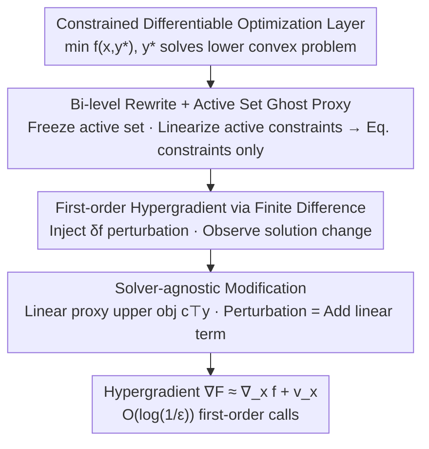

# A Fully First-Order Layer for Differentiable Optimization

**Conference**: ICML2026  
**arXiv**: [2512.02494](https://arxiv.org/abs/2512.02494)  
**Code**: https://github.com/GT-KOALA/FFOLayer  
**Area**: Optimization / Differentiable Optimization Layer  
**Keywords**: Differentiable Optimization, Bi-level Optimization, First-order Methods, Hypergradient, Solver-agnostic  

## TL;DR
Mainstream differentiable optimization layers rely on implicit differentiation of KKT conditions, which requires computing Hessians and solving large KKT linear systems, making them difficult to scale to large problems. This paper rewrites differentiable optimization as a **bi-level optimization**, constructing a "ghost proxy" problem with a fixed active set and linearized active constraints to simplify inequality constraints into equality constraints locally. It then uses **finite differences** to estimate the hypergradient using only first-order information within nearly constant $\mathcal{O}(\log(1/\epsilon))$ calls. The authors implement FFOLayer, a PyTorch library that is plug-and-play with any convex solver (including GUROBI/MOSEK). It achieves convergence comparable to exact methods while computational time and peak memory grow nearly sublinearly with problem scale.

## Background & Motivation
**Background**: Embedding mathematical programming as a differentiable layer within neural networks (e.g., OptNet, CvxpyLayer)—where model outputs are obtained by solving an embedded optimization problem and gradients are backpropagated through the solver for end-to-end training—is widely used in decision-focused learning, control, and meta-learning.

**Limitations of Prior Work**: The primary bottleneck of differentiable optimization layers is **scalability**—computing hypergradients is prohibitively expensive. The standard approach involves implicit differentiation of KKT conditions (CvxpyLayer), reducing backpropagation to several linear solves of the KKT system. However, for large problems, decomposing and solving the KKT system is heavy in both time and memory, limiting the problem scale. Worse, the Jacobian of the KKT system typically contains the Hessian of the lower-level objective $\nabla_{yy}^2 g(x,y)$, which is a major hurdle for scaling.

**Key Challenge**: Implicit differentiation requires "forming and inverting a large KKT matrix containing the Hessian," which directly conflicts with the desire to use differentiable layers for large-scale problems. While pure first-order "Hessian-free" algorithms exist in the bi-level optimization field, they struggle with inequality constraints: existing works mostly use penalty terms (e.g., the $\ell_2$ norm of active constraints), requiring $\mathcal{O}(1/\epsilon)$ iterations for an $\epsilon$-accurate hypergradient, whereas problems with only equality constraints enjoy a much faster $\mathcal{O}(\log(1/\epsilon))$ rate.

**Goal**: To design a hypergradient algorithm for differentiable optimization layers that uses **only first-order information**, can handle general convex constraints (beyond linear inequalities), is compatible with any advanced solver, and fills the gap of achieving near-constant $\mathcal{O}(\log(1/\epsilon))$ hypergradients under inequality constraints.

**Key Insight**: The authors' key observation is that the dependence of the optimal solution $y^*(x)$ on the input $x$ naturally follows a bi-level structure. Near the optimum, only **active constraints** influence the first-order behavior; inactive constraints are slack and do not affect the local gradient. Therefore, by "freezing the active set and linearizing active inequalities into equalities," general convex constraints can be simplified locally into an equality-only proxy problem, allowing the application of near-constant algorithms used in equality-constrained scenarios.

**Core Idea**: A three-step process combining "bi-level rewrite + active set ghost proxy (linearized active constraints → equality) + finite difference first-order hypergradient." This replaces Hessian-heavy implicit differentiation with a pure first-order pipeline requiring two black-box solves and one finite difference calculation.

## Method

### Overall Architecture
Given a downstream loss $f(x,y)$ and a parameterized lower-level convex optimization $y^*(x)\in\arg\min_{y}\,g(x,y)\ \text{s.t.}\ h(x,y)\le 0,\ e(x,y)=0$, the training objective is $F(x):=f(x,y^*(x))$. The difficulty lies in the sensitivity term $dy^*(x)/dx$ when computing the hypergradient. Implicit differentiation requires $-(\nabla G)^{-1}\nabla_x G$, involving Hessians and KKT system solves. This paper reformulates it into a bi-level problem with three steps: **First**, fix the active set of the lower-level optimum and linearize active inequalities to construct a "ghost proxy" containing only linear equality constraints (strictly equivalent to the original hypergradient at $\bar x$). **Second**, inject a $\delta f$ perturbation into the ghost lower objective and use finite differences on the resulting solution change to estimate the first-order hypergradient with $\mathcal{O}(\delta)$ accuracy. **Finally**, use a linear proxy for the upper-level objective $c^\top y$ to transform the perturbation into a "linear term addition," decoupling the backpropagation from the specific solver. The forward pass solves the original problem, and the backward pass solves one perturbed problem—two black-box solves plus finite difference yields the gradient.

### Key Designs

**1. Bi-level Rewrite + Active Set Ghost Proxy: Simplifying General Convex Constraints into Equalities Locally**

Directly handling inequality constraints degrades hypergradient complexity to $\mathcal{O}(1/\epsilon)$. The authors first write the differentiable optimization as a bi-level instance (upper $f$, lower $\arg\min_y g$ s.t. constraints), then construct a **ghost bi-level problem**: given a reference point $\bar x$ and its lower primal-dual optimal solution $(y^*,\lambda^*,\nu^*)$, they define the active set $\mathcal{I}:=\{i\mid h_i(\bar x,y^*)=0,\ \lambda_i^*>0\}$. Active inequalities and equality constraints are merged into the objective using Lagrange terms, and active constraints are linearized:

$$\tilde g(x,y)=g(x,y)+\langle\lambda^*,h(x,y)\rangle+\langle\nu^*,e(x,y)\rangle$$

$$\tilde h(x,y)=\begin{bmatrix}e(x,y)\\ \nabla_x h_{\mathcal{I}}(\bar x,y^*)(x-\bar x)+\nabla_y h_{\mathcal{I}}(\bar x,y^*)(y-y^*)\end{bmatrix}$$

Dual variables $\lambda^*,\nu^*$ are treated as **frozen constants**. Intuitively, inactive constraints are slack in the neighborhood of $(\bar x,y^*)$ and do not affect first-order behavior, while active constraints behave like equalities and are captured by their first-order expansion. **Theorem 4.5 (Active Set Equivalence)** guarantees that if LICQ holds, $F$ is differentiable, and the active set is locally invariant, then $\nabla F(\bar x)=\nabla\tilde F(\bar x)$—meaning this simplification **does not lose hypergradient accuracy**. The computational cost is reduced by handling only a few active constraints rather than all inequalities. Since $\tilde h$ contains only linear equalities, near-constant algorithms for equality-constrained cases can be used.

**2. First-order Hypergradient via Finite Difference: Avoiding Hessians and Inverse Jacobians**

Even after simplifying to equality constraints, explicit calculation of $dy^*(x)/dx$ is avoided. This paper uses **finite differences**: a small perturbation $\delta f(x,y)$ ($\delta>0$ small) is injected into the ghost lower objective to solve for the perturbed primal-dual solution $(y_\delta^*,\lambda_\delta^*)$, and the sensitivity term is estimated via the difference quotient of the perturbed Lagrangian:

$$v_x:=\frac{1}{\delta}\Big(\nabla_x[\tilde g(x,y_\delta^*)+\langle\lambda_\delta^*,\tilde h(x,y^*)\rangle]-\nabla_x[\tilde g(x,y^*)]\Big)$$

It is proven that $\|v_x-(dy^*/dx)^\top\nabla_y f(x,y^*)\|\le\mathcal{O}(\delta)$, and the full hypergradient is assembled as $\tilde\nabla F(x)=\nabla_x f+v_x$. The entire process uses only the first-order derivatives of $f, g, h$. **Theorem 4.6** states that under standard assumptions, the algorithm outputs a hypergradient satisfying $\|\tilde\nabla F-\nabla F\|\le\epsilon$ within $\mathcal{O}(\log(1/\epsilon))$ gradient oracle calls. Compared to Kornowski et al. (2024), which requires exact dual solutions and costs $\tilde{\mathcal{O}}(\epsilon^{-1})$, this method reduces complexity to the logarithmic scale by correctly identifying the active set. When integrated into a meta-algorithm, **Corollary 4.7** further provides a convergence rate of $\tilde{\mathcal{O}}(\delta^{-1}\epsilon^{-3})$ oracle calls to a $(\delta, \epsilon)$-Goldstein stationary point.

**3. Solver-agnostic Modification: Decoupling Backprop from Solvers via Linear Proxy**

The perturbed lower objective $\tilde g+\delta f$ in Step 3 of Algorithm 1 explicitly depends on the upper-level $f$. In a "black-box solver" interface (where the solver only takes $x$ and $(g,h,e)$ and returns $y^*$), the solver does not know $f$. The authors' solution is to construct a **linear proxy upper objective**:

$$\hat f(x,y):=c^\top y,\quad c:=\texttt{detach}(\nabla_y f(x,y^*(x)))$$

Since $\nabla_y f=c=\nabla_y\hat f$, this replacement does not change the resulting hypergradient. The lower-level perturbation is then simply "adding a linear term": $\hat y_\delta^*\in\arg\min_{y:\tilde h(x,y)=0}\tilde g(x,y)+\delta c^\top y$. The process: solve the lower problem with any solver for $y^*$, compute $c=\nabla_y f(x,y^*)$ via autodiff and stop-gradient, then solve the perturbed problem for $\hat y_\delta^*$ and apply finite difference. Consequently, **backpropagation does not require solver-specific implementations**. This allows the direct use of advanced convex solvers like GUROBI and MOSEK—a feature most existing differentiable layers lack. The authors provide two variants: FFOCP (General Convex) and FFOQP (Specialized for QP structures).

### Loss & Training
The method does not introduce a new loss but provides a hypergradient oracle for any upper-level loss $F(x)=f(x,y^*(x))$. Each backprop: (1) Solve lower problem for $(y^*,\lambda^*)$; (2) Solve perturbed ghost lower problem for $(y_\delta^*,\lambda_\delta^*)$; (3) Compute finite difference $v_x$; (4) Output $\tilde\nabla F=\nabla_x f+v_x$. The meta-algorithm converges to a Goldstein stationary point in $\tilde{\mathcal{O}}(\delta^{-1}\epsilon^{-3})$.

## Key Experimental Results

### Main Results
Three types of tasks were compared against differentiable optimization layer baselines (CPU-based due to lack of batch-supporting GPU solvers):

| Task | Lower Problem Type | Evaluation Focus |
|------|---------------------|-----------------|
| Synthetic DFL | QP ($Gy\le h$) | Standard QP layer with inequalities |
| Sudoku | LP (Learning $A(\theta),b(\theta)$) | Dense, ill-conditioned KKT matrices |
| SOCP | Second-order Cone ($\|y\|_2\le c$) | Non-linear/General convex constraints |

Baselines: KKT-based (CvxpyLayer, QPTH); Optimization-based (LPGD, BPQP, dQP). Capability Comparison (Table 1):

| Method | General Constraints | First-order Only | Solver-agnostic |
|------|:--:|:--:|:--:|
| CvxpyLayer | ✓ | ✗ | ✗ |
| QPTH (OptNet) | ✗ | ✗ | ✗ |
| Alt-Diff | ✗ | ✗ | ✗ |
| LPGD | ✓ | ✓ | ✓ |
| BPQP | ✓ | ✗ | ✗ |
| dQP | ✗ | ✗ | ✓ |
| **FFOLayer (Ours)** | **✓** | **✓** | **✓** |

FFOLayer is the first to satisfy all three while providing finite-time hypergradient guarantees (at the cost of $\epsilon$-approximation).

### Ablation Study
Scalability ablation as lower-level decision variable dimension $d_y$ increases (DFL/QP and SOCP):

| Configuration | Compute Time vs $d_y$ | Peak Memory | Observation |
|------|----------------|---------|------|
| FFOCP / FFOQP (Ours) | Sublinear growth | Near-constant | Fast and memory-efficient at scale |
| CvxpyLayer | Superlinear growth | Sharp rise | OOM at $d_y{=}1000$ |
| LPGD | Slow (DiffCP dep.) | High | OOM at $d_y{=}1000$ |
| BPQP / dQP | Conversion overhead | High | Backward dimension amplified |

### Key Findings
- **No Loss in Convergence**: Training loss curves for FFOCP/FFOQP are identical to exact methods (CvxpyLayer, QPTH) across all tasks—using approximate first-order hypergradients does not hurt optimization performance.
- **Superior Stability**: In Sudoku (dense/ill-conditioned KKT), CvxpyLayer backward is slow and unstable, while FFOCP is fast and stable due to avoiding explicit KKT systems.
- **Best Scalability**: Computational time grows much slower than baselines, with nearly constant memory; CvxpyLayer OOMs at $d_y{=}1000$—confirming that eliminating Hessian inversion leads to sublinear backprop costs.
- **Strong Specialized QP Performance**: Even without exploiting QP structure, FFOCP is comparable to QPTH. The specialized FFOQP outperforms all KKT-based and optimization-based baselines in QP tasks.
- **Robustness Over Prior First-order Methods**: The tolerance $\epsilon{=}10^{-4}$ reported for LPGD was insufficient for convergence in some tasks; FFOLayer is less sensitive to solver tolerance due to its non-asymptotic guarantees.

## Highlights & Insights
- **"Active Set Freezing + Linearization" is critical**: It provides the "missing piece" to bring inequality constraint complexity to $\mathcal{O}(\log(1/\epsilon))$. Theorem 4.5 proves this local simplification does not lose accuracy, unlike penalty-based approximations.
- **Linear Proxy Upper Objective is elegant**: Since $\nabla_y f=c$, rewriting the perturbation as "adding a linear term" completely decouples backprop from the solver. This enables the use of GUROBI/MOSEK—a major pain point for other layers.
- **Drop-in Interface**: Shares the same API as CvxpyLayer (`FFOLayer(prob, parameters=..., variables=...)`), allowing replacement with a single line of code. Ideal for large-scale DFL, control, and meta-learning.
- **Transferable Paradigm**: The "first-order only + finite difference" approach can be applied to any scenario requiring backprop through black-box solvers or iterative processes where Hessian computation is infeasible.

## Limitations & Future Work
- **$\epsilon$-approximate Hypergradients**: This is the trade-off for being first-order and solver-agnostic. While most baselines offer exact gradients, FFOLayer's approximation may need evaluation in extremely high-precision scenarios.
- **Dependence on Active Set Identification (Assumption 4.3)**: Theoretical guarantees rely on correct active set identification. Appendix F provides weaker guarantees without this, but the impact of misidentification in practice warrants attention.
- **Standard Assumptions**: Requires strong convexity $\mu_g$ and LICQ. Degenerate cases or dependent constraints are not covered.
- **CPU-only Experiments**: Demonstrated speedups are on CPU. Lack of batch-supporting GPU solvers means GPU-scale acceleration and comparison with GPU-friendly QPTH are not fully explored.
- **Perturbation Factor $\delta$ Trade-off**: Large $\delta$ introduces $\mathcal{O}(\delta)$ bias; small $\delta$ causes numerical instability. The paper uses $\delta=\mathcal{O}(\epsilon)$, but robustness to extreme condition numbers needs further validation.

## Related Work & Insights
- **vs CvxpyLayer / OptNet (QPTH)**: These use implicit differentiation requiring formation and inversion of large Hessian-based KKT matrices. FFOLayer uses two black-box solves + finite difference, avoiding Hessians for better scalability and stability.
- **vs Alt-Diff**: Uses alternating differentiation for exact hypergradients but lacks first-order efficiency and general constraint support.
- **vs LPGD**: Both are first-order and solver-agnostic, but LPGD has only asymptotic guarantees and is sensitive to tolerance. FFOLayer provides non-asymptotic finite-time guarantees.
- **vs BPQP / dQP**: These convert general problems to QP to use fast solvers, often amplifying problem dimensionality. FFOLayer works on the original problem form and is faster in practice.
- **vs First-order Bi-level Optimization**: Existing works attained $\mathcal{O}(\log(1/\epsilon))$ for equality constraints but reverted to $\mathcal{O}(1/\epsilon)$ for inequalities via penalty terms. FFOLayer's "ghost proxy" brings inequalities back to the logarithmic scale.

## Rating
- Novelty: ⭐⭐⭐⭐⭐ "Active set ghost proxy + finite diff hypergradient + linear proxy" provides the first general, first-order, solver-agnostic layer with finite-time guarantees.
- Experimental Thoroughness: ⭐⭐⭐⭐ Solid QP/LP/SOCP tasks and baselines, but lack of GPU experiments and real-world large-scale downstream tasks.
- Writing Quality: ⭐⭐⭐⭐ Clear theoretical derivation (Active Set Equivalence) and engineering implementation.
- Value: ⭐⭐⭐⭐⭐ Addresses the scalability bottleneck of differentiable optimization layers with a practical, drop-in library.

<!-- RELATED:START -->

## Related Papers

- [\[ICML 2026\] Lower Complexity Bounds for Nonconvex-Strongly-Convex Bilevel Optimization with First-Order Oracles](lower_complexity_bounds_for_nonconvex-strongly-convex_bilevel_optimization_with_.md)
- [\[NeurIPS 2025\] A Single-Loop First-Order Algorithm for Linearly Constrained Bilevel Optimization](../../NeurIPS2025/optimization/a_single-loop_first-order_algorithm_for_linearly_constrained_bilevel_optimizatio.md)
- [\[ICLR 2026\] Gradient-Based Diversity Optimization with Differentiable Top-$k$ Objective](../../ICLR2026/optimization/gradient-based_diversity_optimization_with_differentiable_top-k_objective.md)
- [\[ICML 2026\] Neural QAOA$^2$: Differentiable Joint Graph Partitioning and Parameter Initialization for Quantum Combinatorial Optimization](neural_qaoa2_differentiable_joint_graph_partitioning_and_parameter_initializatio.md)
- [\[ICML 2026\] Learning Dynamics of Zeroth-Order Optimization: A Kernel Perspective](learning_dynamics_of_zeroth-order_optimization_a_kernel_perspective.md)

<!-- RELATED:END -->
## Related Papers

- [\[ICML 2026\] Lower Complexity Bounds for Nonconvex-Strongly-Convex Bilevel Optimization with First-Order Oracles](lower_complexity_bounds_for_nonconvex-strongly-convex_bilevel_optimization_with_.md)
- [\[NeurIPS 2025\] A Single-Loop First-Order Algorithm for Linearly Constrained Bilevel Optimization](../../NeurIPS2025/optimization/a_single-loop_first-order_algorithm_for_linearly_constrained_bilevel_optimizatio.md)
- [\[ICLR 2026\] Gradient-Based Diversity Optimization with Differentiable Top-$k$ Objective](../../ICLR2026/optimization/gradient-based_diversity_optimization_with_differentiable_top-k_objective.md)
- [\[ICML 2026\] Learning Dynamics of Zeroth-Order Optimization: A Kernel Perspective](learning_dynamics_of_zeroth-order_optimization_a_kernel_perspective.md)
- [\[ICML 2026\] Neural QAOA$^2$: Differentiable Joint Graph Partitioning and Parameter Initialization for Quantum Combinatorial Optimization](neural_qaoa2_differentiable_joint_graph_partitioning_and_parameter_initializatio.md)

<!-- RELATED:END -->
