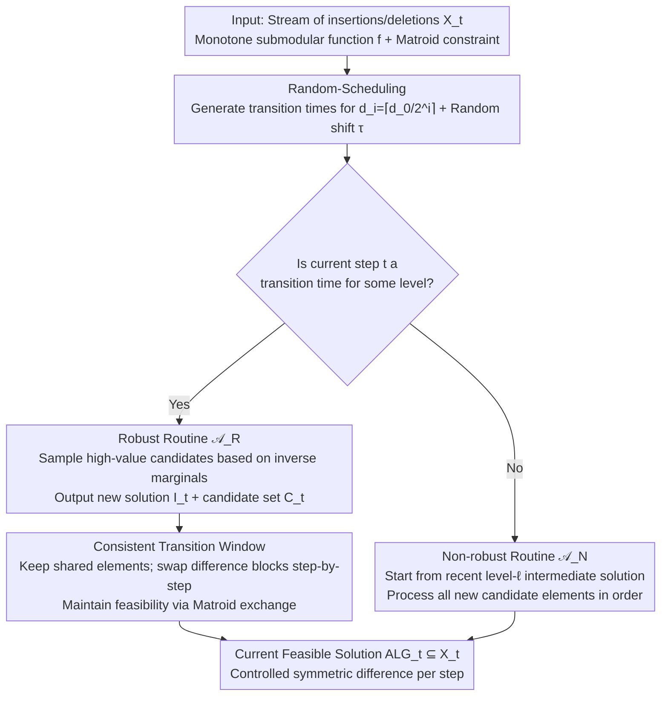

# A General Framework for Dynamic Consistent Submodular Maximization

**Conference**: ICML2026  
**arXiv**: [2606.04946](https://arxiv.org/abs/2606.04946)  
**Code**: No code provided  
**Area**: Optimization / Submodular Maximization / Dynamic Algorithms  
**Keywords**: Submodular maximization, dynamic algorithms, consistency, deletion-robust, Matroid constraint  

## TL;DR
This paper presents a general consistency framework for fully dynamic submodular maximization. In streaming environments with insertions and deletions, it provides the first constant approximation guarantees with sublinear worst-case per-step solution changes (recourse) for both cardinality and matroid constraints.

## Background & Motivation
**Background**: Submodular maximization is widely used in tasks such as data summarization, recommendation, active learning, and sparse selection. While traditional dynamic algorithms focus on how quickly they can maintain an approximately optimal solution after updates, recent work in consistent optimization requires that the solution presented to the user does not change drastically after each update.

**Limitations of Prior Work**: Existing research on consistent submodular maximization primarily addresses insertion-only scenarios. In insertion-only cases, old solutions typically do not become invalid due to the appearance of new elements. However, fully dynamic scenarios include deletions; if a critical element is deleted, the optimal solution may require a complete reconstruction. Directly reapplying dynamic algorithms might yield good approximations but could replace a massive number of elements in a single step.

**Key Challenge**: There is a conflict between approximation (adjusting solutions quickly to match the current optimum) and stability (modifying few elements per step). Insertions and deletions cause the optimal value to fluctuate, making monotonicity-based analysis from insertion-only settings inapplicable. Matroid constraints further restrict the set of exchangeable elements, complicating the process of repairing old solutions.

**Goal**: To construct a modular framework that Maintains high-value feasible solutions in fully dynamic environments while keeping the per-step symmetric-difference change at a small scale, provided a suitable robust submodular routine and a non-robust routine are given.

**Key Insight**: The authors borrow the coreset idea from deletion-robust submodular maximization. Instead of assuming a known number of deletions, they maintain multiple robustness levels. They also use random scheduling to distribute the recomputations of different levels across "transition windows," avoiding large-scale immediate replacements.

**Core Idea**: Candidacy solutions for different deletion robustness levels are periodically recomputed, and transitions occur block-by-block within short windows, effectively amortizing "global reconstruction" into multiple small changes.

## Method
The paper considers a sequence of operations provided by an oblivious adversary, where each step involves the insertion or deletion of an element. The algorithm maintains a feasible solution $ALG_t\subseteq X_t$ at each time $t$. The goals are two-fold: approximation requires $\mathbb{E}[f(ALG_t)]\geq \alpha f(OPT_t)$, and consistency requires the symmetric difference $|ALG_t\triangle ALG_{t-1}|$ between adjacent solutions to be bounded by a small constant $C$.

### Overall Architecture
The framework consists of three parts: Random-Scheduling, a robust routine $\mathcal{A}_R$, and a non-robust routine $\mathcal{A}_N$. Random-Scheduling generates multi-level transition times based on maximum and minimum robustness parameters $d_0$ and $d_\ell$, with each level corresponding to a deletion robustness level. When a transition time arrives, the algorithm calls the robust routine to recompute the intermediate solution and remaining candidate set for that level, then gradually switches the solution during a transition window. During normal time steps (outside transition windows), the algorithm uses the non-robust routine to process new candidate elements starting from the intermediate solution left by the most recent level-$\ell$ transition.

The key is not just when to recompute, but how to present the solution. Within a transition window, the algorithm does not immediately replace the old solution with the new one. Instead, it partitions the difference between the new and old sets into blocks, swapping one block at a step while maintaining matroid feasibility using the exchange property. Thus, even if internal solutions change significantly, the user-visible $ALG_t$ only undergoes controlled changes.

### Key Designs

**1. Random-Scheduling: Determining "When to Recompute" Offline**
The difficulty of fully dynamic settings lies in the fact that the scale of deletions is unknown and varies over time. The framework does not try to guess a single deletion budget; instead, it maintains a hierarchy of robustness levels $d_i=\lceil d_0/2^i\rceil$ (from $d_0$ down to $d_\ell$). Random-Scheduling recursively partitions the timeline: level 0 segments of length $d_0$ with transition windows of length $\varepsilon' d_0$, and the remaining intervals are recursively divided for lower levels. Finally, a uniform random cyclic shift $\tau$ is applied. This shift is critical for analysis—it ensures that any fixed time step falls into a transition window with probability at most $\varepsilon$ (Lemma 3.2), allowing the loss of approximation during transitions to be averaged out.

**2. Deletion-Robust Routine $\mathcal{A}_R$ and Candidate Sets: Retaining Deletion-Resistant Reserves**
At each transition time, the framework calls $\mathcal{A}_R$ with the previous level's intermediate solution $I_{t'}$ and the candidate set to produce an updated $I_t$ and a **remaining candidate set** $C_t$. The core is the deletion-robust coreset sampling idea: for matroids, Robust-Swap samples candidates with probability inversely proportional to their marginal contribution $f(u\mid I)$ (avoiding over-reliance on a few high-value elements) until the candidate count falls below $d/\varepsilon$. For cardinality, a simpler Robust-Greedy is used. These "leftover" high-value elements in $C_t$ serve as reserves to repair value when dominant elements are deleted without rebuilding the entire solution.

**3. Non-robust Routine $\mathcal{A}_N$: Lightweight Follow-up on Regular Steps**
Most steps are not transition times. These are handled by $\mathcal{A}_N$, which starts from the most recent level-$\ell$ solution $I_{t'}$ and processes **all** elements in the candidate set in a fixed order (using Swap for matroids: an element is swapped in only if its marginal contribution is at least twice that of the element being replaced). It does not need to be deletion-robust (that foundation is laid by $\mathcal{A}_R$); it simply ensures the solution quickly absorbs new insertions to maintain approximation.

**4. Consistency Transition Window: Amortizing Major Reconstructions**
A new solution $I_t$ calculated by a robust routine may differ significantly from the current solution $ALG_{old}$. Replacing it immediately would lead to a symmetric difference of $\Theta(k)$. The transition window keeps the shared elements $Shared_t = ALG_{old} \cap I_t$, splits the differences $I_t \setminus ALG_{old}$ and $ALG_{old} \setminus I_t$ into $\varepsilon' d_i$ equal blocks, and swaps one block per step over the next $\varepsilon' d_i$ steps. This mechanism decouples internal recomputations from external consistency—internal solutions can change drastically while the user sees a change of only $O(1/\varepsilon^2)$ (cardinality) or $O(\log k/\varepsilon^2)$ (matroid) elements per step.

## Key Experimental Results

### Main Results
This is a theoretical algorithm paper, so results are provided as mathematical guarantees rather than empirical tables.

| Setting | Algorithm | Approximation | Consistency (Recourse) | Significance |
|---------|-----------|---------------|------------------------|--------------|
| Cardinality constraint | ConsistentCardinality | $1/2-3\varepsilon$ | $O(1/\varepsilon^2)$ | Matches the $1/2$ level of dynamic submodular max while maintaining constant per-step change. |
| Rank-$k$ matroid constraint | ConsistentMatroid | $1/4-7\varepsilon$ | $O(\log k/\varepsilon^2)$ | Matches the $1/4$ level of streaming matroid max but allows deletions and logarithmic recourse. |
| Fully dynamic generic framework | Random scheduling + routines | Determined by routines | Determined by windows/ $d_i$ | Deconstructs consistent dynamic algorithms into a reusable template. |

### Ablation Study
As a theoretical paper, these represent the analytical roles of components.

| Configuration / Component | Impact | Explanation |
|---------------------------|--------|-------------|
| Removing robust routine | Loss of value after deletions | Cannot guarantee enough high-value replacements remain; performance collapses in fully dynamic settings. |
| Removing multi-level robustness | Inability to cover deletion scales | A single level is either too frequent or insufficiently robust; required for $O(\log k/\varepsilon^2)$ in matroids. |
| Removing transition window | Symmetric difference spikes | Without the window, direct replacement results in $\Theta(k)$ changes per step. |
| Removing random shift | Poor worst-case approximation | Certain times would always be in transition; shift ensures high probability of being outside transition periods. |

### Key Findings
- The primary difficulty of fully dynamic settings comes from deletions, not insertions. Deleting a dominant element forces global changes unless a robust candidate structure is pre-maintained.
- Matroid constraints are significantly harder than cardinality constraints because the set of exchangeable elements is restricted by independence constraints; this explains the $1/4$ vs $1/2$ gap.
- Consistency is guaranteed in the worst-case per step, which is superior for stable user interfaces compared to the amortized update time favored by standard dynamic algorithms.

## Highlights & Insights
- The framework is highly modular. Scheduling, consistency transitions, and submodular routines are decoupled, allowing future improvements in robust routines to be inherited by the consistency mechanism.
- Distributing transition loss via a random shift is a simple yet effective technique. It guarantees that any fixed time has a high probability of not being in a transition period.
- The paper adapts deletion-robust coreset concepts to online fully dynamic settings, using multiple robustness levels to handle unknown and varying deletion scales.

## Limitations & Future Work
- The results are purely theoretical; empirical validation on real-world data summarization or recommendation tasks is missing.
- Competitive oracle costs: Particularly in matroid cases, the number of independence oracle calls might be high.
- The framework assumes an oblivious adversary. Guarantees may not directly apply to adaptive adversaries or non-monotone functions.
- Engineering challenges: Implementing efficient block swapping in complex matroids during the transition window requires non-trivial care.

## Related Work & Insights
- **vs Insertion-only Consistent Submodular Maximization**: Previous work achieved constant consistency by relying on the monotonic structure of insertions; this paper extends this to deletions at the cost of complex robustness scheduling.
- **vs Deletion-robust Submodular Maximization**: Traditional deletion-robust methods assume a fixed deletion budget $d$; this paper maintains multiple $d_i$ levels to handle unknown, time-varying deletion scales.
- **vs Fully Dynamic Submodular Algorithms**: Conventional fully dynamic algorithms focus on amortized update time and may radically change solutions periodically; this paper treats "recourse" (solution stability) as a first-class objective.

## Rating
- Novelty: ⭐⭐⭐⭐☆ Combining fully dynamic, consistency, and matroid constraints is challenging.
- Experimental Thoroughness: ⭐⭐☆☆☆ Purely theoretical; lacks real-world data benchmarks.
- Writing Quality: ⭐⭐⭐⭐☆ Clear technical overview and modular algorithm description.
- Value: ⭐⭐⭐⭐☆ Highly significant for stable recommendation and dynamic selection systems.

<!-- RELATED:START -->

## Related Papers

- [\[ICML 2026\] Differentially Private Submodular Maximization with a Knapsack Constraint](differentially_private_submodular_maximization_with_a_knapsack_constraint.md)
- [\[ICLR 2026\] Efficient Submodular Maximization for Sums of Concave over Modular Functions](../../ICLR2026/optimization/efficient_submodular_maximization_for_sums_of_concave_over_modular_functions.md)
- [\[NeurIPS 2025\] Online Two-Stage Submodular Maximization](../../NeurIPS2025/optimization/online_two-stage_submodular_maximization.md)
- [\[ICML 2026\] Budget-Feasible Mechanisms for Submodular Welfare Maximization in Procurement Auctions](budget-feasible_mechanisms_for_submodular_welfare_maximization_in_procurement_au.md)
- [\[NeurIPS 2025\] A Unified Approach to Submodular Maximization Under Noise](../../NeurIPS2025/optimization/a_unified_approach_to_submodular_maximization_under_noise.md)

<!-- RELATED:END -->
## Related Papers

- [\[ICML 2026\] Budget-Feasible Mechanisms for Submodular Welfare Maximization in Procurement Auctions](budget-feasible_mechanisms_for_submodular_welfare_maximization_in_procurement_au.md)
- [\[ICML 2026\] Differentially Private Submodular Maximization with a Knapsack Constraint](differentially_private_submodular_maximization_with_a_knapsack_constraint.md)
- [\[NeurIPS 2025\] A Unified Approach to Submodular Maximization Under Noise](../../NeurIPS2025/optimization/a_unified_approach_to_submodular_maximization_under_noise.md)
- [\[NeurIPS 2025\] Online Two-Stage Submodular Maximization](../../NeurIPS2025/optimization/online_two-stage_submodular_maximization.md)
- [\[ICLR 2026\] Rethinking Consistent Multi-Label Classification Under Inexact Supervision](../../ICLR2026/optimization/rethinking_consistent_multi-label_classification_under_inexact_supervision.md)

<!-- RELATED:END -->
