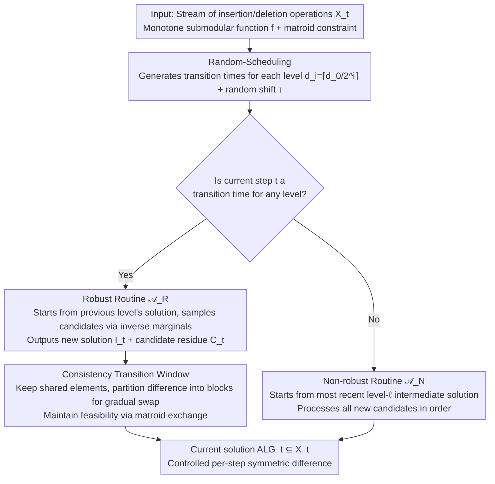

# A General Framework for Dynamic Consistent Submodular Maximization

**Conference**: ICML2026  
**arXiv**: [2606.04946](https://arxiv.org/abs/2606.04946)  
**Code**: No code provided  
**Area**: Optimization / Submodular Maximization / Dynamic Algorithms  
**Keywords**: Submodular Maximization, Dynamic Algorithms, Consistency, Deletion-robust, Matroid Constraints  

## TL;DR
This paper introduces a general consistency framework for fully dynamic submodular maximization. In a streaming environment permitting both insertions and deletions, it is the first to achieve constant-factor approximations alongside sublinear worst-case per-step solution changes for both cardinality and matroid constraints.

## Background & Motivation
**Background**: Submodular maximization is frequently employed in tasks such as data summarization, recommendation, active learning, and sparse selection. Traditional dynamic algorithms prioritize the speed of maintaining an approximate optimal solution after updates. More recently, consistent optimization also requires that the solution presented to the user does not change drastically after each update.

**Limitations of Prior Work**: Existing research on consistent submodular maximization primarily focuses on insertion-only scenarios. In such cases, old solutions typically do not become invalid immediately upon the appearance of new elements. However, fully dynamic scenarios include deletions; if a critical element is removed, the optimal solution may require a complete reconstruction. Directly reapplying dynamic algorithms may yield good approximations but could replace a large number of elements in a single step.

**Key Challenge**: There is an inherent tension between approximation quality and stability. High approximation requires the solution to follow the current optimum rapidly, while stability requires changing only a few elements per step. Insertions and deletions cause the current optimal value to fluctuate, making the monotonicity analysis common in insertion-only settings inapplicable. Matroid constraints further restrict the sets of exchangeable elements, complicating the repair of old solutions.

**Goal**: Construct a modular framework that, given appropriate robust submodular and non-robust routines, maintains a high-value feasible solution in a fully dynamic environment while limiting the symmetric-difference change at each step to a small scale.

**Key Insight**: The authors adopt the coreset concept from deletion-robust submodular maximization. Instead of knowing the number of deletions in advance, they maintain multiple robustness levels. Simultaneously, they use a random scheduling mechanism to disperse the recomputations of different levels into transition windows, avoiding large-scale, one-time replacements.

**Core Idea**: Candidate solutions for different deletion-robustness levels are recomputed periodically and transitioned block-by-block within short windows, effectively amortizing "global reconstruction" into multiple small changes.

## Method
The paper considers a sequence of operations provided by an oblivious adversary, where each step involves the insertion or deletion of an element. The algorithm maintains a feasible solution $ALG_t\subseteq X_t$ at each time $t$. The dual goals are: approximation quality requiring $\mathbb{E}[f(ALG_t)]\geq \alpha f(OPT_t)$, and consistency requiring the symmetric difference $|ALG_t\triangle ALG_{t-1}|$ between adjacent solutions to be bounded by some small value $C$.

### Overall Architecture
The framework consists of three components: Random-Scheduling, a robust routine $\mathcal{A}_R$, and a non-robust routine $\mathcal{A}_N$. Random-Scheduling generates multi-level transition times based on maximum and minimum robustness parameters $d_0, d_\ell$, with each level corresponding to a specific deletion robustness level. When a transition time arrives, the algorithm calls the robust routine to recompute the intermediate solution and the remaining candidate set for that level, then gradually transitions the solution during the subsequent transition window. At ordinary time steps (outside any transition window), the algorithm starts from the intermediate solution left by the most recent finest-level (level $\ell$) transition and uses the non-robust routine to process new candidate elements.

Crucially, it is not just about when to recompute, but how to present the solution. Within a transition window, the algorithm does not immediately replace the old solution with the new one. Instead, it partitions the difference between the new and old sets into several blocks, swapping only one block per step while maintaining matroid feasibility throughout, ensuring the user sees only controlled changes in $\text{ALG}_t$.

### Key Designs

**1. Random-Scheduling: Determining "when to recompute" offline**

The difficulty in fully dynamic settings lies in the fact that the scale of deletions is unknown and varies over time. Rather than guessing a single deletion budget, the framework maintains a family of robustness levels $d_i=\lceil d_0/2^i\rceil$ (decreasing from a maximum $d_0$ to a minimum $d_\ell$), allowing different levels to defend against deletions of varying scales. Random-Scheduling partitions the timeline recursively: level 0 is divided into segments of length $d_0$, with a transition window of length $\varepsilon' d_0$ at the start of each segment; the remaining intervals are recursively bisected for subsequent levels down to $d_\ell$. Finally, a uniform random cyclic shift $\tau$ is applied. This random shift is vital for analysis—it ensures that the probability of any fixed time step falling into a transition window is at most $\varepsilon$ (Lemma 3.2), thereby averaging out the approximation loss during transition periods. High robustness levels are recomputed less frequently, while low levels are recomputed more often, matching the intuition that "large deletions are rare, while small deletions are frequent."

**2. Robust Routine $\mathcal{A}_R$ and Candidate Residue: Retaining a deletion-resistant candidate pool**

At each transition time, the framework calls $\mathcal{A}_R$. Given the intermediate solution $I_{t'}$ from the previous level, the candidates $X_t\setminus(X_{t'}\setminus C_{t'})$, and the robustness parameter $d_i$, it outputs an updated solution $I_t$ and a **candidate residue** $C_t$. Its core is based on the sampling idea of deletion-robust coresets: for matroids, it uses Robust-Swap, sampling candidates with a probability proportional to the **inverse** of their marginal contribution $f(u\mid I)$ (elements with smaller marginals are more likely to be swapped in, preventing the solution from over-relying on a few high-value elements). For cardinality, a simpler Robust-Greedy is sufficient. Retaining $C_t$ rather than exhausting candidates provides a reserve of high-value elements for repairs after deletions—when a dominant element is removed, value can be recovered from $C_t$ with minimal changes.

**3. Non-robust Routine $\mathcal{A}_N$: Lightweight updates on ordinary steps**

Most time steps are not transition times. These are handled by the non-robust routine $\mathcal{A}_N$, which starts from the solution $I_{t'}$ of the most recent finest-level transition and processes **all** elements in the candidate set $X_t\setminus(X_{t'}\setminus C_{t'})$ in a fixed order. For matroids, it uses Swap: an element is swapped in only if its marginal contribution is at least twice that of the element it replaces. $\mathcal{A}_N$ does not handle deletion robustness (which is ensured by $\mathcal{A}_R$) but rather ensures the solution quickly absorbs new insertions to maintain approximation quality.

**4. Consistency Transition Window: Amortizing large reconstructions into small swaps**

The new solution $I_t$ calculated by the robust routine may differ significantly from the current solution $\text{ALG}_\text{old}$. Direct replacement would lead to a symmetric difference of $\Theta(k)$, violating consistency. The transition window approach keeps shared elements $\text{Shared}_t=\text{ALG}_\text{old}\cap I_t$ stationary and divides the sets $I_t\setminus\text{ALG}_\text{old}$ and $\text{ALG}_\text{old}\setminus I_t$ into $\varepsilon' d_i$ equal blocks. Over the next $\varepsilon' d_i$ steps, one block is swapped in and one block is swapped out per step, using matroid exchange properties to ensure feasibility at every sub-step. This mechanism decouples the algorithm's internal need for large updates from the requirement that the externally visible solution remains stable. The user sees changes of only $O(1/\varepsilon^2)$ (cardinality) or $O(\log k/\varepsilon^2)$ (matroid) elements per step.

### Loss & Training
This is a theoretical algorithms paper; there is no neural network training loss. Its objective is a monotone submodular function $f$ under cardinality or matroid independent set constraints. The algorithm utilizes a value oracle and a matroid feasibility oracle. The analysis provides approximation ratios, consistency bounds, and amortized oracle complexity.

## Key Experimental Results

### Main Results
The primary results are theoretical guarantees. The following table summarizes the approximation and consistency for the proposed algorithms in the fully dynamic setting.

| Setting | Algorithm | Approximation Guarantee | Consistency Guarantee | Significance |
|------|----------|----------|------------|--------------------|
| Cardinality constraint | ConsistentCardinality | $1/2-3\varepsilon$ | $O(1/\varepsilon^2)$ | Approaches the known $1/2$ level of dynamic submodular maximization while maintaining constant per-step changes in fully dynamic settings. |
| Rank-$k$ matroid constraint | ConsistentMatroid | $1/4-7\varepsilon$ | $O(\log k/\varepsilon^2)$ | Matches the classic $1/4$ approximation in streaming matroids but permits deletions and requires only logarithmic consistency. |
| Fully dynamic generic framework | Random scheduling + robust/non-robust routines | Defined by routines | Defined by transition window and $d_i$ | Decouples consistent dynamic algorithms into reusable templates. |
| Prev. SOTA insertion-only cardinality | Constant recourse algorithms | ~0.51 or theoretical upper bounds | Constant consistency | Does not handle deletions; relies on stronger monotonicity of the optimal value. |

### Ablation Study
As a theoretical paper, there is no empirical ablation; however, the role of each component can be viewed as an analytical ablation.

| Configuration / Component | Key Metric | Description |
|-------------|----------|------|
| Removing robust routine | Likely loss of critical elements after deletion | Cannot guarantee sufficient value in the candidate set; fails in fully dynamic scenarios. |
| Removing multi-level robustness | Difficulty covering deletion scales in matroids | A single level is either recomputed too often or is not robust to large deletions, making $O(\log k/\varepsilon^2)$ difficult. |
| Removing transition window | Approximation remains good, but consistency is lost | Symmetric difference can reach $\Theta(k)$ during direct replacement of new/old solutions. |
| Removing random shift | Fixed times always hit transitions | Approximation analysis cannot use the probability "not in transition $\geq 1-\varepsilon$" to bound losses. |
| Cardinality-specific Robust-Greedy | $1/2-3\varepsilon$, $O(1/\varepsilon^2)$ | Leverages the simple structure of uniform matroids, requiring only a single level of robustness. |

### Key Findings
- The difficulty of the fully dynamic setting arises primarily from deletions rather than insertions. The deletion of a dominant element can force a global change in the optimal solution, necessitating the advance preservation of a robust candidate structure.
- Matroid constraints are significantly more difficult than cardinality constraints because exchangeable elements are limited by independence constraints; this explains why the matroid result is $1/4$ while cardinality is $1/2$.
- Consistency is guaranteed in the worst-case for every single step, rather than in an amortized sense, which better serves users requiring stable recommendations or summaries.

## Highlights & Insights
- The framework is highly modular. Scheduling, consistency transitions, and submodular routines are decoupled, allowing future improvements in robust routines to be directly integrated while inheriting the consistency mechanism.
- Using a random shift to distribute transition losses is a simple yet effective technique. It does not guarantee optimal approximation at every moment but ensures that any fixed time has a high probability of not being in a transition phase.
- The paper adapts deletion-robust coreset ideas to the online fully dynamic setting and handles unknown, varying deletion scales through multiple robustness levels—a step closer to practical streaming systems than static deletion-robustness.

## Limitations & Future Work
- The results are primarily theoretical guarantees, lacking runtime and stability experiments on real-world data summarization or recommendation tasks. Actual oracle costs might be high, especially independence oracle calls for matroids.
- The approximation ratios remain constant-factor, with $1/4-O(\varepsilon)$ for matroids. Applications sensitive to quality may need to integrate stronger offline or dynamic submodular routines.
- The framework assumes an oblivious adversary and uses randomization in its analysis. The guarantees may not apply directly against an adaptive adversary or for non-monotone submodular functions.
- Block-by-block swapping within the transition window requires specific implementation details; efficiently finding feasible exchange blocks in complex matroids remains an engineering challenge.

## Related Work & Insights
- **vs insertion-only consistent submodular maximization**: Previous work achieved constant consistency and better approximations but relied on the monotonic structure of insertion-only settings. This work extends to concurrent insertions and deletions at the cost of more complex robust scheduling.
- **vs deletion-robust submodular maximization**: Deletion-robust methods typically assume a fixed deletion budget $d$. This paper maintains multiple levels $d_i$ online because future deletion scales are unknown.
- **vs fully dynamic submodular algorithms**: Classic fully dynamic algorithms prioritize amortized update time and may change the solution drastically. This work treats "solution change as seen by the user" as a first-class metric.
- **vs online submodular maximization with preemption**: Preemption allows replacing old elements with fresh ones but discarded elements cannot be recovered; the goals differ. This work maintains a stable solution within a dynamic set of currently available elements.

## Rating
- Novelty: ⭐⭐⭐⭐☆ The combination of fully dynamic settings, consistency, and matroid constraints is challenging, and the framework design is highly reusable.
- Experimental Thoroughness: ⭐⭐☆☆☆ A purely theoretical paper lacking real-world experiments; however, the theorems and complexity analyses are comprehensive.
- Writing Quality: ⭐⭐⭐⭐☆ The technical overview is clear and the algorithm components are well-structured, though the proofs are extensive with long symbolic chains.
- Value: ⭐⭐⭐⭐☆ Significant theoretical value for stable data summarization and recommendation; highlights that dynamic optimization should consider more than just approximation and update time.

<!-- RELATED:START -->

## Related Papers

- [\[ICML 2026\] Budget-Feasible Mechanisms for Submodular Welfare Maximization in Procurement Auctions](budget-feasible_mechanisms_for_submodular_welfare_maximization_in_procurement_au.md)
- [\[NeurIPS 2025\] A Unified Approach to Submodular Maximization Under Noise](../../NeurIPS2025/optimization/a_unified_approach_to_submodular_maximization_under_noise.md)
- [\[NeurIPS 2025\] Online Two-Stage Submodular Maximization](../../NeurIPS2025/optimization/online_two-stage_submodular_maximization.md)
- [\[ICLR 2026\] Rethinking Consistent Multi-Label Classification Under Inexact Supervision](../../ICLR2026/optimization/rethinking_consistent_multi-label_classification_under_inexact_supervision.md)
- [\[CVPR 2026\] Dynamic Momentum Recalibration in Online Gradient Learning](../../CVPR2026/optimization/dynamic_momentum_recalibration_in_online_gradient_learning.md)

<!-- RELATED:END -->
