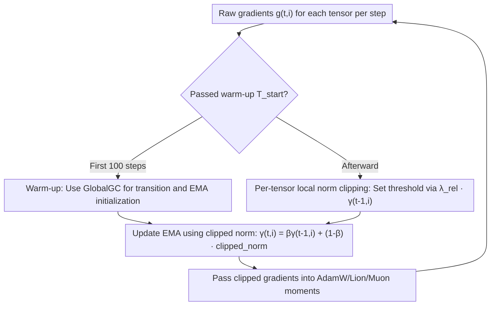

# AdaGC: Enhancing LLM Pretraining Stability via Adaptive Gradient Clipping

**Conference**: ICML 2026  
**arXiv**: [2502.11034](https://arxiv.org/abs/2502.11034)  
**Code**: PaddlePaddle/PaddleFleet（Research/AdaGC）  
**Area**: LLM Efficiency / Optimizers and Training Stability  
**Keywords**: Gradient Clipping, loss spike, per-tensor adaptive, EMA, LLM Pretraining

## TL;DR
To address the recurring loss spikes in large model pretraining, AdaGC replaces the "one-size-fits-all" Global Gradient Clipping with "per-tensor adaptive clipping based on the EMA of its own historical gradient norm." By suppressing abnormal gradients before they pollute the optimizer's first and second moments, it reduces spike scores to zero on Llama-2 7B, Mixtral 8×1B, and ERNIE 10B-A1.4B, while improving downstream accuracy by +1.32%, +1.27%, and +2.48% respectively compared to Global Gradient Clipping (GlobalGC).

## Background & Motivation
**Background**: Pretraining large models often involves thousands of GPUs running for weeks, necessitating smooth convergence of training curves. The industry standard for stable training is **Global Gradient Clipping (GlobalGC)**—concatenating all parameter gradients into a single large vector, calculating its global $\ell_2$ norm, and scaling the entire vector proportionally if it exceeds a fixed threshold $\lambda_{abs}$.

**Limitations of Prior Work**: Even with GlobalGC, loss spikes (sudden surges in loss or even divergence) frequently occur. Replication experiments in the paper found that increasing AdamW's $\beta_2$, decreasing $\epsilon$, or reducing RMSNorm precision below FP32 can trigger spikes. Curiously, **resuming from a checkpoint while keeping the random seed and data unchanged can sometimes bypass a spike purely by luck**, due to minor stochasticity in $dQ/dK/dV$ during FlashAttention backward passes. This indicates that spike triggers are extremely sensitive, making repeated restarts a costly strategy for survival.

**Key Challenge**: While the upstream causes of spikes are diverse (data noise, hardware glitches, numerical precision, hyperparameters), the authors observe that they **converge to the same manifestation: an abnormally large gradient at a specific moment is absorbed into the optimizer's first/second moment accumulators, polluting all subsequent updates**. Instead of locating every root cause, it is more effective to intercept these gradients before they enter the momentum. GlobalGC fails here due to two mismatches: ① **Temporal mismatch**—the optimal clipping threshold gradually decreases as training progresses, and a fixed threshold becomes ineffective in later stages; ② **Spatial mismatch**—gradient statistics and spike timings for different parameter tensors are varied and asynchronous; a single global threshold either under-protects one tensor or over-constrains another.

**Goal**: Design a clipping rule that possesses both **temporal adaptivity** and **spatial specificity**, taking effect before abnormal gradients enter the momentum accumulators.

**Key Insight / Core Idea**: Abandon the global norm and instead use **each tensor's own historical gradient norm EMA as a reference**. Any tensor exceeding this reference is individually suppressed back to the baseline level. This approach is summarized by two principles: locality (per-tensor) and adaptivity (EMA dynamic threshold).

## Method

### Overall Architecture
AdaGC is an **optimizer-agnostic preprocessing step**: before passing gradients to the optimizer (AdamW, Lion, or Muon) at each step, a per-tensor adaptive clipping is performed. The input consists of the raw gradients $\boldsymbol{g}_{t,i}$ for each tensor at the current step, and the output is the clipped gradients, which are then used to update moments and parameters. The process only maintains one additional scalar—the gradient norm EMA $\gamma_{t,i}$ per tensor. Training is divided into two phases: the first $T_{start}$ steps (default 100) use traditional GlobalGC for transition and EMA initialization, followed by a switch to per-tensor AdaGC.

### Key Designs

**1. Per-tensor Local Norm Clipping: Scaling Constraints Individually**

This addresses the "spatial mismatch" of GlobalGC. AdaGC no longer calculates a global norm but clips the $i$-th tensor at step $t$ individually:

$$\boldsymbol{g}_{t,i}\leftarrow h_{t,i}\cdot\boldsymbol{g}_{t,i},\quad h_{t,i}=\min\left\{\lambda_{rel}\frac{\gamma_{t-1,i}}{\|\boldsymbol{g}_{t,i}\|},\,1.0\right\}$$

where $\gamma_{t-1,i}$ is the EMA of the historical gradient norm for that tensor, and $\lambda_{rel}$ is the relative threshold (default 1.04). Intuitively, if the current norm $\|\boldsymbol{g}_{t,i}\|$ of a tensor exceeds $\lambda_{rel}$ times its own recent average, it is scaled back to $\lambda_{rel}\cdot\gamma_{t-1,i}$; otherwise, it remains unchanged ($h_{t,i}=1$). Since the threshold is relative to itself, dimensional differences across tensors are naturally normalized. A local spike in one tensor is neither diluted by the global norm nor does it affect other healthy tensors. Compared to GlobalGC (global, fixed $\lambda_{abs}$) and ZClip (global, EMA z-score), AdaGC is the only norm-based method in Table 2 that achieves **tensor-level granularity and EMA adaptive thresholds**.

**2. Historical Norm EMA as Dynamic Threshold: Self-adjusting Clipping Lines**

This addresses the "temporal mismatch" of GlobalGC. The reference line $\gamma_{t,i}$ is maintained via exponential moving average:

$$\gamma_{t,i}=\beta\gamma_{t-1,i}+(1-\beta)\|\boldsymbol{g}_{t,i}\|$$

with $\beta$ (default 0.99) as the smoothing coefficient. As the global gradient norm decreases during training, the EMA automatically follows, causing the clipping threshold $\lambda_{rel}\cdot\gamma_{t-1,i}$ to tighten accordingly. A crucial detail is that **the norm written back to the EMA is the clipped norm, not the original raw norm**. This prevents an abnormally large gradient from raising the EMA itself, which would relax subsequent thresholds and create a "broken window effect." Anomalies are suppressed without polluting historical statistics.

**3. Warm-up Transition: Avoiding Early Training Traps**

This solves a cold-start problem: during the first few dozen or hundred steps, gradient norms are naturally large, volatile, and rapidly decreasing. Applying AdaGC immediately could lead to two issues: first, large early norms could be incorrectly accumulated into the EMA, creating compound errors; second, it might delay clipping compared to GlobalGC, slowing down the initial loss descent. AdaGC introduces a hyperparameter $T_{start}$ (default 100), during which it reverts to traditional GlobalGC while initializing the EMA for each tensor before switching to per-tensor adaptive clipping.

### Loss & Training
AdaGC does not modify the loss function or model architecture; it simply inserts a clipping step before gradients enter the optimizer. Thus, it is **optimizer-agnostic**—the paper provides an integrated algorithm with AdamW and validates its use with Lion and Muon. Key hyperparameters determined via grid search on Llama-2 7B are $\lambda_{rel}=1.04$ and $\beta=0.99$. Accuracy fluctuates minimally within $\lambda_{rel}\in[1.03, 1.05]$ and $\beta\in[0.98, 0.999]$, indicating low hyperparameter sensitivity.

## Key Experimental Results

### Main Results
Evaluation covers dense (Llama-2 1.3B/7B, Qwen3-1.7B) and MoE (Mixtral 8×1B, ERNIE 10B-A1.4B) architectures using the C4-en pretraining corpus. Stability is measured by **spike score** (percentage of values deviating $\geq 10$ standard deviations from the 1000-step rolling mean), and quality is measured by average zero-shot/few-shot benchmark accuracy.

| Model | Metric | GlobalGC | AdaGC | Gain |
|------|------|----------|-------|------|
| Llama-2 7B | Zero-shot Mean | 49.69 | 51.01 | +1.32% |
| Mixtral 8×1B | Zero-shot Mean | 47.74 | 49.01 | +1.27% |
| Qwen3-1.7B | Zero-shot Mean | 48.42 | 50.37 | +1.95% |
| ERNIE 10B-A1.4B (1T tokens) | General Ability Eval | — | — | +2.48% |

### Spike Score Comparison

| Model | Method | Steps | Spike Counts | Spike Score (%) |
|------|------|------|-----------|----------------|
| Llama-2 7B | GlobalGC | 9K | 3 | 0.0333 |
| Llama-2 7B | ClipByValue | 9K | 9 | 0.1000 |
| Llama-2 7B | AdaGC | 9K | **0** | **0.0000** |
| Qwen3-1.7B | GlobalGC | 19K | 54 | 0.2842 |
| Qwen3-1.7B | ZClip | 19K | 8 | 0.0421 |
| Qwen3-1.7B | AdaGC | 19K | **1** | **0.0053** |
| Mixtral 8×1B | GlobalGC | 36K | 52 | 0.0144 |
| Mixtral 8×1B | AdaGC | 36K | **0** | **0.0000** |
| ERNIE 10B-A1.4B | GlobalGC | 21K | 2 | 0.0100 |
| ERNIE 10B-A1.4B | AdaGC | 21K | **0** | **0.0000** |

### Key Findings
- **Spikes nearly eliminated**: Across four models, AdaGC reduced spike scores to zero or near-zero (Qwen3 reduced to 0.0053). Since Qwen3 already uses architecture-level stability like QK-Norm, AdaGC provides **complementary gains** on top of existing methods.
- **Stability is Quality**: Downstream accuracy improved systematically after spikes were eliminated, supporting the argument that "training stability is strongly correlated with final model quality." On ERNIE, AdaGC enabled the use of a smaller $\epsilon=1\mathrm{e}{-15}$ (allowing more parameters to utilize AdamW adaptive learning rates), resulting in a +2.48% gain.
- **Hyperparameter Robustness**: Accuracy remains stable within the $\lambda_{rel}$ and $\beta$ grid, showing a wide plateau around the optimal (1.04, 0.99).
- **Negligible System Overhead**: Each tensor only stores one additional 4-byte float (extra memory complexity on ERNIE is $\mathcal{O}((9+3E)\times L+3)$, where $L$ is layer count and $E$ is expert count). Computational cost is comparable to GlobalGC, while communication is more efficient—GlobalGC requires an all-reduce across DP/TP/PP groups, whereas AdaGC only requires an **intra-TP group** all-reduce to calculate local norms.

## Highlights & Insights
- **Pragmatic Perspective**: The "suppress the bottleneck" approach is highly practical. Rather than identifying every trigger, the paper intercepts them at a common bottleneck where abnormal gradients pollute moments.
- **Writing back clipped norms** is a critical detail: it prevents anomalies from raising their own reference thresholds, effectively making the statistics "self-consistent and contamination-proof."
- **Per-tensor relative thresholds** naturally normalize scales across different modules (embedding, attention, expert, RMSNorm), allowing a single global $\lambda_{rel}$ to manage all tensors without layer-wise tuning.
- **Reduced communication overhead** is a tangible benefit in distributed training: downgrading global all-reduce to intra-TP group all-reduce provides throughput gains on large clusters as a free byproduct of spike suppression.

## Limitations & Future Work
- **Training duration**: To run multiple experiments, pretraining steps/tokens were limited (e.g., Llama-2 7B only for 9K steps / 36B tokens). Absolute spike scores depend on this short-run setting; performance during long-term training requires further validation (though ERNIE 1T tokens was a step in this direction).
- **New Hyperparameters**: While robustness was argued, the optimal $T_{start}$, $\lambda_{rel}$, and $\beta$ across different architectures or optimizers may still require broader verification.
- **"Collaborative" Anomalies**: If multiple tensors exhibit small anomalies that are only fatal when combined, per-tensor thresholds might independently judge them as normal. Such cross-tensor coupled spikes are not explicitly modeled.
- **Future Directions**: Exploring the link between EMA references and second-moment statistics (similar to ZClip but at the tensor level), or using specialized EMA update rhythms for sparse activation tensors like MoE routers.

## Related Work & Insights
- **vs. GlobalGC**: Both are norm-based and clip gradients rather than updates. However, GlobalGC is global with a fixed threshold, while AdaGC is per-tensor with an EMA adaptive threshold, fixing both temporal and spatial mismatches while saving communication.
- **vs. ZClip**: ZClip also uses EMA but tracks the **global** gradient norm and performs z-score anomaly detection. AdaGC operates at the tensor level, outperforming ZClip on Qwen3 (spike score 0.0053 vs. 0.0421).
- **vs. AGC / Clippy**: These use weights as thresholds and clip **updates** $\Delta_t$ rather than gradients, allowing abnormal gradients to pollute moments before clipping. AdaGC intercepts at the source.
- **vs. SPAM**: SPAM relies on momentum resets and element-wise clipping based on second moments. AdaGC achieves better zero-shot accuracy on Llama-2 1.3B/7B (46.33%/51.01% vs. 45.58%/48.85%) with a simpler mechanism.

## Rating
- Novelty: ⭐⭐⭐⭐ Shifting from global clipping to per-tensor EMA adaptivity is a simple yet effective modification with a clear gradient-centric perspective.
- Experimental Thoroughness: ⭐⭐⭐⭐ Coverage of multiple architectures, optimizers, and baselines using both spike scores and downstream accuracy, though pretraining runs are relatively short.
- Writing Quality: ⭐⭐⭐⭐ Motivation (mismatch) and principles (locality/adaptivity) are clearly explained. Table 2 provides an excellent comparison.
- Value: ⭐⭐⭐⭐⭐ Plug-and-play, optimizer-agnostic, near-zero overhead, and communication-saving. High value for practical LLM pretraining deployment.

<!-- RELATED:START -->

## Related Papers

- [\[ICML 2026\] Enhancing LLM Training via Spectral Clipping](enhancing_llm_training_via_spectral_clipping.md)
- [\[ICML 2026\] Memory-Efficient LLM Pretraining via Minimalist Optimizer Design](memory-efficient_llm_pretraining_via_minimalist_optimizer_design.md)
- [\[ICML 2026\] Adaptive Preconditioners Trigger Loss Spikes in Adam](adaptive_preconditioners_trigger_loss_spikes_in_adam.md)
- [\[ICML 2026\] Stability Analysis of Sharpness-Aware Minimization](stability_analysis_of_sharpness-aware_minimization.md)
- [\[ICML 2026\] Can Adaptive Gradient Methods Converge under Heavy-Tailed Noise? A Case Study of AdaGrad](can_adaptive_gradient_methods_converge_under_heavy-tailed_noise_a_case_study_of_.md)

<!-- RELATED:END -->
