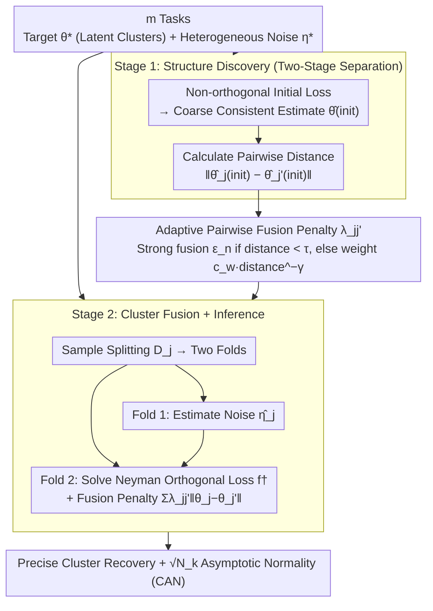

# Adaptive Estimation and Inference in Semi-parametric Heterogeneous Clustered Multitask Learning via Neyman Orthogonality

**Conference**: ICML 2026  
**arXiv**: [2605.01907](https://arxiv.org/abs/2605.01907)  
**Code**: None  
**Area**: Multitask Learning / Causal Inference / Semi-parametric Statistics  
**Keywords**: Neyman Orthogonality, Adaptive Fusion, Latent Clustering, Heterogeneous Noise, Asymptotic Normality

## TL;DR
This paper bridges Double Machine Learning (DML) and clustered multitask learning by proposing an adaptive framework that combines Neyman orthogonality with a data-driven pairwise fusion penalty. In semi-parametric settings with heterogeneous (potentially infinite-dimensional) nuisance parameters, it accurately recovers latent task clusters, achieves oracle-level aggregation rates, and establishes asymptotic normality for valid statistical inference.

## Background & Motivation

**Background**
Multitask Learning (MTL) improves statistical efficiency through shared structures, but in reality, tasks are often only partially related: they may share target parameters, but auxiliary features, data distributions, and confounders vary significantly. Clustered MTL attempts to discover latent groups among tasks. Recent advances in Double Machine Learning (DML) enable the estimation of low-dimensional target parameters under high-dimensional or non-parametric noise.

**Limitations of Prior Work**
1. **Strong assumptions in existing MTL**: Most methods assume aligned feature spaces or isomorphic task structures, failing to handle heterogeneous features and distribution shifts adequately.
2. **DML as a single-task procedure**: Standard DML does not exploit cross-task similarities; variance can be high when individual task sample sizes are limited.
3. **Challenge of clustered learning with infinite-dimensional noise**: Existing clustered MTL methods (fusion penalties, centroid regularization) mostly assume parametric models and cannot handle task-specific complex high-dimensional noise.

**Key Challenge**
There is a need to share information across tasks to reduce variance while maintaining flexible, task-localized noise estimation to preserve inference validity—two goals that often appear to conflict.

**Goal**
Design a method that simultaneously: (i) discovers and utilizes shared target parameter structures, (ii) remains robust to heterogeneous, potentially infinite-dimensional noise, and (iii) establishes rigorous inference guarantees.

**Key Insight**
Starting from a first-stage task-level initial estimation (used for similarity quantification), the second stage uses Neyman orthogonality to protect inference. Fusion penalties are applied only to target parameters (cross-task), while nuisance parameters remain task-local (no cross-task contamination).

**Core Idea**
A two-stage adaptive fusion: Stage 1 uses an arbitrary (potentially non-orthogonal) initial loss to obtain coarse consistent estimates and compute task-pair distances. Stage 2 enforces similarity through an adaptive pairwise penalty $\lambda_{jj'}=\min(c_w\|\hat\theta_j^{\text{init}}-\hat\theta_{j'}^{\text{init}}\|_2^{-\gamma},\text{const})$, combined with an orthogonal loss and sample splitting. This allows the method to achieve $\sqrt{N_k}$ (aggregated sample size) level Consistent Asymptotic Normality (CAN) even after adaptive clustering.

## Method

### Overall Architecture
For $m$ tasks, task $j$ has target parameters $\theta_j^*\in\Theta\subseteq\mathbb R^d$ and nuisance parameters $\eta_j^*\in\mathcal H_j$. It is assumed that $\{\theta_j^*\}$ admits a latent clustering $\{S_k\}_{k=1}^K$, where $\theta_j^*=\beta_k^*$ within the same cluster, but $\eta_j^*$ can differ significantly in dimension, smoothness, etc.

**Two-Stage Estimator**:
- **Stage 1 (Structure Discovery)**: For each task $j$, a coarse initial $\hat\theta_j^{\text{init}}$ is obtained using a potentially non-orthogonal loss $\ell_j^{\text{init}}$. These initial estimates are used only to diagnose task similarity and do not require optimal rates.
- **Stage 2 (Cluster Fusion)**: Sample splitting $\mathcal D_j=\mathcal D_{j,1}\cup\mathcal D_{j,2}$. Nuisance parameters $\hat\eta_j$ are estimated on $\mathcal D_{j,1}$. On $\mathcal D_{j,2}$, the multitask objective is solved: $\hat{\boldsymbol\theta}=\arg\min\sum_j f_j^\dagger(\theta_j,\hat\eta_j)+\sum_{j<j'}\lambda_{jj'}\|\theta_j-\theta_{j'}\|_2$, where $f_j^\dagger$ is the orthogonal loss. The penalty $\lambda_{jj'}$ takes a minimum value $\epsilon_n$ (strong fusion) if the initial distance is $<\tau$, and takes weight $c_w\|\cdot\|^{-\gamma}$ otherwise.

The pipeline integrates as follows: data from all tasks enters Stage 1 to calculate initial estimates and pairwise distances; these distances feed into the adaptive fusion penalty to determine which tasks should be coupled. Stage 2 performs sample splitting for each task—estimating noise on one fold and solving for target parameters with fusion penalties on the orthogonal loss fold—yielding simultaneous cluster recovery and valid inference.

### Key Designs

**1. Within-task Neyman Orthogonality + Sample Splitting: Preventing noise estimation error from contaminating target parameters**

Multitask fusion involves cross-task mixing at the target level. Since nuisance parameters $\eta_j$ are high-dimensional or infinite-dimensional, their estimation errors could propagate through the fusion to target parameters, invalidating inference. The authors design the loss $\ell_j^\dagger$ for each task to be Neyman orthogonal to the noise, meaning the Gâteaux derivative $D_\eta\nabla_\theta\mathbb{E}[\ell_j^\dagger]|_{(\theta_j^*,\eta_j^*)}[h]=0$ holds for all directions $h$. Thus, the first-order noise error $\|\hat\eta-\eta^*\|=O_p(1/\sqrt n)$'s impact on $\theta$ estimation is eliminated. Combined with sample splitting—using one fold for noise and another for the target—overfitting is prevented. Crucially, fusion only occurs across tasks at the target level, while noise remains task-local, preventing erroneous inter-task bias from spreading.

**2. Adaptive Pairwise Fusion Penalty: Inferring cluster probability from initial distance to dynamically adjust fusion strength**

Fixed weights (e.g., MeTaG) do not know which tasks should be tied together, while hard clustering (e.g., ARMUL) requires prior knowledge of the number of clusters $K$ and is not robust to discrete switching. The authors use initial estimates from the first stage to calculate pairwise distances, defining weights $w_{jj'}=c_w\|\hat\theta_j^{\text{init}}-\hat\theta_{j'}^{\text{init}}\|_2^{-\gamma}$. Larger distances result in smaller weights and weaker fusion. A threshold $\tau$ is added: pairs with distance $<\tau$ receive a minimal penalty $\epsilon_n$ (strong fusion), while others use $w_{jj'}$ (moderate fusion). This two-layer structure achieves precise cluster recovery (Theorem 3.5) under strong separation assumptions and is robust to hyperparameters and separation conditions due to its smooth transition.

**3. Two-Stage Separate Design: Using the best tools for "cluster discovery" and "precise inference"**

Combining discovery and inference into a single framework often compromises both. The authors separate them: the first stage only calculates task similarity and requires consistency rather than optimal rates. This allows for the selection of estimators that are more stable with small samples, even if they have some bias—since they are only used to calculate $w_{jj'}$, stability leads to more reliable distances. The second stage then applies orthogonal loss and sample splitting, focusing on refined estimation and inference. This ensures each objective uses the most suitable tool.

### Loss & Training
The optimization of $\theta$ in the second stage is a convex problem, solvable via accelerated gradient or proximal methods. Orthogonality is naturally implemented through the loss design on $\mathcal D_{j,2}$ via sample splitting. The paper proves the conclusions hold for a wide range of $(c_w,\gamma,\tau,\epsilon_n)$, providing a robust guide for hyperparameter selection.

## Key Experimental Results

### Main Results

| Model | Setting | RMSE | ARI | vs Personalized | vs ARMUL (Correct K) | vs MeTaG |
|------|------|------|-----|-----------------|------------------|----------|
| PLM | $\delta=1/3$ | **0.18** | **0.98** | -67% | +2% | -85% |
| PLM | $\delta=2/3$ | **0.12** | **0.99** | -72% | -1% | -88% |
| PLM | $\delta=1.0$ | **0.08** | **1.00** | -78% | -3% | -91% |
| ATE | $\delta=1/3$ | **0.22** | **0.97** | -63% | +5% | -80% |
| ATE | $\delta=2/3$ | **0.15** | **0.99** | -70% | 0% | -85% |
| DID | $\delta=2/3$ | **0.19** | **0.98** | -68% | +1% | -83% |

ARMUL performs slightly better when K is correct but significantly degrades when K is incorrect; the proposed method remains optimal regardless of the correctness of K.

### Ablation Study

| Component | Change | RMSE Gain | ARI Drop | Note |
|------|------|---------|---------|------|
| Full Method | - | - | - | Baseline |
| w/o Orthogonality | Non-orthogonal loss in Stage 2 | +45% | No change | No bias but increased variance |
| Fixed Penalty | $\lambda_{jj'}=0.01$ for all | +28% | +0.15 | No adaptation, under-fusion |
| Single Layer | $\lambda=w_{jj'}$ without threshold | +18% | +0.08 | Improper fusion strength |
| w/o Splitting | Shared fold for noise/target | +32% | No change | Overfitting, unreliable inference |

### Key Findings
- **Precise Cluster Recovery**: High ARI (≈0.98) even under weak cluster separation ($\delta=1/3$), whereas ARMUL requires precise knowledge of K.
- **Criticality of Adaptive Weights**: Fixed weights lead to +28% RMSE, confirming the importance of personalized fusion strength.
- **Necessity of Orthogonality**: RMSE increases by 45% without orthogonality; although clustering is unaffected, confidence interval coverage fails.
- **Sample Splitting Protection**: While it doesn't affect point estimates much, inference (CI coverage) fails significantly without splitting.
- **Hyperparameter Robustness**: Results are insensitive to ranges of $(\gamma,\tau)$, supporting the "broad condition" theory.

### Real-world Application
Analysis of electricity price elasticity across 50 US states + DC revealed 3 clusters:
- Cluster 0 (VA): High elasticity -1.138, cooling-intensive with high adjustability.
- Cluster 1 (KY/AL/OK/TN): Moderate elasticity -0.788, warm southern states.
- Cluster 2 (remaining 46 states): Low elasticity -0.221.

Clustered groups align with climate and geography, validating the effectiveness in real heterogeneous multitask settings.

## Highlights & Insights
- **Role of Neyman Orthogonality in MTL**: Combining DML with clustered fusion ensures valid inference even under cross-task fusion.
- **Sophistication of Adaptive Weights**: Learning soft adaptive weights from data is significantly more robust to hyperparameters than hard clustering.
- **Philosophy of Two-Stage Separation**: Decoupling "discovery" from "precise inference" allows each stage to use optimal tools, avoiding the rigidity of a single framework.
- **Economic Application Integration**: Discovery of regional electricity elasticity validates the method and provides policy-relevant insights.

## Limitations & Future Work
- **Limited to Low-dimensional Target Parameters**: Extensions to high-dimensional targets (dimension growing with sample size) are not considered.
- **Cluster Separation Assumption**: Still requires a minimum separation $\delta$ between clusters; not applicable to completely continuous task spaces.
- **Practical Challenges of Noise Estimation**: Theory requires $O_p(n_j^{-1/4})$ rates, which may be difficult to achieve with overly complex models.

## Related Work & Insights
- **vs ARMUL**: Both perform clustered MTL, but ARMUL requires prior K; the proposed method recovers it automatically and is more robust to hyperparameters.
- **vs Single-task DML**: Extends the DML framework to multitask clustering while retaining advantages in inference validity.
- **vs Classical Clustered Learning (Jacob et al.)**: Earlier methods often restricted to parametric models; this work significantly extends to heterogeneous semi-parametric noise.

## Rating
- Novelty: ⭐⭐⭐⭐⭐ The combination of Neyman orthogonality and adaptive cluster fusion is novel, as is the two-stage framework.
- Experimental Thoroughness: ⭐⭐⭐⭐ Includes three semi-parametric models, multiple separation levels, thorough ablation, and real-world application.
- Writing Quality: ⭐⭐⭐⭐ Mathematically rigorous with clear theorem statements and intuitive results.
- Value: ⭐⭐⭐⭐ Directly applicable in causal inference and economics; the theoretical framework is impactful for multitask inference.

<!-- RELATED:START -->

## Related Papers

- [\[ICLR 2026\] FedDAG: Clustered Federated Learning via Global Data and Gradient Integration for Heterogeneous Environments](../../ICLR2026/optimization/feddag_clustered_federated_learning_via_global_data_and_gradient_integration_for.md)
- [\[NeurIPS 2025\] Robust Estimation Under Heterogeneous Corruption Rates](../../NeurIPS2025/optimization/robust_estimation_under_heterogeneous_corruption_rates.md)
- [\[ICLR 2026\] Incentives in Federated Learning with Heterogeneous Agents](../../ICLR2026/optimization/incentives_in_federated_learning_with_heterogeneous_agents.md)
- [\[ICLR 2026\] MASAM: Multimodal Adaptive Sharpness-Aware Minimization for Heterogeneous Data Fusion](../../ICLR2026/optimization/masam_multimodal_adaptive_sharpness-aware_minimization_for_heterogeneous_data_fu.md)
- [\[CVPR 2026\] ACE-Merging: Data-Free Model Merging with Adaptive Covariance Estimation](../../CVPR2026/optimization/ace-merging_data-free_model_merging_with_adaptive_covariance_estimation.md)

<!-- RELATED:END -->
