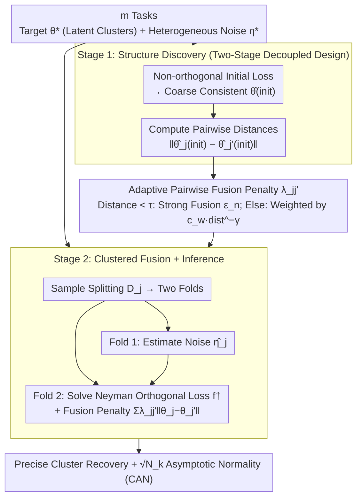

# Adaptive Estimation and Inference in Semi-parametric Heterogeneous Clustered Multitask Learning via Neyman Orthogonality

**Conference**: ICML 2026  
**arXiv**: [2605.01907](https://arxiv.org/abs/2605.01907)  
**Code**: None  
**Area**: Multi-task Learning / Causal Inference / Semi-parametric Statistics  
**Keywords**: Neyman orthogonality, adaptive fusion, latent clustering, heterogeneous noise, asymptotic normality

## TL;DR
This paper bridges double machine learning with clustered multi-task learning, proposing an adaptive framework that combines Neyman orthogonality with data-driven pairwise fusion penalties. In a semi-parametric setting with heterogeneous (potentially infinite-dimensional) noise, it precisely recovers the latent task clusters, achieves oracle-level performance at an aggregated rate, and establishes asymptotic normality for valid statistical inference.

## Background & Motivation

**Background**
Multi-task learning (MTL) improves statistical efficiency by sharing structures, but in reality, tasks are often only partially related: they may share target parameters, while auxiliary features, data distributions, and confounders vary significantly. Clustered multi-task learning attempts to discover latent groupings among tasks. Recent advances in Double Machine Learning (DML) have made it possible to estimate low-dimensional target parameters under high-dimensional or non-parametric noise.

**Limitations of Prior Work**
1. **Existing MTL assumptions are too strong**: Most methods assume aligned feature spaces or isomorphic task structures, performing poorly under heterogeneous features and distribution shifts.
2. **DML as a single-task procedure**: DML itself does not exploit cross-task similarity; variance can be high when the sample size for an individual task is limited.
3. **The challenge of clustered learning with infinite-dimensional noise**: Existing clustered MTL methods (fusion penalties, centroid regularization) mostly assume parametric models and cannot handle task-specific complex high-dimensional noise.

**Key Challenge**
There is a need to share cross-task information to reduce variance while retaining task-local flexibility for noise estimation to maintain inference validity—two goals that seem to conflict.

**Goal**
Design a method that simultaneously: (i) discovers and utilizes shared target parameter structures, (ii) remains robust to heterogeneous and potentially infinite-dimensional noise, and (iii) establishes precise inference guarantees.

**Key Insight**
Starting from a first-stage task-level initial estimate (used for similarity quantification), the second stage uses Neyman orthogonality to protect inference. Fusion penalties are applied only to the target parameters (cross-task), while nuisance parameters remain task-local (no cross-task contamination).

**Core Idea**
Two-stage adaptive fusion: Stage 1 uses an arbitrary (potentially non-orthogonal) initial loss to obtain coarse consistent estimates and compute task-pair distances; Stage 2 strengthens similar tasks via an adaptive pairwise penalty $\lambda_{jj'}=\min(c_w\|\hat\theta_j^{\text{init}}-\hat\theta_{j'}^{\text{init}}\|_2^{-\gamma},\text{const})$. Combining the orthogonal loss with sample splitting, the method achieves $\sqrt{N_k}$ (aggregated sample size) CAN (Consistent and Asymptotically Normal) properties even after adaptive clustering.

## Method

### Overall Architecture
Consider $m$ tasks, where task $j$ has target parameters $\theta_j^*\in\Theta\subseteq\mathbb R^d$ and nuisance parameters $\eta_j^*\in\mathcal H_j$. It is assumed that $\{\theta_j^*\}$ admits a latent clustering $\{S_k\}_{k=1}^K$, such that $\theta_j^*=\beta_k^*$ within the same cluster, though $\eta_j^*$ may vary greatly in dimension or smoothness.

**Two-Stage Estimator**:
- **Stage 1 (Structure Discovery)**: Use a potentially non-orthogonal loss $\ell_j^{\text{init}}$ for each task $j$ to obtain an initial $\hat\theta_j^{\text{init}}$. These initial estimates are only used to diagnose task similarity and do not require optimal rates.
- **Stage 2 (Clustering Fusion)**: Implement sample splitting $\mathcal D_j=\mathcal D_{j,1}\cup\mathcal D_{j,2}$. Estimate the noise $\hat\eta_j$ on $\mathcal D_{j,1}$, and solve the multi-task objective on $\mathcal D_{j,2}$: $\hat{\boldsymbol\theta}=\arg\min\sum_j f_j^\dagger(\theta_j, \hat\eta_j)+\sum_{j<j'}\lambda_{jj'}\|\theta_j-\theta_{j'}\|_2$, where $f_j^\dagger$ is the orthogonal loss. The penalty $\lambda_{jj'}$ takes a minimum value $\epsilon_n$ (strong fusion) if the initial distance is $<\tau$, and takes weight $c_w\|\cdot\|^{-\gamma}$ otherwise.

The entire pipeline flows as follows: data from all tasks enters Stage 1 to calculate initial estimates and task-pair distances, which are fed into an adaptive fusion penalty to determine task groupings; Stage 2 performs sample splitting for each task, estimating noise in one fold and solving for target parameters using the orthogonal loss and fusion penalty in the other fold, ultimately providing both cluster recovery and valid inference.

### Key Designs

**1. Within-Task Neyman Orthogonality + Sample Splitting: Preventing Noise Error Contamination**
While multi-task fusion mixes information at the target level, the noise $\eta_j$ is high-dimensional or infinite-dimensional. If its estimation error propagates through fusion to the target parameters, inference fails. The authors design the loss $\ell_j^\dagger$ to be Neyman orthogonal to the noise, meaning the Gâteaux derivative $D_\eta\nabla_\theta\mathbb{E}[\ell_j^\dagger]|_{(\theta_j^*,\eta_j^*)}[h]=0$ holds for all directions $h$. Thus, the first-order noise error $\|\hat\eta-\eta^*\|=O_p(1/\sqrt n)$ influence on the $\theta$ estimate is eliminated. Combined with sample splitting, this prevents mutual over-fitting between noise and target parameters. Crucially, fusion occurs only across tasks for targets, while noise remains task-local.

**2. Adaptive Pairwise Fusion Penalties: Learning Cluster Probabilities from Initial Distances**
Fixed weights (e.g., MeTaG) do not know which tasks should be joined, while hard clustering (e.g., ARMUL) requires pre-specifying $K$ and is not robust to discrete switching. This work uses first-stage initial distances to define weights $w_{jj'}=c_w\|\hat\theta_j^{\text{init}}-\hat\theta_{j'}^{\text{init}}\|_2^{-\gamma}$; as distance increases, weight decreases, weakening fusion. A threshold $\tau$ is added: pairs with distance $<\tau$ receive a minimum penalty $\epsilon_n$ (strong fusion), while others use $w_{jj'}$. This two-layer structure achieves exact cluster recovery (Theorem 3.5) under strong separation and is more robust due to soft transitions.

**3. Two-Stage Decoupled Design: Using the Best Tools for Discovery vs. Inference**
Integrating discovery and inference into a single framework often leads to compromises. The authors decouple them: Stage 1 solely calculates task similarity and requires consistency rather than optimal rates. This allows for estimation that may be biased but is more stable in finite samples, leading to more reliable distances. Stage 2 then applies orthogonal loss and sample splitting for refined estimation and inference.

### Loss & Training
Optimization for $\theta$ in Stage 2 is a convex problem solvable via accelerated gradient or proximal methods. Orthogonality is naturally implemented through the loss design on fold $\mathcal D_{j,2}$ after sample splitting. The paper proves that the results hold over a wide range of $(c_w,\gamma,\tau,\epsilon_n)$, providing robust hyperparameter guidelines.

## Key Experimental Results

### Main Results

| Model | Setting | RMSE | ARI | vs Personalized | vs ARMUL (Correct K) | vs MeTaG |
|------|------|------|-----|-----------------|------------------|----------|
| PLM | $\delta=1/3$ | **0.18** | **0.98** | -67% | +2% | -85% |
| PLM | $\delta=2/3$ | **0.12** | **0.99** | -72% | -1% | -88% |
| PLM | $\delta=1.0$ | **0.08** | **1.00** | -78% | -3% | -91% |
| ATE | $\delta=1/3$ | **0.22** | **0.97** | -63% | +5% | -80% |
| ATE | $\delta=2/3$ | **0.15** | **0.99** | -70% | 0% | -85% |
| DID | $\delta=2/3$ | **0.19** | **0.98** | -68% | +1% | -83% |

ARMUL performs slightly better when $K$ is correct but degrades significantly when $K$ is wrong; the proposed method maintains optimality regardless of $K$.

### Ablation Study

| Component | Change | RMSE Gain | ARI Drop | Description |
|------|------|---------|---------|------|
| Full Method | - | - | - | Baseline |
| No Orthogonality | Non-orthogonal loss in Stage 2 | +45% | No change | Increased variance despite no bias |
| Fixed Penalty | $\lambda_{jj'}=0.01$ for all pairs | +28% | +0.15 | No adaptation, under-fusion |
| Single Layer | $\lambda=w_{jj'}$ without threshold | +18% | +0.08 | Improper fusion intensity |
| No Splitting | Shared fold for noise & target | +32% | No change | Over-fitting, unreliable inference |

### Key Findings
- **Precise Cluster Recovery**: High ARI $(\approx 0.98)$ even with weak separation $(\delta=1/3)$, whereas ARMUL requires an exact $K$.
- **Criticality of Adaptive Weights**: Fixed weights increase RMSE by 28%, confirming the importance of personalized fusion intensity.
- **Necessity of Orthogonality**: RMSE increases by 45% without it; clustering is unaffected, but confidence interval coverage fails.
- **Sample Splitting for Inference**: While point estimation remains stable, inference (CI coverage) fails significantly without splitting.
- **Hyperparameter Robustness**: Experiments across various $(\gamma,\tau)$ ranges show results are insensitive, supporting the "broad conditions" theory.

### Real-world Application
In an analysis of electricity price elasticity across 50 US states + DC, the method discovered 3 clusters:
- Cluster 0 (VA): High elasticity -1.138, cooling-intensive with high adjustability.
- Cluster 1 (KY/AL/OK/TN): Moderate elasticity -0.788, warm southern states.
- Cluster 2 (Remaining 46 states): Low elasticity -0.221.
The clusters align with climate and geography, validating effectiveness in real heterogeneous multi-task scenarios.

## Highlights & Insights
- **Role of Neyman Orthogonality in MTL**: Combining DML with cluster fusion ensures inference validity even with cross-task fusion.
- **Elegance of Adaptive Weights**: Learning soft adaptive weights from data is significantly more robust than hard clustering or fixed weights.
- **Philosophy of Two-Stage Decoupling**: Separating discovery from inference avoids the rigidity of a single framework and allows for optimal tool selection in each stage.
- **Integration with Economic Applications**: The discovery of regional electricity elasticity validates the method and provides policy-relevant insights.

## Limitations & Future Work
- **Limited to Low-dimensional Targets**: Extension to high-dimensional targets (where dimension grows with sample size) is not considered.
- **Cluster Separation Assumption**: Still requires a minimum separation $\delta$ between clusters; not applicable to fully continuous task spaces.
- **Practical Challenges of Noise Estimation**: Theory requires $O_p(n_j^{-1/4})$ rates, which can be difficult to achieve for very complex models.

## Related Work & Insights
- **vs ARMUL**: Both perform clustered MTL, but ARMUL requires $K$ to be known; this method recovers it automatically and is more robust to hyperparameters.
- **vs Single-task DML**: Extends the DML framework to multi-task clustering while retaining the advantages of inference validity.
- **vs Classical Clustered Learning (Jacob et al.)**: Prior methods are mostly limited to parametric models; this work significantly extends the scope to heterogeneous semi-parametric noise.

## Rating
- Novelty: ⭐⭐⭐⭐⭐ The combination of Neyman orthogonality with adaptive cluster fusion is novel, as is the two-stage framework.
- Experimental Thoroughness: ⭐⭐⭐⭐ Three types of semi-parametric models, multiple separation levels, comprehensive ablation, and real-world application.
- Writing Quality: ⭐⭐⭐⭐ Mathematically rigorous, clear theorem statements, and intuitive main results.
- Value: ⭐⭐⭐⭐ Directly applicable in causal inference and economics, with a theoretical framework that impacts the multi-task inference field.

<!-- RELATED:START -->

## Related Papers

- [\[ICLR 2026\] FedDAG: Clustered Federated Learning via Global Data and Gradient Integration for Heterogeneous Environments](../../ICLR2026/optimization/feddag_clustered_federated_learning_via_global_data_and_gradient_integration_for.md)
- [\[NeurIPS 2025\] Robust Estimation Under Heterogeneous Corruption Rates](../../NeurIPS2025/optimization/robust_estimation_under_heterogeneous_corruption_rates.md)
- [\[CVPR 2026\] ACE-Merging: Data-Free Model Merging with Adaptive Covariance Estimation](../../CVPR2026/optimization/ace-merging_data-free_model_merging_with_adaptive_covariance_estimation.md)
- [\[ICLR 2026\] Incentives in Federated Learning with Heterogeneous Agents](../../ICLR2026/optimization/incentives_in_federated_learning_with_heterogeneous_agents.md)
- [\[ICML 2026\] Adaptive Preconditioners Trigger Loss Spikes in Adam](adaptive_preconditioners_trigger_loss_spikes_in_adam.md)

<!-- RELATED:END -->
