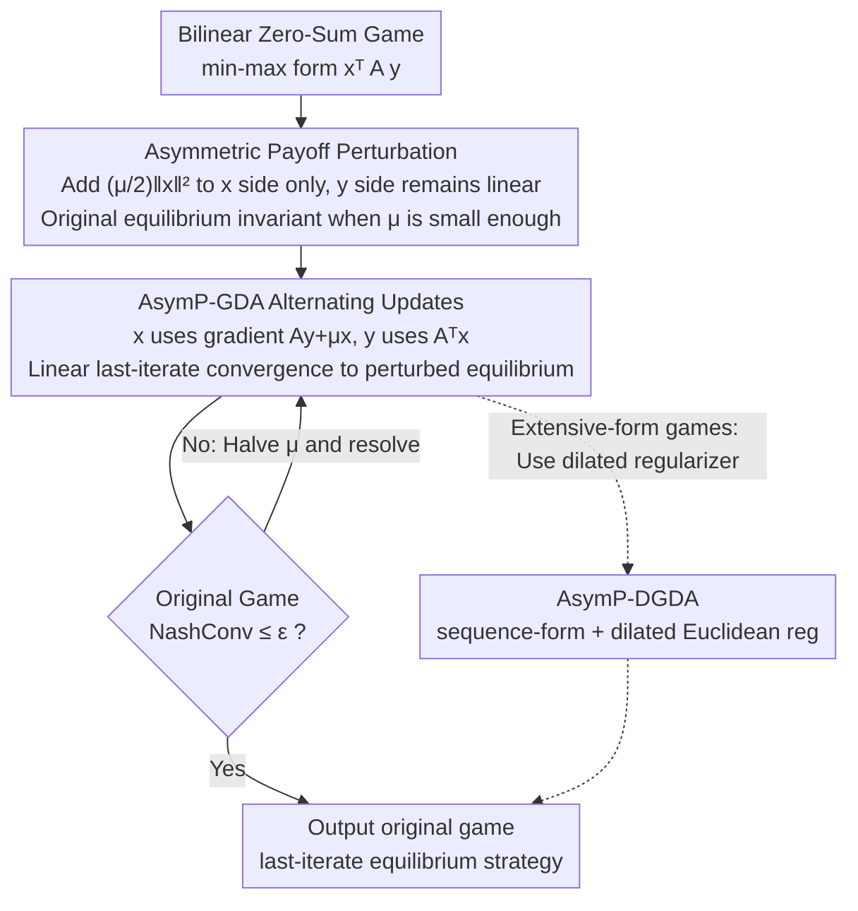

# Asymmetric Perturbation in Solving Bilinear Saddle-Point Optimization

**Conference**: ICML2026  
**arXiv**: [2506.05747](https://arxiv.org/abs/2506.05747)  
**Code**: https://github.com/CyberAgentAILab/asymmetrically-perturbed-gda  
**Area**: Optimization / Game Learning  
**Keywords**: Bilinear saddle-point optimization, asymmetric perturbation, last-iterate convergence, zero-sum games, NashConv  

## TL;DR
This paper demonstrates that perturbing the payoff of only one player in a bilinear zero-sum game preserves the original equilibrium under a sufficiently small perturbation. Based on this, the authors construct AsymP-GDA, which theoretically achieves linear last-iterate convergence and approaches the original equilibrium faster and more accurately than symmetric perturbation in normal-form and extensive-form game experiments.

## Background & Motivation
**Background**: Bilinear saddle-point problems $\min_{x \in X}\max_{y \in Y} x^T A y$ are core formulations in zero-sum games, minimax optimization, and constrained optimization. Many learning algorithms guarantee average-iterate convergence to the Nash equilibrium through no-regret properties, but the actual strategy sequence may cycle and fail to converge.

**Limitations of Prior Work**: Average-iterate convergence is suboptimal in large-scale models or games because it requires storing or mixing massive historical strategies. Methods like Optimistic GDA, Extra-Gradient, and OMWU attempt to achieve last-iterate convergence but may lose stability in environments with sampling noise, bandit feedback, or large-scale simulations.

**Key Challenge**: Payoff perturbation is an alternative route: adding strongly convex regularization terms to the payoff stabilizes dynamics and enables last-iterate convergence. Traditional approaches typically apply symmetric perturbations to both players, but a fixed perturbation strength $\mu$ pushes the equilibrium away from the original game. To approximate the original equilibrium, $\mu$ must be very small or decayed over iterations, creating a conflict between accuracy and speed.

**Goal**: The authors aim to find a method that retains the stable convergence brought by perturbation without systematically shifting the target equilibrium. Ideally, the perturbed problem should be easier to solve while its solutions remain the minimax/maximin strategies of the original game.

**Key Insight**: The paper proposes a simple but effective structural change: perturbing only one side's payoff. To solve for player $x$'s minimax strategy, the objective becomes $\min_x\max_y x^T A y + \frac{\mu}{2}\|x\|^2$, while player $y$'s payoff remains linear.

**Core Idea**: Asymmetric perturbation transforms one side of the objective into a strongly convex function to stabilize gradient dynamics. Simultaneously, it leverages the piecewise linear geometric structure of the original bilinear objective, ensuring that a sufficiently small perturbation does not change the original minimax strategy.

## Method
The paper addresses the question: why is "perturbing only one side" fundamentally different from "perturbing both sides"? Intuitively, symmetric perturbation alters the preferences of both players, so the perturbed equilibrium is usually only an approximation of the original. Asymmetric perturbation only makes the optimization target strongly convex for one player, while the opponent maintains the original linear best-response structure, allowing the "cusps" of the original objective function to lock onto the same minimax solution.

### Overall Architecture
The input is a bilinear zero-sum game or an equivalent saddle-point problem where strategy spaces $X, Y$ are polyhedra. The goal is to find the minimax and maximin strategies. The paper defines the asymmetric perturbation problem and proves that within a certain perturbation range, the perturbed minimax strategy $x^\mu$ belongs to the original equilibrium set $X^*$.

At the algorithmic level, the authors propose AsymP-GDA, a lightweight modification of alternating GDA: when updating $x$, it uses the perturbed gradient $Ay + \mu x$; when updating $y$, it uses the original gradient $A^T x$. To obtain strategies for both players, the asymmetric process can be run mirrors for $x$ and $y$ respectively. Since the invariance threshold depends on game-specific constants and is unknown a priori, the paper provides a parameter-free variant: starting from a large $\mu$, it solves the perturbed game, checks the original NashConv, and halves $\mu$ if the target precision is not met.

For extensive-form games (EFGs), the paper uses the sequence-form representation to express imperfect-information zero-sum games as bilinear saddle-points and introduces a dilated Euclidean regularizer to obtain AsymP-DGDA. This enables computable last-iterate learning in sequential games such as Kuhn Poker, Leduc Poker, Liar's Dice, and Goofspiel.

### Key Designs
**1. Asymmetric Payoff Perturbation: Strongly convex regularizer on one side only keeps original equilibrium stationary**  
When seeking player $x$'s minimax strategy, the objective is modified to $\min_x\max_y x^T A y + \frac{\mu}{2}\|x\|^2$, whereas player $y$'s payoff remains linear—this is the "asymmetry." Symmetric perturbation changes both players' preferences, leading to approximations. Asymmetric perturbation keeps the linear best-response structure of the opponent, preserving the piecewise linear "cusp" geometry of the original objective $g(x)=\max_y x^T A y$. Theorem 3.1 proves that the distance from $x^\mu$ to the original equilibrium set $X^*$ is bounded, and is exactly 0 when $\mu$ is below a game-dependent threshold $\alpha/\max_x\|x\|$ (Corollary 3.2: equilibrium invariance). This allows perturbation to stabilize dynamics without shifting the target.

**2. AsymP-GDA Alternating Updates: Linear last-iterate convergence**  
The algorithm adds only one term to standard alternating GDA: $x^{t+1}=\Pi_X(x^t-\eta(Ay^t+\mu x^t))$ for $x$ using the perturbed gradient, and $y^{t+1}=\Pi_Y(y^t+\eta A^T x^{t+1})$ for $y$ using the original gradient. Theorem 4.1 proves that as long as the learning rate conditions are met, the distance to the perturbed equilibrium set $Z^\mu$ decreases at a geometric (exponential) rate. The strong convexity on the $x$ side prevents the dynamics from cycling around the equilibrium.

**3. Parameter-free Adaptive $\mu$: Achieving invariance without knowing the threshold**  
Since the threshold $\alpha/\max_x\|x\|$ is unknown, Algorithm 1 starts from an arbitrary $\mu_{init}$ and repeatedly executes an outer loop: solve the current perturbed game using AsymP-GDA until the duality gap is small, then check the original NashConv. If it exceeds $\epsilon$, $\mu$ is halved. Since equilibrium invariance holds for small $\mu$, the threshold will eventually be crossed. Total iteration complexity is $O(\log(1/\epsilon))$, whereas symmetric decreasing-$\mu$ methods typically degrade to $\tilde{O}(1/\epsilon)$.

**4. Extension to EFGs (AsymP-DGDA): Bringing the method to sequential games**  
Two-player zero-sum EFGs (Poker, Goofspiel, etc.) can be written as bilinear saddle-points $\min_x\max_y x^T A y$ via sequence-form. To reduce projection costs on sequence-form constraints, the authors replace the proximal and perturbation terms with a dilated Euclidean regularizer (Hoda et al. 2010), resulting in AsymP-DGDA. While it shows strong empirical convergence, the authors note that a global proof as strong as AsymP-GDA is challenging because the smoothness constant of the dilated regularizer may diverge near boundaries.

### Loss & Training
This work focuses on optimization and game learning rather than a standard deep learning training paradigm. The primary convergence metric is NashConv (exploitability). Experiments for normal-form games compare NashConv curves over iterations; experiments for EFGs use sequence-form strategies and report last-iterate NashConv.

Theoretically, AsymP-GDA achieves linear convergence to the equilibrium of the perturbed game for any $\mu > 0$. If $\mu$ is within the invariance interval, the convergence point is the original equilibrium. The parameter-free version ensures $O(\log(1/\epsilon))$ complexity to reach an $\epsilon$-NashConv.

## Key Experimental Results

### Main Results
The experiments are divided into three groups: trajectories and NashConv in normal-form games, AsymP-DGDA for EFGs, and comparison with CFR-based algorithms.

| Target Game | Methods Compared | Metrics | Key Results |
|:---|:---|:---|:---|
| Biased Rock-Paper-Scissors / M-Ne | AsymP-GDA, SymP-GDA, GDA, OGDA | log NashConv / Trajectory | AsymP-GDA converges to the original equilibrium; SymP-GDA often converges to a shifted point; GDA cycles. |
| Different $\mu$ in BRPS | AsymP-GDA, SymP-GDA | Trajectory & Convergence | AsymP-GDA reaches original equilibrium for $\mu \le 2.0$; shifts for $\mu=4.0$. |
| 5 EFG Tasks | AsymP-DGDA, SymP-DGDA, DMWU, DGDA, DOMWU, DOGDA | last-iterate NashConv | AsymP-DGDA achieves competitive or faster convergence across all games (Kuhn, Leduc, Liar's Dice, Goofspiel-4/5). |
| CFR Comparison | AsymP-DGDA, CFR, CFR+, DCFR, LCFR | NashConv vs updates | AsymP-DGDA outperforms CFR variants in several games, except Leduc Poker. |

### Ablation Study

| Design / Phenomenon | Key Metric | Description |
|:---|:---|:---|
| Symmetric Perturbation | Convergence Error | Solutions diverge from original equilibrium under fixed $\mu$. |
| Asymmetric Perturbation | $x^\mu \in X^*$ | Confirms equilibrium invariance when $\mu$ is small enough. |
| AsymP-GDA | Convergence Rate | Linear last-iterate convergence to $Z^\mu$. |
| Parameter-free AsymP-GDA | Complexity | Achieves $O(\log(1/\epsilon))$ by avoiding fixed-ratio $\mu$ decay. |
| AsymP-DGDA | EFG Performance | High empirical performance; theoretical global smoothness remains a challenge. |

### Key Findings
- The core of asymmetric perturbation is not "less regularization," but maintaining the linear response of one side to preserve the "cusp" geometry.
- AsymP-GDA has negligible overhead (one extra vector addition $\mu x$) but transforms reactive GDA dynamics into convergent ones.
- The parameter-free algorithm is essential as game constants are typically unknown.
- In EFGs, AsymP-DGDA requires running the asymmetric process for each player to recover a strategy pair.
- Symmetric perturbation often converges quickly but to the "wrong" target; asymmetric perturbation is better for recovering the original minimax strategy.

## Highlights & Insights
- The most insightful point is the critique of symmetric perturbation: it doesn't fail to converge, but it converges to an objective modified by the regularizer. This is often more insidious than non-convergence.
- Asymmetric perturbation is a minimal change with significant theoretical consequences. Adding an $\ell_2$ term to one side only preserves both stability and the original equilibrium.
- The theoretical chain is complete: from equilibrium invariance to linear convergence rates, and finally to adaptive-$\mu$ for practicality.
- This work suggests for RLHF or adversarial training: if regularization shifts the objective, consider smoothing only one side to preserve the original structure of the opponent's response.

## Limitations & Future Work
- Theory covers bilinear zero-sum games; extending to Markov games still lacks a complete proof.
- The invariance interval depends on game constants and can be arbitrarily small.
- AsymP-DGDA lacks a global convergence proof comparable to AsymP-GDA due to dilated regularizer boundary issues.
- Recovering a full equilibrium pair requires separate runs for $x$ and $y$.
- Future work should validate stability in minimax learning with function approximation, sampling noise, or large-scale neural strategies.

## Related Work & Insights
- **vs OGDA / EG / OMWU**: While optimistic methods use gradient prediction to stabilize last iterates, AsymP-GDA uses structural modification. The latter might be more robust under noisy feedback.
- **vs Symmetric Payoff Perturbation**: Symmetry provides strong-convex/strong-concave structures but fundamentally shifts the equilibrium for any fixed $\mu$.
- **vs CFR**: CFR focus on average-iterate convergence; AsymP-DGDA focuses on the last-iterate strategy itself, which is suited for scenarios where averaging strategies is impractical.

## Rating
- **Novelty**: ⭐⭐⭐⭐⭐ (The observation of equilibrium invariance under asymmetric perturbation is elegant and novel.)
- **Experimental Thoroughness**: ⭐⭐⭐⭐☆ (Covers normal and extensive games, though lacks massive neural network tasks.)
- **Writing Quality**: ⭐⭐⭐⭐☆ (Clear motivation and structure; requires some background in optimization.)
- **Value**: ⭐⭐⭐⭐☆ (Highly valuable for researchers in saddle-point optimization and game learning.)

<!-- RELATED:START -->

<!-- RELATED:END -->

## Related Papers

- [\[ICLR 2026\] Saddle-to-Saddle Dynamics Explains A Simplicity Bias Across Neural Network Architectures](../../ICLR2026/optimization/saddle-to-saddle_dynamics_explains_a_simplicity_bias_across_neural_network_archi.md)
- [\[NeurIPS 2025\] AutoOpt: A Dataset and a Unified Framework for Automating Optimization Problem Solving](../../NeurIPS2025/optimization/autoopt_a_dataset_and_a_unified_framework_for_automating_optimization_problem_so.md)
- [\[ICML 2026\] A2SG: Adaptive and Asymmetric Surrogate Gradients for Training Deep Spiking Neural Networks](a2sgadaptive_and_asymmetric_surrogate_gradients_for_training_deep_spiking_neural.md)
- [\[ICLR 2026\] A Convergence Analysis of Adaptive Optimizers under Floating-Point Quantization](../../ICLR2026/optimization/a_convergence_analysis_of_adaptive_optimizers_under_floating-point_quantization.md)
- [\[AAAI 2026\] GHOST: Solving the Traveling Salesman Problem on Graphs of Convex Sets](../../AAAI2026/optimization/ghost_solving_the_traveling_salesman_problem_on_graphs_of_convex_sets.md)

<!-- RELATED:END -->
