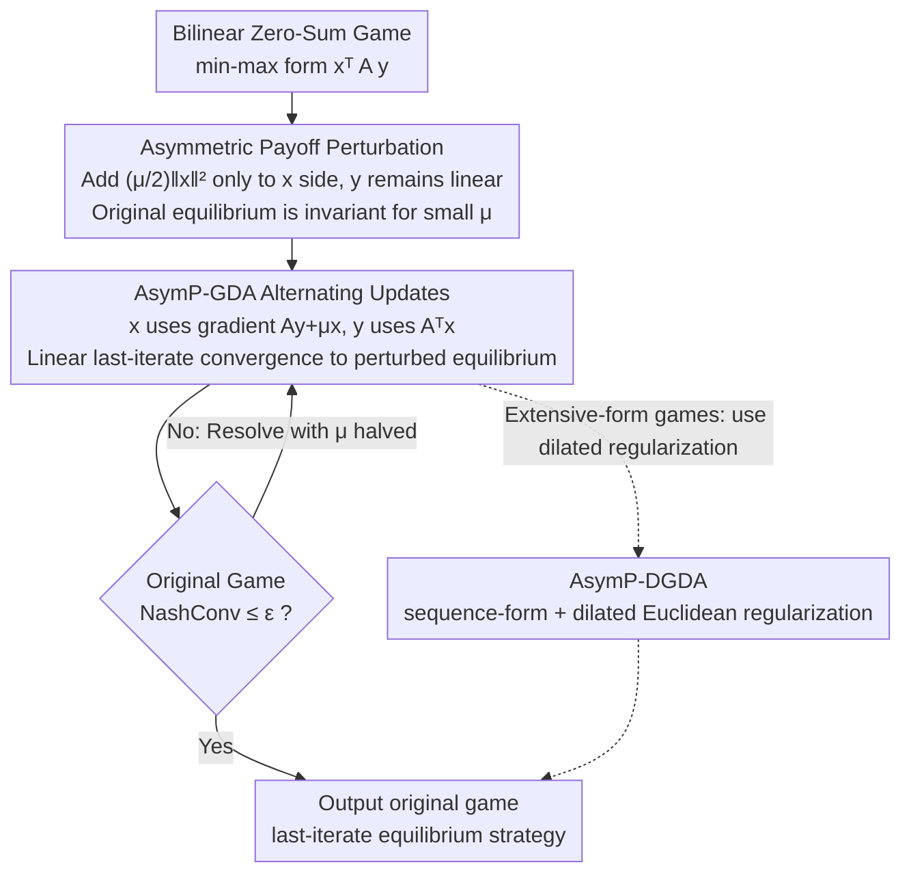

# Asymmetric Perturbation in Solving Bilinear Saddle-Point Optimization

**Conference**: ICML2026  
**arXiv**: [2506.05747](https://arxiv.org/abs/2506.05747)  
**Code**: https://github.com/CyberAgentAILab/asymmetrically-perturbed-gda  
**Area**: Optimization / Game Learning  
**Keywords**: Bilinear saddle-point optimization, Asymmetric perturbation, last-iterate convergence, zero-sum games, NashConv  

## TL;DR
This paper proves that perturbing the payoff of only one player in a bilinear zero-sum game preserves the original equilibrium under sufficiently small perturbations. Based on this, it constructs AsymP-GDA, achieving theoretical linear last-iterate convergence and faster, more accurate convergence to the original equilibrium in normal-form and extensive-form game experiments compared to symmetric perturbations.

## Background & Motivation
**Background**: Bilinear saddle-point problems $\min_{x \in X}\max_{y \in Y} x^T A y$ are core formulations in zero-sum games, minimax optimization, and constrained optimization. Many learning algorithms guarantee average-iterate convergence to a Nash equilibrium via no-regret properties, but the actual strategy sequence may cycle and fail to converge.

**Limitations of Prior Work**: Average-iterate convergence is suboptimal in large-scale models or games because it requires storing or mixing a large volume of historical strategies. Methods like Optimistic GDA, Extra-Gradient, and OMWU attempt to achieve last-iterate convergence but may lose stability in environments with sampling noise, bandit feedback, or large-scale simulations.

**Key Challenge**: Payoff perturbation is another path: adding strongly convex regularization to the payoff stabilizes dynamics and enables last-iterate convergence. Traditional approaches usually apply symmetric perturbations to both sides. However, a fixed perturbation strength $\mu$ shifts the equilibrium away from the original game; to approach the original equilibrium, $\mu$ must be very small or decayed iteratively, creating a conflict between precision and speed.

**Goal**: The authors aim to find a method that preserves the stability of perturbation-induced convergence without systematically shifting the target equilibrium. Ideally, the perturbed problem should be easier to solve, yet the resulting strategies remain the minimax / maximin strategies of the original game.

**Key Insight**: The paper proposes a simple but effective structural change: perturbing the payoff of only one side. To solve for the minimax strategy of player $x$, the objective becomes $\min_x\max_y x^T A y + \frac{\mu}{2}\|x\|^2$, while the payoff for player $y$ remains linear.

**Core Idea**: Asymmetric perturbation makes one side strongly convex to stabilize gradient dynamics while leveraging the piecewise linear geometric structure of the original bilinear objective. This ensures that sufficiently small perturbations do not change the original minimax strategy.

## Method
The paper centers on why "perturbing only one side" differs fundamentally from "perturbing both sides." Intuitively, symmetric perturbation alters the preferences of both players, so the perturbed equilibrium is typically only an approximation of the original. Asymmetric perturbation only makes the optimized player's objective strongly convex, while the opponent maintains the original linear best response structure, allowing the "kinks" of the original objective function to continue locking in the same minimax solution.

### Overall Architecture
The input is a bilinear zero-sum game or an equivalent saddle-point problem where strategy spaces $X, Y$ are polytopes. The goal is to find the minimax and maximin strategies of the original game. The paper first defines the asymmetric perturbation problem and proves that within a certain range of perturbation strength, the perturbed minimax strategy $x^\mu$ belongs to the original equilibrium set $X^*$.

Algorithmically, the authors propose AsymP-GDA. It is a lightweight modification of alternating GDA: the update for $x$ uses the perturbed gradient $Ay + \mu x$, while the update for $y$ still uses the original gradient $A^T x$. To obtain strategies for both players, the asymmetric perturbation can be run in mirrored forms for $x$ and $y$ separately. Since the invariance threshold depends on specific game instances and is unknown a priori, the paper provides a parameter-free variant: starting from a large $\mu$, it solves a perturbed game, checks the NashConv of the original game, and halves $\mu$ if the target is not met, repeating until the threshold is crossed.

For extensive-form games (EFGs), the paper uses the sequence-form representation, formulating imperfect-information zero-sum games as bilinear saddle-points and introducing a dilated Euclidean regularizer to obtain AsymP-DGDA. This enables computable last-iterate learning in sequential games like Kuhn Poker, Leduc Poker, Liar's Dice, and Goofspiel.

### Key Designs
**1. Asymmetric Payoff Perturbation: Strongly convex on one side, original equilibrium unchanged**

When seeking the minimax strategy for player $x$, only its objective is changed to $\min_x\max_y x^T A y + \frac{\mu}{2}\|x\|^2$, while player $y$'s payoff remains in its original linear form—this is the meaning of "asymmetric." Symmetric perturbation regualrizes both sides, rewriting both players' preferences; thus, the solution under fixed $\mu$ is often just an approximation. Asymmetric perturbation only makes one side strongly convex while the opponent maintains the original linear best response, preserving the "kink" geometry of the original objective $g(x)=\max_y x^T A y$. Theorem 3.1 proves that the distance from $x^\mu$ to the original equilibrium set $X^*$ is bounded, and is exactly 0 when $\mu$ is below a game-dependent threshold $\alpha/\max_x\|x\|$ (Equilibrium Invariance in Corollary 3.2). This is the foundation: perturbation stabilizes dynamics without shifting the target.

**2. AsymP-GDA Alternating Updates: Implementing asymmetric perturbation as a first-order algorithm with linear last-iterate convergence**

The algorithm adds only one term to standard alternating GDA: the $x$ update uses the perturbed gradient, $x^{t+1}=\Pi_X(x^t-\eta(Ay^t+\mu x^t))$, while the $y$ update keeps the original gradient, $y^{t+1}=\Pi_Y(y^t+\eta A^T x^{t+1})$. Theorem 4.1 proves that if the learning rate conditions are met, the distance to the perturbed equilibrium set $Z^\mu$ decreases at a geometric (exponential) rate. The extra cost is just a vector addition $\mu x$. With strong convexity on the $x$ side, dynamics no longer circle the equilibrium as in standard GDA; combined with invariance, this last iterate is the original minimax strategy for small $\mu$.

**3. Parameter-free Adaptive $\mu$: Gaining invariance without knowing the threshold**

The threshold $\alpha/\max_x\|x\|$ in Theorem 3.1 is game-dependent and unknown. The parameter-free variant (Algorithm 1) starts with an arbitrary $\mu_{init}$ and executes an outer loop: solve the current perturbed game with AsymP-GDA until the duality gap is small, then check if the NashConv of the original game is $\le \epsilon$. If not, halve $\mu$ and solve the next perturbed game. Since the equilibrium is invariant for small $\mu$, $\mu$ will eventually cross the threshold. Since each subproblem converges linearly, the total iteration complexity is $O(\log(1/\epsilon))$. In contrast, symmetric decreasing-$\mu$ methods (Liu et al. 2023) require shrinking $\mu$ proportional to precision, leading to $\tilde{O}(1/\epsilon)$ complexity.

**4. Extension to EFGs with AsymP-DGDA: Bringing the method to imperfect-information sequential games**

Two-player zero-sum EFGs (Poker, Goofspiel, etc.) can be expressed as bilinear saddle-points $\min_x\max_y x^T A y$ via sequence-form, allowing direct application of asymmetric perturbation. To reduce the computational cost of projections in sequence-form, the paper replaces proximal regularization and perturbation terms with a dilated Euclidean regularizer (Hoda et al. 2010), resulting in AsymP-DGDA. This adds almost no per-step overhead compared to standard Dilated GDA. To obtain strategies for both sides, the asymmetric process is run for $x$ and $y$ separately. While AsymP-DGDA shows strong empirical convergence, the paper notes it lacks a global convergence proof comparable to AsymP-GDA because the smoothness constant of dilated regularization can diverge near the boundaries.

### Loss & Training
This work follows an optimization and game learning paradigm rather than deep learning training. The primary convergence metric is NashConv, representing the exploitability of the current strategy. Normal-form game experiments compare the NashConv descent curves; EFG experiments use sequence-form strategies and report last-iterate NashConv.

Theoretically, AsymP-GDA converges linearly to the equilibrium set of the asymmetrically perturbed game for any fixed $\mu>0$. If $\mu$ is within the invariance interval, the convergence point is also the equilibrium of the original game. The parameter-free version ensures $O(\log(1/\epsilon))$ complexity for reaching a NashConv of $\epsilon$ by halving $\mu$.

## Key Experimental Results

### Main Results
Experiments are divided into three groups: trajectories and NashConv in normal-form games, AsymP-DGDA comparisons in EFGs, and supplementary comparisons with CFR algorithms.

| Object | Comparison | Metric | Main Result | Note |
|--------|------|------|------|------|
| Biased Rock-Paper-Scissors / M-Ne | AsymP-GDA, SymP-GDA, GDA, OGDA | log NashConv / Trajectory | AsymP-GDA converges to original EQ; SymP-GDA converges to shifted point; GDA cycles | Demonstrates equilibrium invariance |
| Different $\mu$ in BRPS | AsymP-GDA, SymP-GDA | Trajectory/Position | AsymP-GDA reaches original EQ for $\mu \le 2.0$; starts shifting at $\mu=4.0$ | Supports the existence of a wide invariance interval |
| Five EFG Tasks | AsymP-DGDA, SymP-DGDA, DMWU, DGDA, DOMWU, DOGDA | last-iterate NashConv | AsymP-DGDA achieves competitive or faster convergence to original EQ | Covers Kuhn, Leduc, Liar's Dice, Goofspiel-4/5 |
| CFR Supplementary | AsymP-DGDA, CFR, CFR+, DCFR, LCFR | NashConv vs updates | AsymP-DGDA is lower than CFR series in most games; Leduc is the main exception | CFR reports average-iterate; Ours reports last-iterate |

### Ablation Study
| Design / Phenomenon | Key Metric | Note |
|------|---------|------|
| Symmetric Perturbation | Solution shifts with fixed $\mu$ | Stability comes at the cost of rewriting the objective |
| Asymmetric Perturbation | $x^\mu \in X^*$ for small $\mu$ | Core invariance result |
| AsymP-GDA | Linear last-iterate convergence to $Z^\mu$ | Geometric rate even with one-sided perturbation |
| Parameter-free AsymP-GDA | $O(\log(1/\epsilon))$ complexity | Avoids needing game-dependent thresholds |
| Symmetric decreasing-$\mu$ | Typical $\tilde{O}(1/\epsilon)$ complexity | Requires solving a sequence of games tied to precision |
| AsymP-DGDA | Strong empirical performance in EFGs | Global smoothness of dilated regularizer is a theoretical gap |

### Key Findings
- The key to asymmetric perturbation is not "less regularization" but "perturbing only one side." This structure keeps the original minimax strategy invariant within a small $\mu$ interval.
- AsymP-GDA has minimal overhead, adding only a $\mu x$ term to alternating GDA, yet changes the rotational dynamics of GDA into convergent dynamics.
- The parameter-free algorithm is essential as the threshold $\alpha / \max_x \|x\|$ is unknown. Halving $\mu$ is a simple yet theoretically grounded strategy.
- In EFGs, AsymP-DGDA requires running the asymmetric process for both sides separately to recover the full equilibrium pair; the paper uses total strategy updates as the x-axis for fairness.
- Symmetric perturbation tends to "converge fast but to the wrong target," making asymmetric perturbation better for solving the original game.

## Highlights & Insights
- The most insightful point is clarifying the issue with symmetric perturbation: it's not that it doesn't converge, but that it converges to a game modified by regularization. This is often more subtle than non-convergence.
- Asymmetric perturbation is a minor modification with major theoretical consequences. Adding an $\ell_2$ term to one side maintains both stability and the original equilibrium, a design more parsimonious than complex optimistic corrections.
- The theoretical chain is complete: from equilibrium invariance to linear last-iterate convergence of AsymP-GDA, to eliminating unknown thresholds with adaptive $\mu$.
- **Ours** offers inspiration for RLHF, adversarial training, and game solving: if regularization shifts the target, one should check if smoothing can be applied only to the "optimized side" while leaving the opponent's response structure intact.

## Limitations & Future Work
- Theory primarily covers bilinear two-player zero-sum games. The authors suggest extensions to two-player zero-sum Markov games, but a complete proof is pending.
- The invariance interval depends on game constants, and Appendix E constructs examples where this interval can be arbitrarily small. Adaptive $\mu$ solves the tuning problem but might require many halving rounds in worst-case scenarios.
- AsymP-DGDA performs well in EFGs, but lacks the global convergence proof of AsymP-GDA because the smoothness of the dilated Euclidean regularizer can diverge.
- Recovering the full equilibrium pair requires running the asymmetric algorithm twice. While parallelizable, this is more complex than a single bilateral update.
- Experiments focus on standard normal-form and EFGs. Future work should validate stability in real minimax learning tasks involving function approximation, sampling noise, or large-scale neural strategies.

## Related Work & Insights
- **vs OGDA / EG / OMWU**: Optimistic methods stabilize last iterates via gradient prediction; AsymP-GDA stabilizes dynamics by altering one-sided geometry. The latter is closer to projection-based optimization and may be more robust under noisy feedback.
- **vs Symmetric Payoff Perturbation**: Symmetric perturbation provides strong concavity-convexity but shifts the equilibrium for fixed $\mu$. Asymmetric perturbation's advantage is exact preservation of the original minimax strategy for small $\mu$.
- **vs Decreasing-$\mu$ Regularization**: Traditional methods require $\mu$ to shrink with precision, leading to slower complexity; **Ours** only needs to cross a threshold.
- **vs CFR Series**: CFR emphasizes average-iterate convergence; AsymP-DGDA focuses on the last-iterate strategy itself, suitable for scenarios where maintaining historical averages is unfeasible.
- **Insight**: Distinguish between "stabilizing the optimization process" and "changing the objective function." Asymmetric regularization provides a reusable pattern to decouple the two.

## Rating
- Novelty: ⭐⭐⭐⭐⭐ The simplicity of asymmetric perturbation combined with invariance and linear convergence is highly novel.
- Experimental Thoroughness: ⭐⭐⭐⭐☆ Covers both NFGs and EFGs with CFR comparisons; however, main experiments lack large-scale neural strategy tasks.
- Writing Quality: ⭐⭐⭐⭐☆ Clear structure and strong motivation; requires background in optimization and game theory for dense proofs.
- Value: ⭐⭐⭐⭐☆ Highly valuable for saddle-point optimization and game learning, especially for reconsidering the side effects of regularization in minimax problems.

<!-- RELATED:START -->

## Related Papers

- [\[ICLR 2026\] Saddle-to-Saddle Dynamics Explains A Simplicity Bias Across Neural Network Architectures](../../ICLR2026/optimization/saddle-to-saddle_dynamics_explains_a_simplicity_bias_across_neural_network_archi.md)
- [\[NeurIPS 2025\] AutoOpt: A Dataset and a Unified Framework for Automating Optimization Problem Solving](../../NeurIPS2025/optimization/autoopt_a_dataset_and_a_unified_framework_for_automating_optimization_problem_so.md)
- [\[ICLR 2026\] A Convergence Analysis of Adaptive Optimizers under Floating-Point Quantization](../../ICLR2026/optimization/a_convergence_analysis_of_adaptive_optimizers_under_floating-point_quantization.md)
- [\[AAAI 2026\] GHOST: Solving the Traveling Salesman Problem on Graphs of Convex Sets](../../AAAI2026/optimization/ghost_solving_the_traveling_salesman_problem_on_graphs_of_convex_sets.md)
- [\[ICML 2026\] Cost-Aware Stopping for Bayesian Optimization](cost-aware_stopping_for_bayesian_optimization.md)

<!-- RELATED:END -->
