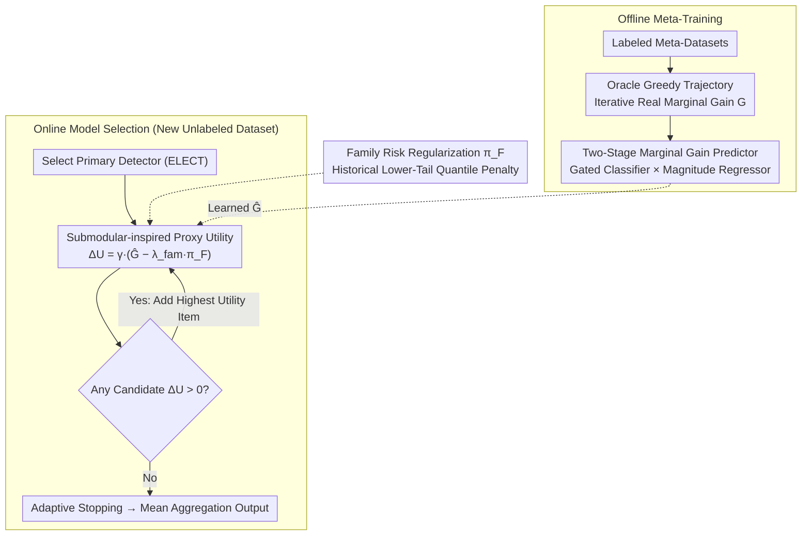

# Automatic Unsupervised Ensemble Outlier Model Selection–Extended Version

**Conference**: ICML2026  
**arXiv**: [2605.16567](https://arxiv.org/abs/2605.16567)  
**Code**: TBC  
**Area**: Anomaly Detection  
**Keywords**: Unsupervised Anomaly Detection, Ensemble Model Selection, Meta-learning, Submodular Optimization, Adaptive Stopping

## TL;DR
The MetaEns framework is proposed to predict the marginal ensemble gain of candidate detectors using meta-learning. By combining a diversity discount and algorithm family risk regularization into a proxy objective function, it adaptively and greedily constructs compact, high-quality anomaly detection ensembles under unlabeled conditions.

## Background & Motivation

**Background**: Unsupervised anomaly detection (AD) is widely applied in fraud detection, cybersecurity, and medical diagnosis. Existing detectors (LOF, IForest, kNN, etc.) have specific strengths, but no single detector consistently performs well across all datasets, making ensemble methods a mainstream approach for enhancing robustness.

**Limitations of Prior Work**: Building ensemble models in unsupervised scenarios faces the "ensemble saturation" problem. Simply averaging scores of all detectors (e.g., Mega Ensemble) or selecting a fixed Top-k leads to performance degradation and high computational costs due to the introduction of redundant or unreliable models. Existing meta-learning methods like MetaOD and ELECT can recommend detectors but are limited to selecting a single optimal model, failing to address complementary combinations.

**Key Challenge**: In the absence of labels, it is impossible to directly evaluate whether adding a new detector to the ensemble is beneficial. The marginal gain of adding a model is unobservable, and naive fixed-size ensembles cannot adapt to dataset characteristics.

**Goal**: To model unsupervised ensemble selection as a sequential decision problem, automatically determining which models to select and when to stop adding them.

**Key Insight**: Although true marginal gains cannot be calculated at test time, the structure of marginal gains can be learned offline from labeled meta-datasets. By utilizing statistical score features (correlation, distribution shape, rank overlap), a gain predictor can be trained to transfer across datasets.

**Core Idea**: Meta-learning is used to predict the marginal ensemble gain of candidate models. This is combined with a submodular-inspired proxy objective (including redundancy discounts and algorithm family risk penalties) for greedy selection. The process stops adaptively when no candidate model yields a positive utility.

## Method

### Overall Architecture
MetaEns consists of two stages: offline meta-training and online model selection. In the offline stage, labeled meta-datasets are used to simulate sequential ensemble construction, calculating the true marginal gain (AP improvement) at each step to train a two-stage gain predictor. In the online stage, for a new unlabeled dataset, an anchor detector (primary detector) is selected first. Then, detectors with the highest proxy utility are greedily added until no further positive utility is generated. The proxy utility is a combination of predicted gain, redundancy discount, and algorithm family risk regularization. The candidate pool includes 297 detectors across 8 algorithm families (IForest, LOF, kNN, HBOS, OCSVM, LODA, ABOD, COF). Ensemble scores are aggregated using the mean of member scores.

### Key Designs

**1. Two-Stage Marginal Gain Predictor: Handling Zero-Inflated Distributions with "Gating + Magnitude"**

Since labels are missing during testing, the gain's magnitude cannot be judged directly; thus, it is learned offline. The challenge is that as the ensemble grows, positive gain samples become extremely sparse—most candidates are either redundant or harmful. A single regressor on this zero-inflated distribution might predict small positive values for many candidates, incorrectly including redundant models. The authors split prediction into a classifier and a regressor:

$$\hat{G}(f_i\mid P)=f_{\text{cls}}(f_i\mid P)\cdot f_{\text{reg}}(f_i\mid P),$$

$f_{\text{cls}}$ estimates the probability that a candidate improves the ensemble as a gate, while $f_{\text{reg}}$ estimates the magnitude only for positive samples. The state representation $\phi(f_i,f_{i-1}^*,P)$ uses statistical score features between the candidate, the previous selection, and the current ensemble (Spearman correlation, cosine similarity, entropy, kurtosis, Jaccard overlap, etc.) plus ensemble size $|P|$. Both models use ExtraTrees.

**2. Submodular-inspired Proxy Utility: Guiding Selection and Stopping without Labels**

The learned $\hat{G}$ is noisy and not guaranteed to be submodular. The authors define marginal utility for candidate $f_i$:

$$\Delta U(f_i\mid P)=\gamma(f_i,P)\cdot\big(\hat{G}(f_i\mid P)-\lambda_{\text{fam}}\,\pi_{\mathcal{F}(f_i)}\big),\qquad \gamma(f_i,P)=\frac{1}{1+\beta\cdot\text{sim}_{\max}(f_i,P)},$$

The redundancy discount $\gamma$ uses the **maximum** Jaccard similarity between the candidate and existing members to decay utility. This strictly prevents near-duplicates, explicitly modeling diminishing returns. When all candidates have $\Delta U\le 0$, the process stops automatically.

**3. Algorithm Family Risk Regularization: Avoiding Systemic Risk via Tail Statistics**

Some algorithm families perform well on average but cause severe negative gains on specific datasets. The authors calculate the 10th percentile of true marginal gains for each family $F$ in training trajectories: $\text{Risk}_F=Q_{0.10}(\{G(f\mid P)\})$, converted into a non-negative penalty $\pi_F=\max(0,-\text{Risk}_F)$. This is added to the proxy objective via coefficient $\lambda_{\text{fam}}$. Removing this component causes the largest AP drop (-0.0359).

## Key Experimental Results

### Main Results
Evaluated on 39 real AD datasets with a pool of 297 detectors.

| Method | AP ↑ | Avg Rank ↓ | ROC-AUC ↑ | Ensemble Size |
|------|------|-----------|-----------|---------|
| Greedy Oracle (Upper Bound) | 0.6877 | 1.0 | 0.8968 | 10 |
| MetaEns (Ours) | **0.4308** | **59.3** | **0.7867** | **2.2** |
| ELECT Top-10 | 0.4117 | 83.2 | 0.7785 | 10 |
| ELECT Top-1 | 0.4069 | 85.8 | 0.7734 | 1 |
| MetaOD | 0.3989 | 101.0 | 0.7547 | 1 |
| Mega Ensemble | 0.3970 | 100.0 | 0.7737 | 297 |
| DeepSVDD | 0.2073 | 247.5 | 0.5905 | 1 |

Ours outperforms the strongest baseline ELECT Top-10 across all metrics, with an AP Gain of 0.019, while using only 2.2 models on average.

### Ablation Study

| Variant | AP ↑ | Avg Rank ↓ | Gain (ΔAP) |
|------|------|-----------|-----|
| MetaEns (Full) | 0.4308 | 59.3 | — |
| W/O Diversity Discount ($\beta=0$) | 0.4185 | 77 | -0.0169 |
| W/O Family Risk Reg. ($\lambda_{\text{fam}}=0$) | 0.3995 | 72 | -0.0359 |
| Single Gain Predictor | 0.4133 | 87 | -0.0221 |

### Key Findings
- Family risk regularization is the most critical component; its removal leads to the largest AP decrease.
- MetaEns is robust to initialization: it recovers performance even with suboptimal primary detectors.
- Score-level state representations allow transfer to image and text modalities (improving AP by +0.0257 on image datasets in ADBench).
- t-SNE shows MetaEns selects models across multiple algorithm families, achieving better diversity than ELECT Top-10.

## Highlights & Insights
- The "gating" design in the gain predictor effectively handles zero-inflated distributions, a useful technique for any sparse signal prediction task.
- Score-only feature design makes the framework agnostic to data dimensions and modalities, enabling zero-shot transfer from tabular to image/text data.
- The adaptive stopping mechanism naturally yields compact ensembles (avg. 2.2 models), offering higher practical utility than fixed-size ensembles.

## Limitations & Future Work
- Dependency on labeled meta-datasets; performance may degrade if the test task distribution differs significantly (e.g., very low-dimensional data).
- Algorithm family classification relies on predefined priors; new detectors require manual assignment.
- Focused on batch scenarios; does not support online updates for streaming or non-stationary data.
- Future work includes introducing uncertainty-aware gain prediction and exploring richer meta-features for better transferability.

## Related Work & Insights
- **vs ELECT**: MetaEns extends ELECT's single-model selection to sequential ensemble expansion, achieving significant gains through context-aware partner selection.
- **vs MetaOD**: MetaOD recommends based on task similarity but cannot build complementary ensembles, resulting in an AP 0.032 lower than Ours.
- **vs Mega Ensemble**: Aggregating all 297 detectors is inferior to adaptively selecting 2.2 models, confirming that "less is more" in ensemble selection.

## Rating
- Novelty: ⭐⭐⭐⭐ Innovative modeling of ensemble selection as sequential decision-making with family risk control.
- Experimental Thoroughness: ⭐⭐⭐⭐⭐ Extensive evaluation across 39 datasets, 19 baselines, and cross-modality analysis.
- Writing Quality: ⭐⭐⭐⭐ Clear structure with rigorous formulation.
- Value: ⭐⭐⭐⭐ Highly practical compact ensembles solving a major pain point in unsupervised AD.

<!-- RELATED:START -->

## Related Papers

- [\[NeurIPS 2025\] Deep Taxonomic Networks for Unsupervised Hierarchical Prototype Discovery](../../NeurIPS2025/optimization/deep_taxonomic_networks_for_unsupervised_hierarchical_prototype_discovery.md)
- [\[NeurIPS 2025\] Towards Reliable and Holistic Visual In-Context Learning Prompt Selection](../../NeurIPS2025/optimization/towards_reliable_and_holistic_visual_in-context_learning_prompt_selection.md)
- [\[ICML 2025\] Sparse Causal Discovery with Generative Intervention for Unsupervised Graph Domain Adaptation](../../ICML2025/optimization/sparse_causal_discovery_with_generative_intervention_for_unsupervised_graph_doma.md)
- [\[CVPR 2026\] Model Merging in the Essential Subspace](../../CVPR2026/optimization/model_merging_in_the_essential_subspace.md)
- [\[ICML 2026\] Sign Lock-In: Randomly Initialized Weight Signs Persist and Bottleneck Sub-Bit Model Compression](sign_lock-in_randomly_initialized_weight_signs_persist_and_bottleneck_sub-bit_mo.md)

<!-- RELATED:END -->
