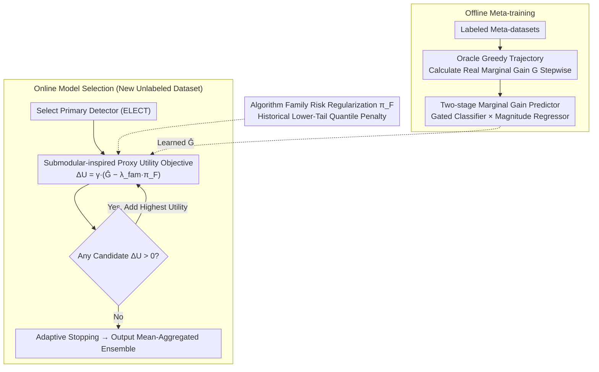

# Automatic Unsupervised Ensemble Outlier Model Selection–Extended Version

**Conference**: ICML2026  
**arXiv**: [2605.16567](https://arxiv.org/abs/2605.16567)  
**Code**: To be confirmed  
**Area**: Anomaly Detection  
**Keywords**: Unsupervised Anomaly Detection, Ensemble Model Selection, Meta-learning, Submodular Optimization, Adaptive Stopping

## TL;DR
The MetaEns framework is proposed to adaptively and greedily construct compact, high-quality anomaly detection ensembles under unlabeled conditions. It works by predicting the marginal ensemble gain of candidate detectors through meta-learning, combined with a proxy objective function featuring diversity discounts and algorithm family risk regularization.

## Background & Motivation

**Background**: Unsupervised anomaly detection is widely applied in scenarios such as fraud detection, cybersecurity, and medical diagnosis. Existing detectors (LOF, IForest, kNN, etc.) have their own strengths, but no single detector consistently performs well across all datasets, making ensemble methods a mainstream approach for enhancing robustness.

**Limitations of Prior Work**: Constructing ensembles in unsupervised scenarios faces the "ensemble saturation" problem. Simply averaging scores from all detectors (e.g., Mega Ensemble) or selecting a fixed Top-k detectors leads to performance degradation and extra computational overhead due to the inclusion of redundant or unreliable models. Existing meta-learning methods like MetaOD and ELECT can recommend detectors but are limited to selecting a single optimal model, failing to utilize complementary model combinations.

**Key Challenge**: In the absence of labels, it is impossible to directly evaluate whether "adding a new detector to the ensemble is beneficial." The marginal gain of adding a model is unobservable, and naive fixed-size ensembles cannot adaptively adjust based on dataset characteristics.

**Goal**: To model model selection for unsupervised ensemble anomaly detection as a sequential decision problem, automatically determining "which models to select" and "when to stop adding."

**Key Insight**: Although the true marginal gain cannot be calculated at test time, the structure of the marginal gain can be learned offline from labeled meta-datasets. By utilizing statistical features of scores between detectors (correlation, distribution shape, rank overlap), a gain predictor can be trained to transfer across datasets.

**Core Idea**: Meta-learning is used to predict the marginal ensemble gain of candidate models. This is combined with a submodular-inspired proxy objective (containing redundancy discounts and algorithm family risk penalties) for greedy selection. The process adaptively stops when no candidate model provides a positive utility.

## Method

### Overall Architecture
MetaEns is divided into two phases: offline meta-training and online model selection. In the offline phase, labeled meta-datasets are used to simulate the sequential ensemble construction process, calculating the true marginal gain (AP improvement) of adding a candidate detector at each step to train a two-stage gain predictor using "state-gain" pairs. In the online phase, for a new unlabeled dataset, a primary detector is first selected (via ELECT), and then detectors with the highest proxy utility are added greedily until no candidate provides positive utility. The proxy utility is a combination of the predicted gain, redundancy discount, and algorithm family risk regularization. The candidate pool consists of 297 detectors covering 8 algorithm families: IForest, LOF, kNN, HBOS, OCSVM, LODA, ABOD, and COF. Ensemble scores are aggregated using the mean of member detector scores.

### Key Designs

**1. Two-stage Marginal Gain Predictor: Addressing Zero-inflated Gain with "Gating + Magnitude"**

Since labels are unavailable at test time, one cannot directly judge the utility of adding a detector, necessitating offline learning from labeled meta-datasets. The challenge is that as the ensemble grows, positive gain samples become extremely sparse—most candidates are either redundant or harmful. A single regressor on such a zero-inflated distribution might predict small positive values for many candidates, leading to the selection of redundant models. The authors split the prediction into a classifier and a regressor:

$$\hat{G}(f_i\mid P)=f_{\text{cls}}(f_i\mid P)\cdot f_{\text{reg}}(f_i\mid P),$$

where $f_{\text{cls}}$ first estimates the probability that "this candidate can improve the ensemble" as a gate, and $f_{\text{reg}}$ only estimates the magnitude of the gain for positive cases. The state representation $\phi(f_i,f_{i-1}^*,P)$ uses score statistics (Spearman correlation, cosine similarity, entropy, kurtosis, Jaccard overlap, etc.) between the candidate, the last selected model, and the current ensemble, plus the ensemble size $|P|$. Both models use ExtraTrees. Determining whether to add before quantifying how much to add is significantly more stable than direct regression.

**2. Submodular-inspired Proxy Utility Objective: Guiding Unsupervised Greedy Selection and Adaptive Stopping**

The learned $\hat{G}$ is noisy and does not guarantee submodularity. Direct greedy selection might pick near-duplicate models or fail to determine when to stop. The authors define the marginal utility for candidate $f_i$ as:

$$\Delta U(f_i\mid P)=\gamma(f_i,P)\cdot\big(\hat{G}(f_i\mid P)-\lambda_{\text{fam}}\,\pi_{\mathcal{F}(f_i)}\big),\qquad \gamma(f_i,P)=\frac{1}{1+\beta\cdot\text{sim}_{\max}(f_i,P)},$$

where the redundancy discount $\gamma$ uses the **maximum** Jaccard similarity between the candidate and existing members to decay utility. Using the maximum rather than the average strictly prevents near-clones from entering the ensemble, explicitly modeling "diminishing returns." Selection automatically stops when all candidates' $\Delta U\le 0$, making the ensemble size adaptive without a manual $k$.

**3. Algorithm Family Risk Regularization: Mitigating Systemic Risks with Historical Tail Statistics**

Certain algorithm families perform well on average but produce severe negative gains on specific datasets. Without labels, individual selection quality cannot be verified on the fly. During meta-training, the authors calculate the 10th percentile of true marginal gains for each algorithm family $F$: $\text{Risk}_F=Q_{0.10}(\{G(f\mid P)\})$. This is converted into a non-negative penalty $\pi_F=\max(0,-\text{Risk}_F)$ and added to the proxy objective via coefficient $\lambda_{\text{fam}}$ (unseen families receive zero penalty). Using the lower tail instead of the mean focuses on risk, which is hidden in the tails. This component proved most critical in ablation studies, with AP dropping the most (-0.0359) if removed.

### Loss & Training
The offline phase uses an oracle greedy strategy to generate training trajectories: for each meta-dataset, starting from the detector with the highest AP, it iteratively selects the model that maximizes true gain. This strategy exposes the meta-model to high-quality partial ensemble states, preventing training from being dominated by low-signal random states. The classification target is $y_{\text{cls}} = \mathbb{I}(G > 0)$, and the regression target is $y_{\text{reg}} = \max(0, G)$, optimized only on samples where $G > 0$. Hyperparameters are tuned via leave-one-dataset-out cross-validation.

## Key Experimental Results

### Main Results
Evaluated on 39 real anomaly detection datasets with a pool of 297 detectors. Compared against 19 unsupervised baselines and 1 supervised greedy upper bound.

| Method | AP ↑ | Average Rank ↓ | ROC-AUC ↑ | Ensemble Size |
|------|------|-----------|-----------|---------|
| Greedy Oracle (Upper Bound) | 0.6877 | 1.0 | 0.8968 | 10 |
| MetaEns (Ours) | **0.4308** | **59.3** | **0.7867** | **2.2** |
| ELECT Top-10 | 0.4117 | 83.2 | 0.7785 | 10 |
| ELECT Top-1 | 0.4069 | 85.8 | 0.7734 | 1 |
| MetaOD | 0.3989 | 101.0 | 0.7547 | 1 |
| Mega Ensemble | 0.3970 | 100.0 | 0.7737 | 297 |
| DeepSVDD | 0.2073 | 247.5 | 0.5905 | 1 |

MetaEns outperforms the strongest baseline ELECT Top-10 across all metrics, with an AP Gain of 0.019, improving the average rank from 83.2 to 59.3, while using only 2.2 models on average (compared to ELECT's 10 and Mega Ensemble's 297). Deep learning baselines generally underperform on unsupervised tabular anomaly detection.

### Ablation Study

| Variant | AP ↑ | Average Rank ↓ | ΔAP |
|------|------|-----------|-----|
| MetaEns (Full) | 0.4308 | 59.3 | — |
| w/o Diversity Discount ($\beta=0$) | 0.4185 | 77 | -0.0169 |
| w/o Family Risk Reg ($\lambda_{\text{fam}}=0$) | 0.3995 | 72 | -0.0359 |
| Single Gain Predictor | 0.4133 | 87 | -0.0221 |

### Key Findings
- Algorithm family risk regularization is the most critical component; its removal causes the largest AP drop (-0.0359), indicating that controlling family-level risk is vital for ensemble quality in unlabeled environments.
- MetaEns is robust to the choice of initial detector: whether using ELECT, LOF, IForest, or random selection as a starting model, performance can be recovered through complementary selection, particularly in the "rescue zone" (primary AP < 0.4).
- Score-level state representations allow the framework to transfer to image and text modalities: on 20 ADBench image/text datasets, MetaEns also outperformed the strongest baseline (+0.0257 AP on images).
- t-SNE visualization shows that while ELECT Top-10 tends to select models within a single algorithm family, MetaEns selections span multiple family clusters, achieving better diversity.

## Highlights & Insights
- The "gating" design of the two-stage gain predictor is a universal trick for zero-inflated distributions: classifying before magnitude estimation is more stable than direct regression and can be transferred to any scenario requiring sparse positive signal prediction (e.g., incremental value prediction in recommender systems).
- Score-level feature design makes the framework independent of data dimensions and modalities: by relying on statistical relationships between detector outputs rather than raw input features or model structures, it achieves zero-shot transfer from tabular to image/text data.
- The adaptive stopping mechanism naturally produces compact ensembles (averaging just 2.2 models), offering much higher practicality than methods requiring manual setting of ensemble sizes.

## Limitations & Future Work
- Dependency on labeled meta-datasets for offline training; performance may degrade if there is a significant distribution shift between test tasks and meta-training (e.g., low-dimensional datasets where $d \leq 13$).
- Algorithm family classification relies on predefined prior knowledge; new detectors require manual assignment to a family, lacking an automated mechanism.
- Focused on batch scenarios, with no support for online ensemble updates on streaming or non-stationary data.
- Future directions: Introducing uncertainty-aware gain prediction for quantified confidence and exploring richer meta-features to improve transfer capability under distribution shifts.

## Related Work & Insights
- **vs ELECT**: ELECT uses meta-learning to select a single optimal detector; MetaEns builds on this by performing sequential ensemble expansion, sharing the same primary detector but achieving significant gains through context-aware companion selection.
- **vs MetaOD**: MetaOD recommends single models based on task similarity, failing to build complementary ensembles. Its AP is 0.032 lower than MetaEns.
- **vs Mega Ensemble**: Naively aggregating all 297 detectors is inferior to adaptively selecting 2.2 models, validating that "less is more" in ensemble selection.

## Rating
- Novelty: ⭐⭐⭐⭐ Modeling ensemble selection as sequential decision-making with two-stage gain prediction and family risk regularization is an innovative contribution to the field.
- Experimental Thoroughness: ⭐⭐⭐⭐⭐ 39 datasets, 297 candidate models, 19 baselines, and comprehensive ablation/robustness/modality transfer analyses.
- Writing Quality: ⭐⭐⭐⭐ Clear structure, standardized formulas, and well-organized problem definitions and methodology.
- Value: ⭐⭐⭐⭐ Addresses practical pain points in unsupervised ensemble selection with a versatile framework; the compact 2.2-model ensembles are highly practical.

<!-- RELATED:START -->

## Related Papers

- [\[ICLR 2026\] CALM: Co-evolution of Algorithms and Language Model for Automatic Heuristic Design](../../ICLR2026/optimization/calm_co-evolution_of_algorithms_and_language_model_for_automatic_heuristic_desig.md)
- [\[ICML 2026\] Minibatch Selection via Partition Matroid Constrained Gradient Matching](minibatch_selection_via_partition_matroid_constrained_gradient_matching.md)
- [\[ICML 2026\] Sign Lock-In: Randomly Initialized Weight Signs Persist and Bottleneck Sub-Bit Model Compression](sign_lock-in_randomly_initialized_weight_signs_persist_and_bottleneck_sub-bit_mo.md)
- [\[ICML 2026\] Utility-Diversity Aware Online Batch Selection for LLM Supervised Fine-tuning](utility-diversity_aware_online_batch_selection_for_llm_supervised_fine-tuning.md)
- [\[ICML 2026\] Convex Basins in Single-Index Model Loss Landscapes: Applications to Robust Recovery under Strong Adversarial Corruption](convex_basins_in_single-index_model_loss_landscapes_applications_to_robust_recov.md)

<!-- RELATED:END -->
