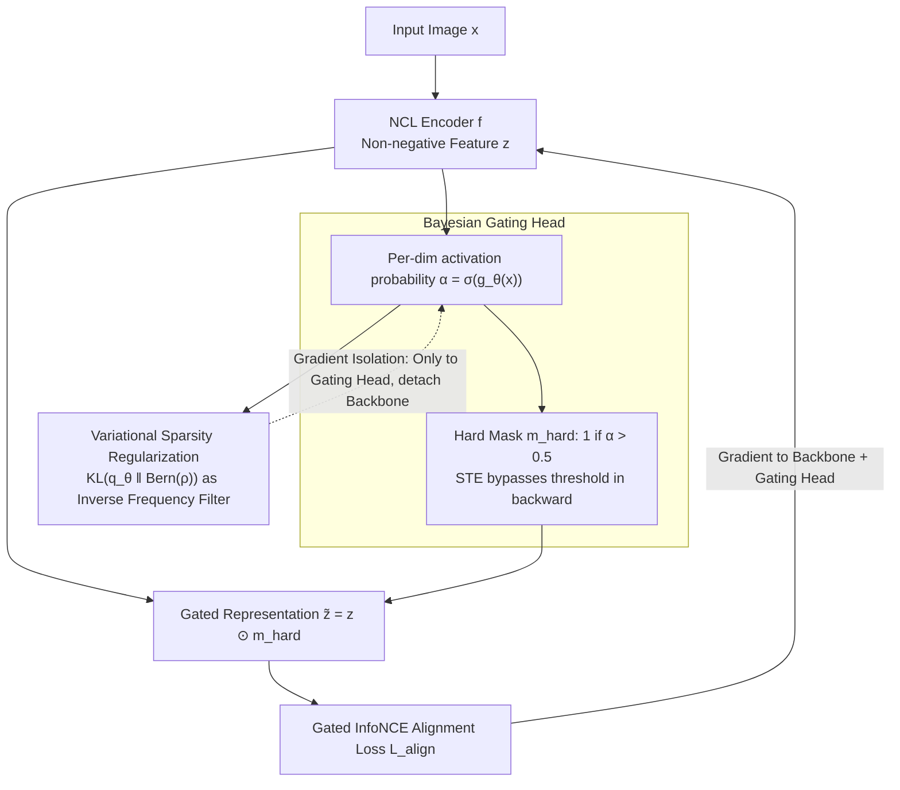

# Bayesian Gated Non-Negative Contrastive Learning

**Conference**: ICML 2026  
**arXiv**: [2605.28441](https://arxiv.org/abs/2605.28441)  
**Code**: https://github.com/Cui-Peng-624/BayesNCL  
**Area**: Self-Supervised/Representation Learning  
**Keywords**: Contrastive Learning, Non-Negative Representation, Bayesian Gating, Semantic Decoupling, Interpretability  

## TL;DR
Addressing the optimization conflict (gradient oscillation) caused by shared background features in Non-Negative Contrastive Learning (NCL), BayesNCL is proposed. By learning a Bernoulli distribution for each feature dimension via a Bayesian gating head to dynamically filter high-frequency public features, it achieves a 142.1% improvement in semantic consistency on ImageNet-100 without sacrificing downstream accuracy.

## Background & Motivation

**Background**: Self-supervised contrastive learning (CL) has become the dominant paradigm for unlabeled visual representation learning, encoding high-level semantics by pulling positive pairs closer and pushing negative pairs apart. However, standard CL representations are highly entangled—semantic concepts are scattered across all feature dimensions, and individual dimensions lack explicit semantic meaning, posing significant risks in safety-critical scenarios.

**Limitations of Prior Work**: Non-Negative Contrastive Learning (NCL) establishes equivalence with Non-negative Matrix Factorization (NMF) by enforcing non-negativity constraints, aligning feature dimensions with semantic clusters. However, NCL employs deterministic similarity measures, treating all dimensions equally. This deterministic approach fails when realistic images exhibit compositionality—different objects sharing high-frequency background features (e.g., "blue sky").

**Key Challenge**: The authors identify a fundamental **optimization conflict**. Taking "bird" and "airplane" sharing a "blue sky" background as an example, positive pairs require aligning the "blue sky" dimension, while negative pairs require repelling the same dimension. This leads to a situation where the expected gradient of conflicting feature dimensions approaches zero while the variance is extremely large ($\mathbb{E}[\nabla_{z_k} L] \approx 0, \text{Var}(\nabla_{z_k} L) \gg 0$), hindering semantic decoupling.

**Key Insight**: Re-examining the definition of similarity from a probabilistic perspective, joint likelihood analysis suggests that optimal similarity should be weighted by inverse frequency: $s_{IPW}(z,z') = \sum_k \frac{1}{\pi_k} z_k z_k'$. This implies that rare discriminative features should dominate alignment scores, while high-frequency background features should be down-weighted. However, explicit computation of semantic frequency $\pi_k$ is infeasible.

**Core Idea**: Introducing a learnable Bayesian gating mechanism that automatically "turns off" conflicting high-frequency public feature dimensions through variational inference, achieving a feasible approximation of inverse-frequency weighted similarity via probabilistic filtering.

## Method

### Overall Architecture
BayesNCL adds a **Bayesian gating head** to the standard NCL encoder $f: \mathcal{X} \to \mathbb{R}_{\geq 0}^K$. The input image yields non-negative features $z = f(x)$ via the encoder, and the gating head predicts Bernoulli parameters $\alpha = \sigma(g_\theta(x))$ for each dimension. Discrete masks $m_{\text{hard}} = \mathbb{I}(\alpha > 0.5)$ are generated via thresholding, and the final gated representation $\tilde{z} = z \odot m_{\text{hard}}$ is used to calculate the contrastive loss. The training objective combines gated InfoNCE with KL sparsity regularization.

### Key Designs

**1. Bayesian Gating Head: Per-image decision on dimension filtering**

High-frequency public features like "blue sky" in backgrounds cause optimization conflicts—they are required to align in positive pairs and repel in negative pairs, resulting in zero-mean gradient and exploding variance. BayesNCL employs a 2-layer MLP gating head atop the encoder features to output activation probabilities $\alpha_k = \sigma(g_\theta(x)_k)$, using a hard threshold $m_{\text{hard}} = \mathbb{I}(\alpha > 0.5)$ to zero out dimensions. "Hard" gating is essential because only strict zeroing can completely cut off oscillating gradients; soft gating merely reduces magnitude while retaining conflict signals. Experiments show BayesNCL-STE consistency (36.14) on ImageNet-100 is significantly higher than soft gating (33.15). Since hard thresholds are non-differentiable, the Straight-Through Estimator (STE) is used for backpropagation: $m_{\text{train}} = \text{sg}[m_{\text{hard}} - \alpha] + \alpha$. Compared to deterministic methods like TopK which use global thresholds, probabilistic gating is image-dependent—allowing "bird" and "airplane" images to close different background dimensions individually.

**2. Variational Sparsity Regularization: Optimizing KL constraints for inverse frequency weighting**

Probabilistic analysis indicates that optimal similarity should follow inverse-frequency weighting $s_{IPW}(z,z') = \sum_k \frac{1}{\pi_k} z_k z_k'$. Instead of explicit frequency calculation, this work formulates dimension selection as variational inference, using a sparse prior to implement inverse frequency filtering indirectly. The training objective follows the ELBO form:

$$\mathcal{L}_{\text{total}} = \mathbb{E}_{m \sim q_\theta}[\mathcal{L}_{\text{InfoNCE}}(z \odot m)] + \lambda \cdot D_{\text{KL}}(q_\theta(m|x) \| p(m))$$

where the prior $p(m) = \text{Bern}(\rho)$ controls expected sparsity. The KL term acts as an "inverse frequency filter"—tagging each dimension activation with a cost $\lambda \cdot \log(1/\rho)$. A dimension is only activated if its alignment gain outweighs this cost. Theorem 4.5 proves that the alignment gain for dimension $k$ is proportional to $\gamma \cdot \pi_k(1-\pi_k)$. As feature frequency $\pi_k \to 1$ (high-frequency background), the gain $\to 0$, falling below the sparsity cost and triggering automatic deactivation. This allocates the limited activation budget to rare discriminative features rather than common backgrounds.

**3. Gradient Isolation: Preventing sparsity objectives from polluting backbone representations**

Sparsity regularization encourages fewer active dimensions. If applied directly to the encoder backbone, it might sacrifice representation quality to satisfy sparsity constraints. BayesNCL's solution is simple: the gradient of the sparsity loss $\mathcal{L}_{\text{sparsity}}$ only propagates to the gating head parameters $\theta$, not the backbone. The backbone learns only through the gated InfoNCE loss, focusing on discriminative features. Decoupling these decisions is critical; removing gradient isolation drops ImageNet-100 consistency from 36.14 to 22.29, confirming that forcing the backbone to handle dual objectives causes conflict.

### Loss & Training
The total objective is the ELBO comprising gated InfoNCE and KL sparsity regularization (see Design 2). Prior sparsity $\rho$ and regularization weight $\lambda$ are key hyperparameters requiring tuning within an "inverted U-shape" sensitivity range. Forward passes use hard gating, while backward passes use STE, with sparsity gradients detached from the backbone.

## Key Experimental Results

### Main Results (Interpretability Metrics)

| Method | CIFAR-10 Cons.↑ | CIFAR-100 Cons.↑ | IN-100 Cons.↑ | IN-100 $H_s$↓ | IN-100 Act. |
|------|-----------------|-------------------|---------------|----------------|-------------|
| CL | 10.00 | 1.00 | 1.00 | 4.59 | 1.00 |
| NCL | 53.82 | 9.91 | 14.93 | 3.28 | 0.48 |
| NCL+TopK | 51.81 | 12.32 | 14.27 | 3.35 | 0.47 |
| BayesNCL (GS) | 53.68 | 20.75 | 11.66 | 3.36 | 0.13 |
| **BayesNCL (STE)** | **56.50** | **22.02** | **36.14** | **2.10** | 0.50 |

BayesNCL-STE achieves a semantic consistency of 36.14 on ImageNet-100, a **142.1%** improvement over NCL (14.93). The activation rate (0.50) is higher than NCL (0.48), suggesting it achieves **effective sparsity** rather than simply shutting down channels.

### Downstream task performance

| Method | CIFAR-10 LP@1 | CIFAR-100 LP@1 | IN-100 LP@1 | IN-100 LP@5 |
|------|---------------|----------------|-------------|-------------|
| CL | 87.88 | 59.72 | 68.31 | 90.24 |
| NCL | 87.80 | 60.67 | 69.63 | 91.23 |
| **Ours** | **88.02** | 60.69 | **70.44** | **91.71** |

BayesNCL improves linear probing accuracy (IN-100: 70.44% vs NCL 69.63%) while significantly enhancing interpretability, breaking the "interpretability-performance" trade-off.

### Ablation Study

| Configuration | IN-100 Cons.↑ | IN-100 LP@1 | Explanation |
|------|---------------|-------------|------|
| BayesNCL (Full) | 36.14 | 70.44 | Baseline |
| Soft Gating | 33.15 | 69.87 | Soft gating fails to interrupt gradient oscillation |
| Remove Gradient Isolation | 22.29 | 67.47 | Backbone misled by sparsity loss |
| 1-Layer MLP | 40.85 | 69.55 | High consistency but lower accuracy |
| 3-Layer MLP | 26.37 | 68.09 | Deep gating head is unstable during training |

### Computing overhead

| Dataset | Method | Training Time (min) | FLOPs |
|--------|------|---------------|-------|
| CIFAR-100 | NCL | 70.95 | 1.416G |
| CIFAR-100 | BayesNCL | 75.12 | 1.419G |
| IN-100 | NCL | 193.78 | 3.731G |
| IN-100 | BayesNCL | 218.53 | 3.815G |

The FLOPs increment is only ~2%, with training time increasing by ~13%, presenting minimal overhead.

## Highlights & Insights
- **Precise Problem Identification**: Attributes the interpretability bottleneck of NCL to "optimization conflict" and provides a formal proof via gradient analysis, offering new perspectives on feature entanglement in CL.
- **Theoretical Rigor**: Provides theoretical guarantees from four complementary perspectives—local semantic filtering (Theorem 4.5), global error reduction (Theorem 4.7), information-theoretic constraints (Theorem 4.9), and generalization bounds.
- **Effective vs. Simple Sparsity**: BayesNCL does not simply close channels; it dynamically recruits more dimensions to encode different semantic concepts while filtering entangled noise, resulting in an activation rate higher than NCL.

## Limitations & Future Work
- Evaluation is limited to CIFAR-10/100 and ImageNet-100; large-scale ImageNet-1K experiments are missing.
- Backbones are limited to ResNet-18/50; effectiveness on modern architectures like ViT is not yet verified.
- Hyperparameters $\rho$ and $\lambda$ require tuning and exhibit "inverted U-shape" sensitivity.
- The gating head makes decisions based on single-sample features without considering global cross-sample statistics.

## Related Work & Insights
- NCL (Wang et al., 2024) is the direct predecessor, establishing NMF-CL equivalence via non-negativity.
- Variational Information Bottleneck (VIB) compresses information by injecting noise; BayesNCL achieves a "hard information bottleneck" through structured sparsity.
- "Feature superposition" in Sparse Autoencoders (SAE) shares conceptual similarities with the "optimization conflict" described here.
- Scalable to multi-modal contrastive learning (e.g., CLIP) to resolve conflicts in shared cross-modal features.

## Rating
- Novelty: 8/10 — Formalization of optimization conflicts and the Bayesian gating solution are novel theoretical contributions.
- Experimental Thoroughness: 7/10 — Detailed ablations but lacks large-scale dataset validation.
- Writing Quality: 9/10 — Clear problem definition, solid theoretical derivation, and thorough experimental analysis.
- Value: 7/10 — Provides an effective solution for interpretable self-supervised learning, though scope requires further validation.

<!-- RELATED:START -->

## Related Papers

- [\[CVPR 2026\] BD-Merging: Bias-Aware Dynamic Model Merging with Evidence-Guided Contrastive Learning](../../CVPR2026/optimization/bd-merging_bias-aware_dynamic_model_merging_with_evidence-guided_contrastive_lea.md)
- [\[ICML 2026\] Multi-Objective Bayesian Optimization via Adaptive ε-Constraints Decomposition](multi-objective_bayesian_optimization_via_adaptive_varepsilon-constraints_decomp.md)
- [\[ICML 2026\] Cost-Aware Stopping for Bayesian Optimization](cost-aware_stopping_for_bayesian_optimization.md)
- [\[ICML 2025\] A Unified View on Learning Unnormalized Distributions via Noise-Contrastive Estimation](../../ICML2025/optimization/a_unified_view_on_learning_unnormalized_distributions_via_noise-contrastive_esti.md)
- [\[ICML 2026\] SyMerge: From Non-Interference to Synergistic Merging via Single-Layer Adaptation](symerge_from_non-interference_to_synergistic_merging_via_single-layer_adaptation.md)

<!-- RELATED:END -->
