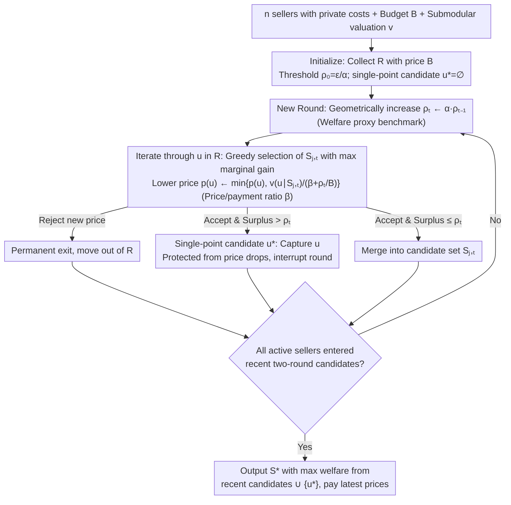

# Budget-Feasible Mechanisms for Submodular Welfare Maximization in Procurement Auctions

**Conference**: ICML 2026  
**arXiv**: [2605.00411](https://arxiv.org/abs/2605.00411)  
**Code**: https://anonymous.4open.science/r/BFM-SWM (Yes, anonymous repository)  
**Area**: Mechanism Design / Algorithmic Game Theory / Submodular Optimization  
**Keywords**: Procurement Auctions, Budget-Feasible, Submodular Social Welfare, Descending Clock Auction, Approximation Ratio

## TL;DR
This paper introduces BFM-SWM, the first truthful mechanism with approximation guarantees for submodular welfare maximization in procurement auctions under budget constraints and private costs. By utilizing a descending clock auction with geometrically increasing thresholds, single-point protection, and a price/payment ratio parameter $\beta$ to ensure non-negative surplus and budget feasibility, the mechanism achieves a 0.0328-approximation for general submodular functions and a 0.0877-approximation for monotone submodular functions. As a byproduct, BFM-VM improves the best deterministic approximation ratio for valuation maximization from 1/64 to $1/(12+4\sqrt{3})\approx 0.0528$, while reducing the runtime from $\mathcal{O}(n^2\log n)$ to $\mathcal{O}(n\log n)$.

## Background & Motivation

**Background**: Procurement auctions, where a buyer with a budget $B$ procures items from $n$ sellers with private costs $c(u)$, are widely applied in AI markets such as crowdsourcing, influence maximization, industrial procurement, and data acquisition. Since the introduction of budget-feasible mechanisms by Singer (2010), the primary objective has been submodular valuation maximization $\max_S v(S)$ s.t. $p(S)\le B$. Currently, the best stochastic approximation ratio for general submodular functions is 0.0856 (Han 2025), and the best deterministic ratio is 1/64 (Balkanski SODA 2022).

**Limitations of Prior Work**: (1) Deng et al. (ICML 2025) first pivoted the objective to the more economically meaningful "social welfare" $v(S)-c(S)$ (net social value, similar to gains-from-trade in bilateral trade), but their mechanism **straightforwardly yields budget feasibility**—total payments to sellers can exceed the buyer's budget, making it impractical for real-world procurement. (2) The state-of-the-art 1/64 deterministic valuation maximization mechanism by Balkanski (2022) requires $\mathcal{O}(n^2\log n)$ time and relies on complex greedy and unconstrained submodular maximization subroutines, making it difficult to implement.

**Key Challenge**: The welfare objective $v(\cdot)-c(\cdot)$ can be negative and, because $c(\cdot)$ is private information, it **cannot be directly queried by the mechanism**. These two factors render existing budget-feasible mechanisms (which assume non-negative and observable objectives) ineffective. Nikolakaki (2021) proved that even if costs are public, a constant multiplicative approximation of welfare is unavailable in polynomial time; thus, a weak approximation $v(S)-c(S)\ge\gamma_w\cdot v(O)-c(O)$ must be adopted.

**Goal**: To fill the gap in "welfare maximization + budget feasibility" by designing a mechanism that simultaneously satisfies truthfulness, individual rationality, non-negative seller surplus, and budget feasibility, while providing a provable lower bound for the approximation ratio of welfare.

**Key Insight**: Instead of directly calculating the true welfare of candidate sets (which is impossible due to private costs), the authors use a **geometrically increasing threshold $\rho_t$ as a welfare proxy benchmark**. In each round, the threshold is multiplied by $\alpha$, and prices drop according to $v(u\mid S)/(\beta+\rho_t/B)$. Simultaneously, a "single-point candidate $u^*$" is introduced to protect high-value individual sellers, and a price/payment ratio parameter $\beta$ is used to enforce $v(S)\ge\beta p(S)$ to ensure non-negative surplus.

**Core Idea**: By replacing "welfare evaluation" with "threshold proxy welfare," using parallel "single-point + multi-candidate" sets, and enforcing the price/payment ratio with $\beta$, the descending clock auction framework sidesteps unobservable private costs while locking in both budget and surplus constraints.

## Method

### Overall Architecture
The BFM-SWM (Algorithm 1) mechanism is a **descending clock auction**: it first collects all sellers who accept price $B$ into an active set $R$. The threshold is initialized as $\rho_0=\epsilon/\alpha$ and the single-point candidate $u^*=\emptyset$. In each round $t$, the threshold is multiplied by $\alpha$ ($\alpha>1$), and $\ell\in\{1,2\}$ parallel candidate sets $\{S_{i,t}\}$ are maintained. The mechanism iterates through sellers in $R$: it finds the candidate set $S_{j,t}$ with the maximum marginal gain and lowers the price $p(u)$ to $\min\{p(u), v(u\mid S_{j,t})/(\beta+\rho_t/B)\}$. If adding $u$ causes the surplus of $S_{j,t}$ to exceed the threshold $\rho_t$, $u$ is captured into $u^*$ and the round is interrupted; otherwise, $u$ is merged into $S_{j,t}$. The process terminates once all active sellers have entered the candidate sets of the two most recent rounds. Finally, the set $S^*$ with the highest welfare is chosen from $\{S_{i,M-1}, S_{i,M}\}\cup\{u^*\}$.

### Key Designs

**1. Geometrically Increasing Threshold $\rho_t=\alpha^t\cdot\rho_0$ as Welfare Proxy: Replacing uncalculable welfare with a monotonically tightening gate.**

The welfare target $v(\cdot)-c(\cdot)$ contains private cost $c(\cdot)$, which the mechanism cannot query, blocking any direct calculation. However, the marginal value $v(u\mid S)$ is observable. BFM-SWM introduces a threshold $\rho_t$ that increases geometrically by factor $\alpha>1$ as a proxy benchmark. It serves two roles: first, it is incorporated into the price denominator—$p(u)\leftarrow\min\{p(u),\, v(u\mid S_{j,t})/(\beta+\rho_t/B)\}$—so as the threshold rises, prices drop, making it easier for sellers to exit. Second, it acts as a clipping condition—once the surplus $v(S_{j,t}\cup\{u\})-p(\cdots)>\rho_t$ is reached, the round stops, capping the welfare of the candidate set. A key analysis step (Lemma 4.5) proves $\rho_M\le 2\alpha(v(S^*)-p(S^*))$, anchoring the final threshold to the output welfare and ensuring high-value candidates are not missed.

**2. "Temporary Protection" of Single-point Candidate $u^*$: Reserving space for high-value sellers to avoid being suppressed by price drops.**

The combination of submodularity, increasing thresholds, and parallel candidates has a side effect: a single highly valuable seller might be forced out by the price drop rules as the threshold inflates. $u^*$ acts as a protective cabin—when a seller $u$ joining a candidate set causes the surplus to exceed the current threshold, $u$ is captured into $u^*$ instead of $S_{j,t}$, and the round is interrupted. $u^*$ is then excluded from subsequent price drop rules. In the final selection, $\{u^*\}$ is considered alongside other candidates. This protection is necessary for the bound in Lemma 4.5; ablation shows that removing $u^*$ causes the mechanism to lose high-value sellers, failing the approximation ratio.

**3. Price/Payment Ratio Parameter $\beta>1$ to Force Non-negative Surplus: Hard-coding buyer surplus at the mechanism level.**

Classic budget-feasible mechanisms only handle $p(S)\le B$, but the welfare objective requires non-negative buyer surplus $v(S)-p(S)$. $\beta$ is introduced to enforce this: it is placed in the price denominator $v(u\mid S)/(\beta+\rho_t/B)$, ensuring each element added to $S_{i,t}$ satisfies $v(u\mid S_{i,t}^u)\ge\beta p(u)$. Summing over elements yields $v(S_{i,t})\ge\beta p(S_{i,t})$ (Lemma 4.6), which implies:

$$v(S)-p(S)\ge\Big(1-\tfrac{1}{\beta}\Big)v(S)\ge 0.$$

This inequality links welfare, valuation, and payment: $v(A)\le(v(A)-p(A))/(1-1/\beta)\le(v(A)-c(A))/(1-1/\beta)$, allowing $\beta$ to both guarantee non-negative surplus and participate in the approximation analysis.

### Loss & Training
Theoretical parameter tuning: For general (non-monotone) submodular functions, setting $\ell=2, \alpha=1+\tfrac{2\sqrt{6}}{3}, \beta=4$ yields a 0.0328-approximation (Thm 4.8). For monotone submodular functions, $\ell=1, \alpha=1+\tfrac{\sqrt{6}}{2}, \beta=3$ yields a 0.0877-approximation (Thm 4.10). Runtime is $\mathcal{O}(n\log(\text{OPT}/\epsilon))$. The BFM-VM byproduct with $\ell=2, \alpha=1+\sqrt{3}, \beta=0$ achieves a $1/(12+4\sqrt{3})$-approximation for valuation maximization in $\mathcal{O}(n\log n)$ time.

## Key Experimental Results

### Main Results
Influence maximization experiments on SNAP datasets (Slashdot 77K nodes, Email 265K nodes, Epinions 131K nodes) measured social welfare $v(S)-c(S)$ and oracle query counts.

| Application / Baseline | Welfare Relative to BFM-SWM | Query Count |
|---|---|---|
| Deng-Distorted / Deng-ROI / Deng-CostScaled | 0.04× – 0.82× (Varied by budget/data) | Usually more |
| BFM-SWM (Ours) | **1.00× (Baseline)** | Usually fewer |
| Avg. Improvement | **4.49×** | – |
| Max Improvement | **26.41×** | – |
| Min Improvement | **1.22×** | – |

Appendix C demonstrates BFM-VM's advantage over SOTA (e.g., Balkanski 2022) in crowdsourcing valuation maximization.

### Ablation Study

| Configuration | Key Metric | Description |
|---|---|---|
| Full BFM-SWM (General, $\ell=2$) | 0.0328-approx | Main result |
| Monotone Specialization ($\ell=1$) | **0.0877-approx** | Second candidate sequence removed via monotonicity |
| BFM-VM (Byproduct, Valuation Max) | $\approx 0.0528$ | **3.38× improvement** over Balkanski 2022 (1/64) |
| BFM-VM Time Complexity | $\mathcal{O}(n\log n)$ | One $n$ factor lower than Balkanski 2022's $\mathcal{O}(n^2\log n)$ |
| Without $u^*$ | Loss of Lemma 4.5 bound | High-value sellers lost, approx ratio fails |
| Without $\beta$ ($\beta=0$) | Loss of surplus guarantee | Welfare can become negative |

### Key Findings
- Baselines, even with prefix-truncation to satisfy the budget, lack theoretical guarantees, leading to welfare near 0 or negative at various budget points. BFM-SWM consistently maintains positive welfare with a 4.49× average advantage.
- The step of bounding the threshold $\rho_M$ against the output welfare $S^*$ (Lemma 4.5) is critical, converting a geometric threshold into an upper bound on final welfare.
- BFM-VM's speedup stems from using threshold filtering to construct disjoint candidate sets, avoiding the heavy unconstrained submodular maximization subroutines used by Balkanski.

## Highlights & Insights
- Solves a long-standing "difficult" open problem: a submodular mechanism satisfying budget feasibility + welfare objective + truthfulness + individual rationality + non-negative surplus.
- The "geometric threshold" + "single-point protection" + "price/payment ratio" trio is a reusable mechanism-design template for any scenario where the objective contains private variables and requires budget feasibility.
- The byproduct BFM-VM improves the best deterministic approximation ratio for valuation maximization—static for 12 years—from 1/64 to $\approx 0.0528$, while simultaneously reducing complexity.
- Opting for a descending clock auction (rather than sealed-bid) provides obvious strategyproofness, making it harder to manipulate than the mechanisms in Deng (2025).

## Limitations & Future Work
- The 0.0328 approximation ratio is still far from the $1-1/e \approx 0.632$ achievable without budget or private cost constraints, partly due to the impossibility result by Nikolakaki (2021).
- Experiments are limited to influence maximization and crowdsourcing; performance on complex valuation oracles for data markets or API pricing is unknown.
- The constants for $\alpha$ and $\beta$ (e.g., $1+2\sqrt{6}/3$) are derived for worst-case bounds; practical implementation requires careful tuning.
- Performance for $\ell > 2$ is unexplored; whether more candidate sequences can further improve the approximation ratio remains an open question.

## Related Work & Insights
- **vs Deng et al. 2025**: They introduced welfare maximization but abandoned budget feasibility and used sealed-bid; this paper provides the first budget-feasible + welfare-objective mechanism and uses a descending clock auction for obvious strategyproofness.
- **vs Balkanski et al. 2022 (SODA)**: They provided 1/64 for deterministic valuation maximization; BFM-VM uses simpler threshold filtering to reach 0.0528 in $\mathcal{O}(n\log n)$.
- **vs Distorted Greedy / Cost-Scaled Greedy**: These are regularized submodular algorithms for public costs; this paper "mechanism-izes" them for private costs.

## Rating
- Novelty: ⭐⭐⭐⭐⭐ First welfare-target budget-feasible truthful mechanism; breaks 12-year valuation record.
- Experimental Thoroughness: ⭐⭐⭐ Comprehensive for influence maximization; crowdsourcing included; but could cover more AI market types.
- Writing Quality: ⭐⭐⭐⭐⭐ Clear mapping between challenges (private + non-negativity) and techniques (thresholds + protection + $\beta$).
- Value: ⭐⭐⭐⭐⭐ Clear progress for the Algorithmic Game Theory community and deployable for industrial crowdsourcing/data platforms.

<!-- RELATED:START -->

## Related Papers

- [\[ICML 2026\] A General Framework for Dynamic Consistent Submodular Maximization](a_general_framework_for_dynamic_consistent_submodular_maximization.md)
- [\[ICML 2026\] Differentially Private Submodular Maximization with a Knapsack Constraint](differentially_private_submodular_maximization_with_a_knapsack_constraint.md)
- [\[NeurIPS 2025\] Online Two-Stage Submodular Maximization](../../NeurIPS2025/optimization/online_two-stage_submodular_maximization.md)
- [\[NeurIPS 2025\] A Unified Approach to Submodular Maximization Under Noise](../../NeurIPS2025/optimization/a_unified_approach_to_submodular_maximization_under_noise.md)
- [\[ICML 2026\] Depth over Fidelity in Fixed-Budget Noisy Evolution Strategies](depth_over_fidelity_in_fixed-budget_noisy_evolution_strategies.md)

<!-- RELATED:END -->
