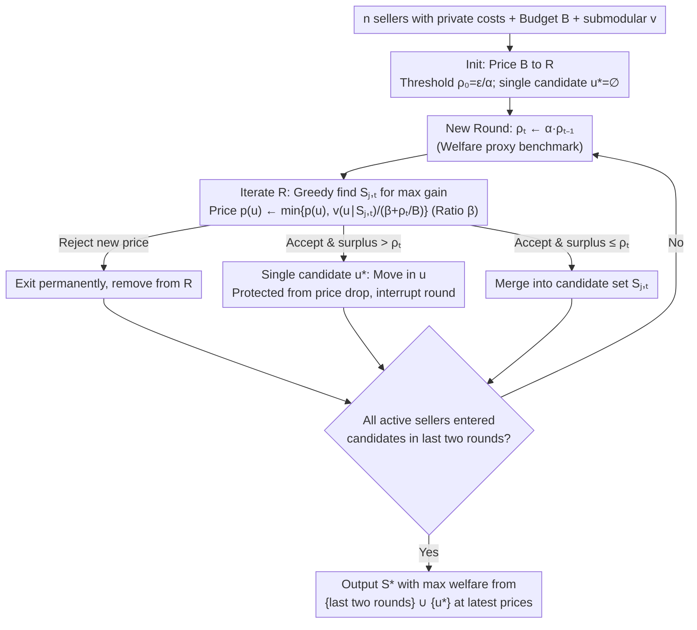

# Budget-Feasible Mechanisms for Submodular Welfare Maximization in Procurement Auctions

**Conference**: ICML 2026  
**arXiv**: [2605.00411](https://arxiv.org/abs/2605.00411)  
**Code**: https://anonymous.4open.science/r/BFM-SWM (Yes, anonymous repository)  
**Area**: Mechanism Design / Algorithmic Game Theory / Submodular Optimization  
**Keywords**: Procurement Auctions, Budget-Feasible, Submodular Social Welfare, Descending Clock Auctions, Approximation Ratio

## TL;DR
This paper proposes BFM-SWM, the first truthful mechanism with approximation guarantees for submodular welfare maximization in procurement auctions under budget constraints and private costs. By utilizing a descending clock auction with geometrically increasing thresholds ($\rho_t$), single-item protection ($u^*$), and a price-to-payment ratio parameter ($\beta$), the mechanism ensures non-negative surplus and budget feasibility. It achieves a 0.0328-approximation for general submodular functions and a 0.0877-approximation for monotone submodular functions. As a by-product, BFM-VM improves the best deterministic approximation ratio for valuation maximization from 1/64 to $1/(12+4\sqrt{3}) \approx 0.0528$, while reducing runtime from $\mathcal{O}(n^2\log n)$ to $\mathcal{O}(n\log n)$.

## Background & Motivation

**Background**: Procurement auctions (where a buyer with budget $B$ procures items from $n$ sellers with private costs $c(u)$) are widely applied in AI markets such as crowdsourcing, influence maximization, industrial procurement, and data acquisition. Since Singer (2010) pioneered budget-feasible mechanisms (BFM), the mainstream goal has been submodular valuation maximization $\max_S v(S)$ s.t. $p(S) \le B$. Currently, the best randomized approximation for general submodular functions is 0.0856 (Han 2025), and the best deterministic ratio is 1/64 (Balkanski SODA 2022).

**Limitations of Prior Work**: (1) Deng et al. 2025 (ICML) first shifted the objective to the more economically meaningful "social welfare" $v(S)-c(S)$ (net social value, analogous to gains-from-trade in bilateral trade), but their mechanism **directly abandoned budget feasibility**—sellers receive total payments exceeding the buyer's budget, making it impractical for real-world procurement. (2) The state-of-the-art deterministic 1/64 mechanism for valuation maximization (Balkanski 2022) requires $\mathcal{O}(n^2\log n)$ time and depends on complex greedy and unconstrained submodular maximization subroutines, leading to engineering complexity.

**Key Challenge**: The welfare objective $v(\cdot)-c(\cdot)$ can be negative and, because $c(\cdot)$ is private information, it **cannot be directly queried by the mechanism**. These two factors render existing budget-feasible mechanisms (which assume non-negative and observable objectives) ineffective. Nikolakaki (2021) proved that even with public costs, a constant multiplicative approximation for welfare is impossible in polynomial time; thus, a weak approximation $v(S)-c(S) \ge \gamma_w \cdot v(O)-c(O)$ must be adopted.

**Goal**: To fill the gap in "welfare maximization + budget feasibility" by designing a mechanism that simultaneously satisfies truthfulness, individual rationality, non-negative seller surplus, and budget feasibility, while providing a provable lower bound on welfare approximation.

**Key Insight**: Instead of directly calculating the true welfare of candidate sets (impossible due to private costs), the authors use a **geometrically increasing threshold $\rho_t$ as a benchmark proxy for welfare**. In each round, the threshold is multiplied by $\alpha$, and prices drop according to $v(u\mid S)/(\beta + \rho_t/B)$. Simultaneously, a "single-item candidate $u^*$" is introduced to protect high-value individual sellers, and a price-to-payment ratio $\beta$ is used to enforce $v(S) \ge \beta p(S)$ to ensure non-negative surplus.

**Core Idea**: By replacing "welfare evaluation" with "proxy thresholds" + "single-item & multi-candidate parallelism" + "ratio-enforced price-to-payment," the mechanism bypasses the unobservability of private costs within a descending clock auction framework while locking down both budget and surplus constraints.

## Method

### Overall Architecture
The BFM-SWM mechanism (Algorithm 1) is a **descending clock auction**: it first admits all sellers who accept price $B$ into an active set $R$; initializes the threshold $\rho_0 = \epsilon/\alpha$ and single-item candidate $u^* = \varnothing$. It then enters a multi-round loop—in each round $t$, the threshold is multiplied by $\alpha$ ($\alpha > 1$), and $\ell \in \{1,2\}$ parallel candidate sets $\{S_{i,t}\}$ are maintained. The mechanism iterates through sellers in $R$: it finds the candidate set $S_{j,t}$ with the maximum marginal gain and lowers the price of seller $u$ to $\min\{p(u), v(u \mid S_{j,t})/(\beta + \rho_t/B)\}$. If adding $u$ causes the surplus of $S_{j,t}$ to exceed the threshold $\rho_t$, $u$ is moved to the single-item candidate $u^*$ and the round is interrupted; otherwise, $u$ is merged into $S_{j,t}$. The process terminates once all active sellers have entered the candidate sets of the last two rounds. Finally, the set $S^*$ with the maximum welfare is selected from $\{S_{i,M-1}, S_{i,M}\} \cup \{u^*\}$. The three key designs are embedded into different stages: the **geometrically increasing threshold** acts as a welfare proxy, the **price-to-payment ratio $\beta$** in the denominator ensures non-negative surplus, and the **single-item candidate $u^*$** protects high-value sellers when surplus boundaries are crossed.

### Key Designs

**1. Geometrically Increasing Threshold $\rho_t = \alpha^t \cdot \rho_0$ as Welfare Proxy: Replacing uncomputable welfare with a monotonically tightening bar.**

The welfare objective $v(\cdot)-c(\cdot)$ contains private costs $c(\cdot)$, which the mechanism cannot query, blocking the path of "calculating candidate welfare directly." However, the marginal value $v(u \mid S)$ is observable. BFM-SWM introduces a threshold $\rho_t$ that increases geometrically at rate $\alpha > 1$ as a proxy benchmark. It serves two roles: first, it is incorporated into the price denominator—the rule $p(u) \leftarrow \min\{p(u), v(u \mid S_{j,t})/(\beta + \rho_t/B)\}$ ensures that as the threshold increases, prices decrease, and sellers are more likely to exit. Second, it acts as a clipping condition—once the surplus $v(S_{j,t} \cup \{u\}) - p(\dots) > \rho_t$ is reached, the process stops, capping the welfare of the candidate set. A key analytical step (Lemma 4.5) proves $\rho_M \le 2\alpha(v(S^*) - p(S^*))$, anchoring the final threshold to the output welfare. This controllable tightening bar approximates welfare while ensuring high-value candidates are not missed.

**2. "Temporary Protection" of Single-item Candidate $u^*$: Reserving a slot for exceptionally high-value sellers.**

Submodularity, threshold growth, and parallel candidates create a side effect: a single, highly valuable seller might be forced out by descending price rules as the threshold inflates. $u^*$ acts as a protection slot—when adding seller $u$ to a candidate set would push the surplus past the current threshold, $u$ is moved to $u^*$ and the round is interrupted, exempting $u$ from further price drops. When selecting the final output, $u^*$ is included in the selection pool. This protection is a prerequisite for the $\rho_M$ upper bound in Lemma 4.5. Ablation shows that removing $u^*$ results in losing high-value individual sellers, causing the approximation ratio to fail.

**3. Price-to-Payment Ratio $\beta > 1$ to Enforce Non-negative Surplus: Encoding "Buyer Positive Surplus" as a structural hard constraint.**

Classic budget-feasible mechanisms only ensure $p(S) \le B$, but the welfare objective adds an implicit requirement: the buyer's surplus $v(S) - p(S)$ must be non-negative, otherwise procurement is meaningless. $\beta$ is designed to lock this in: it is placed directly in the price denominator $v(u \mid S)/(\beta + \rho_t/B)$, ensuring every element added to $S_{i,t}$ satisfies $v(u \mid S_{i,t}^u) \ge \beta p(u)$. Summing over elements yields $v(S_{i,t}) \ge \beta p(S_{i,t})$ (Lemma 4.6), which implies:

$$v(S) - p(S) \ge \left(1 - \frac{1}{\beta}\right)v(S) \ge 0.$$

This inequality links welfare, valuation, and payment such that $v(A) \le (v(A) - p(A))/(1 - 1/\beta) \le (v(A) - c(A))/(1 - 1/\beta)$, allowing $\beta$ to both guarantee non-negative surplus and enter the approximation analysis alongside the threshold. This is also why the valuation maximization by-product BFM-VM sets $\beta = 0$ (as it does not require this surplus constraint).

### Loss & Training
Theoretical analysis for parameter selection: For general (non-monotone) submodular functions, $\ell=2, \alpha=1+\frac{2\sqrt{6}}{3}, \beta=4$ yields a 0.0328-approximation (Thm 4.8). For monotone submodular functions, it simplifies to $\ell=1, \alpha=1+\frac{\sqrt{6}}{2}, \beta=3$ for a 0.0877-approximation (Thm 4.10). Runtime is $\mathcal{O}(n\log(\text{OPT}/\epsilon))$. For the BFM-VM by-product, $\ell=2, \alpha=1+\sqrt{3}, \beta=0$ yields a $1/(12+4\sqrt{3})$-approximation for valuation maximization in $\mathcal{O}(n\log n)$ time.

## Key Experimental Results

### Main Results
Influence maximization experiments on SNAP (Slashdot 77K nodes 905K edges, Email 265K nodes 420K edges, Epinions 131K nodes 841K edges), measuring social welfare $v(S)-c(S)$ and oracle query counts.

| Application / Baseline | Welfare relative to BFM-SWM | Query Counts |
|---|---|---|
| Deng-Distorted / Deng-ROI / Deng-CostScaled (Baselines) | 0.04× – 0.82× (varies by budget/dataset) | Usually higher |
| BFM-SWM (Ours) | **1.00× (Baseline)** | Usually lower |
| Avg. Improvement | **4.49×** | – |
| Max. Improvement | **26.41×** | – |
| Min. Improvement | **1.22×** | – |

Appendix C also demonstrates BFM-VM's advantage over SOTA (Balkanski 2022) in crowdsourcing valuation maximization.

### Ablation Study

| Configuration | Key Metric | Description |
|---|---|---|
| Full BFM-SWM (General, $\ell=2$) | 0.0328-approx | Main result |
| Monotone Specialization ($\ell=1$) | **0.0877-approx** | Monotony allows removing the second candidate sequence |
| BFM-VM (By-product, Val. Max.) | $1/(12+4\sqrt{3}) \approx 0.0528$ | **3.38× improvement** over Balkanski 2022 (1/64) |
| BFM-VM Runtime | $\mathcal{O}(n\log n)$ | Reduces one factor of $n$ compared to Balkanski 2022's $\mathcal{O}(n^2\log n)$ |
| Remove $u^*$ | Loss of $\rho_M$ upper bound | Single high-value sellers are lost; approx ratio fails |
| Remove $\beta$ (i.e., $\beta=0$, for Val. Max. only) | Loss of non-negative surplus guarantee | Welfare can become negative |

### Key Findings
- Baselines, even with prefix-truncation to satisfy budget constraints, lack theoretical guarantees, leading to near-zero or negative welfare at many budget points. BFM-SWM consistently maintains positive welfare with a 4.49× average advantage.
- Coupling threshold $\rho_M$ with the final welfare of $S^*$ (Lemma 4.5) is the analytical linchpin, converting the "geometric threshold" into an upper bound on welfare.
- BFM-VM's speedup stems from using threshold filtering to construct disjoint candidate sets, bypassing heavy subroutines like unconstrained submodular maximization used in prior work.

## Highlights & Insights
- Addresses a long-standing "hard" open problem: providing a submodular mechanism that satisfies budget feasibility + welfare objective + truthfulness + individual rationality + non-negative surplus, offering the first practically feasible truthful mechanism for AI markets (data procurement, crowdsourcing, etc.).
- The "geometric threshold" + "single-item protection" + "ratio parameter" trio forms a reusable mechanism-design template for any scenario where the objective contains private variables and budget feasibility is required.
- The by-product BFM-VM breaks the 12-year-old 1/64 deterministic approximation record for valuation maximization, improving it to $1/(12+4\sqrt{3})$ while significantly reducing complexity.
- Using a descending clock auction (rather than sealed-bid) provides "obvious strategyproofness" (OSP), which is more robust against manipulation than the approach in Deng 2025.

## Limitations & Future Work
- The 0.0328-approximation ratio is still far from the best approximation in non-budgeted or non-private cost settings (1−1/e ≈ 0.632). This is partially due to impossibility results (Nikolakaki 2021), but room for improvement remains.
- Experiments focus on influence maximization and crowdsourcing; performance on other AI market scenarios like data markets or pricing APIs remains to be explored.
- The geometric rate $\alpha$ and ratio $\beta$ require specific constants (e.g., $1+2\sqrt{6}/3$, $1+\sqrt{6}/2$) derived from the proof, which requires careful implementation.
- $\ell$ is limited to 1 or 2; whether increasing the number of candidate sequences can further improve the ratio remains an open question.

## Related Work & Insights
- **vs Deng et al. 2025**: They first attempted welfare maximization but sacrificed budget feasibility using a sealed-bid format. This paper provides the first budget-feasible + welfare-maximizing mechanism and uses a descending clock auction for OSP, significantly outperforming Deng et al. in experiments.
- **vs Balkanski et al. 2022 (SODA)**: They achieved 1/64 for deterministic valuation maximization. The BFM-VM by-product replaces their greedy + unconstrained submodular subroutines with simple threshold filtering, reaching $1/(12+4\sqrt{3})$ in $\mathcal{O}(n\log n)$.
- **vs Distorted Greedy / Cost-Scaled Greedy / ROI Greedy**: These are regularized submodular algorithms for public costs. This paper "mechanism-izes" them for private costs using thresholds and provides corresponding approximation ratios.

## Rating
- Novelty: ⭐⭐⭐⭐⭐ First truthful mechanism for welfare + budget; breaks a decade-long valuation maximization record.
- Experimental Thoroughness: ⭐⭐⭐ Comprehensive main experiments on SNAP; valuation comparisons included; however, application variety is somewhat limited.
- Writing Quality: ⭐⭐⭐⭐⭐ Clearly explains the mapping between challenges (private + non-negativity) and techniques (thresholds + protection + $\beta$).
- Value: ⭐⭐⭐⭐⭐ Represents clear progress for the Algorithmic Game Theory community and provides a deployable truthful mechanism for industry (data markets, crowdsourcing).

<!-- RELATED:START -->

## Related Papers

- [\[ICML 2026\] A General Framework for Dynamic Consistent Submodular Maximization](a_general_framework_for_dynamic_consistent_submodular_maximization.md)
- [\[NeurIPS 2025\] Online Two-Stage Submodular Maximization](../../NeurIPS2025/optimization/online_two-stage_submodular_maximization.md)
- [\[NeurIPS 2025\] A Unified Approach to Submodular Maximization Under Noise](../../NeurIPS2025/optimization/a_unified_approach_to_submodular_maximization_under_noise.md)
- [\[ICML 2026\] URS：统一的神经路由求解器](urs_a_unified_neural_routing_solver_for_cross-problem_zero-shot_generalization.md)
- [\[ICML 2026\] Bregman meets Lévy: Stochastic Mirror Descent with Heavy-Tailed Noise in Continuous and Discrete Time](bregman_meets_lévy_stochastic_mirror_descent_with_heavy-tailed_noise_in_continuo.md)

<!-- RELATED:END -->
