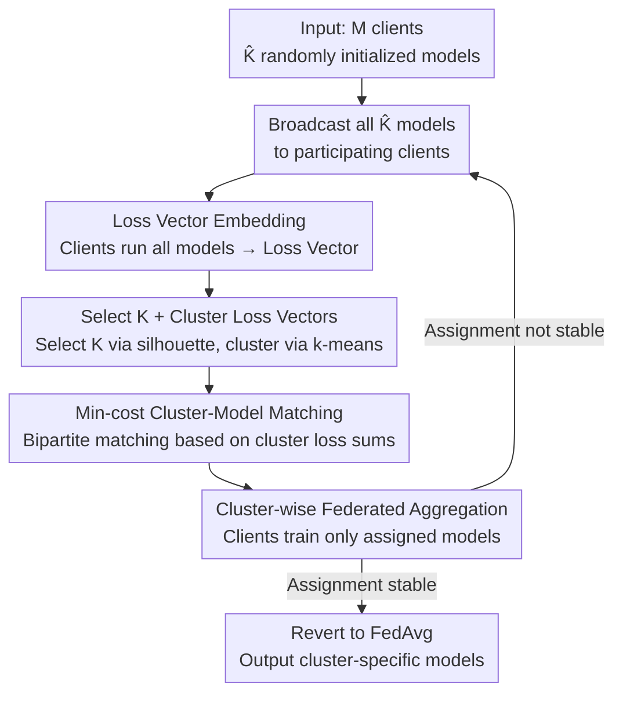

# CLoVE: Personalized Federated Learning through Clustering of Loss Vector Embeddings

**Conference**: ICML 2026  
**arXiv**: [2506.22427](https://arxiv.org/abs/2506.22427)  
**Code**: https://github.com/Nokia-Bell-Labs/Loss-Vector-based-Clustered-Federated-Learning  
**Area**: Federated Learning / Optimization  
**Keywords**: Clustered Federated Learning, Personalized Federated Learning, Loss Vector Embedding, Client Clustering, Non-IID

## TL;DR
CLoVE utilizes the "loss vector of each client across all candidate models" as a client embedding for Clustered Federated Learning (CFL). Based on the observation that "clients in the same cluster share similar loss patterns while those in different clusters exhibit significantly different patterns," the method recovers correct client clusters and trains cluster-specific models within a few communication rounds without requiring meticulous model initialization, achieving SOTA across numerous non-IID settings.

## Background & Motivation

**Background**: Federated Learning (FL) jointly trains models on decentralized data without centralizing raw data, but the natural heterogeneity (non-IID) of client data means a single global model (FedAvg) often fails to serve all participants optimally. Personalized Federated Learning (PFL) has emerged as a solution, with **Clustered Federated Learning (CFL)** being a major branch: it assumes clients naturally belong to $K$ clusters (intra-cluster identity), aiming to simultaneously **recover cluster assignments** and train a specific model for each cluster.

**Limitations of Prior Work**: The primary difficulty lies in unknown cluster labels. Classical methods (k-means, k-FED) rely on the assumption that "data points from different clusters are inherently well-separated," which is often violated in reality—even in a centralized setting, k-means on MNIST yields an ARI of only about 50% due to high intra-class variance and proximity to other clusters. Another representative method, **IFCA**, assigns clients based on "which model yields the minimum loss," but it is extremely sensitive to initialization: it requires the distance between each initial model and its optimal model to be strictly less than "half the minimum distance between any two optimal models." If initialization is poor, clients from multiple clusters may achieve the lowest loss on the same model and be merged into one cluster, while remaining models receive no updates and are never selected, causing the algorithm to collapse into a single cluster.

**Key Challenge**: Using a "single scalar loss (via argmin)" for client assignment results in information that is too sparse and over-sensitive to initialization; conversely, clustering based on "raw data distance" is often defeated by high variance or high overlap in the data itself.

**Key Insight**: The authors observe that even when **raw data overlaps significantly**, the different clusters' loss vectors remain highly separable when the losses of a client across **a set of models** are concatenated. For example, cluster 1 clients might have a loss vector of approximately $[1.0, 5.1]$, while cluster 2 is around $[2.1, 3.5]$. Although both clusters might favor model $\theta_1$ in the "minimum loss" dimension (causing IFCA to mismerge them), they are well-separated as 2D vectors due to their distinct directions.

**Core Idea**: Replace the "single-point argmin loss" with "loss vector embedding" as the client embedding. Directly cluster these vectors to recover clusters, then match clusters back to models for federated aggregation. This preserves the simplicity of loss-driven assignment while discarding the strict initialization requirements of IFCA.

## Method

### Overall Architecture
CLoVE iterates on a standard FL architecture where the server maintains $\hat{K}$ candidate models ($\hat{K}$ is an upper bound on clusters; $\hat{K}=K$ if $K$ is known). In each round, the server broadcasts all candidate models to a subset of participating clients. Each client runs its data through **all** models to produce a loss vector of length $\hat{K}$, which is sent back. The server clusters these loss vectors, matches the client clusters to models using minimum cost, and directs clients to perform local training only on their assigned model. Aggregation occurs per cluster. This "clustering ↔ training" alternation continues until client-to-cluster assignments **stabilize**, after which the server stops computing loss vectors and reverts to standard FedAvg with minimal overhead.

### Key Designs

**1. Loss Vector Embedding: Characterizing clients with a loss curve instead of a point**

Addressing IFCA's "thin information and stagnation" issues, CLoVE concatenates the empirical loss of client $i$ across all $\hat{K}$ models into a vector $L_{i,(t)} = [L_i(\theta_1^{(t)}), \dots, L_i(\theta_{\hat{K}}^{(t)})]$ as the embedding. Empirical loss is defined as $L_i(\theta; Z_i) \triangleq \frac{1}{|Z_i|}\sum_{z\in Z_i} f(\theta; z)$. Intuitively, clients in the same cluster have similar vectors because they share the same distribution; clients in different clusters exhibit different loss patterns across models, separating their vectors. This elevates the criterion for assignment from 1D argmin to a $\hat{K}$-dimensional geometric relationship. In theoretical analysis, the authors use the **Square-root Loss Vector (SLV)** $a^i_k(\theta)=[\sqrt{L^i_k(\theta_1)}, \dots]$, since under linear regression $\sqrt{L^i_k(\theta)} \sim \frac{\alpha(\theta,\theta^*_k)}{\sqrt{n_k}}\chi(n_k)$ follows a (scaled) Chi distribution, facilitating the characterization of inter-cluster mean separation.

**2. Clustering + Min-cost Cluster-Model Matching: Aligning unlabeled clusters to specific models**

Upon receiving loss vectors, the server uses `selectBestK` (scanning a range of $K$ and selecting the one with the highest **silhouette score** or via the elbow method) to determine $K^{(t+1)}$, then clusters the vectors using algorithms like k-means. Since there is no inherent mapping between "the 3rd client cluster" and "the 3rd model," a **minimum-cost bipartite matching** is performed: left nodes are clusters, right nodes are models, and edge weights are "the sum of losses of all clients in that cluster on that model." The matching is solved via max-flow or the Hungarian algorithm to assign each cluster to the model with the lowest aggregate loss, ensuring clusters align correctly with their corresponding models.

**3. Cluster-wise Federated Aggregation + Stability Determination: Iterative refinement and graceful exit**

After matching, each client performs local training for $\tau$ epochs only on its assigned model $\kappa_i$. The server aggregates updates for each model $j$ only from its assigned set of clients $C^{(t)}_j$, e.g., $\theta_j^{(t+1)}=\frac{\sum_{i\in C^{(t)}_j} n_i \tilde{\theta}_i}{\sum_{i\in C^{(t)}_j} n_i}$. As each model is primarily updated by its respective cluster, it becomes more "specialized," further separating the loss vectors in the next round—a positive feedback loop. **Stability** is tracked locally by clients: each client records its historical assignments. Once the assignment remains unchanged for a set number of rounds, it declares "stable" to the server. When all (or a set proportion) of clients are stable, the server declares convergence, after which it only sends each client its specific model, requiring no client-level state storage on the server.

### Loss & Training
Cross-entropy is used for classification and autoencoder reconstruction error for unsupervised tasks; theoretical analysis employs squared error $f(\theta;x,y)=(\langle\theta,x\rangle-y)^2$. Two theoretical conclusions support its effectiveness: **(i) One-shot cluster recovery**—under orthogonal initialization or $\Delta$-proximal models, k-means on SLV recovers the correct clustering with high probability $\xi=1-\delta-\frac{1}{\text{polylog}(M)}$ in a single round (reduction to Kumar & Kannan’s proximity condition); **(ii) Exponential convergence**—after $T$ rounds, each model satisfies $\|\theta_k-\theta^*_k\|\le \frac{\Delta}{c_1^T}$, approaching the optimum exponentially by a constant factor $c_1$. Notably, CLoVE only assumes separation $\Delta$ between optimal models and **makes no assumptions about initial model separation** (a key relaxation compared to IFCA).

## Key Experimental Results

### Main Results
On 3 types of tasks across 6 datasets (MNIST / FMNIST / CIFAR-10 / FEMNIST / Amazon / AG News) under various non-IID splits (label skew / feature skew / concept shift), CLoVE is compared against FedAvg, Local-only, Per-FedAvg, FedProto, FedALA, FedPAC, CFL-S, FeSEM, FlexCFL, PACFL, and IFCA. Representative supervised test accuracy (%) is shown below, where CLoVE achieves the highest or tied highest in most configurations:

| Configuration | Dataset | CLoVE | IFCA | Best Baseline | Note |
|---------------|---------|-------|------|---------------|------|
| Label skew 1 | MNIST | **99.8** | 99.1 | FlexCFL 99.4 | Near perfect |
| Label skew 1 | CIFAR-10 | **90.5** | 85.7 | CFL-S 87.4 | ~3-5% gain |
| Concept shift | CIFAR-10 | **58.4** | 52.7 | FedAvg 63.1* | Remains competitive |
| Label skew 2 | CIFAR-10 | **66.8** | 63.4 | CFL-S 62.1 | Outperforms IFCA |
| Feature skew | MNIST | **97.7** | 95.9 | FlexCFL 96.7 | Consistently top |
| Label skew 2 | AG News | 55.1 | 51.3 | FlexCFL 60.2 | Slightly behind on text |

(*While individual baselines occasionally score higher, CLoVE is the best overall; FeSEM performs poorly due to EM local optima, e.g., 11–15% on CIFAR-10.)

### Ablation Study

| Dimension | CLoVE Performance | Comparison |
|-----------|-------------------|------------|
| Initialization Robustness | Recovers clusters with random initialization | IFCA requires models within optimal radius |
| Convergence Rounds | Clusters recovered in < 10 rounds | CFL-S often requires hundreds |
| Dynamic Refinement | Round-by-round refinement, quality improves | FlexCFL is static and cannot correct errors |
| Applicability | Both supervised + unsupervised (recon) | Most PFL methods are supervised only |
| Local Optima | Loss vector clustering avoids EM traps | FeSEM prone to local optima |

### Key Findings
- **Loss vector is a critical upsampling**: When raw data has high overlap (low separability), loss vectors remain separable, which is why CLoVE outperforms distance-based clustering (k-FED/PACFL) under high-variance non-IID.
- **Removing initialization constraints is the primary practical value**: IFCA often fails on MNIST due to initialization; CLoVE succeeds with random initialization.
- **Unsupervised CFL is nearly unexplored**: CLoVE proves effective on autoencoder reconstruction tasks, expanding the boundaries of CFL.

## Highlights & Insights
- **The "Loss as Embedding" perspective is ingenious**: It introduces no additional communication or server-side state, reusing losses already computed during training to form high-dimensional features—raising discriminative information from 1D to $\hat{K}$D at zero extra cost.
- **Theory and Engineering parity**: It provides rigorous bounds for one-shot recovery and exponential convergence in linear regression, and the theoretical assumption (only requiring optimal model separation, not initial) matches the "random initialization works" observation.
- **Stability through local bookkeeping**: The server stores no client-level state, aligning with privacy and scalability. It seamlessly transitions to FedAvg after stabilization.

## Limitations & Future Work
- **Theoretical guarantees are limited to linear regression**: One-shot recovery and exponential convergence proofs hold in linear settings; deep networks have only empirical results.
- **Reliance on separation assumptions**: Analysis assumes unit norm optimal models, a minimum separation $\Delta$ near 1, and adequate SNR ($\Delta/\sigma$). Separability degrades if cluster centers are too close or noise is extreme.
- **Broadcasting $\hat{K}$ models each round**: The communication and computation overhead in the clustering phase scales linearly with $\hat{K}$, which can be high if $\hat{K}$ is overestimated (though it drops after stabilization).
- **Text task performance**: Not leading on AG News, suggesting the discriminative power of loss vectors may vary across modalities.

## Related Work & Insights
- **vs IFCA**: Both use loss for assignment, but IFCA's 1D argmin requires strict initial model proximity to avoid cluster collapse; CLoVE uses loss vectors + matching to remove this requirement and enable error correction.
- **vs CFL-S**: CFL-S clusters gradients but takes hundreds of rounds; CLoVE takes < 10 rounds and handles sparse participation.
- **vs FlexCFL / PACFL**: These perform one-shot static clustering; CLoVE refines clusters iteratively.
- **vs FeSEM**: FeSEM uses EM to match users to model centers, prone to local optima; CLoVE avoids this via vector clustering.
- **vs k-FED / k-means**: These rely on raw data separability; CLoVE remains robust even when raw data overlaps by utilizing loss space.

## Rating
- Novelty: ⭐⭐⭐⭐ The "Loss vector as embedding" view is simple yet powerful, relaxing IFCA's initialization constraints and unifying supervised/unsupervised CFL.
- Experimental Thoroughness: ⭐⭐⭐⭐⭐ 6 datasets, 3 task types, extensive non-IID splits, and 11 baselines.
- Writing Quality: ⭐⭐⭐⭐ Intuitive diagrams clarify the IFCA failure mechanism; good theory-to-experiment transition.
- Value: ⭐⭐⭐⭐ Simple, robust, low communication after stabilization, and dynamically correctable.

<!-- RELATED:START -->

## Related Papers

- [\[CVPR 2026\] Few-for-Many Personalized Federated Learning](../../CVPR2026/optimization/few-for-many_personalized_federated_learning.md)
- [\[CVPR 2025\] SCOPE: Semantic Coreset with Orthogonal Projection Embeddings for Federated Learning](../../CVPR2025/optimization/scope_semantic_coreset_with_orthogonal_projection_embeddings_for_federated_learn.md)
- [\[AAAI 2026\] Personalized Federated Learning with Bidirectional Communication Compression via One-Bit Random Sketching](../../AAAI2026/optimization/personalized_federated_learning_with_bidirectional_communication_compression_via.md)
- [\[ICLR 2026\] Learning to Recall with Transformers Beyond Orthogonal Embeddings](../../ICLR2026/optimization/learning_to_recall_with_transformers_beyond_orthogonal_embeddings.md)
- [\[NeurIPS 2025\] Personalized Subgraph Federated Learning with Differentiable Auxiliary Projections](../../NeurIPS2025/optimization/personalized_subgraph_federated_learning_with_differentiable_auxiliary_projectio.md)

<!-- RELATED:END -->
