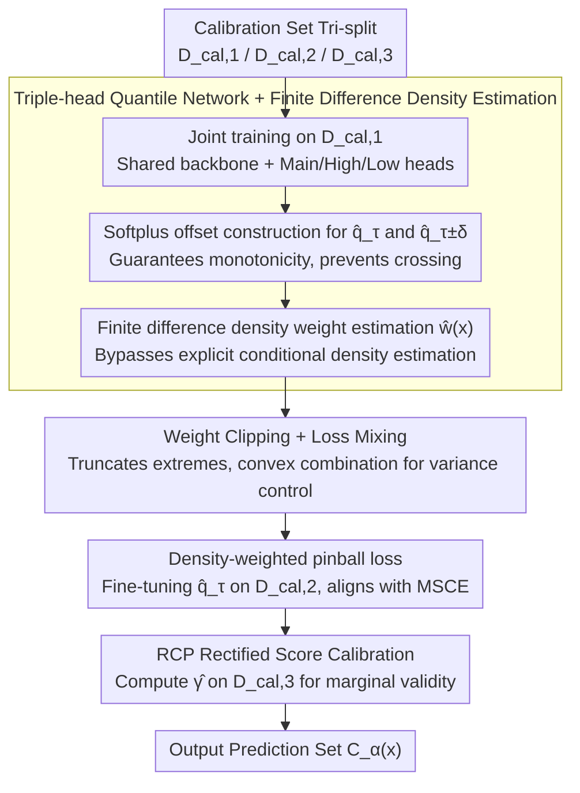

# Colorful Pinball: Density-Weighted Quantile Regression for Conditional Guarantee of Conformal Prediction

**Conference**: ICML2026  
**arXiv**: [2512.24139](https://arxiv.org/abs/2512.24139)  
**Code**: https://github.com/Colorful-Pinball/CPCP  
**Area**: Optimization  
**Keywords**: conformal prediction, conditional coverage, quantile regression, density weighting, pinball loss  

## TL;DR

This paper reveals the inherent flaw of standard pinball loss in optimizing conditional coverage through Taylor expansion—specifically, its neglect of heteroscedasticity. It proposes the density-weighted pinball loss as a tighter surrogate objective for the Mean Squared Coverage Error (MSCE) and designs a triple-head quantile network using finite differences to estimate density weights, significantly improving conditional coverage performance across 8 high-dimensional regression benchmarks.

## Background & Motivation

**Background**: Conformal Prediction (CP) is the prevailing paradigm for uncertainty quantification, providing distribution-free marginal coverage guarantees $\mathbb{P}(Y \in \mathcal{C}_\alpha(X)) \geq 1-\alpha$ with finite samples. However, standard split CP only ensures marginal coverage at the population level and fails to guarantee conditional coverage $\mathbb{P}(Y \in \mathcal{C}_\alpha(X) \mid X=x)$ for specific inputs $x$, which is the actual requirement in high-risk scenarios.

**Limitations of Prior Work**: Existing approaches for conditional coverage follow two paths: (1) approximating conditional guarantees via grouping or localization (e.g., group-conditional, localized CP), though limited by the curse of dimensionality; (2) improving non-conformity score functions (e.g., CQR, RCP) by calibrating heteroscedasticity through quantile regression. However, a systematic bias exists between the standard pinball loss objective and MSCE.

**Key Challenge**: Prior works (Kiyani et al., 2024; Plassier et al., 2025a) established upper bound relationships between MSCE and pinball loss excess risk, but these bounds rely on the global Lipschitz constant $L_F$ of the conditional CDF, which is often loose. It ignores the variation of $f_{S|X}(q_\tau(x))$ across different $x$, i.e., the difference in "steepness" of the conditional score distribution at the target quantile.

**Goal**: Directly approximate the Mean Squared Coverage Error (MSCE) of conditional coverage rather than relying on loose upper bounds or relaxed definitions of conditional coverage.

**Key Insight**: Taylor expansion of MSCE reveals that its dominant term is the **density-weighted pinball excess risk** $\mathbb{E}_X[f_{S|X}(q_\tau(X)) \cdot \mathcal{E}(X)]$, where the weight is precisely the conditional density at the true quantile. Under the location-scale family, this weight is proportional to $1/\sigma(x)$, assigning higher weights to low-variance (steep CDF) regions where conditional coverage is most sensitive—small quantile errors can cause coverage to drop from 95% to 80%.

**Core Idea**: Replace standard pinball loss with density-weighted pinball loss for training quantile regression. Use finite differences from auxiliary quantiles to estimate density weights, compensating for the standard method's neglect of heteroscedastic structures.

## Method

### Overall Architecture

CPCP (Colorful Pinball Conformal Prediction) divides the calibration set into three subsets $\mathcal{D}_{\text{cal},1}, \mathcal{D}_{\text{cal},2}, \mathcal{D}_{\text{cal},3}$ and executes a three-stage pipeline: (1) jointly train three quantile estimators (target quantile $\tau$ and auxiliary quantiles $\tau \pm \delta$) on $\mathcal{D}_{\text{cal},1}$; (2) estimate density weights via finite differences using auxiliary quantiles and fine-tune the target quantile with weighted pinball loss on $\mathcal{D}_{\text{cal},2}$; (3) perform RCP rectified score calibration on $\mathcal{D}_{\text{cal},3}$ to ensure marginal validity. The final output is the prediction set $\mathcal{C}_\alpha(x_{\text{test}}) = \{y: S(x_{\text{test}}, y) \leq \hat{q}_\tau(x_{\text{test}}) + \hat{\gamma}\}$.

### Key Designs

**1. Density-Weighted Pinball Loss (Theoretical Core): Bridging the gap between standard pinball and conditional coverage MSCE via the density factor.**

The authors clarify why standard pinball loss fails to optimize conditional coverage through Taylor expansion: the dominant term of the squared conditional coverage bias $(F_{S|X}(\hat{q}_\tau(x))-\tau)^2$ is $f_{S|X}(q_\tau(x))^2\cdot\epsilon_q(x)^2$, while the dominant term of standard pinball excess risk is $\tfrac{1}{2}f_{S|X}(q_\tau(x))\cdot\epsilon_q(x)^2$. The difference is exactly the density factor $f_{S|X}(q_\tau(x))$. This implies that standard pinball under-weights regions with steep conditional CDFs (high $f_{S|X}$, low $\sigma(x)$), which are precisely the areas most sensitive to quantile errors. The proposed solution multiplies the pinball loss by the density weight $f_{S|X}(q_\tau(x))$ to align the objective with MSCE. Under common location-scale families, this weight simplifies to $1/\sigma(x)$.

**2. Triple-Head Quantile Network + Finite Difference Density Estimation: Estimating weights via auxiliary quantiles without full density estimation.**

Explicitly estimating the conditional density $f_{S|X}$ is often more difficult than the regression task itself. The authors circumvent this by leveraging the inverse relationship between quantile functions and the CDF, $\partial q_\tau(x)/\partial\tau=1/f_{S|X}(q_\tau(x))$, and approximate the density via finite differences:

$$\hat{w}(x)=\frac{2\delta}{\hat{q}_{\tau+\delta}(x)-\hat{q}_{\tau-\delta}(x)}.$$

The network comprises a shared backbone $h(x)$ and three projection heads. Auxiliary quantiles are constructed as $\hat{q}_{\tau\pm\delta}(x)=\hat{q}_\tau(x)\pm\text{Softplus}(\phi_{\text{high/low}}\circ h(x))$, where Softplus ensures non-negative offsets and monotonicity ($\hat{q}_{\tau-\delta}<\hat{q}_\tau<\hat{q}_{\tau+\delta}$), preventing quantile crossing.

**3. Weight Clipping + Loss Mixing (Stability for Finite Samples): Insurance against variance explosion of inverse weights.**

The denominator $\hat{q}_{\tau+\delta}-\hat{q}_{\tau-\delta}$ in the finite difference estimator can approach zero when $\delta$ is small, leading to weight $\hat w(x)$ explosion. Two stabilization techniques are employed: weight clipping limits extreme weights within $M$ times the empirical mean; loss mixing defines the objective as a convex combination of weighted and standard pinball loss, effectively imposing an artificial lower bound on weights. These methods trade slight bias for significant variance reduction, similar to inverse propensity score clipping in causal inference.

### Loss & Training

A two-stage training strategy is adopted: In the first stage, three quantile heads are jointly trained on $\mathcal{D}_{\text{cal},1}$ using standard pinball loss. In the second stage, the backbone and auxiliary heads are frozen, and the main head is fine-tuned on $\mathcal{D}_{\text{cal},2}$ using the density-weighted pinball loss. Finally, the empirical quantile $\hat{\gamma}$ of rectified scores is computed on $\mathcal{D}_{\text{cal},3}$ to guarantee marginal validity.

## Key Experimental Results

### Main Results: Conditional Coverage Performance (MSCE ↓)

Comparison of MSCE (Mean Squared Coverage Error) across 8 high-dimensional regression benchmarks, target coverage $\tau = 90\%$, 20 repetitions:

| Method | Bike | Diamond | Naval | SGEMM | Transcoding | WEC |
|------|------|---------|-------|-------|-------------|-----|
| Split CP | 0.0031 | 0.0118 | 0.0351 | 0.0039 | 0.0125 | 0.0123 |
| CQR | 0.0011 | 0.0010 | 0.0120 | 0.0012 | 0.0016 | 0.0061 |
| RCP | 0.0010 | 0.0133 | 0.0029 | 0.0007 | 0.0009 | 0.0030 |
| CPCP | 0.0009 | 0.0009 | 0.0019 | 0.0003 | 0.0009 | 0.0025 |
| **Ours (Clip+Mix)** | **0.0008** | **0.0004** | **0.0019** | **0.0003** | **0.0004** | **0.0012** |

### Ablation Study / Worst-Slice Coverage (WSC ↑)

| Method | Bike | Diamond | Naval | SGEMM | Transcoding | WEC |
|------|------|---------|-------|-------|-------------|-----|
| Split CP | 0.8133 | 0.6480 | 0.5428 | 0.7435 | 0.6797 | 0.7623 |
| CQR | 0.8641 | 0.8563 | 0.6997 | 0.8393 | 0.8175 | 0.8149 |
| RCP | 0.8849 | 0.8448 | 0.8002 | 0.8627 | 0.8515 | 0.8516 |
| **Ours (Clip+Mix)** | **0.8882** | **0.8802** | **0.8320** | **0.8912** | **0.8759** | **0.8715** |

### Key Findings

- CPCP (Clip+Mix) reduces MSCE by approximately 40-60% compared to RCP and improves WSC (worst-slice coverage) from ~80% to ~87-89%.
- Ablation shows that RCP-MultiHead (joint training without density weights) performs similarly to RCP, proving that improvements stem from the weighted objective rather than multi-task learning capacity.
- Results are robust for bandwidth $\delta$ in the 0.01-0.05 range (default $\delta=0.02$).
- Stabilization via clipping and mixing consistently provides extra gains across all datasets, particularly on high-dimensional multi-output data like SGEMM and Transcoding.

## Highlights & Insights

- **Elegant Theoretical Insight**: Precisely characterizes the systematic "missing density factor" bias between standard pinball loss and conditional coverage MSCE via Taylor expansion, transforming a black-box problem into a mathematically motivated weighted regression.
- **Clever Finite Difference Design**: Utilizes the inverse relationship between quantiles and CDFs to avoid the difficult task of conditional density estimation, requiring only two auxiliary quantiles. Softplus parameterization solves both quantile crossing and negative weight issues.
- **Theoretical Completeness**: Provides a full non-asymptotic excess risk bound, including characterization of inverse weights. This theoretical framework is applicable to other inverse-propensity problems like causal inference or off-policy evaluation.

## Limitations & Future Work

- Tri-splitting the calibration set reduces effective sample size per subset to 1/3, which may degrade performance in small-sample regimes.
- Density weight estimation depends on auxiliary quantile accuracy, potentially becoming unstable at extreme quantiles ($\tau \approx 0$ or $1$) or in sparse regions.
- The theoretical convergence rate $O(n^{-1/3})$ is slower than standard quantile regression; while the constant factor advantage of density weighting compensates in finite samples, standard methods might catch up in the infinite data limit.
- Extension to conditional guarantees in classification and structured output (graphs, sequences) remains to be explored.

## Related Work & Insights

- **RCP** (Plassier et al., 2025a): Direct foundation for CPCP; CPCP can be viewed as introducing a superior weighted objective into the quantile regression stage of the RCP framework.
- **CQR** (Romano et al., 2019): Classic quantile regression based conformal calibration.
- **PLCP** (Kiyani et al., 2024): Establishes links between MSCE and pinball risk but uses discrete binning approximations with a slower $O(n^{-1/4})$ convergence rate.

<!-- RELATED:START -->

## Related Papers

- [\[CVPR 2026\] Conditional Factuality Controlled LLMs with Generalization Certificates via Conformal Sampling](../../CVPR2026/optimization/conditional_factuality_controlled_llms_with_generalization_certificates_via_conf.md)
- [\[ICLR 2026\] Conformal Prediction Adaptive to Unknown Subpopulation Shifts](../../ICLR2026/optimization/conformal_prediction_adaptive_to_unknown_subpopulation_shifts.md)
- [\[ICML 2025\] Conformal Prediction as Bayesian Quadrature](../../ICML2025/optimization/conformal_prediction_as_bayesian_quadrature.md)
- [\[NeurIPS 2025\] Conformal Prediction for Causal Effects of Continuous Treatments](../../NeurIPS2025/optimization/conformal_prediction_for_causal_effects_of_continuous_treatments.md)
- [\[ICML 2025\] On Temperature Scaling and Conformal Prediction of Deep Classifiers](../../ICML2025/optimization/on_temperature_scaling_and_conformal_prediction_of_deep_classifiers.md)

<!-- RELATED:END -->
