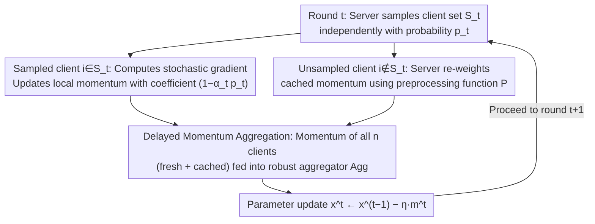

# Delayed Momentum Aggregation: Communication-efficient Byzantine-robust Federated Learning with Partial Participation

**Conference**: ICML 2026  
**arXiv**: [2509.02970](https://arxiv.org/abs/2509.02970)  
**Code**: Not yet public  
**Area**: Optimization / Federated Learning  
**Keywords**: Federated Learning, Byzantine Robustness, Partial Participation, Delayed Momentum, Robust Aggregation

## TL;DR
Addressing the pain point where "Byzantine clients temporarily form a majority in sampled clients" collapses existing robust aggregators under partial participation, this paper proposes the Delayed Momentum Aggregation principle. The server feeds the current round's new momentum along with the most recent cached momentum from unsampled clients into the robust aggregator, effectively maintaining the global Byzantine ratio $\delta < 1/2$ in every aggregation round. Based on this, the DeMoA optimizer is designed, which achieves stable ResNet-18/CIFAR-10 training even under extreme settings of $p=0.1$ and $\delta=0.2$.

## Background & Motivation

**Background**: The "standard configuration" for Byzantine-robust Federated Learning (FL) involves robust aggregators (Krum / Coordinate Median / RFA / CCLIP) combined with client-side local momentum for variance reduction—the former isolates single-point malicious updates, and the latter distinguishes temporally accumulated attacks like ALIE from normal stochastic noise. Existing theories almost exclusively assume full client participation.

**Limitations of Prior Work**: Real-world systems must use partial participation due to bandwidth, battery, and availability constraints. However, the naive combination of "partial participation + robust aggregation" fails. The reason is sharp: even if the global Byzantine ratio is $\delta < 1/2$, in certain independently sampled rounds, the sampled set itself may contain a Byzantine majority ("Byzantine majority round"). Any robust aggregator looking only at the current round's input cannot distinguish good from bad. At $p=0.1, \delta=0.2$, such catastrophic rounds appear as early as the first epoch, causing FedAvg/FedCM to collapse immediately.

**Key Challenge**: The fundamental conflict between communication efficiency (small $p$) and robustness—reducing the participation rate exponentially increases the probability of Byzantine majority rounds. Allouah et al. (2024) characterized partial participation but required $p$ to be too large and did not solve majority rounds; Malinovsky et al. (2024) used variance reduction plus clipping to resist majority rounds but relied on large minibatches or full gradients, which are impractical in deep learning.

**Goal**: Find a solution that tolerates Byzantine majority rounds, adapts to standard deep learning minibatches, and introduces zero additional communication overhead.

**Key Insight**: The server actually retains a cache of the last momentum sent by each client. If these caches are treated as "virtual current updates" and fed into the robust aggregator together, the aggregator faces the full set of $n$ clients. The Byzantine ratio then always equals the global $\delta$, effectively eliminating majority rounds.

**Core Idea**: Use "Delayed Momentum Aggregation" to restore the aggregator's perspective from a "sampled subset" to the "global set," and ensure theoretical convergence through careful selection of momentum coefficients and delay corrections.

## Method

### Overall Architecture
DeMoA maintains the standard shell of synchronous FL: in each round $t$, the server independently samples each client with probability $p_t$ to form $\mathcal{S}_t$. Sampled clients compute stochastic gradients using local data, update their local momentum, and transmit it back. The momentum of unsampled clients is "re-weighted" by the server to simulate the same decay rhythm. The server then sends the momentum of all $n$ clients (both fresh and cached) into a $(\delta,c)$-robust aggregator $\mathrm{Agg}$, outputting $\bm{m}^t$ as the update direction: $\bm{x}^t \leftarrow \bm{x}^{t-1} - \eta\,\bm{m}^t$. The only added state is "the server caches one momentum vector per client," with communication volume identical to FedAvg.

### Key Designs

**1. Delayed Momentum Aggregation Principle: Restoring the Aggregator's Global View**

The root cause of collapse under partial participation is that even if the global Byzantine ratio $\delta < 1/2$, the sampled subset $\mathcal{S}_t$ might have a Byzantine majority. DeMoA treats cached momentum as "virtual current updates": for an unsampled client $i \notin \mathcal{S}_t$, its momentum $\bm{m}_i^{t-\tau(i,t)}$ from the last sampled time $t-\tau(i,t)$ is used after preprocessing $\mathcal{P}$. The aggregator receives $\{\bm{m}_i^t\}_{i \in \mathcal{S}_t} \cup \{\mathcal{P}(\bm{m}_i^{t-\tau(i,t)}, i, t)\}_{i \notin \mathcal{S}_t}$. Thus, the aggregator always faces $n$ clients with a constant Byzantine ratio $\delta$, eliminating Byzantine majority rounds. Under small step sizes, delayed momentum is a good approximation of $\nabla f_i(\bm{x}^t)$, keeping honest signals visible and mitigating non-IID drift—all with zero extra communication.

**2. Special Momentum Coefficient $(1-\alpha_t p_t)$: Decoupling Sampling Noise from Momentum Noise**

Using the standard FedCM momentum coefficient $(1-\alpha_t)$ would cause the coefficient to randomize with sampling, introducing variance tied to the historical momentum norm $\|\bm{m}_i^{t-1}\|^2$, potentially leading to divergence. Ours uses $(1-\alpha_t p_t)$: for sampled clients, $\bm{m}_i^t = (1-\alpha_t p_t)\bm{m}_i^{t-1} + \alpha_t \nabla f_i(\bm{x}^{t-1}; \xi_i^t)$; for unsampled clients, $\bm{m}_i^t = (1-\alpha_t p_t)\bm{m}_i^{t-1}$. With an indicator $r_i^t \sim \mathrm{Ber}(p_t)$, the expected recursion matches standard momentum $(1-\alpha_t p_t)\bm{m}_i^{t-1} + \alpha_t p_t \nabla f_i$, while the variance is reduced to $\alpha_t^2 p_t (1-p_t) \|\nabla f_i\|^2$, removing the term dependent on historical momentum norms. This effectively merges "explicit momentum" and "sampling-induced implicit momentum" into one parameter $\alpha_t p_t$.

**3. Pre-processing Function $\mathcal{P}$: Removing Implicit Momentum for Bound-free Analysis**

Directly aggregating cached momentum delayed by $\tau(i,t)$ rounds would introduce implicit momentum terms requiring a "bounded gradient" assumption. Ours provides a closed-form correction:

$$\mathcal{P}(\bm{m}_i^{t-\tau(i,t)}, i, t) = \Big[ \prod_{s=t-\tau(i,t)+1}^{t} (1-\alpha_s p_s) \Big] \bm{m}_i^{t-\tau(i,t)},$$

which allows the cached momentum to naturally decay as if it were never sampled up to round $t$. This removes the dependency on bounded gradient assumptions and views MIFA as a degenerate case (where $\alpha=1$, $\mathrm{Agg}$ is the mean, and $\mathcal{P}=\text{id}$). Preprocessing bridges the gap between delayed momentum and robust aggregation.

## Key Experimental Results

### Main Results

Setting $n=25$ clients, $\delta=0.2$, and using CCLIP robust aggregation, FedAvg, FedCM, Byz-VR-MARINA-PP, and DeMoA were compared on IID and non-IID data.

| Dataset | Participation $p$ | Metric | FedAvg / FedCM | Byz-VR-MARINA-PP | DeMoA |
| :--- | :--- | :--- | :--- | :--- | :--- |
| MNIST (ConvNet) | 0.5 | First Byzantine Majority | Collapses after epoch 3 | Stable but lower accuracy | Highest throughout |
| CIFAR-10 (ResNet-18) | 0.1 | First Byzantine Majority | Collapses at epoch 1 | High variance, non-IID failures | Stable, highest accuracy |

DeMoA achieved the highest final accuracy and lowest variance across nearly all combinations of five attacks (ALIE, Bit-Flipping, IPM, Label-Flipping, Mimic) and four aggregators (CM, Krum, RFA, CCLIP).

### Ablation Study

| Configuration | Phenomenon | Insight |
| :--- | :--- | :--- |
| No Byzantine $\delta=0, p=0.5$ | DeMoA outperforms FedCM | Delayed momentum acts as implicit regularization for non-IID drift. |
| Replace $(1-\alpha_t p_t) \to (1-\alpha_t)$ | Variance term $\alpha_t^2 p_t(1-p_t)\|\bm{m}_i^{t-1}\|^2$ appears | Explain why naive momentum is amplified by sampling noise. |
| Remove Preprocessing $\mathcal{P}$ | Robust constant $c=\infty$ | Preprocessing is essential to connect delayed momentum with theory. |
| $\delta$ exceeds aggregator breakdown | Performance degradation | Theory and observation align regarding breakdown points. |

### Key Findings
- Failure mode identified: The collapse of FedAvg/FedCM occurs strictly after the "first Byzantine majority round," validating that delayed momentum aggregation targets the correct failure point.
- The non-vanishing term $\mathcal{O}(c\delta\zeta^2)$ in the convergence rate $\frac{1}{T}\sum\mathbb{E}\|\nabla f(\bm{x}^t)\|^2 = \dots$ under partial participation is of the same order as the full participation lower bound, not amplified by $1/\gamma^2$ as in decentralized gossip.
- Under over-parameterization ($\zeta=0, B$-heterogeneity) assumptions (Corollary 3.2), the non-vanishing term disappears, returning to the i.i.d. optimal rate.

## Highlights & Insights
- Dimensions of the "Byzantine majority round" problem are reduced to the full-participation case via the simple operation of expanding the aggregation set, with zero communication overhead.
- The momentum coefficient $(1-\alpha_t p_t)$ is a precise modification that decouples two noise sources (sampling and momentum update), transferable to any "partial participation + momentum" optimizer.
- The preprocessing function $\mathcal{P}$ provides a closed-form mapping that allows asynchronous optimization conclusions to hold in synchronous partial participation settings without the strong "bounded gradient" assumption.

## Limitations & Future Work
- The server must store a momentum vector for every client, which may be memory-intensive for very large $n$. The paper suggests embedding communication compression into $\mathcal{P}$, but systemic analysis is lacking.
- The convergence rate still contains a term $\Gamma = (1-p) \cdot \Theta(1+B^2+c\delta G)/(G(1-60c\delta B^2))$, where constants increase with very small $p$ and heavy heterogeneity.
- Experiments are limited to ResNet-18/CIFAR-10 and ConvNet/MNIST; larger models or large-scale FL have not been verified. Only independent Bernoulli sampling was studied; complex strategies (clustering, power-of-choice) remain future work.
- The Byzantine ratio $\delta$ upper bound might be tight for highly heterogeneous data; adaptive attacks specifically targeting delayed momentum have not yet been evaluated.

## Related Work & Insights
- **vs Allouah et al. 2024**: They characterized participation rates but required large $p$ and did not handle majority rounds or momentum (vulnerable to temporal attacks). Ours actively eliminates majority rounds.
- **vs Malinovsky et al. 2024 (Byz-VR-MARINA-PP)**: They rely on MARINA-style variance reduction plus clipping, requiring large batches or full gradients; DeMoA is more stable and accurate with regular minibatches.
- **vs MIFA / Fedvarp / CA2FL**: These target client unavailability rather than Byzantine robustness, analyzing only SGD. Naive momentum usage there triggers implicit momentum effects; DeMoA corrects this and applies it to robustness.
- **vs OrMo (Asynchronous Momentum SGD)**: Inspired the preprocessing function $\mathcal{P}$, but OrMo relies on bounded gradients. Ours removes this assumption in the synchronous partial participation setting.

## Rating
- Novelty: TBD
- Experimental Thoroughness: TBD
- Writing Quality: TBD
- Value: TBD

<!-- RELATED:START -->

## Related Papers

- [\[ICLR 2026\] Byzantine-Robust Federated Learning with Learnable Aggregation Weights](../../ICLR2026/optimization/byzantine-robust_federated_learning_with_learnable_aggregation_weights.md)
- [\[NeurIPS 2025\] Layer-wise Update Aggregation with Recycling for Communication-Efficient Federated Learning](../../NeurIPS2025/optimization/layer-wise_update_aggregation_with_recycling_for_communication-efficient_federat.md)
- [\[ICLR 2026\] Single-Loop Byzantine-Resilient Federated Bilevel Optimization](../../ICLR2026/optimization/single-loop_byzantine-resilient_federated_bilevel_optimization.md)
- [\[NeurIPS 2025\] Efficient Federated Learning against Byzantine Attacks and Data Heterogeneity via Aggregating Normalized Gradients](../../NeurIPS2025/optimization/efficient_federated_learning_against_byzantine_attacks_and_data_heterogeneity_vi.md)
- [\[ICML 2026\] Learning Locally, Revising Globally: Global Reviser for Federated Learning with Noisy Labels](learning_locally_revising_globally_global_reviser_for_federated_learning_with_no.md)

<!-- RELATED:END -->
