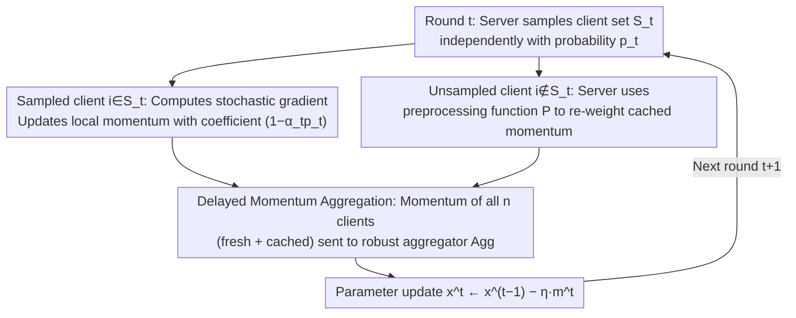

# Delayed Momentum Aggregation: Communication-efficient Byzantine-robust Federated Learning with Partial Participation

**Conference**: ICML 2026  
**arXiv**: [2509.02970](https://arxiv.org/abs/2509.02970)  
**Code**: Not yet released  
**Area**: Optimization / Federated Learning  
**Keywords**: Federated Learning, Byzantine Robustness, Partial Participation, Delayed Momentum, Robust Aggregation

## TL;DR
Addressing the pain point where a "temporary Byzantine majority in sampled clients" can collapse existing robust aggregators under partial participation, this paper proposes the Delayed Momentum Aggregation principle. The server feeds the new momentum from current rounds alongside the most recent cached momentum from unsampled clients into a robust aggregator. This extends the global Byzantine ratio $\delta < 1/2$ to every aggregation round. Based on this, the DeMoA optimizer is designed, achieving stable training of ResNet-18/CIFAR-10 even under the extreme setting of $p=0.1$ and $\delta=0.2$.

## Background & Motivation

**Background**: The "standard configuration" for Byzantine-robust Federated Learning (FL) is a robust aggregator (Krum / Coordinate Median / RFA / CCLIP) combined with client-side local momentum for variance reduction. The former isolates single-point malicious updates, while the latter distinguishes temporally cumulative attacks like ALIE from normal stochastic noise. Existing theories almost exclusively assume full client participation.

**Limitations of Prior Work**: Practical systems must utilize partial participation due to bandwidth, battery, and availability constraints, but the naive combination of "partial participation + robust aggregation" fails. The reason is stark: even if the global Byzantine proportion is $\delta < 1/2$, independent sampling in certain rounds can result in the sampled set itself having a Byzantine majority ("Byzantine majority round"). Any robust aggregator looking only at the current round's inputs cannot distinguish good from bad; at $p=0.1, \delta=0.2$, such catastrophic rounds appear as early as the first epoch, leading to the collapse of FedAvg/FedCM.

**Key Challenge**: A fundamental conflict between communication efficiency (small $p$) and robustness—reducing the participation rate exponentially increases the probability of encountering Byzantine majority rounds. Allouah et al. (2024) characterized partial participation but required $p$ to be too large and did not solve majority rounds; Malinovsky et al. (2024) used variance reduction plus clipping to resist majority rounds but relied on large minibatches or full gradients, which are impractical in deep learning.

**Goal**: To find a solution that tolerates Byzantine majority rounds, adapts to standard deep learning minibatches, and introduces zero additional communication overhead.

**Key Insight**: The server actually retains a cache of the momentum sent by each client in its last active round. If these caches are treated as "virtual current updates" and fed into the robust aggregator together, the aggregator faces the full set of $n$ clients. The Byzantine ratio then remains equal to the global $\delta$, thereby eliminating majority rounds.

**Core Idea**: Use "Delayed Momentum Aggregation" to restore the perspective of the robust aggregator from a "sampled subset" to the "global set." By carefully selecting momentum coefficients and delay corrections, this seemingly simple concatenation remains theoretically convergent.

## Method

### Overall Architecture
DeMoA maintains the standard shell of synchronous FL: in each round $t$, the server independently samples each client with probability $p_t$ to form $\mathcal{S}_t$. Sampled clients compute stochastic gradients using local data, update their local momentum, and send it back. The momentum of unsampled clients is "re-weighted" on the server side to simulate the same decay rhythm. The server then feeds the momentum of all $n$ clients (whether fresh or cached) into a $(\delta,c)$-robust aggregator $\mathrm{Agg}$, outputting $\bm{m}^t$ as the update direction: $\bm{x}^t \leftarrow \bm{x}^{t-1} - \eta\,\bm{m}^t$. The only added state is a "momentum vector cache for each client on the server," keeping communication volume identical to FedAvg.

### Key Designs

**1. Delayed Momentum Aggregation Principle: Restoring Global Perspective**

The root cause of failure under partial participation is that even if the global Byzantine ratio $\delta < 1/2$, the sampled subset $\mathcal{S}_t$ can have a Byzantine majority in certain rounds. Recognizing that the server keeps cached momentum from previous rounds, the authors treat these caches as "virtual current updates." For an unsampled client $i \notin \mathcal{S}_t$, the momentum $\bm{m}_i^{t-\tau(i,t)}$ from its last sampled round $t-\tau(i,t)$ is used after preprocessing $\mathcal{P}$. The aggregation set becomes $\{\bm{m}_i^t\}_{i\in\mathcal{S}_t}\cup\{\mathcal{P}(\bm{m}_i^{t-\tau(i,t)},i,t)\}_{i\notin\mathcal{S}_t}$. Thus, the aggregator faces all $n$ clients every round, keeping the Byzantine ratio fixed at $\delta$ and eliminating the "Byzantine majority round" failure path. Under small step sizes, delayed momentum is a good approximation of $\nabla f_i(\bm{x}^t)$, ensuring honest signals remain visible and mitigating non-IID drift—all with zero extra communication since caches are server-side.

**2. Special Momentum Coefficient $(1-\alpha_t p_t)$: Decoupling Sampling and Momentum Noise**

Directly adopting the momentum coefficient $(1-\alpha_t)$ from FedCM would make the coefficient itself stochastic relative to sampling, introducing variance linked to the historical momentum norm $\|\bm{m}_i^{t-1}\|^2$, which may cause divergence. The authors use $(1-\alpha_t p_t)$: for sampled clients, $\bm{m}_i^t=(1-\alpha_t p_t)\bm{m}_i^{t-1}+\alpha_t\nabla f_i(\bm{x}^{t-1};\xi_i^t)$; for unsampled ones, $\bm{m}_i^t=(1-\alpha_t p_t)\bm{m}_i^{t-1}$. By introducing indicator variables $r_i^t \sim \mathrm{Ber}(p_t)$, the expected recurrence exactly matches standard momentum $(1-\alpha_t p_t)\bm{m}_i^{t-1} + \alpha_t p_t \nabla f_i$, while the variance is reduced to $\alpha_t^2 p_t(1-p_t)\|\nabla f_i\|^2$, eliminating the explosion term. Essentially, "explicit momentum" and "implicit momentum from sampling" are merged into a single effective parameter $\alpha_t p_t$.

**3. Preprocessing Function $\mathcal{P}$: Removing Implicit Momentum Effects**

If cached momentum delayed by $\tau(i,t)$ rounds is fed directly into the aggregator, it leads to double counting and introduces implicit momentum terms that usually require "bounded gradient" assumptions. The authors provide a closed-form correction:

$$\mathcal{P}(\bm{m}_i^{t-\tau(i,t)},i,t)=\Big[\prod_{s=t-\tau(i,t)+1}^{t}(1-\alpha_s p_s)\Big]\bm{m}_i^{t-\tau(i,t)},$$

This allows the cached momentum to naturally decay along the trajectory as if it "had not been sampled" until round $t$. This ensures the convergence analysis does not rely on the bounded gradient assumption and positions MIFA as a degenerate case (where $\alpha=1$, $\mathrm{Agg}$ is mean, and $\mathcal{P}=\text{id}$). Preprocessing is the bridge connecting "delayed momentum" and "robust aggregation."

### Loss & Training
DeMoA does not change the training loss; it only replaces the optimizer. Step size $\eta$, momentum $\alpha_t$, and sampling probability $p_t$ are selected according to the coupling rules in Theorem 3.1. Implementation only requires replacing the "averaging" step in the FedAvg framework with robust aggregation using cached momentum.

## Key Experimental Results

### Main Results

Setup: $n=25$ clients, $\delta=0.2$, CCLIP robust aggregator. Comparison of FedAvg, FedCM, Byz-VR-MARINA-PP, and DeMoA on IID and non-IID data.

| Dataset | Participation $p$ | Metric | FedAvg / FedCM | Byz-VR-MARINA-PP | DeMoA |
|--------|-----------|------|----------------|------------------|-------|
| MNIST (ConvNet) | 0.5 | First Byzantine Majority | Collapses after epoch 3 | Stable but lower accuracy | Highest throughout |
| CIFAR-10 (ResNet-18) | 0.1 | First Byzantine Majority | Collapses at epoch 1 | High variance, occasional non-IID failure | Stable convergence, highest accuracy |

DeMoA achieves the highest final accuracy and lowest variance across almost all combinations of five attacks (ALIE, Bit-Flipping, IPM, Label-Flipping, Mimic) and four aggregators (CM, Krum, RFA, CCLIP).

### Ablation Study

| Configuration | Phenomenon | Interpretation |
|------|------|------|
| No Byzantine $\delta=0$, $p=0.5$, naive avg | DeMoA still outperforms FedCM, Byz-VR-MARINA-PP | Delayed momentum acts as implicit regularization, mitigating non-IID drift |
| Replace coefficient $(1-\alpha_t p_t) \to (1-\alpha_t)$ | Variance term $\alpha_t^2 p_t(1-p_t)\|\bm{m}_i^{t-1}\|^2$ appears | Explains why naive momentum is amplified by sampling noise |
| Remove preprocessing $\mathcal{P}$ (Degenerates to MIFA + naive avg) | Robust constant $c=\infty$, theory becomes void | Shows $\mathcal{P}$ is the bridge between delayed momentum and robust aggregation |
| $\delta$ approaches $\min(1/2, 1/(60c(B^2+\alpha(1-p))))$ | Performance degrades under some aggregators | Hits the breakdown point of the aggregator; theory aligns with observation |

### Key Findings
- **Failure mode localization**: The collapse of FedAvg/FedCM occurs strictly after the "first Byzantine majority round," verifying that delayed momentum aggregation solves this specific failure point.
- The convergence rate under partial participation $\frac{1}{T}\sum\mathbb{E}\|\nabla f(\bm{x}^t)\|^2 = \mathcal{O}(c\delta\zeta^2 + \cdots)$ has a non-vanishing term $\mathcal{O}(c\delta\zeta^2)$ of the same order as the full participation lower bound, without being amplified by $1/\gamma^2$ due to communication sparsity as in decentralized gossip.
- Under over-parameterization $(\zeta=0, B)$-heterogeneity (Corollary 3.2), the non-vanishing term disappears, returning to the i.i.d. optimal rate.

## Highlights & Insights
- By using the minimal operation of "expanding the aggregation input set," the "Byzantine majority round" problem is reduced to a full participation problem, resolving the conflict between communication efficiency and robustness with zero communication overhead.
- The momentum coefficient $(1-\alpha_t p_t)$ is a textbook-level refinement—adjusting a single scalar decouples two noise sources (sampling and momentum updates) in terms of variance, making it transferable to any "partial participation + momentum" optimizer.
- The preprocessing function $\mathcal{P}$ provides a closed-form mapping that makes "delayed momentum equivalent to non-delayed," bringing conclusions from asynchronous/delayed optimization into synchronous partial participation settings without requiring bounded gradient assumptions.

## Limitations & Future Work
- The server must maintain a momentum vector for every client, which can consume significant memory when $n$ is massive; the paper suggests embedding communication compression into $\mathcal{P}$, but systematic analysis is pending.
- The convergence rate still contains the term $\Gamma = (1-p)\cdot\Theta(1+B^2+c\delta G)/(G(1-60c\delta B^2))$, where constants increase under very small $p$ and heavy heterogeneity; while over-parameterization removes the non-vanishing term, $\Gamma$ still affects the rate.
- Experiments cover ResNet-18/CIFAR-10 and ConvNet/MNIST but have not yet been validated on LLMs or large-scale FL; only independent Bernoulli sampling was studied, leaving complex selection strategies (clustered sampling, power-of-choice) for future work.
- The upper bound for $\delta$ can be tight for highly heterogeneous data; adaptive attacks specifically targeting delayed momentum have not yet been systematically evaluated.

## Related Work & Insights
- **vs Allouah et al. 2024 (First work on PP)**: They characterized required participation rates but required large $p$, ignored majority rounds, and lacked momentum (vulnerable to temporal attacks). Ours actively eliminates majority rounds using cached momentum and retains momentum for protection.
- **vs Malinovsky et al. 2024 (Byz-VR-MARINA-PP)**: They rely on MARINA-style variance reduction and clipping to resist majority rounds but require large batches/full gradients; DeMoA is stable and more accurate with standard minibatches.
- **vs MIFA / Fedvarp / CA2FL (Caching methods)**: Motivated by client unavailability rather than Byzantine robustness; they analyze only SGD, and naive momentum adoption triggers implicit momentum effects. DeMoA treats these as degenerate cases and provides corrections.
- **vs OrMo (Asynchronous Momentum SGD)**: Conceptually inspired the preprocessing function $\mathcal{P}$, but OrMo relies on the bounded gradient assumption, which this work removes for synchronous partial participation.

## Rating
- Novelty: To be evaluated
- Experimental Thoroughness: To be evaluated
- Writing Quality: To be evaluated
- Value: To be evaluated

<!-- RELATED:START -->

## Related Papers

- [\[NeurIPS 2025\] Layer-wise Update Aggregation with Recycling for Communication-Efficient Federated Learning](../../NeurIPS2025/optimization/layer-wise_update_aggregation_with_recycling_for_communication-efficient_federat.md)
- [\[ICML 2026\] HO-SFL: Hybrid-Order Split Federated Learning with Backprop-Free Clients and Dimension-Free Aggregation](ho-sfl_hybrid-order_split_federated_learning_with_backprop-free_clients_and_dime.md)
- [\[ICML 2026\] Learning Locally, Revising Globally: Global Reviser for Federated Learning with Noisy Labels](learning_locally_revising_globally_global_reviser_for_federated_learning_with_no.md)
- [\[NeurIPS 2025\] Efficient Federated Learning against Byzantine Attacks and Data Heterogeneity via Aggregating Normalized Gradients](../../NeurIPS2025/optimization/efficient_federated_learning_against_byzantine_attacks_and_data_heterogeneity_vi.md)
- [\[ICML 2025\] The Panaceas for Improving Low-Rank Decomposition in Communication-Efficient Federated Learning](../../ICML2025/optimization/the_panaceas_for_improving_low-rank_decomposition_in_communication-efficient_fed.md)

<!-- RELATED:END -->
