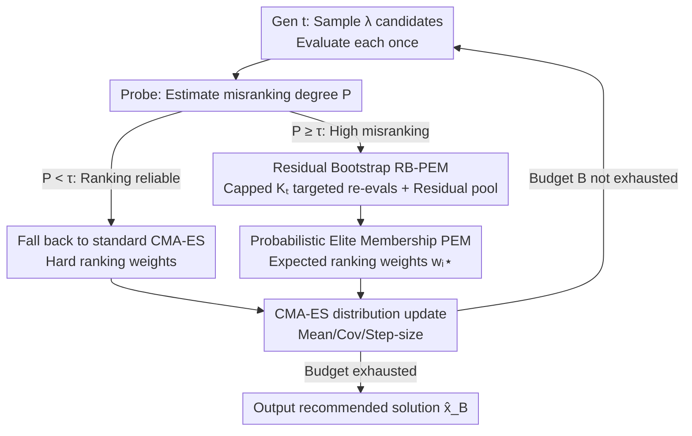

# Depth over Fidelity in Fixed-Budget Noisy Evolution Strategies

**Conference**: ICML 2026  
**arXiv**: [2606.06555](https://arxiv.org/abs/2606.06555)  
**Code**: https://github.com/sichen-wang/Depth-over-Fidelity_ICML2026  
**Area**: Black-box Optimization / Evolution Strategies  
**Keywords**: Evolution Strategies, Noisy Optimization, Fixed Budget, CMA-ES, Rao–Blackwell, Zeroth-order Optimization

## TL;DR
In noisy black-box optimization where the number of evaluations is strictly limited (fixed budget), instead of spending budget on repeated measurements to "clean" intra-generational rankings (fidelity), it is more effective to save that budget to perform more distribution updates (depth). This paper introduces **PEM (Probabilistic Elite Membership)** to replace hard ranking weights with "expected weights over ranking uncertainty" and utilizes **Residual Bootstrap (RB-PEM)** to estimate it with near-zero additional overhead. This approach consistently outperforms the mainstream "denoise then rank" paradigm in high-misranking, budget-constrained scenarios.

## Background & Motivation
**Background**: Objective functions in many machine learning scenarios can only be accessed through **noisy function evaluations**—such as stochastic rollouts in policy search, simulation control, hardware-in-the-loop tuning, and hyperparameter optimization with inherent randomness. The strictest constraint in these problems is often a cap on the number of oracle queries, known as the **fixed-budget protocol**. Ranking-based evolution strategies (especially CMA-ES) are popular in black-box optimization because they only require **relative comparisons** between candidates, making them naturally invariant to objective scaling and robust.

**Limitations of Prior Work**: Because CMA-ES relies solely on intra-generational rankings, it is exceptionally sensitive to evaluation noise. Once the objective values of a batch of candidates are perturbed, the induced ranking order changes, leading the optimizer to update the distribution using "misranked elites." Consequently, evaluation noise transforms directly into **selection noise**, polluting the update direction.

**Key Challenge**: The mainstream approach to denoising is to evaluate each candidate multiple times and aggregate them (e.g., uniform resampling, racing, UH-CMA-ES) to approximate the noise-free ranking before standard updates—a **fidelity-first** stance. However, under a fixed budget, fidelity comes at a cost: if each candidate is evaluated $k$ times, the number of generations is reduced to $T \le \lfloor B/(k\lambda)\rfloor$. The power of CMA-ES stems from **multi-generational accumulation** of distribution learning (mean, covariance, and step-size adaptation). Worse, the most critical comparisons for truncation selection occur near the elite threshold $r\approx\mu$, where candidates are nearly indistinguishable. The cost $k$ required to distinguish them is given by $k=\Omega\!\big((\sigma_i^2+\sigma_j^2)/\Delta_{ij}^2 \cdot \log(1/\delta)\big)$; as the gap $\Delta_{ij}$ shrinks, the cost explodes, causing depth to collapse.

**Goal / Key Insight**: The authors propose a **depth over fidelity** principle for fixed-budget settings: when ranking uncertainty is high, maintain evaluation costs per generation close to "one evaluation per candidate" to save budget for more updates; simultaneously, incorporate uncertainty **directly into selection weights** rather than spending budget to clean the ranking first.

**Core Idea**: Replace "hard weights obtained from a single noisy ranking" $w(r_i)$ with "conditional expected ranking weights" $\mathbb{E}[w(r_i)\mid x_{1:\lambda}]$. This absorbs uncertainty at the selection stage rather than the evaluation stage—a step that can be understood as applying **Rao–Blackwell variance reduction** to noisy ranking updates.

## Method

### Overall Architecture
The method is termed **PEM + RB-PEM + Probe-and-Switch**, aimed at maximizing optimization depth under a fixed budget $B$. The workflow is as follows: in each generation, $\lambda$ candidates are sampled as in standard CMA-ES, but **each candidate is evaluated only once** as a baseline. A strictly capped, small additional budget $K_t \le K_{\max} \ll \lambda$ is used for targeted re-evaluation to calibrate a local noise model. Subsequently, Residual Bootstrap is used to simulate a large number of pseudo-rankings at zero evaluation cost to estimate **soft weights** for each candidate, which are then used for CMA-ES updates. Since the overhead is minimal, the cost per generation $C_t=\lambda+K_t$ allows depth to remain $T\approx B/(\lambda+\mathbb{E}[K_t])\approx B/\lambda$. Finally, a low-cost probe determines whether to run RB-PEM or fall back to standard CMA-ES to avoid unnecessary smoothing in low-noise scenarios.

### Key Designs

**1. Probabilistic Elite Membership (PEM): Replacing hard ranking weights with soft weights expected over uncertainty**

Standard CMA-ES uses deterministic weights $w(r_{t,i})$ based on a single noisy ranking $r_{t,i}$, so even conditioned on the candidate set $x_{1:\lambda}$, the update direction remains stochastic—this is the root of misranking-induced pollution. PEM defines each candidate's weight as its **conditional expectation** under ranking uncertainty:

$$w_{t,i}^{\star} := \mathbb{E}\!\left[w(r_{t,i})\mid x_{t,1:\lambda}\right].$$

For classic top-$\mu$ truncation weights $w(r)=\frac{1}{\mu}\mathbf{1}\{r\le\mu\}$, this has a clean probabilistic interpretation: $w_{t,i}^{\star}=\frac{1}{\mu}\Pr(r_{t,i}\le\mu\mid x_{1:\lambda})$. Candidates near the threshold receive **fractional membership** proportional to their probability of being selected, rather than a hard 0/1. More generally, let $\delta_k=w_k-w_{k+1}$ and $p_{t,i,k}=\Pr(r_{t,i}\le k\mid x_{1:\lambda})$; then $w_{t,i}^{\star}=w_\lambda+\sum_{k=1}^{\lambda-1}\delta_k\,p_{t,i,k}$, which aggregates the top-$k$ membership probabilities.

A key property of PEM (Lemma 1) is that it **preserves the conditional mean update**: $\mathbb{E}[\Delta m_t(y)\mid x_{1:\lambda}]=\Delta m_{\text{PEM},t}$, while significantly reducing conditional variance (update dispersion). This is essentially **Rao–Blackwellization** for noisy ranking updates. Theoretically (Theorem 1), in local $\alpha$-strongly convex regions, update dispersion leads to an unavoidable expected objective loss $\frac{\alpha}{2}\mathbb{E}[\lVert X-\bar X\rVert^2\mid x_{1:\lambda}]$. PEM eliminates this dispersion term, making it superior even if the conditional mean remains the same as standard strategies.

**2. Residual Bootstrap (RB-PEM): Estimating PEM with capped costs and cross-generation residual pools**

Calculating $w_{t,i}^{\star}$ exactly would require massive re-evaluations for every candidate, causing depth to collapse. RB-PEM is a practical estimator: per generation, each candidate is evaluated once, plus a **capped and additive** small set of re-evaluations $K_t\le K_{\max}\ll\lambda$ to calibrate the local noise model. Standardized noise residuals are extracted from these and stored in a **cross-generation residual pool**. Using this amortized pool, one can resample and simulate numerous bootstrap rankings with almost zero oracle cost. This allows for accurate estimation of expected weights while keeping the per-generation cost at $C_t=\lambda+K_t$, where $\mathbb{E}[K_t]\ll\lambda$, maintaining depth at $\approx B/\lambda$.

Unlike parametric Bayesian methods (which assume a likelihood and sample latent variables), RB-PEM is **non-parametric**: it samples directly from empirical residuals, avoiding the need to specify a likelihood for non-Gaussian, heteroscedastic, or state-dependent noise. This also allows the same batch of bootstrap rankings to serve any weight mapping $w(\cdot)$. The trade-off is potential mismatch between the pool and the target distribution (finite pool, non-stationary drift, covariate-dependent shape changes). The paper quantifies this mismatch using the Wasserstein-1 distance $W_1(\widehat D_t, D_t)$ and decomposes it into a finite-pool term and three bias terms, providing **online runtime diagnostics**.

**3. Probe-and-Switch: Low-cost probe to decide between smoothing and standard CMA-ES**

Depth-over-fidelity is not always optimal: when rankings are already reliable, smoothing weakens selection pressure, and the re-evaluation budget $K_t$ is wasted. The paper introduces a **low-cost probe** that uses a small probing budget to estimate the current misranking statistic $P$ (normalized ranking divergence). Decisions are made based on the conditional advantage $\Delta(p)=\mathbb{E}[L_{\text{CMA}}-L_{\text{RB-PEM}}\mid P=p]$. Experiments show $\Delta(p)$ is approximately **single-crossing**: negative when $P$ is small (stable ranking) and positive once $P$ exceeds a threshold. Thus, the rule "run RB-PEM if $P\ge\tau$, otherwise CMA-ES" is Bayes-optimal under monotonic crossing (Proposition 5). Two robust operating points, $\tau=0.12$ (aggressive) and $\tau=0.22$ (conservative), were calibrated on COCO.

### Mechanism
Consider a dimension $d=40$, budget $B=100d=4000$, default $\lambda=15$, $\mu=7$. High noise makes candidates near the threshold $r\approx\mu=7$ indistinguishable. **Prev. SOTA Res.(10)** evaluates each candidate 10 times, spending $10\times15=150$ evals per generation, allowing only $\approx 4000/150\approx 26$ generations—the ranking is clean, but the distribution only learns for 26 steps. **Ours (RB-PEM)** evaluates each once, plus a capped re-evaluation $K_{\max}=1$, costing $\approx 15+\!\le\!15$ evals (effectively $\mathbb{E}[K_t]\ll15$), allowing depth close to $4000/15\approx 266$ generations. Candidates near the threshold are no longer forced into binary selection but receive fractional weights based on their "selection probability," reducing update variance. The nearly 10x more generations allow mean, covariance, and step-size to fully adapt, resulting in lower simple regret. This illustrates depth prevailing over fidelity.

## Key Experimental Results

### Main Results
Benchmarks include the COCO **bbob-noisy** suite (30 functions × 15 instances × 3 dimensions $d\in\{10,20,40\}$) and 6 external tasks (LQR control, Breast Cancer classification, Digits, CartPole-HT with heavy tails, standard CartPole, Pendulum). RB-PEM uses bootstrap size $B_{\text{boot}}=32$ and $K_{\max}=1$. Performance is measured by $\log_{10}(f(\hat x_B)-f^\star)$. The table below shows the pairwise win/loss counts of **Probe-and-Switch** against baselines at $B=200d$ (COCO, $30 \times 15$ instances):

| Opponent | $d{=}10$ Win/Loss | $d{=}20$ Win/Loss | $d{=}40$ Win/Loss | Description |
|------|------|------|------|------|
| vs Res.(10) | 390/60*** | 373/77*** | 363/87*** | Outperforms evaluation-stage denoising |
| vs Res.(5)  | 364/86*** | 356/94*** | 347/103*** | Same as above |
| vs UH-CMA-ES | 359/91*** | 368/82*** | 359/91*** | Outperforms uncertainty-handling variant |
| vs CMA-ES | 230/210 | 239/195* | 257/170** | Advantage grows with dimension |
| vs RB-PEM | 281/169*** | 269/181*** | 270/180*** | Switching is more robust than pure RB-PEM |

Probe-and-Switch achieves a >77% win rate against all evaluation-stage denoising baselines. Significantly outperforms pure CMA-ES as dimensions increase (where misranking is more severe) and maintains a clear advantage over pure RB-PEM, proving the switching mechanism reliably activates beneficial modes without wasted overhead.

### Ablation Study
Rankings on high-misranking subsets (15 bbob-noisy functions, $d{=}40$, $B{=}100d$) and external tasks (1 = best):

| Scenario | RB-PEM Performance | Mechanism Explanation |
|------|------------|----------|
| High Misranking (LQR, Noisy HPO) | Mostly Rank 1 | Preserves depth + Sélection absorbs uncertainty |
| Low Misranking (CartPole, Pendulum) | Slightly < Vanilla CMA-ES | Smoothing + Re-eval becomes pure overhead |
| Depth–Fidelity Plane | Occupies low-cost/high-depth corner with lowest regret | Optimal point on budget curve $depth \times cost \approx B/\lambda$ |

### Key Findings
- **Depth correlates strongly with final performance**: In high-misranking scenarios, depth-preserving methods (CMA-ES, RB-PEM) yield lower final regret. Resample/UH-CMA-ES, despite cleaner intra-generational rankings, yield higher regret due to lost depth.
- **High-misranking clusters are real**: The probe statistic $P$ shows a sharp **bimodal** structure (14 low-noise functions at $P\in[0,0.15]$, 15 high-noise at $P\in[0.30,0.35]$), separated by a gap 3x the width of either cluster. This confirms the probe accurately predicts when to absorb uncertainty.
- **Thresholds are transferable**: COCO-calibrated $\tau\in\{0.12, 0.22\}$ generalize to external tasks without per-task tuning. Aggressive thresholds benefit noisy tasks (LQR, MLP), while conservative thresholds prevent negative transfer in low-noise tasks.

## Highlights & Insights
- **Shifting from "denoising at evaluation" to "absorbing uncertainty at selection"**: This is a clever shift in perspective. While literature for decades focused on evaluation-stage fixes (resampling, racing), this paper identifies that the selection stage in noisy single-objective ES was largely untouched, offering "free" variance reduction via Rao-Blackwell.
- **The Residual Pool is the engineering key**: Amortizing noise information across generations allows "simulating many rankings" at almost zero cost, bypassing the depth-fidelity trade-off that usually crashes these methods.
- **Probe-and-switch provides a provable single-crossing rule**: Framing "when to use the method" as a Bayes-optimal decision problem makes the approach much more practical and honest compared to monolithic algorithms.
- **Closed loop between theory and empirical results**: Theorem 1 translates "ranking noise" into an explicit per-generation loss term $\frac{\alpha}{2}\mathbb{E}[\lVert X-\bar X\rVert^2]$, using the depth ledger $T\propto 1/k$ to explain why "dispersion reduction per evaluation" is the critical efficiency metric under fixed budgets.

## Limitations & Future Work
- **Reliance on i.i.d. intra-generational noise assumptions**: Residual pool standardization and bootstrap resampling assume repeated evaluations at the same point are i.i.d.. In cases of extreme state-dependent or non-stationary noise, pool mismatch risks increase.
- **No gain in low-misranking scenarios**: The method is primarily beneficial in high-misranking, budget-constrained regions. In low-noise cases, it falls back to CMA-ES provided the probe is accurate.
- **Probe/Re-eval costs still consume budget**: The probing budget and $K_t$ are part of the total budget $B$. In extremely small budget scenarios, these fixed costs may become non-negligible relative to $\lambda$.
- **Directions for improvement**: Making the residual pool covariate-adaptive (local noise shape estimation) and extending the discrete switch to a continuous interpolation between hard and soft weights based on $P$.

## Related Work & Insights
- **vs. Evaluation-stage Denoising (Resampling / Racing / UH-CMA-ES)**: These spend budget on stable rankings *before* seeing candidates. Our approach handles uncertainty *at selection*, preserving depth. In fixed budgets, the win rate of the latter is >77%.
- **vs. LRA-CMA-ES**: LRA maintains signal-to-noise ratios by decaying the learning rate, which can be overly conservative (learning rates $\approx 0.04$). Ours keeps the learning rate and handles noise via weights.
- **vs. Surrogate-assisted ES / Noisy BO (qNEI/LogEI)**: These build global GP models to integrate uncertainty. Ours is a lightweight alternative that stays within the ranking-based ES framework and maintains its invariance properties.
- **vs. Ranking & Selection (R&S)**: R&S seeks the "correct choice" within a fixed set. Ours imports R&S logic into the selection stage of ES to facilitate adaptive distribution learning.

## Rating
- Novelty: ⭐⭐⭐⭐⭐ Shifts focus to the selection stage with a Rao-Blackwell interpretation.
- Experimental Thoroughness: ⭐⭐⭐⭐ Extensive COCO results + diverse external tasks; though mostly based on win/loss counts.
- Writing Quality: ⭐⭐⭐⭐ Clear theory-empirical loop; depth/fidelity ledger is intuitive.
- Value: ⭐⭐⭐⭐ Directly useful for budget-constrained policy search and noisy HPO.

<!-- RELATED:START -->

## Related Papers

- [\[ICML 2026\] Budget-Feasible Mechanisms for Submodular Welfare Maximization in Procurement Auctions](budget-feasible_mechanisms_for_submodular_welfare_maximization_in_procurement_au.md)
- [\[ICML 2026\] Learning Locally, Revising Globally: Global Reviser for Federated Learning with Noisy Labels](learning_locally_revising_globally_global_reviser_for_federated_learning_with_no.md)
- [\[ICLR 2026\] Enhancing Learning with Noisy Labels via Rockafellian Relaxation](../../ICLR2026/optimization/enhancing_learning_with_noisy_labels_via_rockafellian_relaxation.md)
- [\[ICML 2026\] Taming the Loss Landscape of PINNs with Noisy Feynman-Kac Supervision: Operator Preconditioning and Non-Asymptotic Error Bounds](taming_the_loss_landscape_of_pinns_with_noisy_feynman-kac_supervision_operator_p.md)
- [\[ICLR 2026\] Online Black-Box Prompt Optimization with Regret Guarantees under Noisy Feedback](../../ICLR2026/optimization/online_black-box_prompt_optimization_with_regret_guarantees_under_noisy_feedback.md)

<!-- RELATED:END -->
