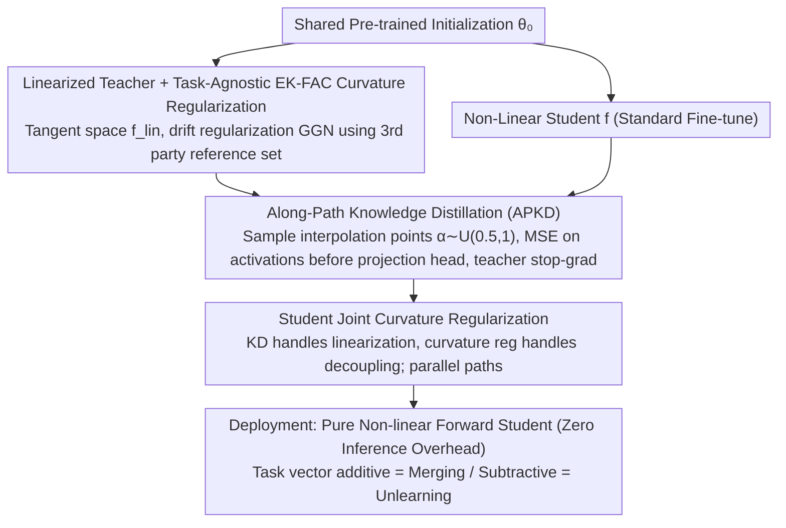

# Distilling Linearized Behavior into Non-Linear Fine-Tuning for Effective Task Arithmetic

**Conference**: ICML 2026  
**arXiv**: [2605.18993](https://arxiv.org/abs/2605.18993)  
**Code**: https://github.com/apanariello4/merge-and-rebase  
**Area**: Model Merging / Model Compression / Task Arithmetic  
**Keywords**: task arithmetic, linearization, knowledge distillation, weight disentanglement, EK-FAC

## TL;DR
This paper proposes DELTA: an online distillation of intermediate activations from a "tangent space linearized teacher" into a regular non-linear student, combined with EK-FAC curvature regularization and sampling along interpolation paths. This allows task vectors from standard non-linear fine-tuning to inherit properties like "additivity, low interference, and scale robustness" from linearized models, without introducing any inference overhead.

## Background & Motivation

**Background**: Task arithmetic (Ilharco 2022) uses weight differences $\bm\tau_t=\bm\theta_t-\bm\theta_0$ as task vectors for addition (merging tasks) or subtraction (machine unlearning) in weight space via $\bm\theta_0+\sum_t\alpha_t\bm\tau_t$. Its effectiveness relies heavily on weight disentanglement: applying $\bm\tau_t$ should leave predictions on other tasks' inputs nearly unchanged. Ortiz-Jimenez et al. found that fine-tuning in the tangent space (linearized model $f_{\mathrm{lin}}(\bm x;\bm\theta)=f(\bm x;\bm\theta_0)+\mathrm J_{\bm\theta}f(\bm x;\bm\theta_0)(\bm\theta-\bm\theta_0)$) naturally yields more decoupled task vectors.

**Limitations of Prior Work**: Linearization paths come with three significant costs: (i) Jacobian-vector products double both training and inference costs; (ii) locking optimization into the tangent space harms expressivity, resulting in a lower accuracy ceiling for single tasks; (iii) existing interference-reduction regularizers ($\tau$Jp requires other tasks' training data, TAK requires other tasks' KFAC factors) assume a closed set of known tasks, requiring full recomputation when a new task arrives. Non-linear fine-tuning is expressive but performs poorly in task arithmetic (e.g., 32% absolute accuracy on 8-Vision with ViT-B/32, compared to 77% for the linear version).

**Key Challenge**: Expressivity (non-linearity) and compositionality for task arithmetic (linearity) seem mutually exclusive, while merging capabilities strongly depend on tangent space structures.

**Goal**: Enable a student model from ordinary non-linear fine-tuning to satisfy two core conditions—"near-linearity to weight perturbations" and "support localization (modifying in-domain while preserving out-of-domain)"—thereby achieving merging performance without inference costs or the need for data/statistics from other tasks.

**Key Insight**: The paper observes that "near-linearity in weight space" is a property of the parameter space, but it can be induced via "objectives in the activation space." If the hidden layer activations of a non-linear student are forced to match those of a linearized teacher, the optimization is biased toward solutions that are near-linear with respect to weight perturbations.

**Core Idea**: Jointly train a non-linear student using a linearized teacher + online feature distillation + sampling along interpolation paths + EK-FAC curvature regularization. This "packs the linearized benefits" into a model that remains a standard non-linear forward pass at inference time.

## Method

### Overall Architecture
For each task $t$, two models are maintained simultaneously: a teacher $f_{\mathrm{lin}}(\bm x;\bm\theta_t^T)$ following tangent space linearization, and a student $f(\bm x;\bm\theta_t^S)$ following standard non-linear fine-tuning. Both share the same pre-trained initialization $\bm\theta_0$, are optimized jointly in a single backward pass (not sequential training), and are regularized with EK-FAC curvature. The teacher provides "low-interference target activations," while the student captures "linearized behavior" via feature MSE distillation on multiple snapshots sampled along the interpolation path.

### Key Designs

**1. Linearized Teacher + Task-Agnostic EK-FAC Curvature Regularization: Pushing the teacher toward low interference for arbitrary future tasks**

Since task arithmetic compositionality depends on weight disentanglement, the teacher must move in a direction that minimizes perturbations for any other input distribution. The teacher loss is $\mathcal L^T_t = \mathcal L_{\text{task}} + \beta^T\,\mathcal L_{\text{drift}}(\bm\theta_t^T)$, where representation drift under linearization has a closed-form $\mathcal L_{\text{drift}}(\bm\theta_t)\propto (\bm\theta_t-\bm\theta_0)^\top \bm G_t(\bm\theta_0)(\bm\theta_t-\bm\theta_0)$, with $\bm G_t$ being the GGN matrix. Crucially, the GGN is not computed on known task sets (which would assume a closed task set) but rather pre-computed once on a third-party reference dataset $\mathcal D_\Omega$ using EK-FAC approximation $\mathrm{GGN}_{\mathrm{EK\text{-}FAC}}^l=(U_A^l\otimes U_G^l)S^l(U_A^l\otimes U_G^l)^\top$ (e.g., 15% subset of ImageNet-21k for vision, $10^5$ C4 samples for text). This turns the regularizer into a decoupling objective for general input distributions. Unlike $\tau$Jp (tasks' training data) or TAK (tasks' KFAC), using a reference dataset means old task vectors don't need retraining when new tasks arrive, nor is private data exposed. EK-FAC also projects eigenvalues more accurately than KFAC.

**2. Along-Path Knowledge Distillation (APKD): Distilling linearized behavior along the entire interpolation path**

The teacher's "near-linearity to weight perturbations" must be transferred to the student, and not just at the point $\alpha=1$. Instead of logits, the distillation targets hidden activations before the final projection head using MSE. Critically, each SGD step samples an interpolation point $\alpha\sim\mathcal U(0.5,1)$, and both teacher/student calculate and align activations at the state $\bm\theta_0+\alpha\bm\tau$:

$$\mathcal L_{\text{KD}}=\mathbb E_{\alpha}\Big[\tfrac{1}{B}\sum_i\big\|f(\bm x_i;\bm\theta_0+\alpha\bm\tau_t^S)-\mathrm{SG}[f_{\mathrm{lin}}(\bm x_i;\bm\theta_0+\alpha\bm\tau_t^T)]\big\|_2^2\Big]$$

A stop-gradient (SG) is placed on the teacher. Traditional KD at fixed $\alpha=1$ only aligns at a single point, causing the student to drift from linear behavior elsewhere; APKD provides the student with the full linear trajectory, effectively performing ensemble distillation from a "family of linearized teachers." This significantly improves $\alpha$-sweep robustness in models like T5, removing the need to fine-tune scaling coefficients on a validation set at deployment.

**3. Student Joint Curvature Regularization: Decoupling "linearization" and "disentanglement" into two paths**

Distillation alone is insufficient; the student must also be pushed toward support localization. The student loss is $\mathcal L^S_t=\mathcal L_{\text{task}}(\bm\theta_t^S)+\beta_1\mathcal L_{\text{KD}}+\beta_2\mathcal L_{\text{drift}}(\bm\theta_t^S)$. The KD term restricts the student to the near-linear region, while the curvature term explicitly controls decoupling within that region. Diagnostic tests (Fig. 6) show why both are necessary: "Distillation only" contributes to linearization but weak decoupling; "Curvature only" contributes to decoupling but weak linearization. This also explains why students can outperform teachers: they retain non-linear expressivity outside the tangent space while their activations are constrained to the linearized teacher's path. This architecture allows for a full FT student + full FT teacher, or a LoRA student + full FT teacher—letting the teacher find directions in a high-expressivity space while the student replicates them in a low-rank efficient subspace.

### Loss & Training
The teacher and student are optimized jointly (not sequentially). Both share $\bm\theta_0$ and use EK-FAC curvature regularization. Teacher loss: $\mathcal L^T_t = \mathcal L_{\text{task}} + \beta^T\mathcal L_{\text{drift}}$; Student loss: $\mathcal L^S_t = \mathcal L_{\text{task}} + \beta_1\mathcal L_{\text{KD}} + \beta_2\mathcal L_{\text{drift}}$. During inference, the student performs standard non-linear forward passes with zero overhead.

## Key Experimental Results

### Main Results
Absolute accuracy comparison for task addition on 8-Vision / 14-Vision / 6-NLI benchmarks with $\alpha=1$. DELTA wins across 4 backbones:

| Method | 8V ViT-B/32 Abs. | 14V ViT-L/14 Abs. | 14V ViT-B/32 Abs. | 6-NLI T5-Base Abs. |
|------|------|------|------|------|
| Pre-trained | 48.4 | 65.0 | 57.8 | 61.7 |
| Individual fine-tune | 92.8 | 95.8 | 90.2 | 85.9 |
| Non-Linear FT (Ilharco 2022) | 32.0 | 45.3 | 15.6 | 42.0 |
| Linear FT (Ortiz-Jimenez 2023) | 77.4 | 88.0 | 73.7 | 76.0 |
| $\tau$Jp (Yoshida 2025) | 85.0 | 90.9 | 85.3 | 82.5 |
| TAK (Porrello 2025b) | 86.0 | 91.6 | 84.3 | 79.1 |
| **DELTA (ours)** | **88.3** | **92.7** | **85.9** | 82.3 |

With the LoRA student + full FT teacher combination, DELTA achieves 87.5 / 99.5 normalized accuracy on 8V ViT-B/32, outperforming the runner-up Core+TSV-M (77.9) by 9.6 points.

### Ablation Study

| Configuration | 8V ViT-B/32 Task Arithmetic Trend | Description |
|------|------------------------------------|------|
| Non-Linear FT baseline | 32.0 abs | Lacks both linearization and decoupling; task arithmetic fails. |
| Student + KD + Curvature (DELTA full) | 88.3 abs | Both components present. |
| Student + KD only (no curvature) | Close to DELTA but lower | Linearization error near zero, but weak support localization. |
| Student + Curvature only (no KD) | Closest to DELTA | Strongest decoupling, but linearization error rises. |
| APKD off (Distillation at fixed $\alpha=1$) | Linearization error rises significantly | Single-point alignment loses along-path properties. |
| Task negation (9.6% target / 62.1% control) | DELTA better than other non-linear methods | Linearization still retains residual advantage in subtraction. |

### Key Findings
- "Distillation handles linearization, curvature handles support localization"—these are independent paths that together approach the performance ceiling.
- **DELTA student outperforming teacher**: On T5, students achieve higher single-task accuracy than teachers and higher average merging accuracy, proving expressivity isn't lost but guided toward a "near-linear but expressive" state.
- **LoRA student + full FT teacher** is a surprisingly strong combination (97.9 normalized on 8V ViT-B/32), far exceeding post-hoc merging methods (Iso-C / TSV-M / Core Space).
- **$\alpha$-sweep robustness**: DELTA shows a flat curve for $\alpha\in[0.5,1]$, while other methods crash when deviating from 1.
- **Extension to Generative LLMs**: LLaMA-3.2-1B + DPO. Combining helpfulness and verbosity vectors via $\bm\theta_{\text{mix}}=\bm\theta_0+\bm\tau_{\text{help}}+\lambda_2\bm\tau_{\text{verb}}$, Distilled DPO's reward Pareto frontier stays closer to Linear DPO and exceeds Non-Linear DPO in preference accuracy.

## Highlights & Insights
- Indoing parameter space properties via activation space objectives provides clean empirical evidence: MSE + curvature reg forces non-linear models to behave "near-linearly." This is likely because optimization is pinned near $\bm\theta_0$ where first-order Taylor is valid, combined with simplicity bias.
- The "division of labor" diagnosis (Fig. 4/5) between KD and curvature is a beautiful experimental design.
- Replacing task-specific statistics with a **reference dataset** allows for incremental task additions without breaking previously learned vectors—a major engineering breakthrough for task arithmetic deployment.
- The asymmetric LoRA student + full FT teacher pairing naturally fits industrial pipelines ("train with high expressivity, deploy with efficiency").

## Limitations & Future Work
- **Training cost**: Training costs roughly triple and memory nearly doubles (Teacher + Student + Path sampling + EK-FAC pre-calculation).
- **Task negation**: Still slightly trails pure linear methods ($\tau$Jp/TAK), suggesting "strict linearity" still has benefits for subtraction not yet replicated.
- **Reference dataset sensitivity**: Curvature reg depends on the representativeness of $\mathcal D_\Omega$; cross-domain robustness (e.g., vision reg for medical data) needs more verification.
- **Generative DPO**: The Distilled DPO version is preliminary and hasn't yet integrated curvature regularization.

## Related Work & Insights
- **vs Linear FT (Ortiz-Jimenez 2023)**: They train entirely in tangent space; DELTA distills those properties into non-linear students, saving 50% inference cost and improving task addition accuracy.
- **vs $\tau$Jp (Yoshida 2025)**: $\tau$Jp uses other task data; DELTA replaces this with a task-agnostic reference dataset + EK-FAC.
- **vs TAK (Porrello 2025b)**: TAK is dataless but requires KFAC factors for all tasks; DELTA uses a shared reference matrix for incremental scaling.
- **vs Post-hoc merging**: These rely on correcting students after training; DELTA pushes task vectors into decoupled regions during training, significantly benefiting LoRA setups.

## Rating
- Novelty: ⭐⭐⭐⭐ (Combining activation constraints for parameter properties + along-path distillation).
- Experimental Thoroughness: ⭐⭐⭐⭐⭐ (Broad coverage: vision, NLI, T5, ViT, LoRA, DPO).
- Writing Quality: ⭐⭐⭐⭐⭐ (Clear explanation of the trade-off between linearization and expressivity).
- Value: ⭐⭐⭐⭐⭐ (Moves task arithmetic from a research demo to a deployable phase with zero-inference cost and incremental capability).

<!-- RELATED:START -->

<!-- RELATED:END -->

## Related Papers

- [\[ICML 2026\] Learning a Zeroth-Order Optimizer for Fine-Tuning LLMs](learning_a_zeroth-order_optimizer_for_fine-tuning_llms.md)
- [\[ICML 2025\] Provable In-Context Vector Arithmetic via Retrieving Task Concepts](../../ICML2025/optimization/provable_in-context_vector_arithmetic_via_retrieving_task_concepts.md)
- [\[ICCV 2025\] Zeroth-Order Fine-Tuning of LLMs in Random Subspaces](../../ICCV2025/optimization/zeroth-order_fine-tuning_of_llms_in_random_subspaces.md)
- [\[ICML 2026\] Bayesian Gated Non-Negative Contrastive Learning](bayesian_gated_non-negative_contrastive_learning.md)
- [\[ICML 2026\] On the Expressive Power of GNNs to Solve Linear SDPs](on_the_expressive_power_of_gnns_to_solve_linear_sdps.md)

<!-- RELATED:END -->
